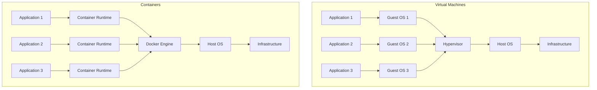
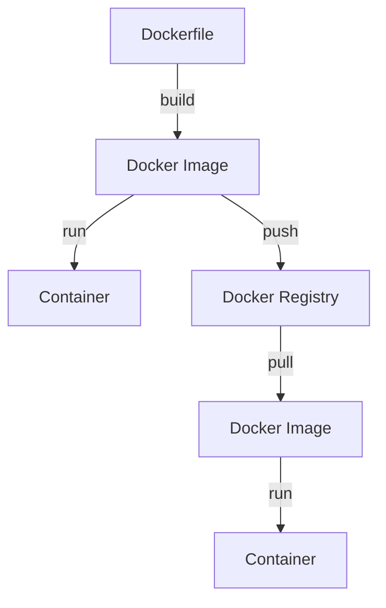
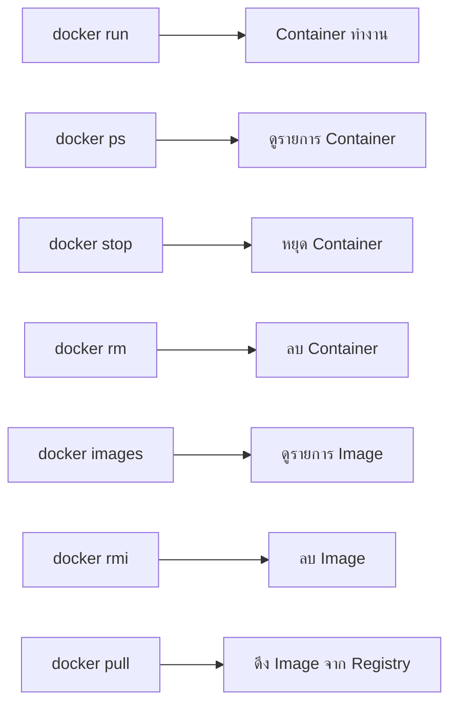
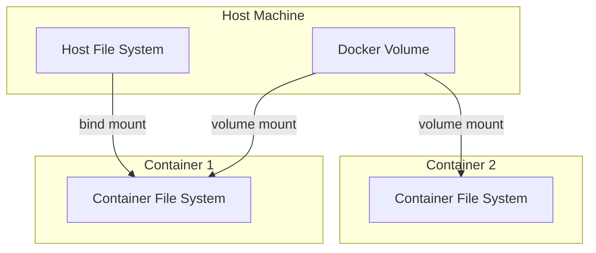
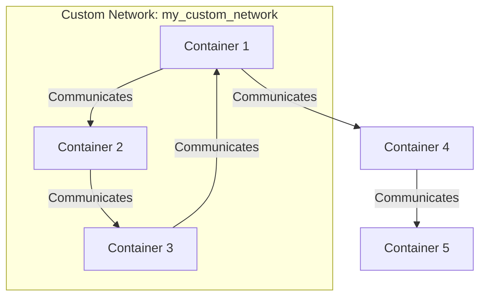

# 🐳 Docker Tutorial

## 📋 สารบัญ

- [1. บทนำสู่ Docker](#บทที่-1-บทนำสู่-docker)
- [2. การติดตั้งและตั้งค่า Docker](#บทที่-2-การติดตั้งและตั้งค่า-docker)
- [3. การใช้งาน Docker เบื้องต้น](#บทที่-3-การใช้งาน-docker-เบื้องต้น)
- [4. การสร้าง Docker Image ด้วย Dockerfile](#บทที่-4-การสร้าง-docker-image-ด้วย-dockerfile)
- [5. Docker Compose – การจัดการ Multi-Container Application](#บทที่-5-docker-compose--การจัดการ-multi-container-application)
- [6. ตัวอย่างการสร้างโปรเจค Docker แบบ End-to-End](#บทที่-6-ตัวอย่างการสร้างโปรเจค-docker-แบบ-end-to-end)
- [7. การจัดการและ Debug Container](#บทที่-7-การจัดการและ-debug-container)
- [8. แนวทางการ Deploy Docker ใน Production](#บทที่-8-แนวทางการ-deploy-docker-ใน-production)
- [9. การปรับปรุงและขยายความสามารถของ Docker](#บทที่-9-การปรับปรุงและขยายความสามารถของ-docker)
- [10. สรุปและแนวทางการเรียนรู้ต่อยอด](#บทที่-10-สรุปและแนวทางการเรียนรู้ต่อยอด)
- [11. ตัวอย่างการ Build และอธิบาย Dockerfile](#บทที่-11-ตัวอย่างการ-build-และอธิบาย-dockerfile)

## 🚀 Prerequisites

ก่อนเข้าสู่เนื้อหา โปรดสมัครและเตรียมรายการบริการทั้งหมดนี้พร้อม login ไว้

* **Docker Hub**
  * URL: [https://hub.docker.com/](https://hub.docker.com/)
  * จำเป็นต้องสมัครสมาชิก (สมัครฟรีด้วยอีเมลหรือผ่าน Google/GitHub)

* **GitHub**
  * URL: [https://github.com/](https://github.com/)
  * จำเป็นต้องสมัครสมาชิกเพื่อใช้งาน repository และ GitHub Actions

* **GitLab**
  * URL: [https://gitlab.com/](https://gitlab.com/)
  * จำเป็นต้องสมัครสมาชิกเพื่อใช้งาน repository และ CI/CD

* **Cloudflare**
  * URL: [https://www.cloudflare.com/](https://www.cloudflare.com/)
  * จำเป็นต้องสมัครสมาชิกเพื่อใช้งาน DNS, CDN และ Reverse Proxy

* **Uptime Monitoring Service (ตัวอย่าง Uptime Robot)**
  * URL: [https://uptimerobot.com/](https://uptimerobot.com/)
  * จำเป็นต้องสมัครสมาชิกเพื่อใช้งานบริการตรวจสอบสถานะ (มีทั้งฟรีและแบบเสียเงิน)

* **Grafana Cloud**
  * URL: [https://grafana.com/products/cloud/](https://grafana.com/products/cloud/)
  * จำเป็นต้องสมัครสมาชิก (มีทั้ง Free tier และแบบเสียเงินสำหรับฟีเจอร์ขั้นสูง)

* **Deploy on Vercel**
  * URL: [https://vercel.com/](https://vercel.com/)
  * จำเป็นต้องสมัครสมาชิก (เชื่อมต่อกับ GitHub/GitLab/Bitbucket)

* **Deploy on Netlify**
  * URL: [https://www.netlify.com/](https://www.netlify.com/)
  * จำเป็นต้องสมัครสมาชิก (เชื่อมต่อกับ Git repository หรือสมัครด้วยอีเมล)

* **DigitalOcean (สำหรับ Droplets, App Platform และ Managed Kubernetes/DOKS)**
  * URL: [https://www.digitalocean.com/](https://www.digitalocean.com/)
  * จำเป็นต้องสมัครสมาชิกและผูกวิธีชำระเงิน เพื่อใช้งาน Droplets, App Platform

* **ดาวน์โหลดและติดตั้ง Git**
  * URL: [https://git-scm.com/](https://git-scm.com/)
  * ทำตามขั้นตอนการติดตั้งที่แนะนำ โดยทั่วไป, คุณสามารถใช้ค่าเริ่มต้นได้

* **GitHub Desktop**
  * URL: [https://github.com/apps/desktop](https://github.com/apps/desktop)

---

## 🚀 บทที่ 1: บทนำสู่ Docker

### 1.1 ความเป็นมาของ Docker

Docker เป็นแพลตฟอร์มสำหรับการทำ containerization ที่พัฒนาขึ้นในปี 2013 ซึ่งช่วยให้การพัฒนา ทดสอบ และนำไปใช้งานแอปพลิเคชันในสภาพแวดล้อมที่แยกออกจากกันเป็นไปได้อย่างง่ายดาย โดยที่ไม่ต้องกังวลกับปัญหาความเข้ากันได้กับระบบปฏิบัติการหรือโครงสร้างพื้นฐานที่แตกต่างกัน

* **Containerization:** แนวคิดการแยกส่วนแอปพลิเคชันและ dependencies ออกจากระบบปฏิบัติการหลัก ทำให้แอปพลิเคชันสามารถทำงานได้อย่างคงเส้นคงวาบนทุกสภาพแวดล้อม
* **ข้อดี:** 
  * ลดขั้นตอนการตั้งค่าสภาพแวดล้อมที่ซับซ้อน
  * สามารถใช้งานได้ทั้งในเครื่องพัฒนาและระบบ production
  * เพิ่มความสามารถในการย้ายข้ามแพลตฟอร์มได้อย่างไร้รอยต่อ
  * ลดปัญหา "works on my machine" ที่พบบ่อยในการพัฒนาซอฟต์แวร์
  * เริ่มต้นทำงานได้เร็วกว่า VM เนื่องจากใช้ทรัพยากรน้อยกว่า

### 1.2 เปรียบเทียบ Containers vs Virtual Machines



**Virtual Machines:**
- ต้องมี Guest OS แต่ละ VM ซึ่งใช้ทรัพยากรมาก
- Boot time ช้า (นาที)
- ขนาดใหญ่ (GB)
- การจัดการทรัพยากร (Hypervisor)

**Containers:**
- ใช้ OS kernel ร่วมกัน
- Boot time เร็ว (วินาที)
- ขนาดเล็ก (MB)
- การจัดการทรัพยากร (Container Engine)

### 1.3 แนวคิดหลักของ Docker

* **Images:** เป็นแม่แบบ read-only ของ container ที่มีการกำหนดค่าต่าง ๆ ที่จำเป็นสำหรับการรันแอปพลิเคชัน รวมถึง dependencies, libraries, และ configuration ต่าง ๆ
* **Containers:** เป็น instance ที่รันจาก image ซึ่งมีสภาพแวดล้อมการทำงานที่แยกออกจากกัน มีชั้น read-write ที่วางทับบน image ช่วยให้สามารถบันทึกการเปลี่ยนแปลงระหว่างที่ container ทำงานได้
* **Dockerfile:** ไฟล์ที่ใช้สำหรับสร้าง Docker image โดยระบุขั้นตอนและคำสั่งที่จำเป็นต่าง ๆ เช่น การเลือกฐาน image, การติดตั้งแพ็คเกจ, การกำหนดคำสั่งที่จะทำงานเมื่อ container เริ่มทำงาน
* **Docker Hub:** Registry สาธารณะที่ใช้เป็นแหล่งเก็บ Docker image ซึ่งผู้ใช้สามารถดึง official image เช่น ubuntu, nginx, mysql หรือ image ที่สร้างโดยชุมชนมาใช้งานได้
* **Registry:** แหล่งเก็บและดึง Docker image ซึ่งอาจเป็น public (เช่น Docker Hub) หรือ private registry ที่องค์กรสร้างขึ้นเอง
* **Docker Compose:** เครื่องมือสำหรับกำหนดและรัน multi-container applications โดยใช้ไฟล์ YAML ในการกำหนดค่า
* **Docker Swarm:** ระบบ orchestration ที่มาพร้อมกับ Docker สำหรับการจัดการ container ในโหมด cluster



### 1.4 วัตถุประสงค์ของเอกสารนี้

เอกสารนี้มีวัตถุประสงค์เพื่อให้ผู้อ่านได้เข้าใจและปฏิบัติการใช้งาน Docker อย่างครบวงจร ผ่านตัวอย่างที่เป็นขั้นตอนและเข้าใจง่าย โดยจะครอบคลุมหัวข้อต่าง ๆ ตั้งแต่การติดตั้ง Docker จนถึงการปรับใช้แอปพลิเคชันในระบบ production รวมถึงการจัดการปัญหาที่อาจเกิดขึ้นในการใช้งานจริง

**เป้าหมายการเรียนรู้:**
* เข้าใจแนวคิดพื้นฐานและประโยชน์ของ containerization
* สามารถติดตั้งและใช้งาน Docker ได้อย่างถูกต้อง
* สร้างและจัดการ Docker images และ containers
* เขียน Dockerfile เพื่อสร้าง custom image
* ใช้งาน Docker Compose สำหรับแอปพลิเคชันที่มี container หลายตัว
* เข้าใจแนวทางการนำ Docker ไปใช้ในสภาพแวดล้อม production

---

## 🔧 บทที่ 2: การติดตั้งและตั้งค่า Docker

### 2.1 การติดตั้ง Docker บนระบบปฏิบัติการต่าง ๆ

#### 2.1.1 บน Linux (Debian)

อัพเดตแพ็คเกจเพื่อให้มั่นใจว่าระบบเป็นเวอร์ชันล่าสุด:

```bash
apt update
apt upgrade -y
```

ติดตั้งแพ็คเกจที่จำเป็นสำหรับการติดตั้ง Docker:

```bash
apt install apt-transport-https ca-certificates curl gnupg lsb-release curl sudo -y
```

เพิ่ม Docker GPG key เพื่อให้ระบบเชื่อถือแหล่งที่มาของแพ็คเกจ:

```bash
curl -fsSL https://download.docker.com/linux/debian/gpg | gpg --dearmor -o /usr/share/keyrings/docker-archive-keyring.gpg
```

เพิ่ม Docker repository เข้าสู่ระบบ:

```bash
echo "deb [arch=$(dpkg --print-architecture) signed-by=/usr/share/keyrings/docker-archive-keyring.gpg] https://download.docker.com/linux/debian $(lsb_release -cs) stable" | tee /etc/apt/sources.list.d/docker.list > /dev/null
```

ติดตั้ง Docker Engine และ components ที่เกี่ยวข้อง:

```bash
apt update
apt install docker-ce docker-ce-cli containerd.io -y
```

ตรวจสอบการติดตั้งโดยดูเวอร์ชัน Docker:

```bash
docker --version
```

ตรวจสอบว่า Docker daemon กำลังทำงานอยู่:

```bash
systemctl status docker
```

#### 2.1.2 บน Windows

**ข้อกำหนดสำหรับ Windows:**
- Windows 10 64-bit: Pro, Enterprise, หรือ Education (Build 16299 หรือใหม่กว่า)
- Hyper-V และ Containers Windows features ต้องเปิดใช้งาน

**ขั้นตอนการติดตั้ง:**
1. ดาวน์โหลด Docker Desktop จาก [Docker Hub](https://hub.docker.com/editions/community/docker-ce-desktop-windows)
2. ดับเบิลคลิกที่ไฟล์ติดตั้ง Docker Desktop Installer.exe
3. ทำตามขั้นตอนการติดตั้งในวิซาร์ด
4. เมื่อเสร็จสิ้น จะมีการรีสตาร์ทเครื่อง
5. หลังจากรีสตาร์ท Docker Desktop จะเริ่มทำงานโดยอัตโนมัติ

**ทดสอบการติดตั้ง:**
เปิด PowerShell หรือ Command Prompt และรันคำสั่ง:

```powershell
docker version
docker run hello-world
```

#### 2.1.3 บน macOS

**ข้อกำหนดสำหรับ macOS:**
- macOS 10.14 (Mojave) ขึ้นไป สำหรับ Intel Mac
- macOS 11 (Big Sur) ขึ้นไป สำหรับ Apple Silicon Mac

**ขั้นตอนการติดตั้ง:**
1. ดาวน์โหลด Docker Desktop จาก [Docker Hub](https://hub.docker.com/editions/community/docker-ce-desktop-mac)
2. ดับเบิลคลิกที่ไฟล์ DMG และลาก Docker.app ไปยัง Applications
3. เปิด Docker จาก Applications folder
4. ตอบรับคำขอสิทธิ์ที่จำเป็น

**ทดสอบการติดตั้ง:**
เปิด Terminal และรันคำสั่ง:

```bash
docker version
docker run hello-world
```

### 2.2 การตั้งค่าพื้นฐานหลังการติดตั้ง

#### 2.2.1 การรัน Docker โดยไม่ต้องใช้ (สำหรับ Linux)

เพิ่มผู้ใช้ปัจจุบันเข้ากลุ่ม docker เพื่อให้สามารถรันคำสั่ง Docker ได้โดยไม่ต้องใช้ sudo:

```bash
usermod -aG docker $USER
```

เพื่อให้การเปลี่ยนแปลงมีผล คุณจำเป็นต้อง:
1. ออกจากระบบแล้วกลับเข้าสู่ระบบใหม่ หรือ
2. รันคำสั่งต่อไปนี้เพื่อใช้งานในเซสชันปัจจุบัน:

```bash
newgrp docker
```

ทดสอบว่าสามารถรัน Docker โดยไม่ใช้ sudo:

```bash
docker run hello-world
```

#### 2.2.2 การตั้งค่า Docker Compose

**สำหรับ Linux:**

Docker Compose ไม่ได้มากับ Docker Engine โดยอัตโนมัติในระบบ Linux จึงต้องติดตั้งเพิ่มเติม:

```bash
curl -L "https://github.com/docker/compose/releases/download/v2.17.2/docker-compose-$(uname -s)-$(uname -m)" -o /usr/local/bin/docker-compose
chmod +x /usr/local/bin/docker-compose
docker-compose --version
```

**สำหรับ Windows และ macOS:**

Docker Compose มาพร้อมกับ Docker Desktop แล้ว ไม่จำเป็นต้องติดตั้งเพิ่มเติม

#### 2.2.3 การตั้งค่า Docker Daemon

คุณสามารถปรับแต่ง Docker daemon เพื่อให้เข้ากับความต้องการใช้งานได้ โดยแก้ไขไฟล์ `/etc/docker/daemon.json` (สร้างไฟล์หากยังไม่มี):

```json
{
  "default-address-pools": [
    {
      "base": "172.20.0.0/16",
      "size": 24
    }
  ],
  "log-driver": "json-file",
  "log-opts": {
    "max-size": "10m",
    "max-file": "3"
  },
  "storage-driver": "overlay2"
}
```

รีสตาร์ท Docker daemon เพื่อให้การเปลี่ยนแปลงมีผล:

```bash
systemctl restart docker
```

---

## 🛠️ บทที่ 3: การใช้งาน Docker เบื้องต้น

### 3.1 คำสั่งพื้นฐานของ Docker



#### 3.1.1 การจัดการ Images

**docker pull:** ดาวน์โหลด image จาก Docker Registry

```bash
# รูปแบบ: docker pull [OPTIONS] NAME[:TAG|@DIGEST]
docker pull ubuntu:22.04
```

**docker images:** แสดงรายการ images ที่มีในเครื่อง

```bash
docker images
```

**docker rmi:** ลบ image ที่ไม่จำเป็นต้องใช้แล้ว

```bash
# รูปแบบ: docker rmi [OPTIONS] IMAGE [IMAGE...]
docker rmi ubuntu:22.04
# ลบหลาย image พร้อมกัน
docker rmi image1 image2 image3
```

**docker build:** สร้าง image จาก Dockerfile

```bash
# รูปแบบ: docker build [OPTIONS] PATH | URL | -
docker build -t myapp:1.0 .
```

**docker tag:** กำหนด tag ให้กับ image

```bash
# รูปแบบ: docker tag SOURCE_IMAGE[:TAG] TARGET_IMAGE[:TAG]
docker tag myapp:1.0 username/myapp:latest
```

#### 3.1.2 การจัดการ Containers

**docker run:** สร้างและเริ่มต้น container จาก image

```bash
# รูปแบบพื้นฐาน
docker run hello-world

# รันแบบ interactive
docker run -it ubuntu bash

# รันในโหมด detached (รันเป็น background)
docker run -d nginx

# กำหนด port mapping (-p host_port:container_port)
docker run -d -p 8080:80 nginx

# กำหนดชื่อ container
docker run -d --name my-nginx nginx

# ระบุ environment variables
docker run -e ENV_VAR=value nginx
```

**docker ps:** แสดงรายการ container ที่กำลังทำงาน

```bash
# ดู container ที่กำลังทำงานอยู่
docker ps

# ดูทั้ง container ที่กำลังทำงานและที่หยุดการทำงาน
docker ps -a
```

**docker stop:** หยุดการทำงานของ container

```bash
# รูปแบบ: docker stop [OPTIONS] CONTAINER [CONTAINER...]
docker stop container_id_or_name

# หยุดหลาย container พร้อมกัน
docker stop container1 container2
```

**docker start:** เริ่มการทำงานของ container ที่หยุดไว้

```bash
docker start container_id_or_name
```

**docker restart:** รีสตาร์ท container

```bash
docker restart container_id_or_name
```

**docker rm:** ลบ container ที่ไม่ใช้งานแล้ว

```bash
docker rm container_id_or_name

# ลบ container พร้อมกัน
docker rm container1 container2

# ลบ container ที่หยุดทำงานแล้วทั้งหมด
docker container prune
```

**docker logs:** ดู logs ของ container

```bash
# ดู logs ทั้งหมด
docker logs container_id_or_name

# ติดตาม logs แบบเรียลไทม์ (เหมือน tail -f)
docker logs -f container_id_or_name

# ดู logs จำนวนจำกัด
docker logs --tail 100 container_id_or_name
```

### 3.2 การทำงานกับ Container แบบ Interactive

การรัน container ในโหมด interactive ช่วยให้เราสามารถเข้าถึง shell ภายใน container เพื่อดีบัก ทดสอบ หรือจัดการกับไฟล์ภายใน container

#### 3.2.1 การเริ่ม Container แบบ Interactive

```bash
# รูปแบบ: docker run -it IMAGE [COMMAND]
docker run -it ubuntu /bin/bash
```

อธิบายการใช้ flags:
- `-i` (interactive) เก็บ STDIN เปิดไว้แม้จะไม่มีการ attach
- `-t` (tty) จัดสรรเทอร์มินัลเสมือนให้กับ container

#### 3.2.2 การเข้าถึง Container ที่กำลังทำงาน

```bash
# รูปแบบ: docker exec -it CONTAINER COMMAND
docker exec -it container_name /bin/bash
```

#### 3.2.3 ตัวอย่างการใช้งาน Interactive Mode

**ตัวอย่าง 1:** ทดสอบการติดตั้งแพ็คเกจใน Ubuntu container

```bash
docker run -it ubuntu /bin/bash
apt update
apt install curl
curl --version
exit  # ออกจาก container
```

**ตัวอย่าง 2:** ตรวจสอบไฟล์ configuration ใน Nginx container

```bash
docker run -d --name my-nginx nginx
docker exec -it my-nginx /bin/bash
cat /etc/nginx/nginx.conf
exit
```

### 3.3 การจัดการ Volume

Docker Volume เป็นกลไกในการจัดเก็บข้อมูลของ container อย่างถาวร ซึ่งจะยังคงอยู่แม้ว่า container จะถูกลบไปแล้ว ช่วยให้สามารถแชร์ข้อมูลระหว่าง container และระหว่าง container กับโฮสต์



#### 3.3.1 ประเภทของ Docker Storage

1. **Volumes:** จัดการโดย Docker เอง เก็บที่ `/var/lib/docker/volumes/` บนโฮสต์
2. **Bind Mounts:** เชื่อมกับไดเรกทอรีที่กำหนดบนระบบไฟล์โฮสต์
3. **tmpfs Mounts:** เก็บใน memory ของโฮสต์ ไม่เขียนลงดิสก์

#### 3.3.2 การสร้างและใช้งาน Volume

**สร้าง volume:**

```bash
docker volume create my-volume
```

**ดูรายละเอียด volume:**

```bash
docker volume inspect my-volume
```

**รัน container โดยใช้ volume:**

```bash
# รูปแบบ: docker run -v VOLUME_NAME:CONTAINER_PATH IMAGE
docker run -d -v my-volume:/app nginx
```

**รัน container โดยใช้ bind mount:**

```bash
# รูปแบบ: docker run -v HOST_PATH:CONTAINER_PATH IMAGE
docker run -d -v /home/user/data:/app/data nginx
```

**แชร์ volume ระหว่าง container:**

```bash
# สร้าง container แรกที่ใช้ volume
docker run -d --name container1 -v my-volume:/app nginx

# สร้าง container ที่สองที่ใช้ volume เดิม
docker run -d --name container2 -v my-volume:/app nginx
```

#### 3.3.3 ตัวอย่างการใช้งานที่พบบ่อย

**เก็บข้อมูลฐานข้อมูล:**

```bash
docker volume create mysql_data
docker run -d \
  --name mysql_db \
  -e MYSQL_ROOT_PASSWORD=secret \
  -v mysql_data:/var/lib/mysql \
  mysql:8.0
```

**แชร์โค้ดแอปพลิเคชันกับ container (สำหรับ development):**

```bash
docker run -d \
  --name node_app \
  -v $(pwd):/app \
  -w /app \
  -p 3000:3000 \
  node:14 \
  npm start
```

**เก็บ configuration files:**

```bash
docker run -d \
  --name nginx \
  -v /path/to/nginx.conf:/etc/nginx/nginx.conf:ro \
  -p 80:80 \
  nginx
```

#### 3.3.4 การลบ Volume

```bash
# ลบ volume
docker volume rm my-volume

# ลบ volume ที่ไม่ได้ใช้งาน
docker volume prune
```

---

## 📝 บทที่ 4: การสร้าง Docker Image ด้วย Dockerfile

### 4.1 ความสำคัญของ Dockerfile

Dockerfile คือไฟล์ข้อความที่ประกอบด้วยชุดคำสั่งที่ใช้สำหรับสร้าง Docker image โดยอัตโนมัติ ซึ่งมีความสำคัญดังนี้:

1. **การทำให้สามารถทำซ้ำได้ (Reproducibility):** ช่วยให้สามารถสร้าง image ที่เหมือนกันได้ทุกครั้ง ไม่ว่าจะบนเครื่องไหนหรือใครเป็นคนสร้าง
2. **การจัดการเวอร์ชัน (Version Control):** สามารถเก็บ Dockerfile ไว้ใน version control system เช่น Git ได้ ทำให้สามารถติดตามการเปลี่ยนแปลงของสภาพแวดล้อมได้
3. **การจัดการขั้นตอนการสร้างอัตโนมัติ (Automation):** สามารถใช้ในระบบ CI/CD เพื่อสร้าง image โดยอัตโนมัติ
4. **การจัดการสภาพแวดล้อมเป็นโค้ด (Infrastructure as Code):** ช่วยให้สามารถจัดการสภาพแวดล้อมการรันแอปพลิเคชันเป็นโค้ด

### 4.2 โครงสร้างพื้นฐานของ Dockerfile

ตัวอย่าง Dockerfile สำหรับแอปพลิเคชัน Node.js:

```dockerfile
# เริ่มต้นด้วย base image
FROM node:14

# กำหนด working directory
WORKDIR /app

# คัดลอกไฟล์ package.json และ package-lock.json
COPY package*.json ./

# ติดตั้ง dependencies
RUN npm install

# คัดลอกโค้ดแอปพลิเคชันทั้งหมดไปยัง container
COPY . .

# กำหนด port ที่จะ expose
EXPOSE 3000

# กำหนดคำสั่งรันเมื่อ container ถูกสร้างขึ้น
CMD ["node", "app.js"]
```

### 4.3 การสร้าง Image จาก Dockerfile

สร้างไฟล์ `Dockerfile` ใน directory ของโปรเจค

รันคำสั่งต่อไปนี้เพื่อสร้าง image:

```bash
docker build -t my-node-app .
```

ตรวจสอบ image ที่สร้างขึ้น:

```bash
docker images
```

---

## 🧩 บทที่ 5: Docker Compose – การจัดการ Multi-Container Application

### 5.1 บทนำสู่ Docker Compose

Docker Compose คือเครื่องมือสำหรับการจัดการและตั้งค่าการรันหลาย container ในแอปพลิเคชันเดียวกัน โดยใช้ไฟล์ `docker-compose.yml`

### 5.2 โครงสร้างไฟล์ docker-compose.yml

ตัวอย่างการตั้งค่า Docker Compose สำหรับแอปพลิเคชันที่ประกอบด้วย Web Server และ Database:

```yaml
version: '3'
services:
  web:
    build: .
    ports:
      - "3000:3000"
    depends_on:
      - db
  db:
    image: postgres:13
    environment:
      POSTGRES_USER: user
      POSTGRES_PASSWORD: password
      POSTGRES_DB: mydb
    volumes:
      - db_data:/var/lib/postgresql/data

volumes:
  db_data:
```

### 5.3 การใช้งาน Docker Compose

**การรัน:**

```bash
docker-compose up -d
```

**การตรวจสอบ log:**

```bash
docker-compose logs
```

**การหยุดและลบ container ที่รันด้วย Compose:**

```bash
docker-compose down
```

---

## 🌐 บทที่ 6: ตัวอย่างการสร้างโปรเจค Docker แบบ End-to-End

### 6.1 ตัวอย่างโปรเจค: Web Application ด้วย Node.js และ PostgreSQL

ในบทนี้เราจะสร้างโปรเจคที่มีแอปพลิเคชัน Node.js ติดต่อกับฐานข้อมูล PostgreSQL โดยใช้ Docker และ Docker Compose

#### ขั้นตอนที่ 1: เตรียมโครงสร้างโปรเจค

```plaintext
my-docker-project/
├── app.js
├── package.json
├── Dockerfile
└── docker-compose.yml
```

#### ขั้นตอนที่ 2: เขียนโค้ดสำหรับแอปพลิเคชัน

*app.js* (ตัวอย่างโค้ดเบื้องต้น):

```javascript
const express = require('express');
const { Client } = require('pg');

const app = express();
const port = 3000;

// กำหนดการเชื่อมต่อฐานข้อมูล
const client = new Client({
  host: 'db',
  user: 'user',
  password: 'password',
  database: 'mydb'
});

client.connect()
  .then(() => console.log('Connected to PostgreSQL'))
  .catch(err => console.error('Connection error', err.stack));

app.get('/', async (req, res) => {
  try {
    const result = await client.query('SELECT NOW()');
    res.send(`Server time is: ${result.rows[0].now}`);
  } catch (err) {
    res.status(500).send(err.toString());
  }
});

app.listen(port, () => {
  console.log(`Server running on port ${port}`);
});
```

#### ขั้นตอนที่ 3: เขียน Dockerfile

ตามที่แสดงในบทที่ 4

```dockerfile
FROM node:14
WORKDIR /app
COPY package*.json ./
RUN npm install
COPY . .
EXPOSE 3000
CMD ["node", "app.js"]
```

#### ขั้นตอนที่ 4: เขียน docker-compose.yml

```yaml
version: '3'
services:
  web:
    build: .
    ports:
      - "3000:3000"
    depends_on:
      - db
  db:
    image: postgres:13
    environment:
      POSTGRES_USER: user
      POSTGRES_PASSWORD: password
      POSTGRES_DB: mydb
    volumes:
      - db_data:/var/lib/postgresql/data

volumes:
  db_data:
```

#### ขั้นตอนที่ 5: รันโปรเจคด้วย Docker Compose

เปิด terminal ไปที่ directory ของโปรเจค

รันคำสั่ง:

```bash
docker-compose up -d
```

ตรวจสอบว่าแอปพลิเคชันและฐานข้อมูลทำงานได้อย่างถูกต้องโดยเข้าเว็บเบราว์เซอร์ที่:

```plaintext
http://localhost:3000
```

---

## 🛠️ บทที่ 7: การจัดการและ Debug Container

### 7.1 การดู Log ของ Container

ดู log ของ container ที่ระบุ:

```bash
docker logs <container_id>
```

ดู log แบบเรียลไทม์:

```bash
docker logs -f <container_id>
```

### 7.2 การเข้าไปใน Container (Exec)

หากต้องการตรวจสอบหรือ debug ภายใน container สามารถใช้คำสั่ง exec:

```bash
docker exec -it <container_id> /bin/bash
```

### 7.3 การแก้ปัญหาที่พบบ่อย

* **ปัญหา Port Conflict:** ตรวจสอบว่า port ที่ระบุใน `docker-compose.yml` หรือ `docker run` ไม่ถูกใช้งานโดยโปรเซสอื่น
* **ปัญหา Image Build:** ตรวจสอบ Dockerfile และ cache ด้วยคำสั่ง `docker build --no-cache`
* **ปัญหา Network:** ตรวจสอบ network ของ container โดยใช้คำสั่ง `docker network ls` และ `docker network inspect`

---

## 🚀 บทที่ 8: แนวทางการ Deploy Docker ใน Production

### 8.1 การจัดการ Container ใน Production

* **การใช้ Docker Swarm หรือ Kubernetes:** สำหรับการจัดการ container ที่มีจำนวนมากและต้องการ scaling แบบอัตโนมัติ
* **การ Monitor Container:** ใช้เครื่องมือเช่น Prometheus, Grafana ในการติดตามสถานะ container
* **การ Log และ Centralized Logging:** ใช้ ELK Stack (Elasticsearch, Logstash, Kibana) หรือ Splunk ในการรวบรวม log

### 8.2 Best Practices ในการ Deploy

* ใช้ multi-stage builds เพื่อลดขนาด image
* ไม่เก็บข้อมูลสำคัญใน image โดยตรง
* กำหนด resource limits (CPU, Memory) ในไฟล์ compose หรือใน orchestration tool
* ตรวจสอบความปลอดภัยของ container ด้วยการสแกน vulnerabilities

---

## 🔧 บทที่ 9: การปรับปรุงและขยายความสามารถของ Docker

### 9.1 การสร้าง Custom Network

สร้าง custom network เพื่อให้ container สามารถสื่อสารกันได้ง่ายและแยกออกจาก network ภายนอก

```bash
docker network create my_custom_network
docker run -d --network my_custom_network my-node-app
```



### 9.2 การใช้ Environment Variables

กำหนด environment variables ใน container เพื่อความยืดหยุ่นในการปรับเปลี่ยนค่า config

ผ่าน Dockerfile:

```dockerfile
ENV NODE_ENV=production
```

ผ่าน docker-compose.yml:

```yaml
environment:
  - NODE_ENV=production
```

### 9.3 การจัดการ Secret และ Config

* ใช้ Docker Secrets (สำหรับ swarm) หรือจัดการไฟล์ config ที่ปลอดภัย
* ป้องกันข้อมูลสำคัญ (เช่น รหัสผ่าน) ไม่ให้ถูก hard-coded ลงใน Dockerfile

---

## 📚 บทที่ 10: สรุปและแนวทางการเรียนรู้ต่อยอด

### 10.1 สรุปเนื้อหาที่ได้เรียนรู้

ในเอกสารนี้เราได้เรียนรู้:

* พื้นฐานและแนวคิดของ Docker
* การติดตั้งและตั้งค่า Docker บนระบบปฏิบัติการต่าง ๆ
* คำสั่งพื้นฐานสำหรับการจัดการ container และ image
* การสร้าง Dockerfile และการสร้าง Docker Image
* การใช้งาน Docker Compose สำหรับ multi-container applications
* ตัวอย่างโปรเจคจริงแบบ End-to-End
* เคล็ดลับในการ debug, monitoring และ deployment ใน production

### 10.2 แนวทางการพัฒนา

* ลองสร้างโปรเจคใหม่ ๆ โดยนำ Docker เข้ามาช่วยจัดการ environment
* สำรวจเครื่องมือ orchestration อย่าง Kubernetes สำหรับการจัดการ container ในระดับ production
* เรียนรู้การ Integrate Docker กับ CI/CD Pipeline (เช่น Jenkins, GitLab CI) เพื่อให้การ deploy เป็นไปโดยอัตโนมัติ
* ศึกษา Docker Security เพื่อให้แอปพลิเคชันของคุณปลอดภัยมากขึ้น

---

## 📦 บทที่ 11: ตัวอย่างการ Build และอธิบาย Dockerfile

ในบทนี้เราจะดูตัวอย่างการ Build Dockerfile ของแอปพลิเคชันประเภทต่างๆ โดยเน้นที่การอธิบายโครงสร้างและคำสั่งใน Dockerfile

### 11.1 ตัวอย่าง Dockerfile สำหรับแอปพลิเคชัน PHP

#### 11.1.1 โครงสร้างโปรเจค PHP

```plaintext
php/
├── src/
│   ├── index.php
│   └── landing.html
└── Dockerfile
```

#### 11.1.2 Dockerfile สำหรับ PHP

```dockerfile
FROM php:8.0-apache
WORKDIR /var/www/html
COPY ./src/index.php .
COPY ./src/landing.html .
EXPOSE 80
```

**คำอธิบาย Dockerfile:**

1. `FROM php:8.0-apache` - ใช้ image พื้นฐานที่มี PHP 8.0 และ Apache web server
2. `WORKDIR /var/www/html` - กำหนด working directory ภายใน container เป็นโฟลเดอร์ที่ Apache ใช้เป็น document root
3. `COPY ./src/index.php .` - คัดลอกไฟล์ index.php จากโฟลเดอร์ src ในโปรเจคไปยัง working directory
4. `COPY ./src/landing.html .` - คัดลอกไฟล์ landing.html ไปยัง working directory เช่นกัน
5. `EXPOSE 80` - ระบุว่า container จะใช้พอร์ต 80 (HTTP) 

#### 11.1.3 การ Build และ Run Container สำหรับ PHP

```bash
# Build image
docker build -t php-app -f Dockerfile .

# Run container
docker run -d -p 8080:80 --name my-php-app php-app
```

หลังจากรันคำสั่งด้านบน คุณสามารถเข้าถึงแอปพลิเคชัน PHP ได้ที่ http://localhost:8080

### 11.2 ตัวอย่าง Dockerfile สำหรับแอปพลิเคชัน HTML

#### 11.2.1 โครงสร้างโปรเจค HTML

```plaintext
html/
├── index.html
├── racksync.html
└── Dockerfile
```

#### 11.2.2 Dockerfile สำหรับ HTML

```dockerfile
FROM httpd:2.4
COPY . /usr/local/apache2/htdocs
WORKDIR /usr/local/apache2/htdocs
EXPOSE 80
ENV HOST=0.0.0.0
ENV PORT=80
```

**คำอธิบาย Dockerfile:**

1. `FROM httpd:2.4` - ใช้ image พื้นฐานของ Apache HTTP Server รุ่น 2.4
2. `COPY . /usr/local/apache2/htdocs` - คัดลอกทุกไฟล์จากโฟลเดอร์ปัจจุบันไปยังโฟลเดอร์ document root ของ Apache
3. `WORKDIR /usr/local/apache2/htdocs` - กำหนด working directory ภายใน container
4. `EXPOSE 80` - ระบุว่า container จะใช้พอร์ต 80 (HTTP)
5. `ENV HOST=0.0.0.0` - กำหนดตัวแปรสภาพแวดล้อมสำหรับระบุ host
6. `ENV PORT=80` - กำหนดตัวแปรสภาพแวดล้อมสำหรับระบุ port

#### 11.2.3 การ Build และ Run Container สำหรับ HTML

```bash
# Build image
docker build -t html-app .

# Run container
docker run -d -p 8088:80 --name my-html-app html-app
```

หลังจากรันคำสั่งด้านบน คุณสามารถเข้าถึงเว็บไซต์ HTML ได้ที่ http://localhost:8088

### 11.3 ตัวอย่าง Dockerfile สำหรับแอปพลิเคชัน Node.js

#### 11.3.1 โครงสร้างโปรเจค Node.js

```plaintext
nodejs-app/
├── src/
│   └── app.js
├── package.json
└── Dockerfile
```

#### 11.3.2 Dockerfile สำหรับ Node.js

```dockerfile
FROM node:14
WORKDIR /app
COPY package*.json ./
RUN npm install
COPY ./src .
EXPOSE 3000
CMD ["node", "app.js"]
```

**คำอธิบาย Dockerfile:**

1. `FROM node:14` - ใช้ image พื้นฐานที่มี Node.js รุ่น 14
2. `WORKDIR /app` - กำหนด working directory ใน container เป็น /app
3. `COPY package*.json ./` - คัดลอกไฟล์ package.json และ package-lock.json (ถ้ามี) ไปยัง working directory
4. `RUN npm install` - รันคำสั่ง npm install เพื่อติดตั้ง dependencies
5. `COPY ./src .` - คัดลอกโค้ดแอปพลิเคชันจากโฟลเดอร์ src ไปยัง working directory
6. `EXPOSE 3000` - ระบุว่า container จะใช้พอร์ต 3000
7. `CMD ["node", "app.js"]` - กำหนดคำสั่งที่จะทำงานเมื่อ container เริ่มต้น

#### 11.3.3 การ Build และ Run Container สำหรับ Node.js

```bash
# Build image
docker build -t nodejs-app .

# Run container
docker run -d -p 3000:3000 --name my-nodejs-app nodejs-app
```

### 11.4 ตัวอย่าง Dockerfile แบบ Multi-stage Build

Multi-stage build ช่วยให้สามารถลดขนาดของ image สุดท้ายโดยแยกขั้นตอนการ build และ runtime

#### 11.4.1 ตัวอย่าง Multi-stage Build สำหรับแอปพลิเคชัน React

```dockerfile
# Build stage
FROM node:14 AS build
WORKDIR /app
COPY package*.json ./
RUN npm install
COPY . .
RUN npm run build

# Production stage
FROM nginx:alpine
COPY --from=build /app/build /usr/share/nginx/html
EXPOSE 80
CMD ["nginx", "-g", "daemon off;"]
```

**คำอธิบาย Dockerfile:**

1. **Build stage:**
   - `FROM node:14 AS build` - ใช้ image พื้นฐานที่มี Node.js สำหรับการ build และตั้งชื่อ stage นี้ว่า "build"
   - `WORKDIR /app` - กำหนด working directory
   - `COPY package*.json ./` - คัดลอกไฟล์ package.json เพื่อติดตั้ง dependencies
   - `RUN npm install` - ติดตั้ง dependencies
   - `COPY . .` - คัดลอกโค้ดทั้งหมดไปยัง working directory
   - `RUN npm run build` - build แอปพลิเคชันเพื่อสร้างไฟล์ static

2. **Production stage:**
   - `FROM nginx:alpine` - ใช้ image ขนาดเล็กของ Nginx สำหรับเซิร์ฟไฟล์ static
   - `COPY --from=build /app/build /usr/share/nginx/html` - คัดลอกไฟล์ที่ build จาก stage แรกไปยัง document root ของ Nginx
   - `EXPOSE 80` - ระบุว่า container จะใช้พอร์ต 80
   - `CMD ["nginx", "-g", "daemon off;"]` - คำสั่งเริ่มต้น Nginx

#### 11.4.2 การ Build และ Run Container สำหรับ Multi-stage Build

```bash
# Build image
docker build -t react-app .

# Run container
docker run -d -p 8080:80 --name my-react-app react-app
```

### 11.5 คำสั่งทั่วไปใน Dockerfile และคำอธิบาย

| คำสั่ง | คำอธิบาย | ตัวอย่าง |
|-------|---------|---------|
| `FROM` | กำหนด base image | `FROM node:14` |
| `WORKDIR` | กำหนด working directory | `WORKDIR /app` |
| `COPY` | คัดลอกไฟล์จากโฮสต์ไปยัง container | `COPY . /app` |
| `ADD` | คล้าย `COPY` แต่สามารถใช้กับ URL และไฟล์ tar | `ADD https://example.com/file.tar.gz /app` |
| `RUN` | รันคำสั่งระหว่างการสร้าง image | `RUN npm install` |
| `ENV` | กำหนดตัวแปรสภาพแวดล้อม | `ENV NODE_ENV production` |
| `ARG` | กำหนดตัวแปรที่ใช้ในขณะสร้าง image | `ARG VERSION=latest` |
| `EXPOSE` | ระบุพอร์ตที่ container จะเปิดให้ใช้งาน | `EXPOSE 80` |
| `CMD` | กำหนดคำสั่งเริ่มต้นเมื่อ container เริ่มทำงาน | `CMD ["node", "app.js"]` |
| `ENTRYPOINT` | กำหนดแอปพลิเคชันหลักที่จะรันใน container | `ENTRYPOINT ["npm", "start"]` |
| `VOLUME` | สร้าง mount point สำหรับข้อมูลที่ต้องคงอยู่ | `VOLUME /data` |
| `USER` | กำหนด user ที่จะรันคำสั่งต่อไป | `USER node` |
| `HEALTHCHECK` | กำหนดการตรวจสอบสถานะของ container | `HEALTHCHECK CMD curl -f http://localhost/ || exit 1` |
| `LABEL` | เพิ่ม metadata ให้กับ image | `LABEL version="1.0" maintainer="user@example.com"` |
| `SHELL` | กำหนด shell ที่ใช้กับคำสั่ง RUN, CMD, ENTRYPOINT | `SHELL ["/bin/bash", "-c"]` |

### 11.6 Best Practices ในการเขียน Dockerfile

1. **ใช้ multi-stage builds** เพื่อลดขนาด image
   ```dockerfile
   FROM node:14 AS build
   # คำสั่งสำหรับการ build
   
   FROM nginx:alpine
   COPY --from=build /app/dist /usr/share/nginx/html
   ```

2. **จัดลำดับชั้นตามความถี่ของการเปลี่ยนแปลง** โดยวางชั้นที่มีการเปลี่ยนแปลงน้อยไว้ด้านบน เพื่อใช้ประโยชน์จาก Docker cache
   ```dockerfile
   # คัดลอก package.json ก่อนเพื่อใช้ประโยชน์จาก cache
   COPY package.json .
   RUN npm install
   # คัดลอกไฟล์โค้ดที่อาจมีการเปลี่ยนแปลงบ่อย
   COPY . .
   ```

3. **รวมคำสั่ง RUN เพื่อลดจำนวนชั้น**
   ```dockerfile
   # แนะนำให้ใช้
   RUN apt-get update && apt-get install -y \
     package1 \
     package2 \
     && rm -rf /var/lib/apt/lists/*
   
   # ไม่แนะนำให้ใช้
   RUN apt-get update
   RUN apt-get install -y package1
   RUN apt-get install -y package2
   ```

4. **ใช้ .dockerignore เพื่อลดขนาด build context**
   ```
   # .dockerignore
   node_modules
   npm-debug.log
   .git
   ```

5. **หลีกเลี่ยงการติดตั้งแพ็คเกจที่ไม่จำเป็น**
   ```dockerfile
   # ใช้ --no-install-recommends เพื่อติดตั้งเฉพาะแพ็คเกจที่จำเป็น
   RUN apt-get update && apt-get install -y --no-install-recommends \
     package1 \
     && rm -rf /var/lib/apt/lists/*
   ```

6. **ใช้ specific tag แทน latest เพื่อความคงเส้นคงวา**
   ```dockerfile
   # แนะนำให้ใช้
   FROM node:14.17.0-alpine
   
   # ไม่แนะนำให้ใช้
   FROM node:latest
   ```

7. **ลบไฟล์ที่ไม่จำเป็นหลังจากติดตั้ง**
   ```dockerfile
   RUN apt-get update && apt-get install -y \
     package1 \
     && rm -rf /var/lib/apt/lists/*
   ```

8. **ใช้ non-root user เพื่อความปลอดภัย**
   ```dockerfile
   RUN useradd -r appuser
   USER appuser
   ```

### 11.7 การเปรียบเทียบวิธีการ Deploy แบบดั้งเดิมกับการใช้ Docker

| ลักษณะ | การ Deploy แบบดั้งเดิม | การ Deploy ด้วย Docker |
|--------|---------------------|---------------------|
| การติดตั้ง Dependencies | ต้องติดตั้ง runtime และ dependencies บน server โดยตรง | มาพร้อมกับ image ไม่ต้องติดตั้งเพิ่มเติม |
| ความสอดคล้องของสภาพแวดล้อม | อาจแตกต่างระหว่าง development และ production | สภาพแวดล้อมเหมือนกันทุกที่ |
| การ Scale | ต้องตั้งค่า load balancer และเพิ่ม server แยก | สามารถ scale ได้ง่ายด้วย orchestration tools |
| การแยกแอปพลิเคชัน | ต้องใช้ VM หรือ server แยก | แต่ละ container แยกออกจากกันโดยธรรมชาติ |
| การ Rollback | มักซับซ้อนและใช้เวลา | สามารถทำได้อย่างรวดเร็วโดยการเปลี่ยน image tag |
| CI/CD | ต้องตั้งค่าเพิ่มเติมมาก | บูรณาการได้ง่ายกับ workflows |

ด้วยความรู้เกี่ยวกับการสร้างและใช้งาน Dockerfile ที่ได้เรียนรู้ในบทนี้ คุณจะสามารถสร้าง Docker image สำหรับแอปพลิเคชันของคุณได้อย่างมีประสิทธิภาพ และนำไปสู่การพัฒนาและ deploy แอปพลิเคชันที่มีความคงเส้นคงวาและจัดการได้ง่าย