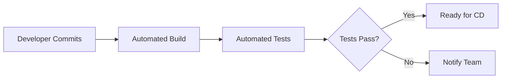
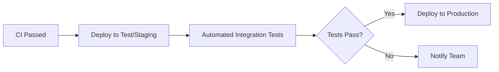
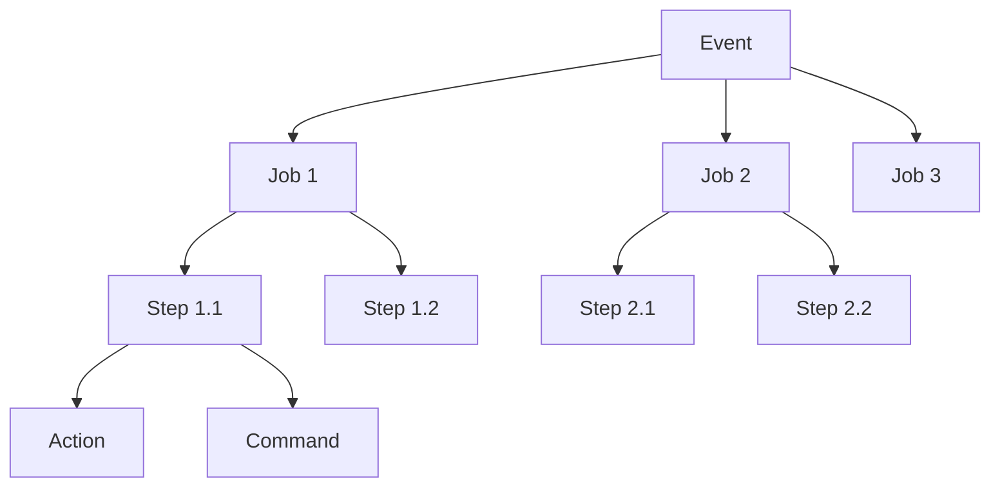

# CI/CD Workshop

## 📑 สารบัญ
- [1. Introduction to CI/CD](#-1-introduction-to-cicd) 
- [2. Overview of CI/CD Platforms](#-2-overview-of-cicd-platforms) 
- [3. Getting Started with GitHub Actions](#-3-getting-started-with-github-actions) 
- [4. Core Concepts in GitHub Actions](#-4-core-concepts-in-github-actions) 
- [5. GitHub Actions Marketplace](#-5-github-actions-marketplace) 
- [6. Secrets, Security & Permissions](#-6-secrets-security--permissions) 
- [7. Debugging & Monitoring GitHub Actions](#-7-debugging--monitoring-github-actions) 
- [8. Optimizing GitHub Actions Workflows](#-8-optimizing-github-actions-workflows) 
- [9. Basic CI/CD Pipelines](#-9-basic-cicd-pipelines) 
- [10. Deployment Pipelines](#-10-deployment-pipelines) 
- [11. Advanced Use Cases](#-11-advanced-use-cases) 

## 🔹 1. Introduction to CI/CD

### 🚀 CI/CD คืออะไร? ทำไมสำคัญ?

**Continuous Integration (CI) และ Continuous Delivery/Deployment (CD)** คือแนวทางในการพัฒนาซอฟต์แวร์ที่ช่วยให้ทีมสามารถส่งมอบการเปลี่ยนแปลงไปยังลูกค้าได้อย่างรวดเร็วและปลอดภัยยิ่งขึ้น

**ทำไมสำคัญ?**
- ลดความเสี่ยงในการ deploy
- ตรวจจับ bug ได้เร็วขึ้น
- เพิ่มความเร็วในการพัฒนาและ delivery
- ลดงานที่ซ้ำซ้อนและเพิ่ม automation
- สร้างความมั่นใจในคุณภาพของโค้ด

### ⚙️ การทำงานของ Continuous Integration (CI)

CI เน้นที่การรวมโค้ดจากนักพัฒนาหลายคนเข้าด้วยกันอย่างสม่ำเสมอ:

1. **การ Commit โค้ดบ่อยๆ**: นักพัฒนาควร push โค้ดไปยังระบบควบคุมเวอร์ชัน (เช่น Git) อย่างสม่ำเสมอ
2. **Automated Build**: ระบบจะสร้าง build โปรเจคโดยอัตโนมัติเมื่อมีการ push โค้ด
3. **Automated Tests**: ทดสอบโค้ดที่ถูก push เข้ามาโดยอัตโนมัติ
4. **Fail Fast**: หากมีปัญหาเกิดขึ้น ระบบจะแจ้งเตือนทีมทันที



### 🚢 การทำงานของ Continuous Deployment (CD)

CD เป็นกระบวนการที่ทำให้มั่นใจว่าซอฟต์แวร์พร้อมจะ deploy ได้ตลอดเวลา:

1. **Continuous Delivery**: การเตรียมโค้ดให้พร้อมสำหรับการ deploy โดยอัตโนมัติ แต่ยังคงต้องอนุมัติการ deploy แบบ manual
2. **Continuous Deployment**: ขั้นตอนถัดไปที่โค้ดจะถูก deploy ไปยัง production โดยอัตโนมัติหากผ่านทุกการทดสอบ



### 🤝 DevOps กับ CI/CD

DevOps เป็นวัฒนธรรมและแนวทางที่เน้นการทำงานร่วมกันระหว่างทีม Development และ Operations:

- CI/CD เป็นเครื่องมือสำคัญในการทำ DevOps
- ช่วยให้ทีมสามารถส่งมอบซอฟต์แวร์ได้อย่างรวดเร็ว มีประสิทธิภาพและคุณภาพ
- สนับสนุนค่านิยมหลักของ DevOps: การทำงานร่วมกัน, automation, การวัดผล, และการแบ่งปัน

## 🔹 2. Overview of CI/CD Platforms

### เปรียบเทียบ CI/CD Platforms ยอดนิยม

| Platform | รูปแบบ | ข้อดี | ข้อเสีย |
|----------|--------|-------|---------|
| **GitHub Actions** | Cloud/Self-hosted | - ใช้งานง่าย<br>- รวมกับ GitHub<br>- Marketplace ใหญ่ | - นำมาใช้ใหม่ๆ เมื่อเทียบกับตัวอื่น |
| **GitLab CI/CD** | Cloud/Self-hosted | - All-in-one platform<br>- Built-in container registry | - UI ซับซ้อน<br>- Self-hosted อาจยุ่งยาก |
| **Jenkins** | Self-hosted | - Customizable<br>- Plugin ecosystem ใหญ่มาก | - ต้องการ maintenance สูง<br>- Setup ยาก |
| **CircleCI** | Cloud/Self-hosted | - ใช้งานง่าย<br>- Orbs (reusable configurations) | - ราคาอาจแพงสำหรับทีมขนาดใหญ่ |
| **Travis CI** | Cloud | - Setup ง่าย<br>- เหมาะกับ open source | - จำกัดความสามารถในการ customize |

### จุดเด่นและข้อเสียของแต่ละแพลตฟอร์ม

**GitHub Actions**
- จุดเด่น: ผสานรวมกับ GitHub อย่างลงตัว, ใช้งานง่าย, Community actions จำนวนมาก
- ข้อเสีย: Debugging อาจทำได้ยาก, ตัวเลือกในการ caching ยังจำกัด

**GitLab CI/CD**
- จุดเด่น: ระบบครบวงจร, Built-in registry, ทำงานได้ดีกับ GitLab repositories
- ข้อเสีย: Learning curve สูง, Documentation อาจไม่ครบถ้วน

**Jenkins**
- จุดเด่น: ปรับแต่งได้สูงมาก, มี plugin มากกว่า 1,500 ตัว, Community ใหญ่
- ข้อเสีย: UI ล้าสมัย, ต้องการ maintenance มาก, ไม่เหมาะกับโปรเจคเล็ก

**CircleCI**
- จุดเด่น: Setup ง่าย, มีฟีเจอร์ dockerization ที่ดี
- ข้อเสีย: ราคาอาจสูงเมื่อมีทีมขนาดใหญ่, ปรับแต่งได้น้อยกว่า Jenkins

**Travis CI**
- จุดเด่น: ใช้งานง่าย, เหมาะสำหรับโปรเจค open source
- ข้อเสีย: ไม่ค่อยยืดหยุ่น, อาจมีข้อจำกัดใน free tier

### ทำไมต้องเลือก GitHub Actions?

1. **Native Integration**: ทำงานร่วมกับ GitHub ได้อย่างลงตัวโดยไม่ต้องใช้บริการจากภายนอก
2. **YAML-based Configuration**: ใช้ไฟล์ YAML ที่อ่านง่ายและเข้าใจได้ง่าย
3. **Community Actions**: มี action มากมายที่พร้อมใช้งานจาก marketplace
4. **Free for Public Repositories**: ฟรีสำหรับ public repositories และมี free minutes สำหรับ private repositories
5. **Matrix Builds**: สร้าง matrix builds เพื่อทดสอบในหลาย environment ได้ง่าย
6. **Self-hosted Runners**: สามารถใช้ runner บนเครื่องของตัวเองได้

## การรัน GitHub Actions Runner บน On-Premises

การรัน runner บนเครื่องหรือเซิร์ฟเวอร์ของตนเอง (self-hosted runner) เป็นทางเลือกที่ดีเมื่อต้องการควบคุมสภาพแวดล้อมการทำงานหรือต้องการใช้ทรัพยากรที่มีอยู่

### ประโยชน์ของ Self-hosted Runners

1. **รองรับฮาร์ดแวร์เฉพาะทาง** - เช่น GPU หรือ CPU ที่มีประสิทธิภาพสูง
2. **เข้าถึงทรัพยากรภายใน** - สามารถเข้าถึงระบบภายในที่ไม่เปิดให้ภายนอก
3. **ประหยัดเวลา** - ไม่ต้องอัปโหลด/ดาวน์โหลดไฟล์ขนาดใหญ่ไปยัง GitHub
4. **การตั้งค่าเฉพาะ** - กำหนดสภาพแวดล้อมให้ตรงกับ production ได้
5. **ไม่มีข้อจำกัดเวลา** - ไม่มี timeout แบบที่ GitHub-hosted runners มี

### การติดตั้ง Self-hosted Runner

1. **การเข้าถึงหน้าตั้งค่า Runner**:
   - ไปที่ repository > Settings > Actions > Runners
   - คลิกปุ่ม "New self-hosted runner"

2. **เลือกระบบปฏิบัติการ**:
   - เลือก OS ที่จะติดตั้ง runner (Linux, Windows, macOS)
   - ระบบจะแสดงคำสั่งสำหรับการติดตั้ง

3. **ขั้นตอนการติดตั้งบน Linux**:
   ```bash
   # 1. ดาวน์โหลด runner
   mkdir actions-runner && cd actions-runner
   curl -o actions-runner-linux-x64-2.305.0.tar.gz -L https://github.com/actions/runner/releases/download/v2.305.0/actions-runner-linux-x64-2.305.0.tar.gz
   
   # 2. ตรวจสอบความถูกต้องของไฟล์ (optional)
   echo "22715802b9dc9476229d2f5bc2d4e85b71c7a377 actions-runner-linux-x64-2.305.0.tar.gz" | shasum -a 256 -c
   
   # 3. แตกไฟล์
   tar xzf ./actions-runner-linux-x64-2.305.0.tar.gz
   
   # 4. กำหนดค่า และลงทะเบียน runner
   ./config.sh --url https://github.com/YOUR-ORG/YOUR-REPO --token YOUR_TOKEN
   
   # 5. เริ่มการทำงาน
   ./run.sh
   ```

4. **การรัน Runner เป็น Service**:
   ```bash
   # ติดตั้งเป็น service (สำหรับ Linux)
   sudo ./svc.sh install
   
   # เริ่มการทำงาน
   sudo ./svc.sh start
   
   # ตรวจสอบสถานะ
   sudo ./svc.sh status
   ```

### การตั้งค่า Labels

การกำหนด labels ให้ runner ช่วยในการเลือกใช้ runner ที่เหมาะสมสำหรับแต่ละงาน:

```bash
./config.sh --url https://github.com/YOUR-ORG/YOUR-REPO --token YOUR_TOKEN --labels gpu,production,ubuntu-20.04
```

การใช้ labels ใน workflow:

```yaml
jobs:
  build:
    runs-on: [self-hosted, gpu, production]
```

### การรัน Docker บน Self-hosted Runner

หากต้องการใช้งาน Docker บน self-hosted runner:

1. **ติดตั้ง Docker**:
   ```bash
   # สำหรับ Ubuntu
   sudo apt-get update
   sudo apt-get install docker.io
   sudo systemctl start docker
   sudo systemctl enable docker
   
   # เพิ่มผู้ใช้ runner เข้ากลุ่ม docker
   sudo usermod -aG docker $USER
   ```

2. **ตั้งค่า runner ให้ใช้งานร่วมกับ Docker**:
   ```yaml
   jobs:
     build:
       runs-on: [self-hosted]
       container:
         image: node:14
   ```

### ความปลอดภัย

1. **แยก Runners ตามระดับความเสี่ยง**:
   - ใช้ runner แยกสำหรับ public repositories และ private repositories
   - ไม่ควรใช้ runner เดียวกันสำหรับงานที่มีระดับความปลอดภัยต่างกัน

2. **จำกัดการเข้าถึง**:
   - ตั้งค่า firewall อย่างเหมาะสม
   - ระวังการให้สิทธิ์บน runner machine

3. **อัปเดต Runner อยู่เสมอ**:
   ```bash
   # ตรวจสอบการอัปเดต
   cd actions-runner
   ./run.sh
   ```

### การดูแลรักษา

1. **การอัปเดต Runner**:
   ```bash
   cd actions-runner
   ./config.sh remove --token YOUR_REMOVE_TOKEN
   # หลังจากลบแล้ว ให้ติดตั้งเวอร์ชันใหม่
   ```

2. **การตรวจสอบการทำงาน**:
   ```bash
   # ดูล็อกไฟล์
   tail -f ~/actions-runner/_diag/Runner_*.log
   ```

3. **การตั้งค่าเพิ่มเติม**:
   - `--ephemeral`: รันแบบใช้ครั้งเดียวแล้วลบตัวเอง
   - `--disableupdate`: ปิดการอัปเดตอัตโนมัติ

## 🔹 3. Getting Started with GitHub Actions

### GitHub Actions คืออะไร?

GitHub Actions เป็นแพลตฟอร์ม CI/CD ที่ช่วยให้คุณสามารถสร้าง workflow automation ของคุณเองได้ภายใน repository ของ GitHub คุณสามารถ:

- ทดสอบและ build โค้ดโดยอัตโนมัติ
- Deploy applications
- Automate different parts ของ development workflow

### คำศัพท์สำคัญ

**1. Workflow**
- ไฟล์ YAML ที่กำหนด automation process
- อยู่ในโฟลเดอร์ `.github/workflows`
- ประกอบด้วย job หนึ่งหรือหลาย job
- ทริกเกอร์ด้วย event เช่น push, pull request

**2. Jobs**
- ชุดของ steps ที่รันบน runner เดียวกัน
- Jobs ต่างๆ จะรันแบบขนานโดยค่าเริ่มต้น
- สามารถกำหนดเงื่อนไขการรันได้ เช่น รันต่อเมื่อ job อื่นสำเร็จ

**3. Steps**
- งานย่อยของแต่ละ job
- สามารถรัน commands, scripts หรือ actions
- แต่ละ step รันแบบ sequential
- แต่ละ step แชร์ข้อมูลกันได้

**4. Actions**
- ชุดคำสั่งที่สามารถนำกลับมาใช้ซ้ำได้
- สามารถสร้างเองหรือใช้จาก GitHub Marketplace
- เช่น `actions/checkout@v2` เพื่อ clone repository

**5. Runners**
- เครื่องที่รัน workflow
- มีทั้ง GitHub-hosted runners และ self-hosted runners
- มีหลาย OS ให้เลือก เช่น Ubuntu, Windows, macOS

### โครงสร้างของไฟล์ .yml

```yaml
name: [ชื่อ Workflow]

on: [event ที่ทริกเกอร์ workflow]

jobs:
  job_id:
    runs-on: [runner]
    steps:
      - name: [ชื่อ step]
        uses: [action]  # หรือ
        run: [command]  # คำสั่ง shell
        env:  # ตัวแปรสภาพแวดล้อม (optional)
          KEY: value
```

### ตัวอย่าง Workflow พื้นฐาน

ตัวอย่างพื้นฐานสำหรับ Node.js project:

```yaml
name: Node.js CI

on:
  push:
    branches: [ main ]
  pull_request:
    branches: [ main ]

jobs:
  build:
    runs-on: ubuntu-latest
    
    strategy:
      matrix:
        node-version: [14.x, 16.x, 18.x]
    
    steps:
      - name: Checkout repository
        uses: actions/checkout@v3
        
      - name: Setup Node.js ${{ matrix.node-version }}
        uses: actions/setup-node@v3
        with:
          node-version: ${{ matrix.node-version }}
          cache: 'npm'
          
      - name: Install dependencies
        run: npm ci
        
      - name: Run tests
        run: npm test
        
      - name: Build
        run: npm run build --if-present
```

ตัวอย่าง Workflow สำหรับ Docker:

```yaml
name: Docker Build and Push

on:
  push:
    branches: [ main ]

jobs:
  build:
    runs-on: ubuntu-latest
    steps:
      - name: Checkout
        uses: actions/checkout@v3
        
      - name: Set up QEMU
        uses: docker/setup-qemu-action@v2
        
      - name: Set up Docker Buildx
        uses: docker/setup-buildx-action@v2
        
      - name: Login to Docker Hub
        uses: docker/login-action@v2
        with:
          username: ${{ secrets.DOCKERHUB_USERNAME }}
          password: ${{ secrets.DOCKERHUB_TOKEN }}
          
      - name: Build and push
        uses: docker/build-push-action@v3
        with:
          context: .
          push: true
          tags: user/app:latest
```

ตัวอย่างสำหรับการ Deploy ไปยัง Firebase:

```yaml
name: Firebase Deploy

on:
  push:
    branches: [ main ]

jobs:
  build_and_deploy:
    runs-on: ubuntu-latest
    steps:
      - uses: actions/checkout@v3
      
      - name: Setup Node.js
        uses: actions/setup-node@v3
        with:
          node-version: '16'
          
      - name: Install dependencies
        run: npm ci
        
      - name: Build
        run: npm run build
        
      - name: Deploy to Firebase
        uses: w9jds/firebase-action@master
        with:
          args: deploy --only hosting
        env:
          FIREBASE_TOKEN: ${{ secrets.FIREBASE_TOKEN }}
```

## 🔹 4. Core Concepts in GitHub Actions

### Workflow Structure

GitHub Actions ทำงานตามลำดับดังนี้:

**Event → Jobs → Steps → Actions**

1. **Event**: เหตุการณ์ที่ทริกเกอร์ให้ workflow เริ่มทำงาน
2. **Jobs**: งานที่ต้องทำหลังจากเกิด event (รันแบบขนานโดยปกติ)
3. **Steps**: ขั้นตอนย่อยในแต่ละ job (รันแบบลำดับ)
4. **Actions**: คำสั่งที่ใช้ในแต่ละ step



### Types of Events ที่ Trigger Workflow

1. **push**: เมื่อมีการ push โค้ดเข้า repository
   ```yaml
   on:
     push:
       branches: [ main, dev ]
       paths-ignore: [ 'docs/**', '**.md' ]
   ```

2. **pull_request**: เมื่อมีการสร้างหรืออัปเดต Pull Request
   ```yaml
   on:
     pull_request:
       types: [opened, synchronize, reopened]
       branches: [ main ]
   ```

3. **schedule**: รันตามเวลาที่กำหนดด้วยรูปแบบ cron
   ```yaml
   on:
     schedule:
       - cron: '0 0 * * *'  # รันทุกวันตอนเที่ยงคืน
   ```

4. **workflow_dispatch**: รันด้วยตนเองผ่าน UI หรือ API
   ```yaml
   on:
     workflow_dispatch:
       inputs:
         environment:
           description: 'Environment to deploy to'
           required: true
           default: 'staging'
   ```

5. **repository_dispatch**: รันเมื่อ webhook ภายนอกเรียก API
   ```yaml
   on:
     repository_dispatch:
       types: [deploy]
   ```

### Runners และ Execution Environment

Runners คือเซิร์ฟเวอร์ที่รัน workflow ของคุณ มี 2 ประเภท:

#### GitHub-hosted Runners

- GitHub จัดเตรียมให้พร้อมใช้งาน
- มีหลาย OS ให้เลือก: `ubuntu-latest`, `windows-latest`, `macos-latest`
- มีซอฟต์แวร์ติดตั้งไว้แล้วจำนวนมาก
- ฟรีสำหรับ public repositories และมี quotas สำหรับ private repositories

```yaml
jobs:
  build:
    runs-on: ubuntu-latest
    # หรือ
    # runs-on: windows-latest
    # runs-on: macos-latest
```

#### Self-hosted Runners

- คุณติดตั้งและดูแลเอง
- เหมาะสำหรับสภาพแวดล้อมพิเศษหรือต้องการ performance สูง
- สามารถเป็นเครื่องจริง, VM หรือ container

```yaml
jobs:
  build:
    runs-on: self-hosted
    # หรือระบุ labels เพิ่มเติม
    # runs-on: [self-hosted, linux, x64]
```

## 🔹 5. GitHub Actions Marketplace

### ใช้ Actions สำเร็จรูปจาก Marketplace

GitHub Actions Marketplace คือแหล่งรวม actions สำเร็จรูปที่สามารถนำมาใช้ในโปรเจกต์ของคุณได้ทันที โดยส่วนใหญ่:
- พัฒนาโดย GitHub, องค์กรชั้นนำ, หรือชุมชน
- มีวิธีใช้งานและเอกสารประกอบชัดเจน
- มีการอัปเดตสม่ำเสมอ

### วิธีค้นหาและใช้งาน Actions

1. **การค้นหา Actions**:
   - เข้าไปที่ [GitHub Marketplace](https://github.com/marketplace?type=actions)
   - ใช้คำค้นเพื่อหา action ที่ต้องการ
   - อ่านรีวิวและดูจำนวนดาวเพื่อประเมินความนิยม

2. **วิธีเพิ่ม Action ในไฟล์ workflow**:
   ```yaml
   steps:
     - name: ชื่อขั้นตอน
       uses: ชื่อ-action@version
       with:
         parameter-1: value-1
         parameter-2: value-2
   ```

3. **การระบุเวอร์ชัน**:
   - `@v1`: ใช้เวอร์ชันหลักล่าสุด (เช่น v1.x.x)
   - `@v1.2`: ใช้เวอร์ชันรองล่าสุด (เช่น v1.2.x)
   - `@v1.2.3`: ใช้เวอร์ชันแน่นอน
   - `@main`: ใช้จากบรานช์หลัก (อาจไม่เสถียร)
   - `@5a4ac9bb22`: ใช้ commit hash แน่นอน (ปลอดภัยที่สุด)

### ตัวอย่าง Actions ยอดนิยม

#### 1. actions/checkout
ใช้สำหรับโคลน repository ไปยัง runner

```yaml
- name: Checkout code
  uses: actions/checkout@v3
  with:
    # รองรับ 
    fetch-depth: 0  # โคลนประวัติทั้งหมด
    ref: feature-branch  # ระบุ branch หรือ tag
```

#### 2. actions/setup-node
ตั้งค่าสภาพแวดล้อม Node.js

```yaml
- name: Setup Node.js
  uses: actions/setup-node@v3
  with:
    node-version: '16'
    # หรือใช้ version range
    # node-version: '14.x'
    
    cache: 'npm'  # เปิดใช้การแคช npm dependencies
    registry-url: 'https://registry.npmjs.org'  # สำหรับ publish packages
```

#### 3. docker/build-push-action
สร้างและส่ง Docker image ไปยัง registry

```yaml
- name: Build and push Docker image
  uses: docker/build-push-action@v3
  with:
    context: .
    push: true
    tags: |
      username/image:latest
      username/image:v1
    build-args: |
      ARG1=value1
      ARG2=value2
    cache-from: type=registry,ref=username/image:latest
    cache-to: type=inline
```

#### 4. actions/cache
แคชไฟล์เพื่อเร่งความเร็วในการรัน workflow

```yaml
- name: Cache dependencies
  uses: actions/cache@v3
  with:
    path: ~/.npm
    key: ${{ runner.os }}-npm-${{ hashFiles('**/package-lock.json') }}
    restore-keys: |
      ${{ runner.os }}-npm-
```

#### 5. JamesIves/github-pages-deploy-action
สำหรับ deploy เว็บไปยัง GitHub Pages

```yaml
- name: Deploy to GitHub Pages
  uses: JamesIves/github-pages-deploy-action@v4
  with:
    branch: gh-pages
    folder: build
    clean: true
```

## 🔹 6. Secrets, Security & Permissions

### การใช้ Secrets & Environment Variables

Secrets คือตัวแปรที่เข้ารหัสซึ่งใช้เก็บข้อมูลที่มีความอ่อนไหว โดยจะไม่แสดงในล็อก:

#### Environment Variables ทั่วไป

```yaml
jobs:
  example-job:
    runs-on: ubuntu-latest
    env:
      # ตัวแปรระดับ job
      API_URL: https://api.example.com
    
    steps:
      - name: Step with env variable
        env:
          # ตัวแปรระดับ step
          DEBUG_MODE: true
        run: echo $API_URL $DEBUG_MODE
```

#### การเรียกใช้ Secrets

```yaml
jobs:
  publish:
    runs-on: ubuntu-latest
    steps:
      - name: Use secret
        env:
          # เรียกใช้ secret จาก repository settings
          API_TOKEN: ${{ secrets.API_TOKEN }}
        run: |
          echo "Using API token to authenticate"
          curl -H "Authorization: Bearer $API_TOKEN" https://api.example.com
```

### วิธีตั้งค่า Secrets

1. ไปที่ repository ของคุณ > **Settings** > **Secrets and variables** > **Actions**
2. คลิกปุ่ม **New repository secret**
3. ใส่ชื่อ secret (เช่น `API_TOKEN`) และค่า
4. คลิก **Add secret**


**ประเภทของ Secrets**:
- **Repository secrets**: ใช้ได้เฉพาะ repository หนึ่ง
- **Environment secrets**: ใช้ได้เฉพาะ environment ที่กำหนด
- **Organization secrets**: ใช้ได้ทุก repository ในองค์กร

### การจำกัดสิทธิ์ (GITHUB_TOKEN, Fine-grained permissions)

#### GITHUB_TOKEN

GitHub สร้าง token พิเศษสำหรับแต่ละ workflow run โดยอัตโนมัติ:

```yaml
jobs:
  job1:
    runs-on: ubuntu-latest
    steps:
      - uses: actions/checkout@v3
      
      - name: Create issue using REST API
        run: |
          curl -X POST \
          -H "Authorization: Bearer ${{ secrets.GITHUB_TOKEN }}" \
          -H "Accept: application/vnd.github.v3+json" \
          https://api.github.com/repos/${{ github.repository }}/issues \
          -d '{"title":"Automated issue"}'
```

#### จำกัดสิทธิ์ของ GITHUB_TOKEN

```yaml
permissions:
  # จำกัดสิทธิ์ทั้งหมด
  contents: read
  issues: write
  pull-requests: write
  # จะมีสิทธิ์เฉพาะ contents:read, issues:write, pull-requests:write เท่านั้น
```

หรือปิดการใช้งานทั้งหมด:
```yaml
permissions: {}  # ไม่มีสิทธิ์ใดๆ
```

### วิธีป้องกันข้อมูลรั่วไหล

1. **อย่าแสดง Secret โดยตรง**:
   ```yaml
   # BAD - secrets จะถูกแสดงในล็อก
   run: echo "My secret is ${{ secrets.MY_SECRET }}"
   
   # GOOD - ไม่แสดง secret ในล็อก
   run: |
     echo "Using secret for authentication..."
     # ใช้ secret โดยไม่แสดง
   ```

2. **จำกัดสิทธิ์**:
   - ใช้หลักการ "least privilege" โดยให้สิทธิ์เท่าที่จำเป็น
   - กำหนด `permissions` อย่างชัดเจน

3. **ระวัง Workflow จาก Pull Request**:
   ```yaml
   # จำกัด secret เมื่อ workflow ถูกเรียกจาก pull request
   if: github.event_name != 'pull_request'
   env:
     TOKEN: ${{ secrets.TOKEN }}
   ```

4. **ใช้ Environment Protection Rules**:
   ```yaml
   jobs:
     deploy:
       runs-on: ubuntu-latest
       environment: production  # สภาพแวดล้อมที่มีการป้องกัน
   ```

5. **ตรวจสอบ Dependencies**:
   - ใช้ `actions/checkout@` ด้วยเวอร์ชันแน่นอน
   - ระวัง action ที่ไม่น่าเชื่อถือ
   - พิจารณาใช้ action hash แทนเวอร์ชัน

**ตัวอย่างการตั้งค่า Environment Protection Rules**:

1. ไปที่ repository > Settings > Environments
2. สร้าง environment ใหม่หรือคลิก environment ที่มีอยู่
3. ตั้งค่า "Required reviewers" เพื่อจำเป็นต้องมีการอนุมัติ
4. จำกัด branches ที่สามารถ deploy ได้

```yaml
name: Deploy to Production

on:
  push:
    branches: [ main ]

jobs:
  deploy:
    runs-on: ubuntu-latest
    environment: production  # ต้องมีการอนุมัติก่อนทำงาน
    steps:
      - uses: actions/checkout@v3
      - name: Deploy
        run: ./deploy.sh
        env:
          DEPLOY_KEY: ${{ secrets.PRODUCTION_DEPLOY_KEY }}
```

## 🔹 7. Debugging & Monitoring GitHub Actions

การดีบักและติดตามการทำงานของ GitHub Actions เป็นทักษะสำคัญในการแก้ไขปัญหาและปรับปรุงประสิทธิภาพของ workflow

### การดู Logs

GitHub มีระบบ logs ที่ช่วยให้เราตรวจสอบการทำงานของ workflow ได้อย่างละเอียด:

1. **การเข้าถึง Workflow Logs**:
   - ไปที่ repository > Actions tab
   - เลือก workflow run ที่ต้องการตรวจสอบ
   - คลิกที่ job เพื่อดูรายละเอียดของแต่ละ step

2. **การอ่าน Logs**:
   - แต่ละ step มีลูกศรสำหรับขยาย/ย่อ logs
   - สามารถค้นหาข้อความใน logs ได้
   - ดาวน์โหลด logs เป็นไฟล์ได้โดยใช้ปุ่มด้านบนขวา

3. **องค์ประกอบของ Logs**:
   - เวลาเริ่มต้นและสิ้นสุดของแต่ละ step
   - คำสั่งที่รันและผลลัพธ์
   - สถานะการทำงาน (success/failure)
   - ข้อความ warning และ error

```
[2023-05-15 10:15:22] Starting: Setup Node.js
[2023-05-15 10:15:24] Node.js 16.x installed successfully
[2023-05-15 10:15:25] Completed: Setup Node.js
```

### การใช้ debug logs

เมื่อต้องการข้อมูลเพิ่มเติมเกี่ยวกับการทำงานของ workflow สามารถเปิดใช้ debug logs ได้:

1. **การเปิดใช้งาน Debug Logs**:
   - สร้าง repository secret ชื่อ `ACTIONS_RUNNER_DEBUG` ค่าเป็น `true`
   - หรือสร้าง repository secret ชื่อ `ACTIONS_STEP_DEBUG` ค่าเป็น `true`

2. **การดู Debug Output ใน Actions Runner**:
   ```yaml
   steps:
     - name: Show debug info
       env:
         RUNNER_DEBUG: 1
       run: |
         echo "Debug information"
   ```

3. **Debug ด้วย `set-output`**:
   ```yaml
   steps:
     - name: Set output
       id: debug-step
       run: echo "::set-output name=debug-data::This is debug data"
       
     - name: Use output
       run: echo "${{ steps.debug-step.outputs.debug-data }}"
   ```

### วิธีรีรัน Workflow

มีหลายวิธีในการรีรัน workflow ที่ล้มเหลวหรือต้องการทดสอบซ้ำ:

1. **รีรันทั้ง Workflow**:
   - ไปที่หน้า workflow run ที่ต้องการรีรัน
   - คลิกปุ่ม "Re-run all jobs" ที่มุมขวาบน

2. **รีรันเฉพาะ Jobs ที่ล้มเหลว**:
   - ไปที่หน้า workflow run
   - คลิกปุ่ม "Re-run failed jobs" (จะปรากฏเมื่อมีงานที่ล้มเหลว)

3. **รีรันผ่าน API**:
   ```bash
   curl -X POST \
     -H "Authorization: token $GITHUB_TOKEN" \
     -H "Accept: application/vnd.github.v3+json" \
     https://api.github.com/repos/OWNER/REPO/actions/runs/RUN_ID/rerun
   ```

### Debugging Techniques

เทคนิคขั้นสูงสำหรับการดีบัก workflow:

1. **ใช้ `tmate` สำหรับ Interactive Debugging**:
   ```yaml
   steps:
     - uses: actions/checkout@v3
     
     - name: Setup tmate session
       uses: mxschmitt/action-tmate@v3
       if: ${{ failure() }}  # รันเมื่อ step ก่อนหน้าล้มเหลว
   ```

2. **ตรวจสอบตัวแปรและสภาพแวดล้อม**:
   ```yaml
   - name: Debug environment
     run: |
       echo "GitHub workspace: $GITHUB_WORKSPACE"
       echo "GitHub event name: $GITHUB_EVENT_NAME"
       echo "GitHub ref: $GITHUB_REF"
       env
   ```

3. **แสดงข้อมูลเกี่ยวกับ Runner**:
   ```yaml
   - name: Debug runner
     run: |
       echo "OS: $(uname -a)"
       echo "Disk space:"
       df -h
       echo "Installed packages:"
       if [ -x "$(command -v apt)" ]; then
         apt list --installed
       elif [ -x "$(command -v brew)" ]; then
         brew list
       elif [ -x "$(command -v yum)" ]; then
         yum list installed
       fi
   ```

4. **สร้าง Artifacts สำหรับตรวจสอบ**:
   ```yaml
   - name: Generate debug info
     run: |
       mkdir -p debug-info
       env > debug-info/environment.txt
       npm list > debug-info/npm-packages.txt
     
   - name: Upload debug info
     uses: actions/upload-artifact@v3
     with:
       name: debug-artifacts
       path: debug-info
   ```

## 🔹 8. Optimizing GitHub Actions Workflows

การปรับปรุงประสิทธิภาพของ workflow ช่วยประหยัดเวลาและทรัพยากร ทำให้กระบวนการ CI/CD เร็วขึ้นและมีประสิทธิภาพมากขึ้น

### ลดระยะเวลา Execution

1. **ใช้ GitHub-hosted runner ที่เหมาะสม**:
   - `ubuntu-latest` มีประสิทธิภาพสูงกว่า Windows และ macOS
   ```yaml
   jobs:
     build:
       # เลือก OS ที่เร็วที่สุดสำหรับงาน
       runs-on: ubuntu-latest
   ```

2. **ลดขนาดของ Repository**:
   ```yaml
   - name: Checkout
     uses: actions/checkout@v3
     with:
       fetch-depth: 1  # ดึงเฉพาะ commit ล่าสุด
   ```

3. **ปรับแต่ง Timeout**:
   ```yaml
   jobs:
     build:
       runs-on: ubuntu-latest
       timeout-minutes: 10  # กำหนด timeout สำหรับทั้ง job
       
       steps:
         - name: Long running process
           timeout-minutes: 5  # กำหนด timeout สำหรับเฉพาะ step
           run: ./long_process.sh
   ```

4. **หลีกเลี่ยงการติดตั้งซอฟต์แวร์ที่ไม่จำเป็น**:
   ```yaml
   - name: Setup Node.js
     uses: actions/setup-node@v3
     with:
       node-version: '16'
       # ลดเวลาด้วยการติดตั้งเฉพาะที่จำเป็น
       check-latest: false
   ```

### ใช้ Caching (actions/cache)

การใช้ cache ช่วยลดเวลาในการดาวน์โหลดและติดตั้งแพ็คเกจต่างๆ:

1. **Cache สำหรับ npm/yarn**:
   ```yaml
   - name: Cache dependencies
     uses: actions/cache@v3
     with:
       path: ~/.npm
       key: ${{ runner.os }}-node-${{ hashFiles('**/package-lock.json') }}
       restore-keys: |
         ${{ runner.os }}-node-
   ```

2. **Cache สำหรับ pip (Python)**:
   ```yaml
   - name: Cache pip packages
     uses: actions/cache@v3
     with:
       path: ~/.cache/pip
       key: ${{ runner.os }}-pip-${{ hashFiles('**/requirements.txt') }}
       restore-keys: |
         ${{ runner.os }}-pip-
   ```

3. **Cache สำหรับ Gradle**:
   ```yaml
   - name: Cache Gradle packages
     uses: actions/cache@v3
     with:
       path: |
         ~/.gradle/caches
         ~/.gradle/wrapper
       key: ${{ runner.os }}-gradle-${{ hashFiles('**/*.gradle*', '**/gradle-wrapper.properties') }}
       restore-keys: |
         ${{ runner.os }}-gradle-
   ```

4. **การใช้ cache ร่วมกับ setup-* actions**:
   ```yaml
   - name: Setup Node.js
     uses: actions/setup-node@v3
     with:
       node-version: '16'
       cache: 'npm'  # ทำ cache โดยอัตโนมัติ
   ```

### Reusable Workflows

Reusable workflows ช่วยลดความซ้ำซ้อนและทำให้การจัดการ workflow ง่ายขึ้น:

1. **การสร้าง Reusable Workflow**:
   ```yaml
   # .github/workflows/reusable.yml
   name: Reusable workflow
   
   on:
     workflow_call:
       inputs:
         node-version:
           required: true
           type: string
       secrets:
         token:
           required: true
   
   jobs:
     build:
       runs-on: ubuntu-latest
       steps:
         - uses: actions/checkout@v3
         
         - name: Setup Node
           uses: actions/setup-node@v3
           with:
             node-version: ${{ inputs.node-version }}
   ```

2. **การเรียกใช้ Reusable Workflow**:
   ```yaml
   # .github/workflows/caller.yml
   name: Caller workflow
   
   on:
     push:
       branches: [ main ]
   
   jobs:
     call-workflow:
       uses: ./.github/workflows/reusable.yml
       with:
         node-version: '16'
       secrets:
         token: ${{ secrets.GITHUB_TOKEN }}
   ```

3. **ตัวอย่าง Reusable Workflow สำหรับ Deploy**:
   ```yaml
   # .github/workflows/deploy-reusable.yml
   name: Reusable Deploy
   
   on:
     workflow_call:
       inputs:
         environment:
           required: true
           type: string
   
   jobs:
     deploy:
       runs-on: ubuntu-latest
       environment: ${{ inputs.environment }}
       steps:
         # ขั้นตอนการ deploy
   ```

### Parallel & Matrix Jobs

การใช้ parallel jobs และ matrix strategy ช่วยให้สามารถรันงานหลายๆ งานพร้อมกัน:

1. **การใช้ Matrix Strategy**:
   ```yaml
   jobs:
     test:
       runs-on: ubuntu-latest
       strategy:
         matrix:
           node-version: [14.x, 16.x, 18.x]
           os: [ubuntu-latest, windows-latest]
           # สามารถยกเว้นบาง combination ได้
           exclude:
             - os: windows-latest
               node-version: 14.x
       
       steps:
         - uses: actions/checkout@v3
         - name: Use Node.js ${{ matrix.node-version }}
           uses: actions/setup-node@v3
           with:
             node-version: ${{ matrix.node-version }}
         - run: npm test
   ```

2. **การแบ่งงานทดสอบ**:
   ```yaml
   jobs:
     test:
       runs-on: ubuntu-latest
       strategy:
         matrix:
           test-group: [unit, integration, e2e]
       
       steps:
         - uses: actions/checkout@v3
         - name: Run ${{ matrix.test-group }} tests
           run: npm run test:${{ matrix.test-group }}
   ```

3. **Job Dependencies**:
   ```yaml
   jobs:
     setup:
       runs-on: ubuntu-latest
       # การสร้าง output สำหรับงานอื่น
       outputs:
         matrix: ${{ steps.set-matrix.outputs.matrix }}
       steps:
         - id: set-matrix
           run: echo "::set-output name=matrix::{\"include\":[{\"project\":\"foo\",\"config\":\"Debug\"},{\"project\":\"bar\",\"config\":\"Release\"}]}"
     
     build:
       needs: setup
       runs-on: ubuntu-latest
       strategy:
         matrix: ${{ fromJson(needs.setup.outputs.matrix) }}
       steps:
         - run: build.sh ${{ matrix.project }} ${{ matrix.config }}
   ```

4. **การเพิ่มประสิทธิภาพด้วย fail-fast**:
   ```yaml
   jobs:
     test:
       runs-on: ubuntu-latest
       strategy:
         # หยุดทุก jobs เมื่อมี job หนึ่งล้มเหลว
         fail-fast: true
         # หรือยกเลิกการหยุดอัตโนมัติ
         # fail-fast: false
         matrix:
           node-version: [14.x, 16.x, 18.x]
       
       steps:
         - uses: actions/checkout@v3
         - run: npm test
   ```

เทคนิคเหล่านี้ช่วยให้ workflow ของคุณทำงานเร็วขึ้น มีประสิทธิภาพมากขึ้น และง่ายต่อการบำรุงรักษา ลดเวลาในการรอ CI/CD และช่วยให้ทีมพัฒนาได้รวดเร็วขึ้น

## 🔥 ตัวอย่างการใช้งาน GitHub Actions (Workshop + Use Cases)

## 🔹 9. Basic CI/CD Pipelines

### ✅ Example 1: รัน Unit Tests อัตโนมัติ

การรัน unit tests อัตโนมัติเมื่อมีการ push โค้ดเป็นส่วนสำคัญของ CI เพื่อยืนยันว่าโค้ดใหม่ไม่สร้างปัญหา:

```yaml
# .github/workflows/unit-tests.yml
name: Run Unit Tests

on:
  push:
    branches: [ main, develop ]
  pull_request:
    branches: [ main, develop ]

jobs:
  test:
    runs-on: ubuntu-latest
    
    steps:
      - uses: actions/checkout@v3
      
      - name: Set up Node.js
        uses: actions/setup-node@v3
        with:
          node-version: '16'
          cache: 'npm'
          
      - name: Install dependencies
        run: npm ci
        
      - name: Run tests
        run: npm test
        
      - name: Generate test coverage report
        run: npm run test:coverage
        
      - name: Upload coverage report
        uses: actions/upload-artifact@v3
        with:
          name: coverage-report
          path: coverage/
```

**ข้อดี**:
- รันเทสต์อัตโนมัติทุกครั้งที่มีการ push หรือ pull request
- สร้างรายงานความครอบคลุมของเทสต์ (test coverage)
- เก็บรายงานเป็น artifact สำหรับดูภายหลัง

### ✅ Example 2: Linting และ Code Quality Checks

การตรวจสอบคุณภาพโค้ดช่วยให้โค้ดสะอาด มีมาตรฐาน และลดปัญหาที่อาจเกิดขึ้น:

```yaml
# .github/workflows/code-quality.yml
name: Code Quality

on:
  push:
    branches: [ main, develop ]
  pull_request:
    branches: [ main, develop ]

jobs:
  lint:
    runs-on: ubuntu-latest
    
    steps:
      - uses: actions/checkout@v3
      
      - name: Set up Node.js
        uses: actions/setup-node@v3
        with:
          node-version: '16'
          cache: 'npm'
          
      - name: Install dependencies
        run: npm ci
        
      - name: Run ESLint
        run: npx eslint . --ext .js,.jsx,.ts,.tsx
        
      - name: Run Prettier
        run: npx prettier --check "src/**/*.{js,jsx,ts,tsx,json,css,scss,md}"
  
  sonarcloud:
    runs-on: ubuntu-latest
    
    steps:
      - uses: actions/checkout@v3
        with:
          fetch-depth: 0
          
      - name: SonarCloud Scan
        uses: SonarSource/sonarcloud-github-action@master
        env:
          GITHUB_TOKEN: ${{ secrets.GITHUB_TOKEN }}
          SONAR_TOKEN: ${{ secrets.SONAR_TOKEN }}
```

**ข้อดี**:
- ตรวจสอบและบังคับใช้รูปแบบโค้ด (code style)
- ตรวจหาปัญหาที่อาจเกิดขึ้น (potential bugs)
- วิเคราะห์คุณภาพโค้ดด้วย SonarCloud

### ✅ Example 3: Auto Build & Test สำหรับ Frontend

สำหรับโปรเจค frontend เช่น React, Vue หรือ Angular สามารถสร้าง workflow เพื่อ build และทดสอบอัตโนมัติ:

```yaml
# .github/workflows/frontend-ci.yml
name: Frontend CI

on:
  push:
    branches: [ main, develop ]
    paths:
      - 'frontend/**'
  pull_request:
    branches: [ main ]
    paths:
      - 'frontend/**'

jobs:
  build_and_test:
    runs-on: ubuntu-latest
    defaults:
      run:
        working-directory: ./frontend
        
    steps:
      - uses: actions/checkout@v3
      
      - name: Set up Node.js
        uses: actions/setup-node@v3
        with:
          node-version: '16'
          cache: 'npm'
          cache-dependency-path: frontend/package-lock.json
          
      - name: Install dependencies
        run: npm ci
        
      - name: Run lint
        run: npm run lint
        
      - name: Run unit tests
        run: npm run test:ci
        
      - name: Build
        run: npm run build
        
      - name: Run E2E tests
        run: npm run e2e:headless
        
      - name: Archive build
        uses: actions/upload-artifact@v3
        with:
          name: build
          path: frontend/build/
```

**ข้อดี**:
- จำกัดการทำงานเฉพาะเมื่อมีการเปลี่ยนแปลงโค้ดใน directory frontend
- รัน unit tests และ E2E tests
- จัดเก็บ build artifacts สำหรับการตรวจสอบหรือการ deploy

## 🔹 10. Deployment Pipelines

### ✅ Example 4: Deploy React/Vue/Angular ไปที่ GitHub Pages

การ deploy Single Page Application (SPA) ไปยัง GitHub Pages อัตโนมัติ:

```yaml
# .github/workflows/github-pages-deploy.yml
name: Deploy to GitHub Pages

on:
  push:
    branches: [ main ]
    paths:
      - 'src/**'
      - 'public/**'
      - 'package.json'
      - '.github/workflows/github-pages-deploy.yml'

jobs:
  build-and-deploy:
    runs-on: ubuntu-latest
    
    steps:
      - name: Checkout
        uses: actions/checkout@v3
        
      - name: Set up Node.js
        uses: actions/setup-node@v3
        with:
          node-version: '16'
          cache: 'npm'
          
      - name: Install dependencies
        run: npm ci
        
      - name: Build
        run: npm run build
        env:
          PUBLIC_URL: /${{ github.event.repository.name }}
          
      - name: Deploy to GitHub Pages
        uses: JamesIves/github-pages-deploy-action@v4
        with:
          folder: build
          branch: gh-pages
          clean: true
```

**ข้อดี**:
- Deploy อัตโนมัติเมื่อมีการ push ไปยัง main branch
- จำกัดการทำงานเฉพาะเมื่อมีการเปลี่ยนแปลงไฟล์สำคัญ
- ตั้งค่า PUBLIC_URL สำหรับ subdirectory การ deploy

### ✅ Example 5: Build & Push Docker Image ไปที่ Docker Hub

การสร้างและ push Docker image ไปยัง Docker Hub อัตโนมัติ:

```yaml
# .github/workflows/docker-build-push.yml
name: Docker Build and Push

on:
  push:
    branches: [ main ]
    tags:
      - 'v*.*.*'
  pull_request:
    branches: [ main ]

jobs:
  build-and-push:
    runs-on: ubuntu-latest
    
    steps:
      - name: Checkout
        uses: actions/checkout@v3
        
      - name: Docker metadata
        id: meta
        uses: docker/metadata-action@v4
        with:
          images: username/appname
          tags: |
            type=ref,event=branch
            type=ref,event=pr
            type=semver,pattern={{version}}
            type=semver,pattern={{major}}.{{minor}}
            
      - name: Set up QEMU
        uses: docker/setup-qemu-action@v2
        
      - name: Set up Docker Buildx
        uses: docker/setup-buildx-action@v2
        
      - name: Login to Docker Hub
        if: github.event_name != 'pull_request'
        uses: docker/login-action@v2
        with:
          username: ${{ secrets.DOCKERHUB_USERNAME }}
          password: ${{ secrets.DOCKERHUB_TOKEN }}
          
      - name: Build and push
        uses: docker/build-push-action@v3
        with:
          context: .
          push: ${{ github.event_name != 'pull_request' }}
          tags: ${{ steps.meta.outputs.tags }}
          labels: ${{ steps.meta.outputs.labels }}
          cache-from: type=registry,ref=username/appname:buildcache
          cache-to: type=registry,ref=username/appname:buildcache,mode=max
```

**ข้อดี**:
- สร้าง tags อัตโนมัติจากชื่อ branch, PR หรือ version tags
- รองรับ multi-architecture builds ด้วย QEMU
- ใช้ cache เพื่อเร็วขึ้นในการ build
- แยก build-only สำหรับ PR และ build-and-push สำหรับ push หรือ tag

### ✅ Example 6: Deploy ไปที่ AWS (EC2, S3, Lambda)

การ deploy ไปยัง AWS ด้วยการรวม AWS CLI และ Configure AWS credentials action:

```yaml
# .github/workflows/aws-deploy.yml
name: Deploy to AWS

on:
  push:
    branches: [ main ]
  workflow_dispatch:
    inputs:
      environment:
        description: 'Environment to deploy to'
        required: true
        default: 'staging'
        type: choice
        options:
          - staging
          - production

jobs:
  deploy-to-s3:
    runs-on: ubuntu-latest
    environment: ${{ github.event.inputs.environment || 'staging' }}
    
    steps:
      - name: Checkout
        uses: actions/checkout@v3
        
      - name: Configure AWS credentials
        uses: aws-actions/configure-aws-credentials@v1
        with:
          aws-access-key-id: ${{ secrets.AWS_ACCESS_KEY_ID }}
          aws-secret-access-key: ${{ secrets.AWS_SECRET_ACCESS_KEY }}
          aws-region: ap-southeast-1
          
      - name: Build frontend
        run: |
          npm ci
          npm run build
          
      - name: Deploy to S3
        run: |
          aws s3 sync ./build s3://${{ secrets.S3_BUCKET }} --delete
          
      - name: Invalidate CloudFront cache
        run: |
          aws cloudfront create-invalidation --distribution-id ${{ secrets.CLOUDFRONT_DISTRIBUTION_ID }} --paths "/*"
          
  deploy-lambda:
    runs-on: ubuntu-latest
    environment: ${{ github.event.inputs.environment || 'staging' }}
    needs: deploy-to-s3
    
    steps:
      - name: Checkout
        uses: actions/checkout@v3
        
      - name: Configure AWS credentials
        uses: aws-actions/configure-aws-credentials@v1
        with:
          aws-access-key-id: ${{ secrets.AWS_ACCESS_KEY_ID }}
          aws-secret-access-key: ${{ secrets.AWS_SECRET_ACCESS_KEY }}
          aws-region: ap-southeast-1
          
      - name: Package Lambda function
        run: |
          cd lambda
          npm ci
          zip -r ../function.zip .
          
      - name: Deploy Lambda function
        run: |
          aws lambda update-function-code \
            --function-name ${{ secrets.LAMBDA_FUNCTION_NAME }} \
            --zip-file fileb://function.zip
```

**ข้อดี**:
- รองรับการ deploy ทั้งแบบอัตโนมัติและ manual trigger
- ใช้ GitHub Environments สำหรับแยก secrets และ variables
- Deploy ไปยังหลาย services ของ AWS
- Invalidate CloudFront cache หลัง deploy

### ✅ Example 7: Deploy ไปที่ Firebase

การ deploy โปรเจคไปยัง Firebase อัตโนมัติ:

```yaml
# .github/workflows/firebase-deploy.yml
name: Deploy to Firebase

on:
  push:
    branches: [ main ]
  pull_request:
    branches: [ main ]

jobs:
  build_and_preview:
    runs-on: ubuntu-latest
    steps:
      - uses: actions/checkout@v3
      
      - name: Setup Node.js
        uses: actions/setup-node@v3
        with:
          node-version: '16'
          
      - name: Install dependencies
        run: npm ci
        
      - name: Build
        run: npm run build
        
      - name: Deploy to Firebase Hosting preview channel
        uses: FirebaseExtended/action-hosting-deploy@v0
        with:
          repoToken: ${{ secrets.GITHUB_TOKEN }}
          firebaseServiceAccount: ${{ secrets.FIREBASE_SERVICE_ACCOUNT }}
          projectId: your-firebase-project-id
          channelId: preview-${{ github.event.number || github.ref_name }}
        
  deploy_production:
    name: Deploy to Firebase Hosting
    runs-on: ubuntu-latest
    if: github.event_name == 'push' && github.ref == 'refs/heads/main'
    steps:
      - uses: actions/checkout@v3
      
      - name: Setup Node.js
        uses: actions/setup-node@v3
        with:
          node-version: '16'
          
      - name: Install dependencies
        run: npm ci
        
      - name: Build
        run: npm run build
        
      - name: Deploy to Firebase Hosting
        uses: FirebaseExtended/action-hosting-deploy@v0
        with:
          repoToken: ${{ secrets.GITHUB_TOKEN }}
          firebaseServiceAccount: ${{ secrets.FIREBASE_SERVICE_ACCOUNT }}
          projectId: your-firebase-project-id
          channelId: live
```

**ข้อดี**:
- สร้าง preview channels สำหรับ pull requests
- Deploy ไปยัง production เฉพาะเมื่อ push ไปยัง main branch
- ใช้ Firebase service account สำหรับการ authentication

## 🔹 11. Advanced Use Cases

### ✅ Example 8: Multi-Environment Deployment (Dev, Staging, Prod)

การ deploy แบบหลายสภาพแวดล้อมแตกต่างกันตาม branch หรือแบบ manual approval:

```yaml
# .github/workflows/multi-environment-deploy.yml
name: Multi-Environment Deployment

on:
  push:
    branches: [develop, staging, main]
  workflow_dispatch:
    inputs:
      environment:
        description: 'Target environment'
        required: true
        type: choice
        options:
          - dev
          - staging
          - production

jobs:
  determine_environment:
    runs-on: ubuntu-latest
    outputs:
      environment: ${{ steps.set-env.outputs.environment }}
    steps:
      - id: set-env
        run: |
          if [[ "${{ github.event_name }}" == "workflow_dispatch" ]]; then
            echo "environment=${{ github.event.inputs.environment }}" >> $GITHUB_OUTPUT
          elif [[ "${{ github.ref }}" == "refs/heads/main" ]]; then
            echo "environment=production" >> $GITHUB_OUTPUT
          elif [[ "${{ github.ref }}" == "refs/heads/staging" ]]; then
            echo "environment=staging" >> $GITHUB_OUTPUT
          else
            echo "environment=dev" >> $GITHUB_OUTPUT
          fi
          
  deploy:
    needs: determine_environment
    environment: ${{ needs.determine_environment.outputs.environment }}
    runs-on: ubuntu-latest
    steps:
      - name: Checkout code
        uses: actions/checkout@v3
        
      - name: Configure AWS credentials
        uses: aws-actions/configure-aws-credentials@v1
        with:
          aws-access-key-id: ${{ secrets.AWS_ACCESS_KEY_ID }}
          aws-secret-access-key: ${{ secrets.AWS_SECRET_ACCESS_KEY }}
          aws-region: ap-southeast-1
          
      - name: Install dependencies
        run: npm ci
        
      - name: Build with environment variables
        run: |
          echo "Building for ${{ needs.determine_environment.outputs.environment }} environment"
          npm run build:${{ needs.determine_environment.outputs.environment }}
          
      - name: Deploy to S3
        run: |
          aws s3 sync ./build s3://${{ secrets.S3_BUCKET_PREFIX }}-${{ needs.determine_environment.outputs.environment }} --delete
          
      - name: Slack notification
        uses: 8398a7/action-slack@v3
        with:
          status: ${{ job.status }}
          fields: repo,message,commit,author,action,eventName,ref,workflow
        env:
          SLACK_WEBHOOK_URL: ${{ secrets.SLACK_WEBHOOK_URL }}
```

**ข้อดี**:
- สามารถตรวจจับสภาพแวดล้อมจาก branch หรือ manual trigger
- ใช้ GitHub Environments สำหรับควบคุมการ approvals
- เรียกใช้สคริปต์ build ที่แตกต่างกันตามสภาพแวดล้อม
- แจ้งเตือนผ่าน Slack เมื่อ deploy เสร็จสิ้น

### ✅ Example 9: Automating Database Migrations

การ run database migrations อัตโนมัติเมื่อมีการ deploy:

```yaml
# .github/workflows/db-migrations.yml
name: Database Migrations

on:
  push:
    branches: [ main ]
    paths:
      - 'migrations/**'
      - 'schema/**'

jobs:
  migrate_database:
    runs-on: ubuntu-latest
    environment: production
    
    services:
      # Test database for validation
      postgres:
        image: postgres:13
        env:
          POSTGRES_PASSWORD: postgres
          POSTGRES_USER: postgres
          POSTGRES_DB: test_db
        ports:
          - 5432:5432
        options: --health-cmd pg_isready --health-interval 10s --health-timeout 5s --health-retries 5
    
    steps:
      - name: Checkout code
        uses: actions/checkout@v3
        
      - name: Set up Node.js
        uses: actions/setup-node@v3
        with:
          node-version: '16'
          
      - name: Install dependencies
        run: npm ci
        
      - name: Validate migrations against test DB
        run: |
          npm run migrate:test
          npm run migrate:verify
          
      - name: Run migrations on production DB
        env:
          DB_HOST: ${{ secrets.DB_HOST }}
          DB_USER: ${{ secrets.DB_USER }}
          DB_PASS: ${{ secrets.DB_PASS }}
          DB_NAME: ${{ secrets.DB_NAME }}
        run: npm run migrate:production
        
      - name: Create migration report
        run: npm run migrate:report > migration_report.md
        
      - name: Upload migration report
        uses: actions/upload-artifact@v3
        with:
          name: migration-report
          path: migration_report.md
          
      - name: Notify on failure
        if: failure()
        uses: dawidd6/action-send-mail@v3
        with:
          server_address: ${{ secrets.SMTP_SERVER }}
          server_port: 587
          username: ${{ secrets.SMTP_USERNAME }}
          password: ${{ secrets.SMTP_PASSWORD }}
          subject: "[ALERT] Database migration failed!"
          body: Migration to production DB failed. Check the logs.
          to: dbadmin@example.com
          from: CI System <ci@example.com>
```

**ข้อดี**:
- รัน migrations เมื่อมีการเปลี่ยนแปลงไฟล์ที่เกี่ยวข้องกับ database
- ทดสอบ migrations บน test database ก่อน
- สร้างรายงานการ migrate สำหรับตรวจสอบ
- ส่งการแจ้งเตือนทาง email เมื่อ migrations ล้มเหลว

### ✅ Example 10: Monitoring & Alerts (แจ้งเตือน Slack, Discord, Email)

การตั้งค่าการแจ้งเตือนผ่านช่องทางต่างๆ:

```yaml
# .github/workflows/monitoring-alerts.yml
name: Monitoring & Alerts

on:
  workflow_run:
    workflows: ["CI/CD Pipeline"]
    types: [completed]
  schedule:
    - cron: '0 */3 * * *'  # ทุก 3 ชั่วโมง

jobs:
  health_check:
    runs-on: ubuntu-latest
    steps:
      - name: Check API status
        id: api_check
        continue-on-error: true
        run: |
          response=$(curl -s -o /dev/null -w "%{http_code}" https://api.example.com/health)
          echo "status=$response" >> $GITHUB_OUTPUT
          test $response -eq 200
          
      - name: Check website status
        id: web_check
        continue-on-error: true
        run: |
          response=$(curl -s -o /dev/null -w "%{http_code}" https://www.example.com)
          echo "status=$response" >> $GITHUB_OUTPUT
          test $response -eq 200
          
      - name: Send Slack notification
        if: steps.api_check.outcome == 'failure' || steps.web_check.outcome == 'failure'
        uses: slackapi/slack-github-action@v1
        with:
          payload: |
            {
              "text": "🚨 System Alert!",
              "blocks": [
                {
                  "type": "section",
                  "text": {
                    "type": "mrkdwn",
                    "text": "*System Health Check Failed!*"
                  }
                },
                {
                  "type": "section",
                  "fields": [
                    {
                      "type": "mrkdwn",
                      "text": "*API Status:* ${{ steps.api_check.outcome == 'success' && '✅ OK' || '❌ Failed' }} (${{ steps.api_check.outputs.status }})"
                    },
                    {
                      "type": "mrkdwn", 
                      "text": "*Website Status:* ${{ steps.web_check.outcome == 'success' && '✅ OK' || '❌ Failed' }} (${{ steps.web_check.outputs.status }})"
                    }
                  ]
                }
              ]
            }
        env:
          SLACK_WEBHOOK_URL: ${{ secrets.SLACK_WEBHOOK_URL }}
          
      - name: Send Discord notification
        if: steps.api_check.outcome == 'failure' || steps.web_check.outcome == 'failure'
        uses: sarisia/actions-status-discord@v1
        with:
          webhook: ${{ secrets.DISCORD_WEBHOOK }}
          title: "System Health Check Failed!"
          description: |
            API Status: ${{ steps.api_check.outcome == 'success' && '✅ OK' || '❌ Failed' }} (${{ steps.api_check.outputs.status }})
            Website Status: ${{ steps.web_check.outcome == 'success' && '✅ OK' || '❌ Failed' }} (${{ steps.web_check.outputs.status }})
          color: 0xff0000
          
      - name: Send Email Alert
        if: steps.api_check.outcome == 'failure' || steps.web_check.outcome == 'failure'
        uses: dawidd6/action-send-mail@v3
        with:
          server_address: ${{ secrets.SMTP_SERVER }}
          server_port: 587
          username: ${{ secrets.SMTP_USERNAME }}
          password: ${{ secrets.SMTP_PASSWORD }}
          subject: "🚨 System Health Alert"
          body: |
            System health check has detected issues:
            
            API Status: ${{ steps.api_check.outcome == 'success' && 'OK' || 'Failed' }} (${{ steps.api_check.outputs.status }})
            Website Status: ${{ steps.web_check.outcome == 'success' && 'OK' || 'Failed' }} (${{ steps.web_check.outputs.status }})
            
            Please check systems immediately.
          to: ops-team@example.com
          from: Monitoring System <alerts@example.com>
```

**ข้อดี**:
- ตรวจสุขภาพระบบตามระยะเวลาที่กำหนด
- ส่งการแจ้งเตือนผ่าน Slack, Discord และอีเมล
- รายงานสถานะที่เฉพาะเจาะจงของแต่ละส่วนของระบบ
- รันหลังจาก workflow CI/CD เสร็จสิ้นเพื่อตรวจสอบหลัง deploy

### ✅ Example 11: ใช้ GitHub Actions กับ Monorepo

การจัดการ workflow สำหรับ monorepo ที่มีหลาย projects:

```yaml
# .github/workflows/monorepo.yml
name: Monorepo CI/CD

on:
  push:
    branches: [ main, develop ]
  pull_request:
    branches: [ main, develop ]

jobs:
  detect_changes:
    runs-on: ubuntu-latest
    outputs:
      backend: ${{ steps.filter.outputs.backend }}
      frontend: ${{ steps.filter.outputs.frontend }}
      api: ${{ steps.filter.outputs.api }}
      docs: ${{ steps.filter.outputs.docs }}
    steps:
      - uses: actions/checkout@v3
      
      - name: Check for file changes
        uses: dorny/paths-filter@v2
        id: filter
        with:
          filters: |
            backend:
              - 'backend/**'
              - 'shared/**'
            frontend:
              - 'frontend/**'
              - 'shared/**'
            api:
              - 'api/**'
              - 'shared/**'
            docs:
              - 'docs/**'
              - '**/*.md'
  
  backend:
    needs: detect_changes
    if: ${{ needs.detect_changes.outputs.backend == 'true' }}
    runs-on: ubuntu-latest
    defaults:
      run:
        working-directory: ./backend
    steps:
      - uses: actions/checkout@v3
      
      - name: Set up Node.js
        uses: actions/setup-node@v3
        with:
          node-version: '16'
          cache: 'npm'
          cache-dependency-path: backend/package-lock.json
      
      - name: Install dependencies
        run: npm ci
        
      - name: Run tests
        run: npm test
        
      - name: Build
        run: npm run build
  
  frontend:
    needs: detect_changes
    if: ${{ needs.detect_changes.outputs.frontend == 'true' }}
    runs-on: ubuntu-latest
    defaults:
      run:
        working-directory: ./frontend
    steps:
      - uses: actions/checkout@v3
      
      - name: Set up Node.js
        uses: actions/setup-node@v3
        with:
          node-version: '16'
          cache: 'npm'
          cache-dependency-path: frontend/package-lock.json
      
      - name: Install dependencies
        run: npm ci
        
      - name: Run tests
        run: npm test
        
      - name: Build
        run: npm run build
  
  deploy:
    needs: [detect_changes, backend, frontend]
    # รันเมื่อมีการเปลี่ยนแปลงอย่างน้อย 1 โปรเจกต์และทุก jobs ที่เกี่ยวข้องสำเร็จ
    if: |
      always() &&
      (needs.detect_changes.outputs.backend == 'true' || 
       needs.detect_changes.outputs.frontend == 'true' || 
       needs.detect_changes.outputs.api == 'true') &&
      !contains(needs.*.result, 'failure') &&
      github.ref == 'refs/heads/main'
    runs-on: ubuntu-latest
    steps:
      - uses: actions/checkout@v3
      
      - name: Deploy backend
        if: needs.detect_changes.outputs.backend == 'true'
        run: echo "Deploying backend..."
      
      - name: Deploy frontend
        if: needs.detect_changes.outputs.frontend == 'true'
        run: echo "Deploying frontend..."
      
      - name: Deploy API
        if: needs.detect_changes.outputs.api == 'true'
        run:
