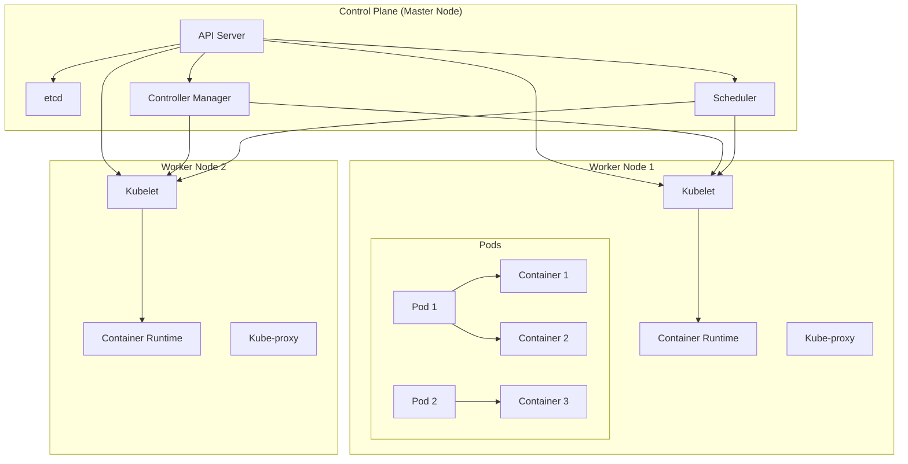
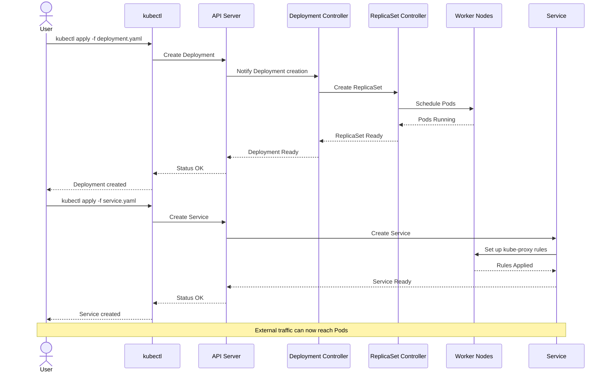
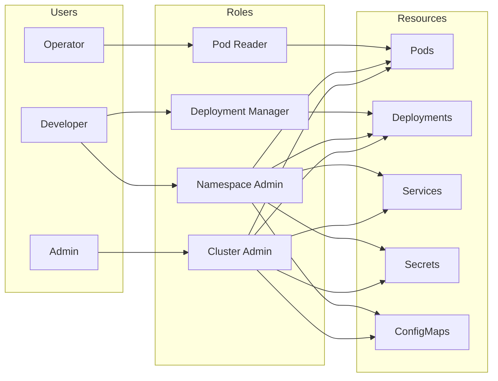

# 🚢 การสร้างและจัดการระบบแบบ Container Orchestration (Kubernetes)

## 📑 สารบัญ

- [บทนำ](#บทนำ)
- [1. พื้นฐาน Container และ Kubernetes](#-พื้นฐาน-container-และ-kubernetes)
- [2. การเตรียมสภาพแวดล้อมสำหรับ Windows User](#️-การเตรียมสภาพแวดล้อมสำหรับ-windows-user)
- [3. การติดตั้ง Minikube](#️-การติดตั้ง-minikube)
- [4. เริ่มต้นใช้งาน Kubernetes](#-เริ่มต้นใช้งาน-kubernetes)
- [5. การ Deploy แอปพลิเคชันบน Kubernetes](#-การ-deploy-แอปพลิเคชันบน-kubernetes)
- [6. การ Scale และ Update แอปพลิเคชัน](#-การ-scale-และ-update-แอปพลิเคชัน)
- [7. การทำ Networking ใน Kubernetes](#-การทำ-networking-ใน-kubernetes)
- [8. การจัดการข้อมูลด้วย Persistent Volumes](#-การจัดการข้อมูลด้วย-persistent-volumes)
- [9. ความปลอดภัยใน Kubernetes](#️-ความปลอดภัยใน-kubernetes)
- [10. การ Deploy Kubernetes บน Digital Ocean](#️-การ-deploy-kubernetes-บน-digital-ocean)
- [11. แนวทางการศึกษาต่อ](#-แนวทางการศึกษาต่อ)

## บทนำ

Container Orchestration คือการจัดการ containers จำนวนมากให้สามารถทำงานร่วมกันได้อย่างมีประสิทธิภาพ Kubernetes (K8s) เป็นระบบ container orchestration ที่ได้รับความนิยมมากที่สุดในปัจจุบัน เราจะเรียนรู้ตั้งแต่พื้นฐานไปจนถึงการ deploy บน cloud provider อย่าง Digital Ocean

## 🔰 พื้นฐาน Container และ Kubernetes

### Container คืออะไร?

Container เป็นหน่วยของซอฟต์แวร์ที่แพ็กโค้ดและส่วนประกอบทั้งหมดที่จำเป็นเพื่อให้แอปพลิเคชันทำงานได้ในทุกสภาพแวดล้อม ต่างจาก VM ตรงที่ container ใช้ทรัพยากรน้อยกว่า และทำงานบน OS kernel เดียวกัน

### Kubernetes คืออะไร?

Kubernetes เป็นแพลตฟอร์มโอเพนซอร์สที่ออกแบบมาเพื่อจัดการ container จำนวนมากโดยอัตโนมัติ ไม่ว่าจะเป็นการ deploy, การปรับขนาด และการจัดการ

### สถาปัตยกรรมของ Kubernetes

Kubernetes ประกอบด้วยองค์ประกอบหลักดังนี้:

1. **Control Plane (Master Node)**:
   - API Server: จุดศูนย์กลางการติดต่อกับ Kubernetes cluster
   - etcd: ฐานข้อมูลแบบ key-value สำหรับเก็บข้อมูลของ cluster
   - Scheduler: ทำการตัดสินใจว่า pod ควรจะทำงานที่ node ไหน
   - Controller Manager: จัดการสถานะของ cluster ให้ตรงกับที่ต้องการ

2. **Worker Nodes**:
   - Kubelet: เอเจนต์ที่ทำงานบนแต่ละ node เพื่อสื่อสารกับ control plane
   - Kube-proxy: จัดการ network rules และการเชื่อมต่อ
   - Container Runtime: เช่น Docker, containerd

3. **Kubernetes Objects**:
   - Pod: หน่วยพื้นฐานที่เล็กที่สุดที่สามารถ deploy บน Kubernetes
   - Service: การเชื่อมต่อระหว่าง Pods และการเข้าถึงจากภายนอก
   - Volume: การจัดการพื้นที่เก็บข้อมูล
   - Namespace: การแบ่งแยกทรัพยากรในคลัสเตอร์

#### แผนภาพสถาปัตยกรรม Kubernetes



## ⚙️ การเตรียมสภาพแวดล้อมสำหรับ Windows User

สำหรับผู้ใช้ Windows จำเป็นต้องเตรียมสภาพแวดล้อมให้พร้อมก่อนเริ่มใช้งาน Kubernetes:

1. **ติดตั้ง Windows Subsystem for Linux (WSL2)** - ทำให้สามารถรัน Linux บน Windows ได้
   ```bash
   # เปิด PowerShell as Administrator แล้วรันคำสั่ง
   wsl --install
   # รีสตาร์ทเครื่อง
   ```

2. **ติดตั้ง Docker Desktop** - ดาวน์โหลดและติดตั้งจาก [docker.com](https://www.docker.com/products/docker-desktop)
   - ตั้งค่า Docker Desktop ให้ใช้งานกับ WSL2

3. **ติดตั้ง kubectl** - เครื่องมือสำหรับควบคุม Kubernetes cluster
   ```bash
   curl -LO "https://dl.k8s.io/release/stable.txt"
   $version = $(Get-Content stable.txt)
   curl -LO "https://dl.k8s.io/release/$version/bin/windows/amd64/kubectl.exe"
   # ย้ายไปไว้ใน PATH
   ```

4. **ติดตั้ง Windows Terminal** - แนะนำให้ใช้งานเพื่อความสะดวก
   - ดาวน์โหลดจาก Microsoft Store

## 🏗️ การติดตั้ง Minikube

Minikube เป็นเครื่องมือที่ช่วยให้รัน Kubernetes แบบ single-node cluster บนเครื่องของเราได้ เหมาะสำหรับการเรียนรู้และพัฒนา

### การติดตั้ง Minikube

#### Windows
```bash
# ดาวน์โหลด installer จาก https://minikube.sigs.k8s.io/docs/start/
# หรือใช้ chocolatey
choco install minikube
```

#### MacOS
```bash
brew install minikube
```

#### Linux
```bash
curl -LO https://storage.googleapis.com/minikube/releases/latest/minikube-linux-amd64
sudo install minikube-linux-amd64 /usr/local/bin/minikube
```

### เริ่มใช้งาน Minikube
```bash
# เริ่มต้น Minikube
minikube start --driver=docker

# ตรวจสอบสถานะ
minikube status

# เปิด Kubernetes Dashboard
minikube dashboard
```

## 🚀 เริ่มต้นใช้งาน Kubernetes

เมื่อติดตั้ง Minikube เรียบร้อยแล้ว เราสามารถเริ่มใช้งาน Kubernetes ได้ทันที

### การตรวจสอบสถานะของ Cluster
```bash
# ดูข้อมูลของ cluster
kubectl cluster-info

# ดูรายการ nodes
kubectl get nodes

# ดูรายการ namespace
kubectl get namespaces
```

### Kubernetes YAML Files

การสร้างและจัดการทรัพยากรใน Kubernetes จะใช้ไฟล์ YAML เป็นหลัก ตัวอย่าง:

```yaml
# ตัวอย่าง Pod
apiVersion: v1
kind: Pod
metadata:
  name: nginx-pod
  labels:
    app: nginx
spec:
  containers:
  - name: nginx
    image: nginx:latest
    ports:
    - containerPort: 80
```

### การใช้งานคำสั่งพื้นฐาน
```bash
# สร้าง resource จาก YAML
kubectl apply -f my-pod.yaml

# ดูรายการ pods
kubectl get pods

# ดูรายละเอียดของ pod
kubectl describe pod nginx-pod

# เข้าถึง shell ของ pod
kubectl exec -it nginx-pod -- /bin/bash

# ดูบันทึกของ pod
kubectl logs nginx-pod

# ลบ pod
kubectl delete pod nginx-pod
```

## 🔄 การ Deploy แอปพลิเคชันบน Kubernetes

การ deploy แอปพลิเคชันบน Kubernetes จะใช้ Deployment เป็นหลัก

### Deployment คืออะไร?

Deployment เป็น resource ที่จัดการชุดของ Pods ที่เหมือนกันหลาย ๆ ตัว มีความสามารถในการ:
- จัดการและอัปเดตแอปพลิเคชันอย่างนุ่มนวล
- Roll back ไปยังเวอร์ชันก่อนหน้าได้
- Scale และ autoscale แอปพลิเคชัน

#### แผนภาพกระบวนการ Deployment และ Service



### การสร้าง Deployment

```yaml
# my-deployment.yaml
apiVersion: apps/v1
kind: Deployment
metadata:
  name: nginx-deployment
  labels:
    app: nginx
spec:
  replicas: 3
  selector:
    matchLabels:
      app: nginx
  template:
    metadata:
      labels:
        app: nginx
    spec:
      containers:
      - name: nginx
        image: nginx:1.14.2
        ports:
        - containerPort: 80
```

```bash
# นำ deployment ไปใช้งาน
kubectl apply -f my-deployment.yaml

# ตรวจสอบสถานะ
kubectl get deployments
kubectl get pods
```

### Service คืออะไร?

Service เป็น resource ที่ใช้เพื่อให้แอปพลิเคชันสามารถติดต่อกันได้ และให้บริการกับภายนอก

```yaml
# my-service.yaml
apiVersion: v1
kind: Service
metadata:
  name: nginx-service
spec:
  selector:
    app: nginx
  ports:
  - port: 80
    targetPort: 80
  type: NodePort
```

```bash
# สร้าง service
kubectl apply -f my-service.yaml

# ดูรายละเอียด service
kubectl get services
kubectl describe service nginx-service

# เข้าถึง service ใน minikube
minikube service nginx-service
```

## 📈 การ Scale และ Update แอปพลิเคชัน

### การ Scale แอปพลิเคชัน
```bash
# Scale deployment เป็น 5 replicas
kubectl scale deployment nginx-deployment --replicas=5

# หรือแก้ไขไฟล์ YAML แล้ว apply ใหม่
```

### Horizontal Pod Autoscaler (HPA)

HPA จะช่วย scale จำนวน pods อัตโนมัติตามการใช้งานทรัพยากร

```yaml
# my-hpa.yaml
apiVersion: autoscaling/v2
kind: HorizontalPodAutoscaler
metadata:
  name: nginx-hpa
spec:
  scaleTargetRef:
    apiVersion: apps/v1
    kind: Deployment
    name: nginx-deployment
  minReplicas: 2
  maxReplicas: 10
  metrics:
  - type: Resource
    resource:
      name: cpu
      target:
        type: Utilization
        averageUtilization: 50
```

```bash
kubectl apply -f my-hpa.yaml
kubectl get hpa
```

### การ Update แอปพลิเคชัน

```bash
# Update image ของ deployment
kubectl set image deployment/nginx-deployment nginx=nginx:1.16.1

# ตรวจสอบประวัติการ roll out
kubectl rollout history deployment/nginx-deployment

# Roll back ไปยังเวอร์ชันก่อนหน้า
kubectl rollout undo deployment/nginx-deployment
```

## 🌐 การทำ Networking ใน Kubernetes

### Service Types

1. **ClusterIP** - เข้าถึงได้เฉพาะภายใน cluster
2. **NodePort** - เปิด port ที่ทุก node สำหรับเข้าถึงจากภายนอก
3. **LoadBalancer** - ใช้ load balancer ของผู้ให้บริการ cloud
4. **ExternalName** - สร้าง CNAME DNS record

### Ingress

Ingress ช่วยจัดการการเข้าถึงจากภายนอกในระดับ HTTP/HTTPS

```yaml
# my-ingress.yaml
apiVersion: networking.k8s.io/v1
kind: Ingress
metadata:
  name: my-ingress
spec:
  rules:
  - host: myapp.example.com
    http:
      paths:
      - path: /
        pathType: Prefix
        backend:
          service:
            name: nginx-service
            port:
              number: 80
```

```bash
# ต้องเปิด ingress ใน minikube ก่อน
minikube addons enable ingress

# สร้าง ingress
kubectl apply -f my-ingress.yaml

# ดูรายการ ingress
kubectl get ingress
```

### Network Policies

Network Policies ช่วยควบคุมการติดต่อระหว่าง pods

```yaml
# network-policy.yaml
apiVersion: networking.k8s.io/v1
kind: NetworkPolicy
metadata:
  name: access-nginx
spec:
  podSelector:
    matchLabels:
      app: nginx
  ingress:
  - from:
    - podSelector:
        matchLabels:
          access: "true"
    ports:
    - protocol: TCP
      port: 80
```

## 💾 การจัดการข้อมูลด้วย Persistent Volumes

### Persistent Volume (PV) และ Persistent Volume Claim (PVC)

PV เป็นทรัพยากรเก็บข้อมูลที่ admin จัดเตรียมไว้ และ PVC เป็นคำขอใช้พื้นที่จากผู้ใช้

```yaml
# persistent-volume.yaml
apiVersion: v1
kind: PersistentVolume
metadata:
  name: my-pv
spec:
  capacity:
    storage: 1Gi
  accessModes:
    - ReadWriteOnce
  hostPath:
    path: "/mnt/data"
```

```yaml
# persistent-volume-claim.yaml
apiVersion: v1
kind: PersistentVolumeClaim
metadata:
  name: my-pvc
spec:
  accessModes:
    - ReadWriteOnce
  resources:
    requests:
      storage: 500Mi
```

```bash
kubectl apply -f persistent-volume.yaml
kubectl apply -f persistent-volume-claim.yaml

# ตรวจสอบ PV และ PVC
kubectl get pv
kubectl get pvc
```

### การใช้ PVC กับ Pod

```yaml
# pod-with-pvc.yaml
apiVersion: v1
kind: Pod
metadata:
  name: nginx-pvc-pod
spec:
  containers:
  - name: nginx
    image: nginx
    volumeMounts:
    - mountPath: "/usr/share/nginx/html"
      name: nginx-data
  volumes:
  - name: nginx-data
    persistentVolumeClaim:
      claimName: my-pvc
```

### ConfigMaps และ Secrets

#### ConfigMap
```yaml
# my-configmap.yaml
apiVersion: v1
kind: ConfigMap
metadata:
  name: app-config
data:
  database_url: "mysql://db:3306/mydb"
  app_mode: "production"
```

#### Secret
```yaml
# my-secret.yaml
apiVersion: v1
kind: Secret
metadata:
  name: app-secrets
type: Opaque
data:
  username: YWRtaW4=  # base64 encoded "admin"
  password: cGFzc3dvcmQxMjM=  # base64 encoded "password123"
```

## 🛡️ ความปลอดภัยใน Kubernetes

### RBAC (Role-Based Access Control)

การควบคุมสิทธิ์การเข้าถึงทรัพยากรใน Kubernetes

```yaml
# role.yaml
apiVersion: rbac.authorization.k8s.io/v1
kind: Role
metadata:
  namespace: default
  name: pod-reader
rules:
- apiGroups: [""]
  resources: ["pods"]
  verbs: ["get", "watch", "list"]
```

```yaml
# role-binding.yaml
apiVersion: rbac.authorization.k8s.io/v1
kind: RoleBinding
metadata:
  name: read-pods
  namespace: default
subjects:
- kind: User
  name: jane
  apiGroup: rbac.authorization.k8s.io
roleRef:
  kind: Role
  name: pod-reader
  apiGroup: rbac.authorization.k8s.io
```

#### แผนภาพสิทธิ์การเข้าถึงด้วย RBAC



### Pod Security Policies

การกำหนดนโยบายความปลอดภัยสำหรับ Pod

```yaml
# pod-security-policy.yaml
apiVersion: policy/v1beta1
kind: PodSecurityPolicy
metadata:
  name: restricted
spec:
  privileged: false
  seLinux:
    rule: RunAsAny
  runAsUser:
    rule: MustRunAsNonRoot
  fsGroup:
    rule: MustRunAs
    ranges:
    - min: 1000
      max: 2000
  supplementalGroups:
    rule: MustRunAs
    ranges:
    - min: 1000
      max: 2000
  volumes:
  - 'configMap'
  - 'emptyDir'
  - 'persistentVolumeClaim'
```

## ☁️ การ Deploy Kubernetes บน Digital Ocean

Digital Ocean Kubernetes (DOKS) เป็นบริการที่ให้เราสามารถสร้าง Kubernetes cluster บน cloud ได้อย่างง่ายดาย

### ขั้นตอนการ Setup DOKS

1. **สร้างบัญชี Digital Ocean** (หากยังไม่มี)

2. **ติดตั้ง doctl CLI**
   ```bash
   # Linux
   cd ~
   wget https://github.com/digitalocean/doctl/releases/download/v1.X.X/doctl-1.X.X-linux-amd64.tar.gz
   tar xf doctl-1.X.X-linux-amd64.tar.gz
   sudo mv doctl /usr/local/bin
   
   # MacOS
   brew install doctl
   
   # Windows
   # ดาวน์โหลด MSI installer จาก GitHub releases
   ```

3. **เชื่อมต่อกับ Digital Ocean**
   ```bash
   doctl auth init
   # ป้อน API token จาก Digital Ocean
   ```

4. **สร้าง Kubernetes cluster**
   ```bash
   doctl kubernetes cluster create my-cluster \
     --region sgp1 \
     --size s-2vcpu-4gb \
     --count 3
   ```

5. **เชื่อมต่อกับ cluster**
   ```bash
   doctl kubernetes cluster kubeconfig save my-cluster
   kubectl get nodes
   ```

### การ Deploy แอปพลิเคชันบน DOKS

1. **นำ YAML manifest ไปใช้**
   ```bash
   kubectl apply -f my-deployment.yaml
   kubectl apply -f my-service.yaml
   ```

2. **ตั้งค่า Load Balancer**
   ```yaml
   # lb-service.yaml
   apiVersion: v1
   kind: Service
   metadata:
     name: nginx-lb
   spec:
     selector:
       app: nginx
     ports:
     - port: 80
       targetPort: 80
     type: LoadBalancer
   ```
   
   ```bash
   kubectl apply -f lb-service.yaml
   kubectl get services
   # จะได้ IP address จาก Digital Ocean
   ```

## 🎓 แนวทางการศึกษาต่อ

เมื่อเรียนรู้พื้นฐานของ Kubernetes แล้ว คุณสามารถศึกษาเพิ่มเติมในหัวข้อต่อไปนี้:

1. **Helm** - Package Manager สำหรับ Kubernetes
   ```bash
   # ติดตั้ง Helm
   curl https://raw.githubusercontent.com/helm/helm/main/scripts/get-helm-3 | bash
   
   # เพิ่ม repo
   helm repo add stable https://charts.helm.sh/stable
   
   # ติดตั้ง chart
   helm install my-nginx stable/nginx-ingress
   ```

2. **CI/CD กับ Kubernetes** - เช่น ArgoCD, Jenkins, GitHub Actions

3. **Service Mesh** - เช่น Istio
   ```bash
   # ติดตั้ง Istio
   istioctl install --set profile=demo
   ```

4. **การ Monitor และ Observability** - เช่น Prometheus, Grafana
   ```bash
   # ติดตั้ง Prometheus ด้วย Helm
   helm repo add prometheus-community https://prometheus-community.github.io/helm-charts
   helm install prometheus prometheus-community/kube-prometheus-stack
   ```

5. **CKA (Certified Kubernetes Administrator)** - การสอบรับรองสำหรับ Kubernetes admin

6. **CKAD (Certified Kubernetes Application Developer)** - การสอบรับรองสำหรับนักพัฒนาบน Kubernetes

7. **CKS (Certified Kubernetes Security Specialist)** - การสอบรับรองด้านความปลอดภัยของ Kubernetes

### แหล่งข้อมูลที่แนะนำ

- [Kubernetes Documentation](https://kubernetes.io/docs/home/) - เอกสารอย่างเป็นทางการ
- [Kubernetes The Hard Way](https://github.com/kelseyhightower/kubernetes-the-hard-way) - สำหรับเรียนรู้การติดตั้งแบบละเอียด
- [Kubernetes Patterns](https://k8spatterns.io/) - แพทเทิร์นการออกแบบสำหรับ Kubernetes
- [CNCF Learning Path](https://www.cncf.io/certification/training/) - เส้นทางการเรียนรู้จาก CNCF

