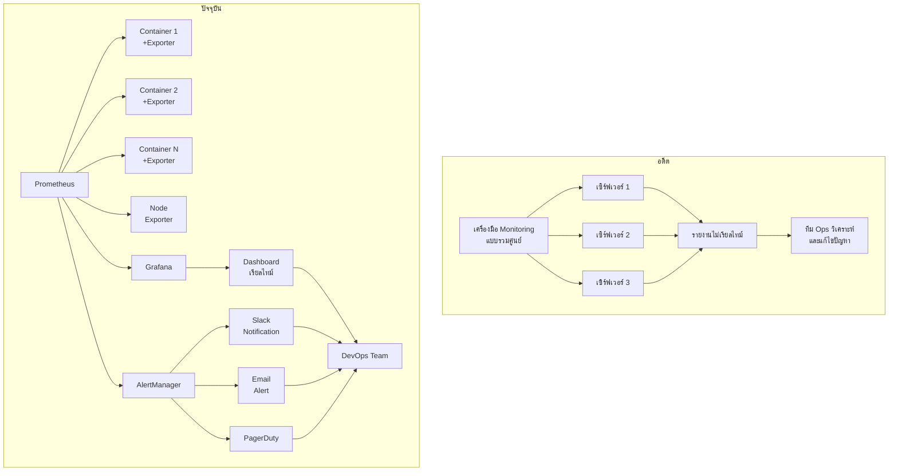
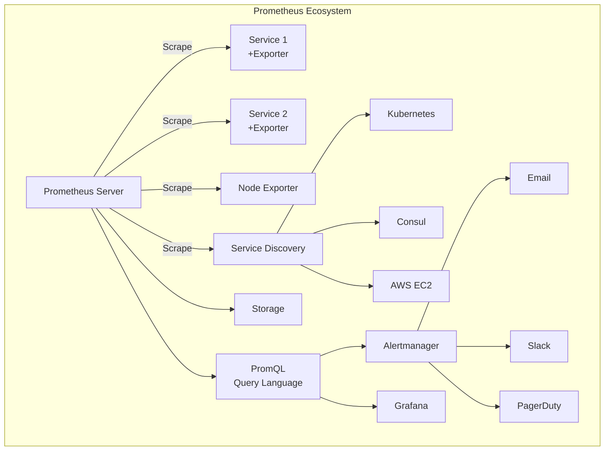
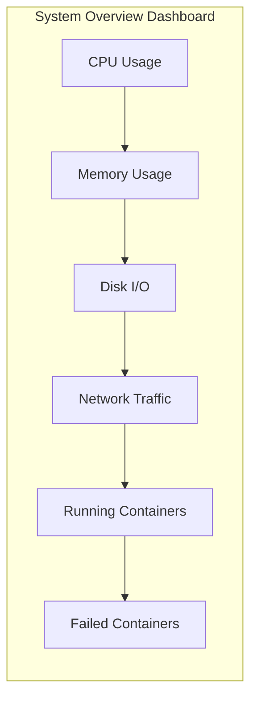
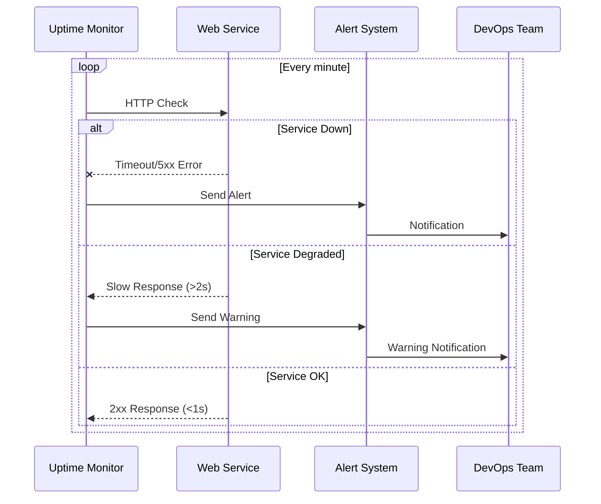

# 📊 Monitoring Deployed Projects & Containers

## 📋 สารบัญ
- [1. บทนำสู่การ Monitoring](#1-บทนำสู่การ-monitoring)
- [2. Prometheus: ระบบเก็บข้อมูล Metrics](#2-prometheus-ระบบเก็บข้อมูล-metrics)
- [3. Grafana: การสร้าง Dashboard](#3-grafana-การสร้าง-dashboard)
- [4. Uptime Monitoring](#4-uptime-monitoring)
- [5. แนวทางการติดตั้งและใช้งาน](#5-แนวทางการติดตั้งและใช้งาน)
- [6. การประยุกต์ใช้กับ Real-World Projects](#6-การประยุกต์ใช้กับ-real-world-projects)
- [7. Best Practices ในการ Monitoring](#7-best-practices-ในการ-monitoring)
- [8. แนวโน้มในอนาคตของ Monitoring](#8-แนวโน้มในอนาคตของ-monitoring)

## 1. บทนำสู่การ Monitoring

### 1.1 ความสำคัญของการ Monitoring

ในโลกของ DevOps และ Cloud Native ที่แอปพลิเคชันมีความซับซ้อนมากขึ้น การ monitoring จึงมีความสำคัญอย่างยิ่งต่อความสำเร็จของการให้บริการดิจิทัล การ monitoring ช่วยให้ทีมพัฒนาและ operations สามารถ:

- **เฝ้าระวังสถานะ** ของระบบแบบเรียลไทม์
- **วินิจฉัยปัญหา** ได้รวดเร็ว ก่อนที่ผู้ใช้จะได้รับผลกระทบ
- **วิเคราะห์แนวโน้ม** การใช้งานทรัพยากรในระยะยาว
- **ติดตามประสิทธิภาพ** ของการเปลี่ยนแปลงหรือการอัปเดตระบบ
- **วางแผนการขยายระบบ** ได้อย่างมีประสิทธิภาพ

### 1.2 พัฒนาการของระบบ Monitoring

#### ในอดีต:
ในอดีตการ monitoring ระบบมีลักษณะดังนี้:

- **แบบรวมศูนย์ (Centralized)**: มักใช้เครื่องมือรวมศูนย์ที่ราคาแพงและขาดความยืดหยุ่น
- **ไม่เรียลไทม์**: ข้อมูลมักล่าช้า ทำให้ไม่สามารถแก้ไขปัญหาได้ทันท่วงที
- **ต้องใช้ผู้เชี่ยวชาญ**: การตั้งค่าและบำรุงรักษาระบบต้องใช้ผู้เชี่ยวชาญเฉพาะทาง
- **แยกส่วน**: การ monitoring แต่ละส่วน (เซิร์ฟเวอร์, เครือข่าย, แอปพลิเคชัน) มักแยกจากกัน
- **ขาดความยืดหยุ่น**: ปรับเปลี่ยนหรือขยายระบบได้ยาก

#### ในปัจจุบัน:
ปัจจุบันระบบ monitoring ได้พัฒนาไปอย่างมาก:

- **แบบกระจาย (Distributed)**: รองรับการทำงานแบบกระจายศูนย์และ microservices
- **เรียลไทม์**: ให้ข้อมูลแบบเรียลไทม์ ช่วยให้ตอบสนองต่อปัญหาได้ทันที
- **Open Source**: มีเครื่องมือ open source คุณภาพสูง เช่น Prometheus และ Grafana
- **Self-service**: ทีมพัฒนาสามารถตั้งค่าและจัดการการ monitor ได้เอง
- **บูรณาการ**: สามารถบูรณาการกับระบบอื่นๆ เช่น CI/CD และระบบแจ้งเตือนได้ง่าย
- **รองรับ Container**: ออกแบบมาให้ทำงานกับ containers และ orchestration platforms



### 1.3 ทำไมปัจจุบันถึงดีกว่า และจำเป็นอย่างไร

**เหตุผลที่วิธีการปัจจุบันดีกว่า:**

1. **รองรับ Cloud Native**: เหมาะกับสถาปัตยกรรมแบบไมโครเซอร์วิส และ cloud native applications
2. **ปรับขนาดได้**: สามารถปรับขนาดเพื่อรองรับระบบขนาดใหญ่ได้อย่างมีประสิทธิภาพ
3. **ต้นทุนต่ำ**: ลดต้นทุนด้วยการใช้ open-source solutions
4. **ชุมชนขนาดใหญ่**: มีชุมชนนักพัฒนาที่คอยสนับสนุนและพัฒนาเครื่องมือต่างๆ
5. **วิเคราะห์ข้อมูลขั้นสูง**: มีความสามารถในการวิเคราะห์และสร้างภาพข้อมูลที่ซับซ้อน
6. **อัตโนมัติ**: รองรับการทำงานแบบอัตโนมัติ เช่น auto-scaling ตามข้อมูล metrics

**เหตุผลที่จำเป็น:**

1. **ความซับซ้อนของระบบ**: แอปพลิเคชันสมัยใหม่มีความซับซ้อนสูง มีหลายส่วนประกอบ
2. **ความคาดหวังของผู้ใช้**: ผู้ใช้คาดหวังให้บริการพร้อมใช้งานตลอด 24/7
3. **การแข่งขันสูง**: องค์กรต้องรับประกันว่าบริการของพวกเขามีเสถียรภาพและประสิทธิภาพสูง
4. **การปรับขนาดอัตโนมัติ**: จำเป็นต้องมีข้อมูลสำหรับการตัดสินใจเพิ่มหรือลดขนาดระบบ
5. **ต้นทุนการดำเนินงาน**: ช่วยลดต้นทุนโดยการระบุปัญหาก่อนที่จะกระทบกับธุรกิจ
6. **การตัดสินใจบนพื้นฐานของข้อมูล**: ทำให้การตัดสินใจทางเทคนิคและธุรกิจอยู่บนพื้นฐานของข้อมูลจริง

## 2. Prometheus: ระบบเก็บข้อมูล Metrics

### 2.1 Prometheus คืออะไร

Prometheus เป็นระบบ monitoring และ time series database แบบ open-source ที่ออกแบบมาเพื่อความน่าเชื่อถือสูงในการ monitoring ระบบแบบเรียลไทม์ โดยเฉพาะในสภาพแวดล้อมแบบ dynamic เช่น Kubernetes และ cloud environments

Prometheus ทำงานด้วยหลักการ "pull-based" คือจะไปดึงข้อมูล metrics จากเป้าหมายที่กำหนดไว้ตามช่วงเวลาที่กำหนด แทนที่จะรอให้แอปพลิเคชันส่งข้อมูลมาให้แบบ "push-based"

### 2.2 สถาปัตยกรรมของ Prometheus



### 2.3 องค์ประกอบหลักของ Prometheus

1. **Prometheus Server**: ทำหน้าที่เก็บข้อมูล time series และประมวลผลข้อมูล
2. **Exporters**: ตัวดึงข้อมูลจากระบบต่างๆ เช่น Node Exporter (ข้อมูล server), MySQL Exporter, Redis Exporter
3. **Alertmanager**: จัดการและรวมการแจ้งเตือน แล้วส่งไปยังช่องทางต่างๆ
4. **PromQL**: ภาษาสำหรับ query ข้อมูล metrics โดยเฉพาะ
5. **Service Discovery**: ค้นหาเป้าหมายที่ต้องการเก็บ metrics โดยอัตโนมัติ

### 2.4 ประเภทของ Metrics ใน Prometheus

1. **Counter**: ค่าที่เพิ่มขึ้นเรื่อยๆ ไม่ลดลง (เช่น จำนวน HTTP requests)
2. **Gauge**: ค่าที่สามารถขึ้นและลงได้ (เช่น การใช้ CPU หรือ RAM)
3. **Histogram**: การกระจายของค่าในช่วงเวลา (เช่น latency ของ request)
4. **Summary**: คล้าย Histogram แต่คำนวณ percentiles บนเซิร์ฟเวอร์ต้นทาง

### 2.5 ข้อดีของ Prometheus

- **ใช้งานง่าย**: ติดตั้งและเริ่มต้นใช้งานได้อย่างรวดเร็ว
- **ออกแบบมาสำหรับ containers**: เหมาะกับการใช้ใน Kubernetes และ cloud environment
- **Multi-dimensional data**: เก็บ metrics พร้อม labels ที่หลากหลาย
- **มีชุมชนที่ใหญ่**: มีการพัฒนาและสนับสนุนจากชุมชนอย่างต่อเนื่อง
- **เสถียร**: ออกแบบให้ทำงานได้อย่างน่าเชื่อถือแม้ในสภาพแวดล้อมที่มีปัญหา
- **Pull-based model**: ง่ายต่อการทำ monitoring และการค้นพบปัญหา

### 2.6 การตั้งค่า Prometheus พื้นฐาน

ตัวอย่าง configuration file สำหรับ Prometheus (`prometheus.yml`):

```yaml
global:
  scrape_interval:     15s # How often to scrape targets
  evaluation_interval: 15s # How often to evaluate rules

scrape_configs:
  - job_name: 'prometheus'
    static_configs:
      - targets: ['localhost:9090']
  
  - job_name: 'node_exporter'
    static_configs:
      - targets: ['node_exporter:9100']

  - job_name: 'api_service'
    static_configs:
      - targets: ['api:8080']
    metrics_path: '/metrics'
```

## 3. Grafana: การสร้าง Dashboard

### 3.1 Grafana คืออะไร

Grafana เป็นแพลตฟอร์ม open source สำหรับการสร้าง dashboard และการวิเคราะห์ข้อมูล โดยสามารถเชื่อมต่อกับแหล่งข้อมูลหลายประเภท เช่น Prometheus, Elasticsearch, InfluxDB และอื่นๆ Grafana มีเครื่องมือที่ช่วยให้สามารถสร้างภาพที่เข้าใจง่าย และกราฟที่มีประสิทธิภาพเพื่อแสดงข้อมูล metrics

### 3.2 ความสามารถหลักของ Grafana

- **Data Visualization**: สร้างกราฟและภาพแสดงข้อมูลที่ซับซ้อนได้อย่างง่ายดาย
- **Dashboard**: สร้าง dashboard ที่มีข้อมูลจากหลายแหล่งรวมกัน
- **Alerting**: กำหนดการแจ้งเตือนตามเงื่อนไขที่กำหนด
- **Multi-data sources**: เชื่อมต่อกับแหล่งข้อมูลหลายประเภทในคราวเดียว
- **Plugins**: ขยายความสามารถด้วย plugins ที่หลากหลาย
- **Templating**: สร้าง dashboard ที่แสดงผลตามตัวแปรที่กำหนด เช่น เลือกเซิร์ฟเวอร์

### 3.3 การสร้าง Dashboard สำหรับ Container และ Services

#### ตัวอย่าง Dashboard ที่ควรมี:

1. **System Overview Dashboard**:
   - CPU, Memory, Disk และ Network ของระบบ
   - จำนวน containers ที่ทำงานหรือล้มเหลว
   - ปริมาณการใช้งานทรัพยากร



2. **Service-specific Dashboard**:
   - Response time ของแต่ละ service
   - Error rates
   - Request rates
   - Success rates
   - Custom metrics

3. **Database Dashboard**:
   - Query performance
   - Connection counts
   - Transaction rates
   - Replication status

### 3.4 การสร้าง Dashboard ที่มีประสิทธิภาพ

1. **ใช้หลัก USE Method**:
   - Utilization: ทรัพยากรถูกใช้มากแค่ไหน
   - Saturation: ทรัพยากรมีงานค้างอยู่มากแค่ไหน
   - Errors: มีข้อผิดพลาดเกิดขึ้นหรือไม่

2. **ใช้หลัก RED Method** สำหรับ Service Monitoring:
   - Rate: จำนวน request ต่อวินาที
   - Errors: จำนวน failed requests
   - Duration: เวลาในการตอบสนอง

3. **สร้างความชัดเจนด้วยการจัดระเบียบ**:
   - จัดกลุ่มข้อมูลที่เกี่ยวข้องไว้ด้วยกัน
   - ลำดับความสำคัญของข้อมูล (สิ่งสำคัญอยู่ด้านบน)
   - ใช้สีและขนาดเพื่อเน้นข้อมูลที่สำคัญ

4. **เพิ่มการอธิบาย**:
   - เพิ่ม annotation เพื่ออธิบายเหตุการณ์สำคัญ
   - เพิ่มคำอธิบายใต้กราฟเพื่อให้เข้าใจง่าย
   - ระบุเกณฑ์สำหรับสถานะปกติและผิดปกติ

### 3.5 การตั้งค่า Grafana กับ Prometheus

1. **เพิ่ม Prometheus เป็น Data Source**:
   - ไปที่ Configuration > Data Sources > Add data source
   - เลือก Prometheus
   - กำหนด URL (เช่น http://prometheus:9090)
   - บันทึกและทดสอบ

2. **สร้าง Dashboard**:
   - เลือก Create > Dashboard
   - เพิ่ม panel และเลือก query แบบ PromQL
   - ตัวอย่าง query:
     - CPU usage: `100 - (avg by(instance) (irate(node_cpu_seconds_total{mode="idle"}[1m])) * 100)`
     - Memory usage: `node_memory_MemTotal_bytes - node_memory_MemFree_bytes - node_memory_Buffers_bytes - node_memory_Cached_bytes`
     - Disk usage: `100 - ((node_filesystem_avail_bytes / node_filesystem_size_bytes) * 100)`

## 4. Uptime Monitoring

### 4.1 ความสำคัญของ Uptime Monitoring

Uptime monitoring เป็นการติดตามว่าเซิร์ฟเวอร์หรือบริการยังทำงานอยู่หรือไม่ และแจ้งเตือนเมื่อเกิดปัญหา ซึ่งมีความสำคัญอย่างยิ่งในการรักษา SLA (Service Level Agreement) และความพึงพอใจของผู้ใช้

ข้อมูลที่ได้จาก uptime monitoring ยังช่วยในการคำนวณ:
- **Uptime Percentage**: เปอร์เซ็นต์เวลาที่บริการพร้อมใช้งาน
- **MTBF (Mean Time Between Failures)**: ระยะเวลาเฉลี่ยระหว่างความล้มเหลว
- **MTTR (Mean Time To Recovery)**: ระยะเวลาเฉลี่ยในการกู้คืนระบบ

### 4.2 วิธีการทำ Uptime Monitoring

#### 4.2.1 การ Check แบบพื้นฐาน

1. **HTTP/HTTPS Check**: ตรวจสอบว่าเว็บไซต์ตอบสนองด้วย status code ที่ถูกต้องหรือไม่
2. **TCP Port Check**: ตรวจสอบว่า port ที่ต้องการเปิดอยู่หรือไม่
3. **ICMP (Ping) Check**: ตรวจสอบว่าเซิร์ฟเวอร์ตอบสนองต่อ ping หรือไม่
4. **DNS Check**: ตรวจสอบว่า DNS resolver ทำงานถูกต้องหรือไม่

#### 4.2.2 การ Check แบบขั้นสูง

1. **Transaction Check**: จำลองการทำธุรกรรมของผู้ใช้ เช่น การ login หรือการทำธุรกรรม
2. **API Check**: ตรวจสอบว่า API ตอบสนองถูกต้องทั้งในแง่ของ status code และ content
3. **Content Check**: ตรวจสอบว่าเนื้อหาที่ส่งกลับมามีข้อมูลที่ถูกต้องหรือไม่
4. **Certificate Check**: ตรวจสอบอายุและความถูกต้องของ SSL/TLS certificates

### 4.3 เครื่องมือสำหรับ Uptime Monitoring

#### 4.3.1 Blackbox Exporter (Prometheus)

Blackbox Exporter เป็น exporter ของ Prometheus ที่ทำหน้าที่ตรวจสอบ endpoints จากภายนอก (black box testing) และรายงานผลลัพธ์เป็น metrics ที่ Prometheus สามารถเก็บได้

ตัวอย่างการตั้งค่า:

```yaml
scrape_configs:
  - job_name: 'blackbox'
    metrics_path: /probe
    params:
      module: [http_2xx]
    static_configs:
      - targets:
        - https://example.com
    relabel_configs:
      - source_labels: [__address__]
        target_label: __param_target
      - source_labels: [__param_target]
        target_label: instance
      - target_label: __address__
        replacement: blackbox-exporter:9115
```

#### 4.3.2 เครื่องมือ External

- **Uptime Robot**: บริการฟรีที่ตรวจสอบทุก 5 นาที
- **Pingdom**: บริการระดับองค์กรที่มีการรายงานละเอียด
- **Statuspage.io**: ช่วยในการสื่อสารสถานะของบริการกับผู้ใช้
- **Grafana Cloud**: ให้บริการ synthetic monitoring รวมกับ dashboard

### 4.4 การตั้งค่าระบบแจ้งเตือนสำหรับ Uptime Monitoring

1. **กำหนดเกณฑ์**:
   - บริการไม่ตอบสนองภายใน X วินาที
   - มี error response มากกว่า Y% ในช่วง Z นาที
   - Response time มากกว่า N มิลลิวินาที

2. **ช่องทางการแจ้งเตือน**:
   - Email
   - SMS
   - Slack หรือ Teams
   - PagerDuty หรือ OpsGenie สำหรับการ escalation

3. **ระดับความรุนแรง (Severity Levels)**:
   - Critical: ต้องรีบแก้ไขทันที
   - Warning: ต้องตรวจสอบแต่ยังไม่มีผลกระทบกับผู้ใช้
   - Info: ข้อมูลที่ควรทราบแต่ไม่ต้องดำเนินการใดๆ



## 5. แนวทางการติดตั้งและใช้งาน

### 5.1 การติดตั้งระบบ Monitoring ด้วย Docker Compose

สร้างไฟล์ `docker-compose.yml` สำหรับระบบ monitoring แบบพื้นฐาน:

```yaml
version: '3'

services:
  prometheus:
    image: prom/prometheus:latest
    container_name: prometheus
    volumes:
      - ./prometheus/prometheus.yml:/etc/prometheus/prometheus.yml
      - prometheus_data:/prometheus
    command:
      - '--config.file=/etc/prometheus/prometheus.yml'
      - '--storage.tsdb.path=/prometheus'
      - '--web.console.libraries=/etc/prometheus/console_libraries'
      - '--web.console.templates=/etc/prometheus/consoles'
    ports:
      - "9090:9090"
    restart: always

  grafana:
    image: grafana/grafana:latest
    container_name: grafana
    volumes:
      - grafana_data:/var/lib/grafana
    environment:
      - GF_SECURITY_ADMIN_PASSWORD=admin
      - GF_USERS_ALLOW_SIGN_UP=false
    ports:
      - "3000:3000"
    depends_on:
      - prometheus
    restart: always

  node_exporter:
    image: prom/node-exporter:latest
    container_name: node_exporter
    volumes:
      - /proc:/host/proc:ro
      - /sys:/host/sys:ro
      - /:/rootfs:ro
    command:
      - '--path.procfs=/host/proc'
      - '--path.sysfs=/host/sys'
      - '--collector.filesystem.ignored-mount-points=^/(sys|proc|dev|host|etc)($$|/)'
    ports:
      - "9100:9100"
    restart: always

  cadvisor:
    image: gcr.io/cadvisor/cadvisor:latest
    container_name: cadvisor
    volumes:
      - /:/rootfs:ro
      - /var/run:/var/run:ro
      - /sys:/sys:ro
      - /var/lib/docker/:/var/lib/docker:ro
      - /dev/disk/:/dev/disk:ro
    ports:
      - "8080:8080"
    restart: always

  alertmanager:
    image: prom/alertmanager:latest
    container_name: alertmanager
    volumes:
      - ./alertmanager/alertmanager.yml:/etc/alertmanager/alertmanager.yml
    command:
      - '--config.file=/etc/alertmanager/alertmanager.yml'
    ports:
      - "9093:9093"
    restart: always

volumes:
  prometheus_data