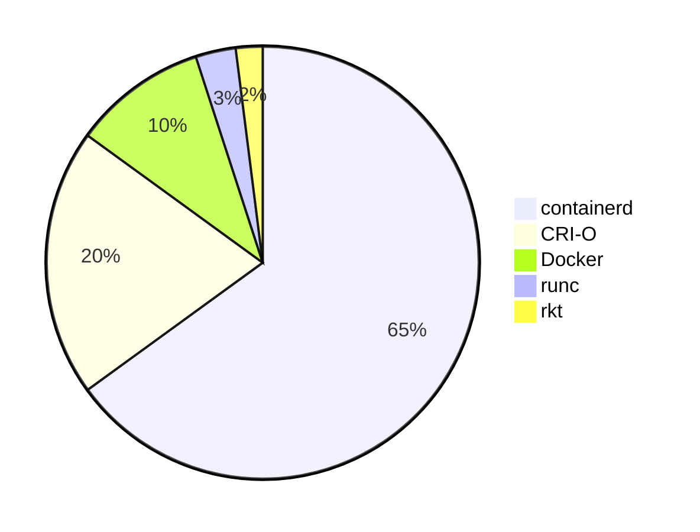
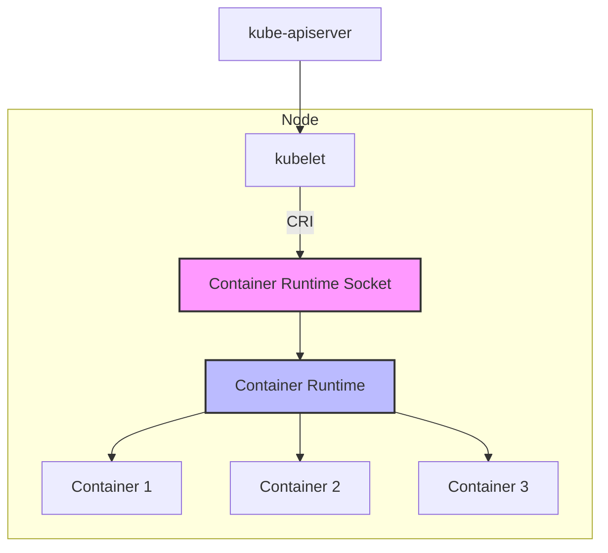
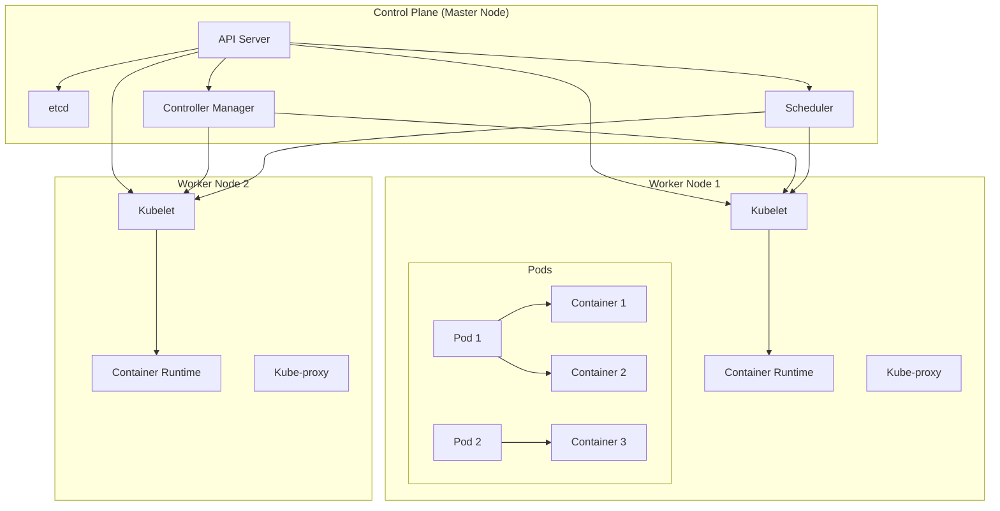
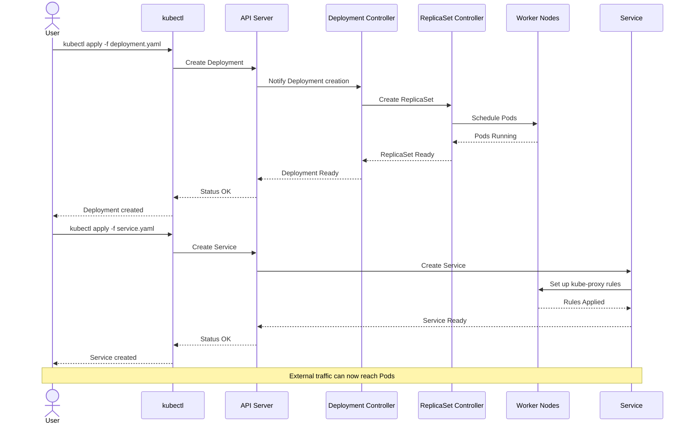
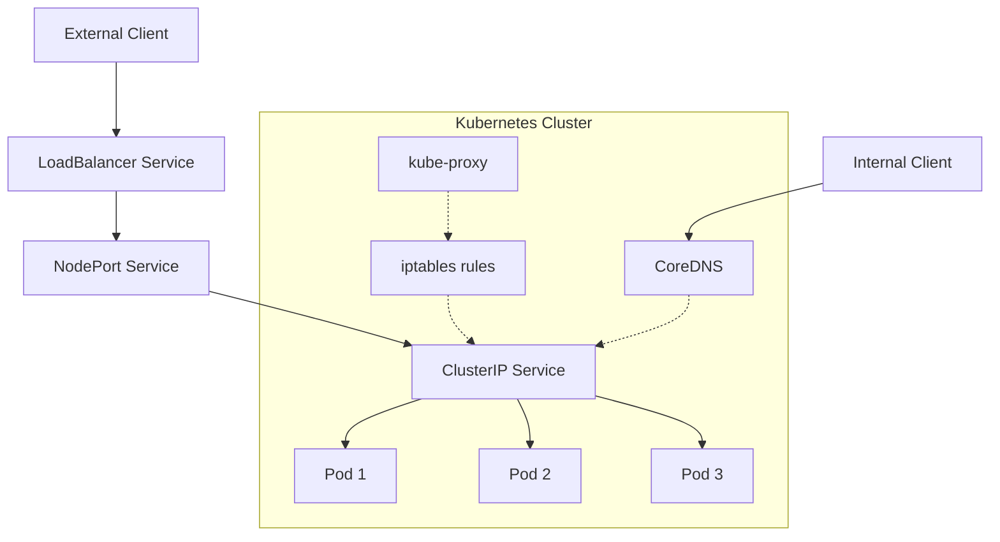
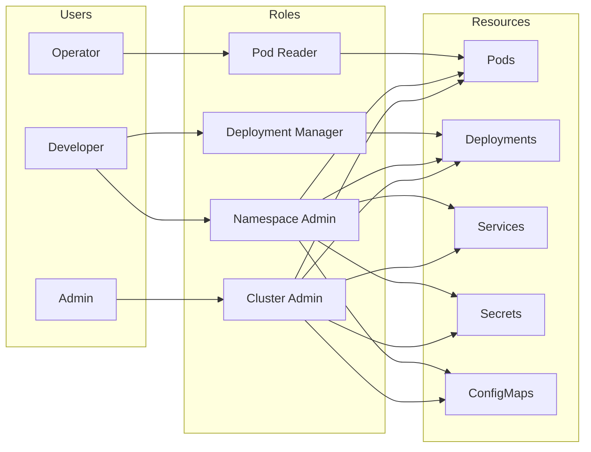

# 🚢 การสร้างและจัดการระบบแบบ Container Orchestration (Kubernetes)


## 📑 สารบัญ
- [🚢 การสร้างและจัดการระบบแบบ Container Orchestration (Kubernetes)](#-การสร้างและจัดการระบบแบบ-container-orchestration-kubernetes)
  - [📑 สารบัญ](#-สารบัญ)
  - [1. บทนำ](#1-บทนำ)
  - [2. 🔰 พื้นฐาน Container และ Kubernetes](#2--พื้นฐาน-container-และ-kubernetes)
    - [2.1 Container คืออะไร?](#21-container-คืออะไร)
    - [2.2 Kubernetes คืออะไร?](#22-kubernetes-คืออะไร)
    - [2.3 Container Runtime ที่นิยมใช้กับ Kubernetes](#23-container-runtime-ที่นิยมใช้กับ-kubernetes)
      - [2.3.1 ประเภทของ Container Runtime ที่นิยมใช้กับ Kubernetes](#231-ประเภทของ-container-runtime-ที่นิยมใช้กับ-kubernetes)
      - [2.3.2 สัดส่วนการใช้งาน Container Runtime ในตลาด](#232-สัดส่วนการใช้งาน-container-runtime-ในตลาด)
      - [2.3.3 เปรียบเทียบคุณสมบัติของ Container Runtime](#233-เปรียบเทียบคุณสมบัติของ-container-runtime)
      - [2.3.4 แนวโน้มในอนาคต](#234-แนวโน้มในอนาคต)
      - [2.3.5 Unix Socket และ Container Runtime](#235-unix-socket-และ-container-runtime)
      - [Unix Socket คืออะไร?](#unix-socket-คืออะไร)
      - [Container Runtime Socket Path ในแต่ละระบบ](#container-runtime-socket-path-ในแต่ละระบบ)
      - [การใช้งาน Socket ใน Kubernetes](#การใช้งาน-socket-ใน-kubernetes)
      - [Socket กับความปลอดภัย](#socket-กับความปลอดภัย)
      - [แผนภาพการสื่อสารระหว่าง Kubernetes กับ Container Runtime](#แผนภาพการสื่อสารระหว่าง-kubernetes-กับ-container-runtime)
    - [2.4 สถาปัตยกรรมของ Kubernetes](#24-สถาปัตยกรรมของ-kubernetes)
      - [2.4.1 แผนภาพสถาปัตยกรรม Kubernetes](#241-แผนภาพสถาปัตยกรรม-kubernetes)
  - [3. ⚙️ การเตรียมสภาพแวดล้อมสำหรับ Windows User](#3-️-การเตรียมสภาพแวดล้อมสำหรับ-windows-user)
      - [3.1 MacOS](#31-macos)
      - [3.2 Linux](#32-linux)
    - [3.3 เริ่มใช้งาน Minikube](#33-เริ่มใช้งาน-minikube)
  - [4. 🚀 เริ่มต้นใช้งาน Kubernetes](#4--เริ่มต้นใช้งาน-kubernetes)
    - [4.1 การตรวจสอบสถานะของ Cluster](#41-การตรวจสอบสถานะของ-cluster)
    - [4.2 kubectl config](#42-kubectl-config)
    - [4.3 Kubernetes YAML Files](#43-kubernetes-yaml-files)
    - [4.4 การใช้งานคำสั่งพื้นฐาน](#44-การใช้งานคำสั่งพื้นฐาน)
    - [4.5 โครงสร้างคำสั่ง kubectl](#45-โครงสร้างคำสั่ง-kubectl)
      - [4.5.1 รูปแบบคำสั่ง kubectl](#451-รูปแบบคำสั่ง-kubectl)
      - [4.5.2 คำสั่งหลัก (Command)](#452-คำสั่งหลัก-command)
      - [4.5.3 ประเภททรัพยากร (Resource Type)](#453-ประเภททรัพยากร-resource-type)
      - [4.5.4 ชื่อทรัพยากร (Resource Name)](#454-ชื่อทรัพยากร-resource-name)
      - [4.5.5 ตัวเลือกเพิ่มเติม (Flags/Options)](#455-ตัวเลือกเพิ่มเติม-flagsoptions)
      - [4.5.6 ตัวย่อสำหรับคำสั่ง kubectl](#456-ตัวย่อสำหรับคำสั่ง-kubectl)
      - [4.5.7 การใช้ --dry-run=client สำหรับการสร้างทรัพยากร](#457-การใช้---dry-runclient-สำหรับการสร้างทรัพยากร)
    - [Pod คืออะไร?](#pod-คืออะไร)
      - [หลักการทำงานของ Pod](#หลักการทำงานของ-pod)
      - [คุณลักษณะเฉพาะของ Pod](#คุณลักษณะเฉพาะของ-pod)
      - [ข้อจำกัดของ Pod](#ข้อจำกัดของ-pod)
      - [ข้อควรระวังในการใช้งาน Pod](#ข้อควรระวังในการใช้งาน-pod)
      - [ตัวอย่าง YAML ของ Pod ที่มี Multiple Containers](#ตัวอย่าง-yaml-ของ-pod-ที่มี-multiple-containers)
  - [5. 🔄 การ Deploy แอปพลิเคชันบน Kubernetes](#5--การ-deploy-แอปพลิเคชันบน-kubernetes)
    - [5.1 Deployment คืออะไร?](#51-deployment-คืออะไร)
      - [5.1.1 บทบาทและความสำคัญของ Deployment](#511-บทบาทและความสำคัญของ-deployment)
      - [5.1.2 ตัวอย่างสถานการณ์การทำงานจริงของ Deployment](#512-ตัวอย่างสถานการณ์การทำงานจริงของ-deployment)
      - [5.1.3 แนวทางปฏิบัติที่ดีและควรหลีกเลี่ยงสำหรับ Deployment](#513-แนวทางปฏิบัติที่ดีและควรหลีกเลี่ยงสำหรับ-deployment)
        - [5.1.3.1 สิ่งที่ควรทำ ✅](#5131-สิ่งที่ควรทำ-)
        - [5.1.3.2 สิ่งที่ควรหลีกเลี่ยง ❌](#5132-สิ่งที่ควรหลีกเลี่ยง-)
      - [5.1.4 แผนภาพกระบวนการ Deployment และ Service](#514-แผนภาพกระบวนการ-deployment-และ-service)
    - [5.2 การสร้าง Deployment](#52-การสร้าง-deployment)
    - [5.3 Service คืออะไร?](#53-service-คืออะไร)
      - [5.3.1 บทบาทและความสำคัญของ Service](#531-บทบาทและความสำคัญของ-service)
      - [5.3.2 ประเภทของ Service](#532-ประเภทของ-service)
      - [5.3.3 ตัวอย่างสถานการณ์การทำงานจริงของ Service](#533-ตัวอย่างสถานการณ์การทำงานจริงของ-service)
        - [5.3.3.1 สถานการณ์: แอปพลิเคชันอีคอมเมิร์ซที่มีหลายส่วนประกอบ](#5331-สถานการณ์-แอปพลิเคชันอีคอมเมิร์ซที่มีหลายส่วนประกอบ)
      - [5.3.4 แนวทางปฏิบัติที่ดีและควรหลีกเลี่ยงสำหรับ Service](#534-แนวทางปฏิบัติที่ดีและควรหลีกเลี่ยงสำหรับ-service)
        - [5.3.4.1 สิ่งที่ควรทำ ✅](#5341-สิ่งที่ควรทำ-)
        - [5.3.4.2 สิ่งที่ควรหลีกเลี่ยง ❌](#5342-สิ่งที่ควรหลีกเลี่ยง-)
      - [5.3.5 แผนภาพการทำงานของ Service](#535-แผนภาพการทำงานของ-service)
    - [การสร้าง Service](#การสร้าง-service)
      - [5.4.3 Namespace ที่สำคัญใน Kubernetes](#543-namespace-ที่สำคัญใน-kubernetes)
      - [5.4.4 ตัวย่อในการกำหนด Labels และ Selectors](#544-ตัวย่อในการกำหนด-labels-และ-selectors)
      - [5.4.5 ตัวย่อของ Context และการตั้งค่า](#545-ตัวย่อของ-context-และการตั้งค่า)
      - [5.4.6 ตัวย่อที่ใช้บ่อยใน YAML Manifest](#546-ตัวย่อที่ใช้บ่อยใน-yaml-manifest)
  - [6. 📈 การ Scale และ Update แอปพลิเคชัน](#6--การ-scale-และ-update-แอปพลิเคชัน)
    - [6.1 การ Scale แอปพลิเคชัน](#61-การ-scale-แอปพลิเคชัน)
    - [Horizontal Pod Autoscaler (HPA)](#horizontal-pod-autoscaler-hpa)
    - [การ Update แอปพลิเคชัน](#การ-update-แอปพลิเคชัน)
  - [7. 🌐 การทำ Networking ใน Kubernetes](#7--การทำ-networking-ใน-kubernetes)
    - [7.1 Service Types](#71-service-types)
    - [7.2 Ingress](#72-ingress)
      - [7.2.1 Ingress คืออะไร?](#721-ingress-คืออะไร)
      - [7.2.2 Ingress Controller คืออะไร?](#722-ingress-controller-คืออะไร)
      - [7.2.3 ตัวอย่างสถานการณ์การทำงานจริงของ Ingress](#723-ตัวอย่างสถานการณ์การทำงานจริงของ-ingress)
      - [7.2.4 แนวทางปฏิบัติที่ดีและควรหลีกเลี่ยงสำหรับ Ingress](#724-แนวทางปฏิบัติที่ดีและควรหลีกเลี่ยงสำหรับ-ingress)
        - [7.2.4.1 สิ่งที่ควรทำ ✅](#7241-สิ่งที่ควรทำ-)
    - [7.3 Network Policies](#73-network-policies)
  - [8. 💾 การจัดการข้อมูลด้วย Persistent Volumes](#8--การจัดการข้อมูลด้วย-persistent-volumes)
    - [Persistent Volume (PV) และ Persistent Volume Claim (PVC)](#persistent-volume-pv-และ-persistent-volume-claim-pvc)
    - [8.1 การใช้ PVC กับ Pod](#81-การใช้-pvc-กับ-pod)
    - [8.2 ConfigMaps และ Secrets](#82-configmaps-และ-secrets)
      - [8.2.1 ConfigMap](#821-configmap)
      - [8.2.2 Secret](#822-secret)
  - [9. 🛡️ ความปลอดภัยใน Kubernetes](#9-️-ความปลอดภัยใน-kubernetes)
    - [RBAC (Role-Based Access Control)](#rbac-role-based-access-control)
      - [9.1 แผนภาพสิทธิ์การเข้าถึงด้วย RBAC](#91-แผนภาพสิทธิ์การเข้าถึงด้วย-rbac)
    - [9.2 Pod Security Policies](#92-pod-security-policies)
  - [10. ☁️ การ Deploy Kubernetes บน Digital Ocean](#10-️-การ-deploy-kubernetes-บน-digital-ocean)
    - [ขั้นตอนการ Setup DOKS](#ขั้นตอนการ-setup-doks)
    - [10.1 การ Deploy แอปพลิเคชันบน DOKS](#101-การ-deploy-แอปพลิเคชันบน-doks)
  - [11. 🎓 แนวทางการศึกษาต่อ](#11--แนวทางการศึกษาต่อ)
    - [แหล่งข้อมูลที่แนะนำ](#แหล่งข้อมูลที่แนะนำ)

## 1. บทนำ

Container Orchestration คือการจัดการ containers จำนวนมากให้สามารถทำงานร่วมกันได้อย่างมีประสิทธิภาพ Kubernetes (K8s) เป็นระบบ container orchestration ที่ได้รับความนิยมมากที่สุดในปัจจุบัน เราจะเรียนรู้ตั้งแต่พื้นฐานไปจนถึงการ deploy บน cloud provider อย่าง Digital Ocean

## 2. 🔰 พื้นฐาน Container และ Kubernetes

### 2.1 Container คืออะไร?

Container เป็นหน่วยของซอฟต์แวร์ที่แพ็กโค้ดและส่วนประกอบทั้งหมดที่จำเป็นเพื่อให้แอปพลิเคชันทำงานได้ในทุกสภาพแวดล้อม ต่างจาก VM ตรงที่ container ใช้ทรัพยากรน้อยกว่า และทำงานบน OS kernel เดียวกัน

### 2.2 Kubernetes คืออะไร?

Kubernetes เป็นแพลตฟอร์มโอเพนซอร์สที่ออกแบบมาเพื่อจัดการ container จำนวนมากโดยอัตโนมัติ ไม่ว่าจะเป็นการ deploy, การปรับขนาด และการจัดการ

### 2.3 Container Runtime ที่นิยมใช้กับ Kubernetes

Container Runtime เป็นซอฟต์แวร์ที่รับผิดชอบในการรัน containers บนเครื่องโฮสต์ โดยทำหน้าที่ดาวน์โหลด container images, แยก namespaces, จัดสรรทรัพยากร และรันแอปพลิเคชันภายใน container

#### 2.3.1 ประเภทของ Container Runtime ที่นิยมใช้กับ Kubernetes

1. **containerd**
   - แยกตัวออกมาจาก Docker เพื่อเป็น lightweight runtime
   - เป็นมาตรฐานที่ CNCF รับรอง และเป็น default runtime ใน Kubernetes ปัจจุบัน
   - ประสิทธิภาพและความเสถียรสูง เหมาะกับการใช้งานในระดับ production

2. **CRI-O**
   - พัฒนาโดย Red Hat สำหรับ Kubernetes โดยเฉพาะ
   - เป็น implementation ของ Container Runtime Interface (CRI) ของ Kubernetes
   - รองรับ OCI (Open Container Initiative) images เช่นเดียวกับ Docker
   - ใช้งานเป็นมาตรฐานใน OpenShift

3. **Docker (dockershim)**
   - เดิมเป็น runtime ที่นิยมใช้กับ Kubernetes
   - ถูก deprecated ใน Kubernetes 1.20 และถูกลบออกจาก Kubernetes ตั้งแต่เวอร์ชัน 1.24
   - ปัจจุบัน Docker ใช้ containerd เป็น runtime ภายใน

4. **Kata Containers**
   - รวมความเร็วของ containers กับความปลอดภัยของ VMs
   - รัน containers ในสภาพแวดล้อมที่มีการแยก isolation แบบ VM-like
   - เหมาะสำหรับระบบ multi-tenant ที่ต้องการความปลอดภัยสูง

5. **gVisor**
   - พัฒนาโดย Google เพื่อเพิ่มความปลอดภัยให้กับ containers
   - มี application kernel ที่ทำหน้าที่เป็นตัวกลางระหว่าง container และ host kernel
   - ให้การแยก isolation ที่ดีกว่า container ทั่วไป แต่มี overhead มากกว่า

6. **AWS Firecracker**
   - พัฒนาโดย AWS สำหรับ serverless computing (AWS Lambda, Fargate)
   - สร้าง microVMs ที่มีความเร็วในการเริ่มต้นใกล้เคียงกับ containers
   - ให้การแยก isolation ระดับ VM แต่ใช้ทรัพยากรน้อย

#### 2.3.2 สัดส่วนการใช้งาน Container Runtime ในตลาด

ปัจจุบันมีการใช้งาน Container Runtime หลักๆ ในตลาด ดังนี้:



#### 2.3.3 เปรียบเทียบคุณสมบัติของ Container Runtime

| Container Runtime | ความเร็ว | ความปลอดภัย | ความเสถียร | การรองรับ OCI | เหมาะกับ |
|------------------|---------|-----------|-----------|-------------|---------|
| containerd | สูง | ปานกลาง | สูง | ✅ | การใช้งานทั่วไป, production workloads |
| CRI-O | สูง | ปานกลาง | สูง | ✅ | Red Hat OpenShift, production workloads |
| Docker | ปานกลาง | ปานกลาง | สูง | ✅ | การพัฒนา, การทดสอบ |
| runc | สูงมาก | ปานกลาง | สูง | ✅ | low-level runtime ที่ใช้โดย containerd และ CRI-O |
| rkt | ปานกลาง | สูง | ปานกลาง | ✅ | ระบบที่ต้องการความปลอดภัยเพิ่มเติม |

#### 2.3.4 แนวโน้มในอนาคต

- การใช้งาน containerd เพิ่มขึ้นเรื่อยๆ เนื่องจากเป็น default ของ Kubernetes
- ความต้องการความปลอดภัยที่สูงขึ้นอาจทำให้ Kata Containers และ gVisor ได้รับความนิยมมากขึ้น
- Container Runtime ที่เน้น WebAssembly อาจเข้ามามีบทบาทมากขึ้นในอนาคต
- การพัฒนาเพื่อรองรับ multi-architecture (ARM, x86) มีความสำคัญมากขึ้น

#### 2.3.5 Unix Socket และ Container Runtime

Unix Domain Socket เป็นกลไกสำคัญที่ใช้ในการสื่อสารระหว่างโปรเซสในระบบ Unix-like โดย container runtime จะสร้าง socket ไว้เพื่อรับคำสั่งจากเครื่องมือต่างๆ รวมถึง kubelet ใน Kubernetes

#### Unix Socket คืออะไร?

Unix Socket (หรือ Unix Domain Socket) คือกลไกการสื่อสารระหว่างโปรเซสภายในเครื่องเดียวกัน โดยแสดงในรูปแบบไฟล์พิเศษในระบบไฟล์ ซึ่งมีข้อดีคือ:
- ใช้สื่อสารระหว่างโปรเซสได้เร็วกว่า TCP/IP socket เพราะไม่ต้องผ่านชั้น network
- สามารถใช้ permission ของระบบไฟล์เพื่อควบคุมการเข้าถึง
- รองรับการส่ง file descriptor ระหว่างโปรเซส

#### Container Runtime Socket Path ในแต่ละระบบ

**1. Docker Socket**

| ระบบปฏิบัติการ | Path ที่ตั้งของ Socket |
|--------------|----------------------|
| Linux | `/var/run/docker.sock` หรือ `/run/docker.sock` |
| macOS | `/var/run/docker.sock` (ผ่าน Docker Desktop) |
| Windows | `//./pipe/docker_engine` (เป็น Named Pipe ไม่ใช่ Unix Socket) |

**2. containerd Socket**

| ระบบปฏิบัติการ | Path ที่ตั้งของ Socket |
|--------------|----------------------|
| Linux | `/run/containerd/containerd.sock` |
| Kubernetes Path | `/run/containerd/containerd.sock` |

**3. CRI-O Socket**

| ระบบปฏิบัติการ | Path ที่ตั้งของ Socket |
|--------------|----------------------|
| Linux | `/var/run/crio/crio.sock` |
| Kubernetes Path | `/var/run/crio/crio.sock` |

**4. Kata Containers Socket**

| ระบบปฏิบัติการ | Path ที่ตั้งของ Socket |
|--------------|----------------------|
| Linux | `/run/kata-containers/kata-containers.sock` |

**5. gVisor (runsc) Socket**

| ระบบปฏิบัติการ | Path ที่ตั้งของ Socket |
|--------------|----------------------|
| Linux | `/run/containerd/containerd.sock` (ใช้ผ่าน containerd) |

#### การใช้งาน Socket ใน Kubernetes

Kubelet สื่อสารกับ Container Runtime Interface (CRI) ผ่าน socket ของ runtime ที่เลือกใช้ โดยสามารถระบุ runtime socket ได้ผ่านพารามิเตอร์ `--container-runtime-endpoint`:

```bash
# การระบุ socket path ใน kubelet
kubelet --container-runtime=remote --container-runtime-endpoint=unix:///run/containerd/containerd.sock
```

**การตรวจสอบ Socket ที่ใช้งาน**

```bash
# ตรวจสอบ socket ที่กำลังใช้งานใน Linux
sudo ls -la /var/run/ | grep sock

# ดูการเชื่อมต่อผ่าน socket
sudo lsof | grep docker.sock

# ตรวจสอบ Kubernetes runtime ที่ใช้
kubectl get nodes -o wide
```

#### Socket กับความปลอดภัย

Socket files มีความสำคัญอย่างมากในเรื่องความปลอดภัย:
- ผู้ที่เข้าถึงไฟล์ socket (เช่น `/var/run/docker.sock`) สามารถควบคุม container runtime ได้
- การตั้งค่า permission ของไฟล์ socket ไม่ถูกต้องอาจเป็นช่องโหว่ด้านความปลอดภัย
- หลายคนแนะนำให้ mount docker socket เข้าไปใน container เพื่อจัดการ container อื่น (Docker-in-Docker) ซึ่งอาจเป็นความเสี่ยงด้านความปลอดภัย

**Best Practices สำหรับการจัดการ Socket**

1. ตรวจสอบ permission ของไฟล์ socket ให้ถูกต้อง (มักจะเป็น root:docker ที่ 660)
2. ให้เฉพาะผู้ใช้ที่จำเป็นอยู่ในกลุ่มที่สามารถเข้าถึง socket ได้
3. ใช้ Network Policy ใน Kubernetes เพื่อจำกัดการเข้าถึงส่วนประกอบที่สื่อสารกับ runtime socket
4. ระมัดระวังการ mount socket เข้าไปใน container

#### แผนภาพการสื่อสารระหว่าง Kubernetes กับ Container Runtime



### 2.4 สถาปัตยกรรมของ Kubernetes

Kubernetes ประกอบด้วยองค์ประกอบหลักดังนี้:

1. **Control Plane (Master Node)**:
   - API Server: จุดศูนย์กลางการติดต่อกับ Kubernetes cluster
   - etcd: ฐานข้อมูลแบบ key-value สำหรับเก็บข้อมูลของ cluster
   - Scheduler: ทำการตัดสินใจว่า pod ควรจะทำงานที่ node ไหน
   - Controller Manager: จัดการสถานะของ cluster ให้ตรงกับที่ต้องการ

2. **Worker Nodes**:
   - Kubelet: เอเจนต์ที่ทำงานบนแต่ละ node เพื่อสื่อสารกับ control plane
   - Kube-proxy: จัดการ network rules และการเชื่อมต่อ
   - Container Runtime: เช่น Docker, containerd

3. **Kubernetes Objects**:
   - Pod: หน่วยพื้นฐานที่เล็กที่สุดที่สามารถ deploy บน Kubernetes
   - Service: การเชื่อมต่อระหว่าง Pods และการเข้าถึงจากภายนอก
   - Volume: การจัดการพื้นที่เก็บข้อมูล
   - Namespace: การแบ่งแยกทรัพยากรในคลัสเตอร์

#### 2.4.1 แผนภาพสถาปัตยกรรม Kubernetes



## 3. ⚙️ การเตรียมสภาพแวดล้อมสำหรับ Windows User

สำหรับผู้ใช้ Windows จำเป็นต้องเตรียมสภาพแวดล้อมให้พร้อมก่อนเริ่มใช้งาน Kubernetes:

1. **ติดตั้ง Windows Subsystem for Linux (WSL2)** - ทำให้สามารถรัน Linux บน Windows ได้
   ```bash
   # เปิด PowerShell as Administrator แล้วรันคำสั่ง
   wsl --install
   # รีสตาร์ทเครื่อง
   ```

2. **ติดตั้ง Docker Desktop** - ดาวน์โหลดและติดตั้งจาก [docker.com](https://www.docker.com/products/docker-desktop)
   - ตั้งค่า Docker Desktop ให้ใช้งานกับ WSL2

3. **ติดตั้ง kubectl** - เครื่องมือสำหรับควบคุม Kubernetes cluster
   ```bash
   curl -LO "https://dl.k8s.io/release/stable.txt"
   $version = $(Get-Content stable.txt)
   curl -LO "https://dl.k8s.io/release/$version/bin/windows/amd64/kubectl.exe"
   # ย้ายไปไว้ใน PATH
   ```

4. **ติดตั้ง Windows Terminal** - แนะนำให้ใช้งานเพื่อความสะดวก
   - ดาวน์โหลดจาก Microsoft Store

#### 3.1 MacOS
```bash
brew install minikube
```

#### 3.2 Linux
```bash
curl -LO https://storage.googleapis.com/minikube/releases/latest/minikube-linux-amd64
sudo install minikube-linux-amd64 /usr/local/bin/minikube
```

### 3.3 เริ่มใช้งาน Minikube
```bash
# เริ่มต้น Minikube
minikube start --driver=docker

# ตรวจสอบสถานะ
minikube status

# เปิด Kubernetes Dashboard
minikube dashboard
```

## 4. 🚀 เริ่มต้นใช้งาน Kubernetes

เมื่อติดตั้ง Minikube เรียบร้อยแล้ว เราสามารถเริ่มใช้งาน Kubernetes ได้ทันที

### 4.1 การตรวจสอบสถานะของ Cluster
```bash
# ดูข้อมูลของ cluster
kubectl cluster-info

# ดูรายการ nodes
kubectl get nodes

# ดูรายการ namespace
kubectl get namespaces
```

### 4.2 kubectl config
```bash
# ดู context ที่ใช้งานอยู่
kubectl config current-context

# ดูรายการ context ทั้งหมด
kubectl config get-contexts

# สลับ context
kubectl config use-context <context-name>
```

### 4.3 Kubernetes YAML Files

การสร้างและจัดการทรัพยากรใน Kubernetes จะใช้ไฟล์ YAML เป็นหลัก ตัวอย่าง:
```yaml
# ตัวอย่าง Pod
apiVersion: v1
kind: Pod
metadata:
  name: nginx-pod
  labels:
    app: nginx
spec:
  containers:
  - name: nginx
    image: nginx:latest
    ports:
    - containerPort: 80
```

### 4.4 การใช้งานคำสั่งพื้นฐาน
```bash
# สร้าง resource จาก YAML
kubectl apply -f my-pod.yaml

# ดูรายการ pods
kubectl get pods

# ดูรายละเอียดของ pod
kubectl describe pod nginx-pod

# เข้าถึง shell ของ pod
kubectl exec -it nginx-pod -- /bin/bash

# ดูบันทึกของ pod
kubectl logs nginx-pod

# ลบ pod
kubectl delete pod nginx-pod
```

### 4.5 โครงสร้างคำสั่ง kubectl

เมื่อใช้งาน kubectl คำสั่งจะมีรูปแบบโครงสร้างเป็นลำดับชั้น ทำให้เราสามารถจำแนกคำสั่งและทำความเข้าใจได้ง่ายขึ้น

#### 4.5.1 รูปแบบคำสั่ง kubectl

โครงสร้างคำสั่ง kubectl จะเป็นรูปแบบ:

```
kubectl [1:command] [2:resource_type] [3:resource_name] [4:flags/options]
```

| ระดับ | องค์ประกอบ | คำอธิบาย | ตัวอย่าง |
|------|-----------|---------|---------|
| 1 | command | คำสั่งหลักที่ต้องการดำเนินการ | get, create, delete |
| 2 | resource_type | ประเภทของทรัพยากรที่ต้องการจัดการ | pods, deployments, services |
| 3 | resource_name | ชื่อเฉพาะของทรัพยากร (ไม่จำเป็นในบางคำสั่ง) | nginx-pod, my-deployment |
| 4 | flags/options | ตัวเลือกเพิ่มเติมสำหรับคำสั่ง | --namespace, -o yaml |

ตัวอย่างคำสั่ง:
```bash
kubectl get pods nginx-pod -n default -o yaml
#      [1]   [2]    [3]      [4]
```

#### 4.5.2 คำสั่งหลัก (Command)

ระดับที่ 1 ประกอบด้วยคำสั่งหลักที่บ่งบอกว่าต้องการทำอะไรกับทรัพยากร

| คำสั่ง | คำอธิบาย | ตัวอย่าง |
|-------|---------|---------|
| get | แสดงรายการทรัพยากร | `kubectl get pods` |
| describe | แสดงรายละเอียดของทรัพยากร | `kubectl describe pod nginx` |
| create | สร้างทรัพยากรใหม่ | `kubectl create deployment nginx --image=nginx` |
| apply | สร้างหรืออัปเดตทรัพยากรจากไฟล์ | `kubectl apply -f nginx.yaml` |
| delete | ลบทรัพยากร | `kubectl delete pod nginx` |
| edit | แก้ไขทรัพยากรที่มีอยู่ | `kubectl edit deployment nginx` |
| exec | รันคำสั่งใน container | `kubectl exec -it nginx -- /bin/bash` |
| logs | ดูบันทึกของ container | `kubectl logs nginx` |
| port-forward | ส่งต่อพอร์ตจากพอร์ตของ Pod ไปยังพอร์ตในเครื่อง local | `kubectl port-forward pod/nginx 8080:80` |
| scale | ปรับขนาดของ Deployment, ReplicaSet | `kubectl scale deployment nginx --replicas=3` |
| rollout | จัดการการปรับใช้ | `kubectl rollout status deployment nginx` |
| expose | สร้าง Service จาก resource ที่มีอยู่ | `kubectl expose deployment nginx --port=80` |
| config | ปรับแต่งค่าคุณสมบัติของ kubeconfig | `kubectl config view` |
| label | เพิ่ม/ลบ labels จาก resource | `kubectl label pods nginx env=prod` |
| taint | เพิ่ม/ลบ taints จาก node | `kubectl taint nodes node1 key=value:NoSchedule` |

#### 4.5.3 ประเภททรัพยากร (Resource Type)

ระดับที่ 2 ระบุประเภทของทรัพยากรที่ต้องการจัดการ

| ประเภททรัพยากร | คำอธิบาย | ตัวย่อ | ตัวอย่าง |
|---------------|---------|------|---------|
| pods | หน่วยการทำงานพื้นฐานที่เล็กที่สุด | po | `kubectl get pods` |
| deployments | ตัวควบคุมการ deploy และ scale แอพ | deploy | `kubectl get deployments` |
| services | การเชื่อมต่อระหว่าง pods | svc | `kubectl get services` |
| nodes | เครื่องแม่ข่ายใน cluster | no | `kubectl get nodes` |
| namespaces | พื้นที่แยกในคลัสเตอร์ | ns | `kubectl get namespaces` |
| configmaps | ข้อมูล configuration | cm | `kubectl get configmaps` |
| secrets | ข้อมูลที่เป็นความลับ | secret | `kubectl get secrets` |
| persistentvolumes | พื้นที่เก็บข้อมูลถาวร | pv | `kubectl get pv` |
| replicasets | ตัวควบคุมจำนวนสำเนาของ pods | rs | `kubectl get rs` |
| daemonsets | ตัวควบคุม pod ที่ต้องมีบนทุก node | ds | `kubectl get ds` |
| statefulsets | ตัวควบคุมสำหรับแอปที่มีสถานะ | sts | `kubectl get statefulsets` |
| ingresses | ตัวจัดการ traffic เข้าสู่ cluster | ing | `kubectl get ingresses` |
| jobs | งานที่ต้องทำจนเสร็จแล้วจบ | job | `kubectl get jobs` |
| cronjobs | งานที่ทำตามเวลาที่กำหนด | cj | `kubectl get cronjobs` |

#### 4.5.4 ชื่อทรัพยากร (Resource Name)

ระดับที่ 3 ระบุชื่อเฉพาะของทรัพยากรที่ต้องการจัดการ (มีหรือไม่มีก็ได้)

| รูปแบบ | คำอธิบาย | ตัวอย่าง |
|------|---------|---------|
| ชื่อเดียว | ระบุทรัพยากรเดียว | `kubectl get pod nginx` |
| หลายชื่อ | ระบุหลายทรัพยากร โดยคั่นด้วยช่องว่าง | `kubectl get pods nginx redis mongodb` |
| ไม่ระบุชื่อ | ดึงข้อมูลทุกทรัพยากรในประเภทนั้น | `kubectl get pods` |
| ชื่อตามรูปแบบ | ใช้รูปแบบชื่อในการค้นหา | `kubectl get pods nginx-*` |
| จากไฟล์ | ดึงข้อมูลจากไฟล์ที่ระบุ | `kubectl get -f nginx.yaml` |

#### 4.5.5 ตัวเลือกเพิ่มเติม (Flags/Options)

ระดับที่ 4 ประกอบด้วยตัวเลือกเพิ่มเติมที่ปรับแต่งพฤติกรรมของคำสั่ง

| ตัวเลือก | คำอธิบาย | ตัวอย่าง |
|---------|---------|---------|
| --namespace, -n | ระบุ namespace | `kubectl get pods -n kube-system` |
| --output, -o | กำหนดรูปแบบการแสดงผล | `kubectl get pod nginx -o yaml` |
| --all-namespaces, -A | ดำเนินการกับทุก namespace | `kubectl get pods -A` |
| --selector, -l | เลือกทรัพยากรตาม labels | `kubectl get pods -l app=nginx` |
| --watch, -w | ติดตามการเปลี่ยนแปลง | `kubectl get pods -w` |
| --filename, -f | ระบุไฟล์ | `kubectl apply -f nginx.yaml` |
| --recursive, -R | ดำเนินการกับไฟล์ในไดเร็กทอรีย่อยด้วย | `kubectl apply -f ./dir -R` |
| --dry-run | จำลองการทำงานแต่ไม่ได้ทำจริง | `kubectl create pod nginx --dry-run=client` |
| --context | เลือก context ที่ใช้งาน | `kubectl get pods --context=prod-cluster` |
| --kubeconfig | ระบุไฟล์ kubeconfig | `kubectl get pods --kubeconfig=/path/to/config` |
| --force | บังคับดำเนินการ | `kubectl delete pod nginx --force` |
| --record | บันทึกคำสั่งในประวัติการ deploy | `kubectl apply -f nginx.yaml --record` |
| --cascade | ควบคุมการลบทรัพยากรย่อย | `kubectl delete deployment nginx --cascade=true` |
| --field-selector | เลือกทรัพยากรตาม field | `kubectl get pods --field-selector status.phase=Running` |

ตัวอย่างคำสั่ง kubectl ที่ซับซ้อน:

```bash
# แสดงรายการ pods ทั้งหมดที่มี label app=nginx ในทุก namespace และแสดงในรูปแบบ wide
kubectl get pods -l app=nginx -A -o wide

# ตรวจสอบรายละเอียด deployment ชื่อ "web-app" ใน namespace "production"
kubectl describe deployment web-app -n production

# ลบ all pods ที่มีสถานะเป็น Failed ในทุก namespaces
kubectl delete pods --field-selector=status.phase=Failed -A

# สร้าง configmap จากไฟล์หลายไฟล์ในไดเร็กทอรี config/
kubectl create configmap app-config --from-file=./config/ -n default
```

#### 4.5.6 ตัวย่อสำหรับคำสั่ง kubectl

เมื่อใช้งาน kubectl คุณสามารถใช้ตัวย่อแทนคำสั่งเต็มได้:

| ตัวย่อ | คำสั่งเต็ม | ตัวอย่าง |
|-------|----------|---------|
| `k` | `kubectl` | `k get pods` = `kubectl get pods` |
| `-n` | `--namespace` | `k -n kube-system get pods` = `kubectl --namespace kube-system get pods` |
| `-A` | `--all-namespaces` | `k get pods -A` = `kubectl get pods --all-namespaces` |
| `-o wide` | `--output=wide` | `k get pods -o wide` = `kubectl get pods --output=wide` |
| `-o yaml` | `--output=yaml` | `k get pod nginx -o yaml` = `kubectl get pod nginx --output=yaml` |
| `-f` | `--filename` | `k apply -f file.yaml` = `kubectl apply --filename file.yaml` |
| `-l` | `--selector` | `k get pods -l app=nginx` = `kubectl get pods --selector app=nginx` |

ตารางตัวย่อของ Kubernetes Resources/Objects

| ตัวย่อ | Resource/Object เต็ม | ความหมาย |
|-------|------------------|---------|
| `po` | `pods` | หน่วยการทำงานพื้นฐานที่เล็กที่สุด |
| `svc` | `services` | ตัวจัดการการเชื่อมต่อไปยัง pods |
| `deploy` | `deployments` | ตัวควบคุมการ deploy และ scale แอพ |
| `rs` | `replicasets` | ตัวควบคุมจำนวนของ pods ที่ต้องการให้ทำงาน |
| `sts` | `statefulsets` | คล้าย deployment แต่มีคุณสมบัติเฉพาะสำหรับแอปที่เก็บสถานะ |
| `ds` | `daemonsets` | ทำให้มี pod ทำงานบนทุก node |
| `cm` | `configmaps` | เก็บข้อมูล configuration แบบ key-value |
| `secret` | `secrets` | เก็บข้อมูลที่ต้องรักษาความลับ |
| `ns` | `namespaces` | กลุ่มของทรัพยากรที่แยกกันเป็นหมวดหมู่ |
| `pv` | `persistentvolumes` | พื้นที่เก็บข้อมูลถาวร |
| `pvc` | `persistentvolumeclaims` | คำขอใช้พื้นที่เก็บข้อมูลถาวร |
| `sa` | `serviceaccounts` | บัญชีสำหรับ pods ใช้เข้าถึง API server |
| `ing` | `ingresses` | ตัวจัดการเส้นทางเข้าถึงจากภายนอก |
| `netpol` | `networkpolicies` | นโยบายควบคุมการสื่อสารระหว่าง pods |
| `pdb` | `poddisruptionbudgets` | นโยบายการจัดการเมื่อ pod ถูกรบกวน |
| `crd` | `customresourcedefinitions` | นิยามทรัพยากรที่กำหนดเอง |
| `hpa` | `horizontalpodautoscalers` | ตัวขยาย/ลด pods อัตโนมัติตามการใช้ทรัพยากร |
| `job` | `jobs` | งานที่ทำจนเสร็จแล้วสิ้นสุด |
| `cj` | `cronjobs` | จำลอง cron jobs บน Kubernetes |

#### 4.5.7 การใช้ --dry-run=client สำหรับการสร้างทรัพยากร

`--dry-run=client` เป็นฟีเจอร์ที่มีประโยชน์ใน kubectl ที่ช่วยให้คุณสามารถดูตัวอย่างการกำหนดค่าทรัพยากรที่จะถูกส่งไปยัง Kubernetes API server โดยไม่ต้องส่งจริงๆ ฟีเจอร์นี้มีประโยชน์สำหรับ:

- การสร้างไฟล์ YAML template สำหรับทรัพยากร
- การตรวจสอบการกำหนดค่าทรัพยากรก่อนการใช้งาน
- การเรียนรู้เกี่ยวกับโครงสร้างของทรัพยากร Kubernetes
- การแก้ไขปัญหาการกำหนดค่า

ฟีเจอร์นี้มีสองค่า:
- `--dry-run=client`: ประมวลผลวัตถุในเครื่องโดยไม่ส่งไปยังเซิร์ฟเวอร์
- `--dry-run=server`: ส่งคำขอไปยังเซิร์ฟเวอร์แต่ขอให้เซิร์ฟเวอร์ไม่บันทึกทรัพยากร

มาดูวิธีการใช้ `--dry-run=client` กับประเภททรัพยากรต่างๆ:

**1. การสร้าง Pod Template**

```bash
# สร้าง YAML ของ pod พื้นฐานโดยไม่สร้างจริง
kubectl run nginx-pod --image=nginx:1.20 --port=80 --dry-run=client -o yaml > nginx-pod.yaml
```

คำสั่งนี้:
- สร้างการกำหนดค่า pod ชื่อ "nginx-pod"
- ใช้ภาพ nginx:1.20
- เปิดพอร์ต 80
- ส่งออกการกำหนดค่าในรูปแบบ YAML ไปยังไฟล์ชื่อ "nginx-pod.yaml"
- ไม่ได้สร้าง pod จริงในคลัสเตอร์

YAML ที่สร้างจะมีลักษณะดังนี้:

```yaml
apiVersion: v1
kind: Pod
metadata:
  creationTimestamp: null
  labels:
    run: nginx-pod
  name: nginx-pod
spec:
  containers:
  - image: nginx:1.20
    name: nginx-pod
    ports:
    - containerPort: 80
    resources: {}
  dnsPolicy: ClusterFirst
  restartPolicy: Always
status: {}
```

**2. การสร้าง Deployment Template**

```bash
# สร้าง deployment ที่มี 3 replicas
kubectl create deployment nginx-deploy --image=nginx:1.20 --replicas=3 --dry-run=client -o yaml > nginx-deploy.yaml
```

คำสั่งนี้สร้างการกำหนดค่า deployment ที่มี:
- ชื่อ: "nginx-deploy"
- 3 pod replicas
- ภาพ nginx:1.20
- ส่งออกไปยัง "nginx-deploy.yaml" โดยไม่สร้าง deployment จริง

**3. การสร้าง Service Template**

```bash
# สร้าง template ของ ClusterIP service
kubectl create service clusterip nginx-svc --tcp=80:80 --dry-run=client -o yaml > nginx-svc.yaml

# สร้าง template ของ NodePort service
kubectl create service nodeport nginx-nodeport --tcp=80:80 --node-port=30080 --dry-run=client -o yaml > nginx-nodeport.yaml

# สร้าง template ของ LoadBalancer service
kubectl create service loadbalancer nginx-lb --tcp=80:80 --dry-run=client -o yaml > nginx-lb.yaml
```

คำสั่งเหล่านี้สร้างการกำหนดค่า service ที่มีประเภทต่างๆ:
- ClusterIP: บริการภายในคลัสเตอร์ (ค่าเริ่มต้น)
- NodePort: เปิดบริการบน IP ของแต่ละ node ที่พอร์ตคงที่
- LoadBalancer: เปิดบริการโดยใช้ load balancer ของผู้ให้บริการ cloud

**4. การสร้าง Ingress Template**

```bash
# สร้าง template ของ ingress (ต้องใช้ kubectl v1.19+)
kubectl create ingress nginx-ingress --rule="example.com/=nginx-svc:80" --dry-run=client -o yaml > nginx-ingress.yaml
```

คำสั่งนี้สร้างทรัพยากร ingress ที่:
- กำหนดเส้นทางการเข้าถึงจาก "example.com/" ไปยัง service "nginx-svc" พอร์ต 80
- ส่งออกการกำหนดค่าไปยัง "nginx-ingress.yaml"

**5. การรวมทรัพยากรหลายประเภท**

คุณสามารถเชื่อมโยงคำสั่งเข้าด้วยกันเพื่อสร้างแอปพลิเคชันที่สมบูรณ์:

```bash
# สร้างโฟลเดอร์สำหรับแอปพลิเคชันของคุณ
mkdir my-nginx-app
cd my-nginx-app

# สร้าง template ของทรัพยากรที่ต้องการทั้งหมด
kubectl create deployment nginx-app --image=nginx:1.20 --replicas=2 --port=80 --dry-run=client -o yaml > 01-deployment.yaml
kubectl create service clusterip nginx-app --tcp=80:80 --dry-run=client -o yaml > 02-service.yaml
kubectl create configmap nginx-config --from-file=nginx.conf --dry-run=client -o yaml > 03-configmap.yaml
```

**6. การปรับปรุง Templates**

หลังจากสร้าง template พื้นฐานแล้ว คุณสามารถปรับปรุงด้วยการตั้งค่าเพิ่มเติม:

```bash
# สร้าง template พื้นฐาน
kubectl create deployment nginx-app --image=nginx:1.20 --dry-run=client -o yaml > deployment.yaml

# แก้ไขไฟล์เพื่อเพิ่ม resource limits, liveness probes, ฯลฯ
# vim deployment.yaml

# จากนั้นนำ template ที่ปรับปรุงไปใช้งาน
kubectl apply -f deployment.yaml
```

**7. กรณีการใช้งานจริง**

- **CI/CD Pipelines**: สร้างและตรวจสอบการกำหนดค่าทรัพยากรก่อนการ deploy
- **Documentation**: สร้างตัวอย่างสำหรับเอกสารทีม
- **Learning**: สำรวจว่าตัวเลือกคำสั่งต่างๆ มีผลต่อ YAML ที่สร้างอย่างไร
- **Quick Templates**: สร้างจุดเริ่มต้นสำหรับการกำหนดค่าที่ซับซ้อนมากขึ้น

**8. การใช้งานขั้นสูงด้วย JSONPath**

คุณสามารถรวม `--dry-run=client` กับ JSONPath เพื่อดึงส่วนที่เฉพาะเจาะจง:

```bash
# ดึงเฉพาะ container spec จากการกำหนดค่า pod
kubectl run nginx --image=nginx --dry-run=client -o jsonpath='{.spec.containers[0]}' > container-spec.json
```

จำไว้ว่าถึงแม้ `--dry-run=client` จะมีประโยชน์ในการสร้าง template และการตรวจสอบ แต่ก็ไม่สามารถจับปัญหาทั้งหมดที่อาจเกิดขึ้นเมื่อสร้างทรัพยากรจริงในคลัสเตอร์ได้ โดยเฉพาะปัญหาที่เกี่ยวข้องกับสถานะของคลัสเตอร์หรือนโยบาย

### Pod คืออะไร?

Pod เป็นหน่วยพื้นฐานที่เล็กที่สุดที่สามารถ deploy และจัดการได้ใน Kubernetes โดยมีลักษณะสำคัญดังนี้:

#### หลักการทำงานของ Pod

- **กลุ่มของ Containers**: Pod สามารถประกอบด้วย container หนึ่งตัวหรือหลายตัวที่ทำงานร่วมกัน และแชร์ทรัพยากรระหว่างกัน
- **Shared Namespace**: Containers ในแต่ละ Pod จะแชร์ network namespace, IPC namespace และ UTS namespace ทำให้สามารถสื่อสารกันผ่าน localhost ได้
- **Atomic Unit**: ไม่สามารถแยก deploy containers ในแต่ละ Pod ได้ ทุก container จะถูก schedule ไปยัง node เดียวกันและทำงานหรือล้มเหลวไปพร้อมกัน

#### คุณลักษณะเฉพาะของ Pod

1. **Ephemeral (ชั่วคราว)**: Pods ถูกออกแบบให้เป็นหน่วยแบบใช้แล้วทิ้ง ไม่ควรคาดหวังว่า Pod จะมีอายุยาวนาน
2. **Storage Volume**: สามารถกำหนด volumes ที่จะแชร์ระหว่าง containers ในแต่ละ Pod ได้
3. **Init Containers**: สามารถกำหนด containers พิเศษที่จะทำงานและเสร็จสิ้นก่อนที่ containers หลักจะเริ่มทำงาน
4. **Quality of Service (QoS)**: มีการจัดระดับความสำคัญของการใช้ทรัพยากรเป็น Guaranteed, Burstable และ BestEffort
5. **Pod Lifecycle**: วงจรชีวิตของ Pod ประกอบด้วยหลายสถานะ เช่น Pending, Running, Succeeded, Failed และ Unknown

#### ข้อจำกัดของ Pod

1. **ไม่มี Self-healing**: หาก Pod ล้มเหลวหรือถูกลบ ระบบจะไม่พยายามสร้างใหม่โดยอัตโนมัติ (ต้องใช้ controllers เช่น Deployment)
2. **ไม่มี Auto-scaling**: ไม่สามารถขยายหรือลด Pod โดยอัตโนมัติได้ด้วยตัวเอง
3. **Node Binding**: เมื่อ Pod ถูกกำหนดให้ทำงานบน node ใดแล้ว จะไม่สามารถย้ายไปยัง node อื่นได้
4. **IP Address**: แต่ละ Pod จะมี IP address เฉพาะ แต่ IP นี้จะเปลี่ยนเมื่อ Pod ถูกสร้างใหม่

#### ข้อควรระวังในการใช้งาน Pod

1. **ไม่ควรสร้าง Pod โดยตรง**: ควรใช้ controllers (เช่น Deployment, StatefulSet, DaemonSet) ในการจัดการ Pod แทน
2. **การออกแบบ Multi-container Pods**: ควรใส่เฉพาะ containers ที่ต้องทำงานร่วมกันอย่างใกล้ชิดเท่านั้น
3. **Resource Request และ Limits**: ควรกำหนด resource requests และ limits ให้กับ containers เพื่อป้องกันการใช้ทรัพยากรมากเกินไป
4. **Health Checks**: ควรกำหนด liveness และ readiness probes เพื่อให้ Kubernetes ตรวจสอบสถานะของ application ได้อย่างถูกต้อง
5. **Pod Affinity/Anti-affinity**: พิจารณาใช้กฎการจัดวาง Pod เพื่อกระจายหรือรวมกลุ่ม Pod ตามความเหมาะสม

#### ตัวอย่าง YAML ของ Pod ที่มี Multiple Containers
```yaml
apiVersion: v1
kind: Pod
metadata:
  name: multi-container-pod
  labels:
    app: web
spec:
  containers:
  - name: web
    image: nginx:1.20
    ports:
    - containerPort: 80
    volumeMounts:
    - name: shared-data
      mountPath: /usr/share/nginx/html
    
  - name: content-generator
    image: alpine:3.14
    command: ["/bin/sh", "-c"]
    args:
    - while true; do
        echo "<h1>เวลาปัจจุบัน: $(date)</h1>" > /content/index.html;
        sleep 10;
      done
    volumeMounts:
    - name: shared-data
      mountPath: /content
      
  volumes:
  - name: shared-data
    emptyDir: {}
```

## 5. 🔄 การ Deploy แอปพลิเคชันบน Kubernetes

การ deploy แอปพลิเคชันบน Kubernetes จะใช้ Deployment เป็นหลัก

### 5.1 Deployment คืออะไร?

Deployment เป็น resource ที่จัดการชุดของ Pods ที่เหมือนกันหลาย ๆ ตัว มีความสามารถในการ:
- จัดการและอัปเดตแอปพลิเคชันอย่างนุ่มนวล
- Roll back ไปยังเวอร์ชันก่อนหน้าได้
- Scale และ autoscale แอปพลิเคชัน

#### 5.1.1 บทบาทและความสำคัญของ Deployment

Deployment เป็นหนึ่งในทรัพยากรหลักที่สำคัญที่สุดใน Kubernetes มีหน้าที่ดังนี้:

1. **จัดการวงจรชีวิตของ Pods** - Deployment จะสร้าง ReplicaSet ซึ่งเป็นตัวควบคุมการสร้างและลบ Pods ตามจำนวนที่กำหนด
2. **รับประกันความพร้อมใช้งาน** - หาก Pod ล้มเหลว Deployment จะสร้าง Pod ใหม่ทดแทนโดยอัตโนมัติ
3. **อัพเดตแบบ Rolling Update** - อัพเดตแอปพลิเคชันทีละส่วนโดยไม่ทำให้เกิดการหยุดให้บริการ
4. **ประวัติการ Deploy** - เก็บประวัติการเปลี่ยนแปลงและสามารถย้อนกลับไปใช้เวอร์ชันก่อนหน้าได้

#### 5.1.2 ตัวอย่างสถานการณ์การทำงานจริงของ Deployment

สมมติว่าคุณเป็นผู้ดูแลระบบที่ต้องการ deploy แอปพลิเคชัน web server ให้มีความพร้อมใช้งานสูง:

1. **เริ่มต้น Deployment**:
   - คุณสร้าง Deployment ที่มี 3 replicas ของ nginx
   - Kubernetes จะสร้าง ReplicaSet และ 3 Pods กระจายไปยัง nodes ต่างๆ
   - แอปพลิเคชันของคุณเริ่มทำงานและให้บริการผ่าน Service

2. **ระหว่างวัน**:
   - หนึ่งใน node เกิดปัญหาและล่ม ทำให้ Pod ที่ทำงานบน node นั้นหายไป
   - Deployment ตรวจพบว่ามี Pods ที่ทำงานอยู่น้อยกว่าที่กำหนด (3)
   - Deployment สั่ง ReplicaSet ให้สร้าง Pod ใหม่บน node ที่ยังทำงานได้
   - ระบบกลับมาให้บริการเต็มประสิทธิภาพโดยอัตโนมัติ

3. **การอัปเดตแอปพลิเคชัน**:
   - คุณต้องการอัปเดตจาก nginx 1.14 เป็น nginx 1.15
   - คุณรัน `kubectl set image deployment/nginx-deployment nginx=nginx:1.15`
   - Deployment เริ่มทำ Rolling Update โดย:
     - สร้าง ReplicaSet ใหม่สำหรับเวอร์ชัน 1.15
     - ค่อยๆ ลด Pods ในเวอร์ชันเก่าลง พร้อมๆ กับเพิ่ม Pods ในเวอร์ชันใหม่
     - ตรวจสอบสถานะของ Pods ใหม่ว่าพร้อมให้บริการหรือไม่
     - เมื่อเสร็จสิ้น Pods ทั้งหมดจะเป็นเวอร์ชัน 1.15 และยังคงให้บริการได้ต่อเนื่องระหว่างการอัปเดต

4. **เมื่อพบปัญหา**:
   - หลังอัปเดต พบว่ามีบั๊กในเวอร์ชัน 1.15
   - คุณรัน `kubectl rollout undo deployment/nginx-deployment`
   - Deployment จะย้อนกลับไปใช้เวอร์ชัน 1.14 โดยอัตโนมัติ ด้วยกระบวนการ Rolling Update แบบเดียวกัน

#### 5.1.3 แนวทางปฏิบัติที่ดีและควรหลีกเลี่ยงสำหรับ Deployment

##### 5.1.3.1 สิ่งที่ควรทำ ✅

1. **กำหนดค่า Resource Limits และ Requests**
   ```yaml
   resources:
     requests:
       memory: "64Mi"
       cpu: "250m"
     limits:
       memory: "128Mi"
       cpu: "500m"
   ```
   - ช่วยให้ scheduler สามารถจัดสรรทรัพยากรได้เหมาะสม
   - ป้องกันไม่ให้แอปพลิเคชันใช้ทรัพยากรมากเกินไป

2. **กำหนด Liveness และ Readiness Probes**
   ```yaml
   livenessProbe:
     httpGet:
       path: /health
       port: 8080
     initialDelaySeconds: 30
     periodSeconds: 10
   readinessProbe:
     httpGet:
       path: /ready
       port: 8080
     initialDelaySeconds: 5
     periodSeconds: 5
   ```
   - Liveness probes ตรวจสอบว่าแอปทำงานอยู่หรือไม่ ถ้าไม่จะรีสตาร์ท pod
   - Readiness probes ตรวจสอบว่าแอปพร้อมรับรีเควสหรือยัง

3. **ตั้งค่า RollingUpdate Strategy ให้เหมาะสม**
   ```yaml
   strategy:
     type: RollingUpdate
     rollingUpdate:
       maxSurge: 25%
       maxUnavailable: 25%
   ```
   - กำหนดว่าจะมี pod ใหม่เพิ่มได้มากสุดเท่าไร (maxSurge)
   - กำหนดว่าสามารถมี pod ที่ไม่พร้อมใช้งานได้มากสุดเท่าไร (maxUnavailable)

4. **ใช้ Labels และ Selectors อย่างมีความหมาย**
   ```yaml
   labels:
     app: myapp
     tier: frontend
     version: v1.0.0
     environment: production
   ```
   - ช่วยในการจัดระเบียบ, การค้นหา, และการอ้างถึงกลุ่มของ pods

5. **เก็บ YAML ไว้ใน Version Control**
   - ติดตามการเปลี่ยนแปลงของ configuration
   - ทำให้สามารถย้อนกลับไปยังเวอร์ชันที่ทำงานได้ถ้าเกิดปัญหา
   - สนับสนุนแนวทาง GitOps

##### 5.1.3.2 สิ่งที่ควรหลีกเลี่ยง ❌

1. **การแก้ไข Pods โดยตรง**
   - ไม่ควรแก้ไข Pod โดยตรง เพราะเมื่อ Pod ถูกสร้างใหม่ การเปลี่ยนแปลงนั้นจะหายไป
   - ควรแก้ไขที่ Deployment และ apply การเปลี่ยนแปลง

2. **ไม่กำหนด Resource Limits**
   - อาจทำให้ Pod ใช้ทรัพยากรมากเกินไปจนกระทบกับ Pods อื่น
   - อาจถูก kill โดยระบบเมื่อ node มีทรัพยากรไม่เพียงพอ (OOMKilled)

3. **ละเลย Readiness Probes**
   - อาจทำให้ traffic ถูกส่งไปยัง Pod ที่ยังไม่พร้อมให้บริการ
   - ก่อให้เกิดความล้มเหลวในการตอบสนองต่อผู้ใช้

4. **Update หลายการเปลี่ยนแปลงพร้อมกัน**
   - เมื่อเกิดปัญหา จะยากในการระบุว่าการเปลี่ยนแปลงใดเป็นสาเหตุ
   - ควรอัปเดตทีละส่วน เช่น อัปเดต image ก่อน แล้วค่อยเปลี่ยนแปลง configuration

5. **ไม่ทดสอบการ Rollback**
   - ควรมั่นใจว่า rollback สามารถทำได้จริงในกรณีฉุกเฉิน
   - ทดสอบกระบวนการ rollback เป็นประจำ เพื่อให้มั่นใจว่าสามารถกู้คืนระบบได้รวดเร็ว

6. **ใช้ Latest Tag**
   - `image: myapp:latest` ไม่สามารถติดตามได้ว่าใช้ image จริงๆ เวอร์ชันไหน
   - เมื่อต้องการ rollback จะทำได้ยากเพราะไม่รู้ว่า latest คือเวอร์ชันอะไร
   - ควรใช้ tag ที่ระบุเวอร์ชันชัดเจน เช่น `image: myapp:v1.2.3` หรือ SHA hash

7. **ละเลยการวางแผน Update Strategy**
   ```yaml
   # ควรหลีกเลี่ยง
   strategy:
     type: Recreate
   ```
   - การใช้ Recreate ทำให้เกิดการหยุดให้บริการ (downtime)
   - ควรใช้ RollingUpdate ในระบบที่ต้องการความพร้อมใช้งานสูง

#### 5.1.4 แผนภาพกระบวนการ Deployment และ Service



### 5.2 การสร้าง Deployment
```yaml
# my-deployment.yaml
apiVersion: apps/v1
kind: Deployment
metadata:
  name: nginx-deployment
  labels:
    app: nginx
spec:
  replicas: 3
  selector:
    matchLabels:
      app: nginx
  template:
    metadata:
      labels:
        app: nginx
    spec:
      containers:
      - name: nginx
        image: nginx:1.14.2
        ports:
        - containerPort: 80
```
```bash
# นำ deployment ไปใช้งาน
kubectl apply -f my-deployment.yaml

# ตรวจสอบสถานะ
kubectl get deployments
kubectl get pods
```

### 5.3 Service คืออะไร?

Service เป็น resource ที่ใช้เพื่อให้แอปพลิเคชันสามารถติดต่อกันได้ และให้บริการกับภายนอก

#### 5.3.1 บทบาทและความสำคัญของ Service

Service เป็นแบบจำลองที่ให้บริการ API แบบคงที่สำหรับชุดของ Pods ที่มีการเปลี่ยนแปลงตลอดเวลา โดยมีบทบาทสำคัญดังนี้:

1. **Service Discovery** - ทำหน้าที่เป็นระบบค้นหาและตั้งชื่อภายใน Kubernetes cluster
2. **Load Balancing** - กระจาย traffic ไปยัง Pods หลายตัวที่ทำหน้าที่เดียวกัน
3. **เสถียรภาพการเชื่อมต่อ** - ให้ IP address และ DNS name ที่คงที่ แม้ Pods จะถูกสร้างหรือลบ
4. **การเข้าถึงจากภายนอก** - อนุญาตให้ traffic จากภายนอกเข้าถึง Pods ในคลัสเตอร์

#### 5.3.2 ประเภทของ Service

1. **ClusterIP (ค่าเริ่มต้น)**
   - สร้าง IP ภายในคลัสเตอร์ที่ใช้ได้เฉพาะภายในคลัสเตอร์เท่านั้น
   - เหมาะสำหรับการสื่อสารระหว่างแอปพลิเคชันภายในคลัสเตอร์

2. **NodePort**
   - เปิด port บน nodes ทุกตัวที่มาพร้อมกับ ClusterIP
   - เข้าถึงได้จากภายนอกผ่าน `<NodeIP>:<NodePort>`
   - ช่วง port: 30000-32767 (ค่าเริ่มต้น)
   - เหมาะสำหรับสภาพแวดล้อมการพัฒนา หรือการเข้าถึงชั่วคราว

3. **LoadBalancer**
   - สร้าง external load balancer บน cloud providers
   - จัดสรร IP address ภายนอกที่สามารถเข้าถึงได้จากอินเทอร์เน็ต
   - รวมความสามารถของ NodePort และ ClusterIP
   - เหมาะสำหรับการให้บริการในสภาพแวดล้อมการผลิต

4. **ExternalName**
   - สร้าง CNAME DNS record ที่ชี้ไปยัง external service
   - ไม่มีการ proxy หรือ forwarding
   - ใช้สำหรับการเชื่อมต่อกับบริการภายนอกคลัสเตอร์

#### 5.3.3 ตัวอย่างสถานการณ์การทำงานจริงของ Service

##### 5.3.3.1 สถานการณ์: แอปพลิเคชันอีคอมเมิร์ซที่มีหลายส่วนประกอบ

สมมติว่าคุณมีแอปพลิเคชันอีคอมเมิร์ซที่แบ่งเป็นส่วนต่างๆ ดังนี้:
- frontend-service (React)
- product-service (API สำหรับข้อมูลสินค้า)
- cart-service (API สำหรับตะกร้าสินค้า)
- payment-service (API สำหรับการชำระเงิน)
- database-service (PostgreSQL)

แต่ละส่วนได้ถูก deploy เป็น Deployment และมี Service เป็นของตัวเอง

**ขั้นตอนการทำงาน:**

1. **การกำหนดค่า Services**
   - ทุก service กำหนด selector ที่ตรงกับ labels ของ pods ที่เกี่ยวข้อง:
     ```yaml
     selector:
       app: product-service
     ```

2. **การเริ่มต้นระบบ**
   - เมื่อ Pod ของ product-service ถูกสร้างขึ้น Kubernetes จะลงทะเบียน endpoints ของ pods ที่มี label ตรงกับ selector ของ service
   - kube-proxy จะสร้าง network rules (iptables หรือ IPVS) บนทุก node เพื่อ route traffic ไปยัง pods ที่เลือก
   - DNS service ภายใน cluster จะลงทะเบียนชื่อ "product-service" ให้ตรงกับ ClusterIP

3. **การเรียกใช้งานระหว่าง Services**
   - cart-service ต้องการข้อมูลสินค้าจะเรียก HTTP request ไปที่ `http://product-service:8080/api/products`
   - การเรียกจะถูกส่งไปยัง IP ของ product-service service ซึ่งจะ route ไปยัง pod ที่พร้อมใช้งาน

4. **การ Scale Up ระหว่างวัน**
   - เมื่อมีผู้ใช้งานมากขึ้น product-service scaling จาก 3 pods เป็น 10 pods
   - Service จะอัปเดท endpoints โดยอัตโนมัติ และกระจาย traffic ไปยัง pods ทั้ง 10 ตัว
   - การเปลี่ยนแปลงนี้เป็นแบบไร้รอยต่อ ไม่มีการเปลี่ยนแปลง service IP หรือ DNS name

5. **เหตุการณ์ Pod ล้มเหลว**
   - หนึ่งใน product-service pods เกิดปัญหาและไม่ผ่าน readiness probe
   - Service จะหยุดส่ง traffic ไปยัง pod นั้นโดยอัตโนมัติ
   - ขณะที่ deployment สร้าง pod ใหม่ traffic จะถูกส่งไปยัง pods ที่เหลือ

6. **การเข้าถึงจากภายนอก**
   - frontend-service ถูกกำหนดเป็น LoadBalancer
   - Cloud provider จัดสรร external IP และตั้งค่า load balancer
   - ผู้ใช้สามารถเข้าถึงแอปผ่าน external IP นี้

#### 5.3.4 แนวทางปฏิบัติที่ดีและควรหลีกเลี่ยงสำหรับ Service

##### 5.3.4.1 สิ่งที่ควรทำ ✅

1. **ใช้ Readiness Probes อย่างเหมาะสม**
   ```yaml
   readinessProbe:
     httpGet:
       path: /health
       port: 8080
     initialDelaySeconds: 5
     periodSeconds: 10
   ```
   - Service จะส่ง traffic ไปยัง pods ที่พร้อมให้บริการเท่านั้น
   - ช่วยป้องกัน traffic ไปยัง pods ที่กำลังเริ่มต้นหรือมีปัญหา

2. **ตั้งชื่อ Service อย่างมีความหมาย**
   - ใช้ชื่อที่สื่อความหมายและสอดคล้องกับบทบาท เช่น `auth-service`, `product-api`
   - หลีกเลี่ยงชื่อที่เปลี่ยนแปลงบ่อย เพราะชื่อ service จะถูกใช้เป็น DNS name

3. **กำหนดค่า Selector ที่เฉพาะเจาะจง**
   ```yaml
   selector:
     app: myapp
     tier: frontend
     version: v1
   ```
   - selector ที่เฉพาะเจาะจงช่วยให้ไม่เกิดความสับสนในการเชื่อมต่อ

4. **ตั้งค่า Session Affinity เมื่อจำเป็น**
   ```yaml
   sessionAffinity: ClientIP
   sessionAffinityConfig:
     clientIP:
       timeoutSeconds: 10800
   ```
   - ใช้เมื่อแอปพลิเคชันต้องการรักษา session กับ client เดิม

5. **ใช้ External Traffic Policy อย่างเหมาะสม**
   ```yaml
   externalTrafficPolicy: Local
   ```
   - `Local`: ส่ง traffic ไปยัง pods บน node เดียวกันเท่านั้น รักษา source IP แต่อาจกระจาย traffic ไม่สม่ำเสมอ
   - `Cluster` (ค่าเริ่มต้น): กระจาย traffic อย่างสม่ำเสมอ แต่อาจไม่รักษา source IP

6. **กำหนด targetPort ให้ชัดเจน**
   ```yaml
   ports:
   - port: 80
     targetPort: http-web
   ```
   - ใช้ชื่อ port แทนเลข port เพื่อความชัดเจน
   - ช่วยให้สามารถเปลี่ยน port ใน container ได้โดยไม่ต้องเปลี่ยน service

7. **ใช้ EndpointSlices สำหรับ Service ที่มี Endpoints จำนวนมาก**
   - เริ่มใช้งานใน Kubernetes 1.17
   - ช่วยเพิ่มประสิทธิภาพและลดเวลาในการอัปเดท endpoints จำนวนมาก

##### 5.3.4.2 สิ่งที่ควรหลีกเลี่ยง ❌

1. **การเปลี่ยนแปลง Service IP หรือ Port บ่อยๆ**
   - แอปพลิเคชันอื่นอาจจดจำ IP ไว้ (hardcode) ทำให้เกิดปัญหาเมื่อมีการเปลี่ยนแปลง
   - ควรใช้ DNS name ของ service แทนการอ้างอิง IP โดยตรง

2. **การใช้ NodePort ในสภาพแวดล้อมการผลิต**
   - ไม่มีความยืดหยุ่นเท่า LoadBalancer
   - ยากในการจัดการเมื่อ nodes มีการเปลี่ยนแปลง
   - ไม่มีการตรวจสอบสุขภาพในระดับ node

3. **วางใจใน kube-proxy mode โดยไม่เข้าใจ**
   - iptables mode: ใช้ random selection แต่มีประสิทธิภาพต่ำกว่าเมื่อมี endpoints จำนวนมาก
   - IPVS mode: มีประสิทธิภาพสูงกว่าแต่ต้องการโมดูล Linux kernel เพิ่มเติม
   - ควรทำความเข้าใจกับ mode ที่คลัสเตอร์ของคุณใช้งานอยู่

4. **ละเลยการตั้งค่า Health Checks**
   - Service จะยังคงส่ง traffic ไปยัง pods ที่มีปัญหาถ้าไม่มี readiness probe
   - ควรกำหนด readiness probe เสมอเพื่อให้ service ส่ง traffic อย่างถูกต้อง

5. **ไม่คำนึงถึงการจำกัดการเข้าถึง Service**
   - ClusterIP services สามารถเข้าถึงได้จากทุก namespace ในคลัสเตอร์
   - ใช้ NetworkPolicy เพื่อจำกัดการเข้าถึง services ที่มีความสำคัญ

6. **ความแออัดของ Service ด้วย multi-port**
   ```yaml
   # ควรหลีกเลี่ยง
   ports:
   - name: http
     port: 80
   - name: admin
     port: 8080
   - name: metrics
     port: 9090
   ```
   - ควรแยก service ตามหน้าที่แทน เช่น web-service, admin-service และ metrics-service

7. **ใช้ externalIPs โดยตรงแทนที่จะใช้ Ingress หรือ Service Type LoadBalancer**
   - externalIPs ต้องจัดการเองและไม่มีการปรับขนาดอัตโนมัติ
   - ไม่ได้รับประโยชน์จากฟีเจอร์ของ cloud provider เช่น automatic failover

#### 5.3.5 แผนภาพการทำงานของ Service



### การสร้าง Service
```yaml
# my-service.yaml
apiVersion: v1
kind: Service
metadata:
  name: nginx-service
spec:
  selector:
    app: nginx
  ports:
  - port: 80
    targetPort: 80
  type: NodePort
```
```bash
# สร้าง service
kubectl apply -f my-service.yaml

# ดูรายละเอียด service
kubectl get services
kubectl describe service nginx-service

# เข้าถึง service ใน minikube
minikube service nginx-service
```


ตัวอย่างการใช้งาน:
```bash
# ดู pods ทุกตัวในทุก namespaces
kubectl get po -A

# ดู service ชื่อ nginx
kubectl get svc nginx

# ลบ deployment ชื่อ webapp
kubectl delete deploy webapp
```

#### 5.4.3 Namespace ที่สำคัญใน Kubernetes

| Namespace | คำอธิบาย |
|-----------|---------|
| `default` | Namespace เริ่มต้นสำหรับทรัพยากรที่ไม่ได้ระบุ namespace |
| `kube-system` | เก็บทรัพยากรระบบที่สำคัญของ Kubernetes เช่น CoreDNS, kube-proxy |
| `kube-public` | เข้าถึงได้จากทุกผู้ใช้ (รวมถึงผู้ไม่ได้ยืนยันตัวตน) |
| `kube-node-lease` | เก็บ lease objects ของ node เพื่อตรวจสอบความพร้อมใช้งาน |
| `istio-system` | (ถ้าติดตั้ง) เก็บทรัพยากรของ Istio service mesh |
| `monitoring` | (ชื่อทั่วไป) สำหรับเก็บทรัพยากรเกี่ยวกับการเฝ้าระวัง เช่น Prometheus, Grafana |

ตัวอย่างการใช้งาน:
```bash
# ดู pods ในเฉพาะ kube-system
kubectl get pods -n kube-system

# สร้าง namespace ใหม่
kubectl create ns my-project

# ใช้งาน namespace เป็นค่าเริ่มต้น
kubectl config set-context --current --namespace=my-project
```

#### 5.4.4 ตัวย่อในการกำหนด Labels และ Selectors

| คำย่อ | ความหมาย |
|------|---------|
| `app` | application name |
| `tier` | application tier (frontend, backend, etc.) |
| `env` | environment (dev, staging, prod) |
| `rel` | release version |
| `component` | ส่วนประกอบของระบบ |
| `partition` | partition identifier |

ตัวอย่างการใช้งาน:
```bash
# เลือก pods โดยใช้ selector
kubectl get pods -l app=nginx,env=production
```

#### 5.4.5 ตัวย่อของ Context และการตั้งค่า

| คำสั่งย่อ | คำสั่งเต็ม | ความหมาย |
|---------|----------|---------|
| `k config get-contexts` | `kubectl config get-contexts` | แสดงรายการ contexts ทั้งหมด |
| `k config current-context` | `kubectl config current-context` | แสดง context ที่กำลังใช้งานอยู่ |
| `k config use-context` | `kubectl config use-context` | เปลี่ยน context ที่ใช้งาน |

#### 5.4.6 ตัวย่อที่ใช้บ่อยใน YAML Manifest

| ฟิลด์ย่อ | ความหมาย |
|---------|---------|
| `apiVersion` | เวอร์ชันของ API ที่ใช้กับทรัพยากร |
| `kind` | ประเภทของทรัพยากร |
| `metadata` | ข้อมูลประกอบของทรัพยากร เช่น name, namespace, labels |
| `spec` | ข้อมูลจำเพาะของทรัพยากร |
| `replicas` | จำนวน replicas ที่ต้องการ |
| `selector` | เงื่อนไขในการเลือก pods |
| `template` | แม่แบบสำหรับสร้าง pods |
| `containers` | รายการของ containers ในหนึ่ง pod |
| `volumeMounts` | การ mount volumes เข้าสู่ container |
| `env` | ตั้งค่า environment variables |
| `resources` | ข้อกำหนดทรัพยากรที่จำเป็น (CPU, memory) |

## 6. 📈 การ Scale และ Update แอปพลิเคชัน

### 6.1 การ Scale แอปพลิเคชัน
```bash
# Scale deployment เป็น 5 replicas
kubectl scale deployment nginx-deployment --replicas=5

# หรือแก้ไขไฟล์ YAML แล้ว apply ใหม่
```

### Horizontal Pod Autoscaler (HPA)

HPA จะช่วย scale จำนวน pods อัตโนมัติตามการใช้งานทรัพยากร
```yaml
# my-hpa.yaml
apiVersion: autoscaling/v2
kind: HorizontalPodAutoscaler
metadata:
  name: nginx-hpa
spec:
  scaleTargetRef:
    apiVersion: apps/v1
    kind: Deployment
    name: nginx-deployment
  minReplicas: 2
  maxReplicas: 10
  metrics:
  - type: Resource
    resource:
      name: cpu
      target:
        type: Utilization
        averageUtilization: 50
```

```bash
kubectl apply -f my-hpa.yaml
kubectl get hpa
```

### การ Update แอปพลิเคชัน
```bash
# Update image ของ deployment
kubectl set image deployment/nginx-deployment nginx=nginx:1.16.1

# ตรวจสอบประวัติการ roll out
kubectl rollout history deployment/nginx-deployment

# Roll back ไปยังเวอร์ชันก่อนหน้า
kubectl rollout undo deployment/nginx-deployment
```

## 7. 🌐 การทำ Networking ใน Kubernetes

### 7.1 Service Types

1. **ClusterIP** - เข้าถึงได้เฉพาะภายใน cluster
2. **NodePort** - เปิด port ที่ทุก node สำหรับเข้าถึงจากภายนอก
3. **LoadBalancer** - ใช้ load balancer ของผู้ให้บริการ cloud
4. **ExternalName** - สร้าง CNAME DNS record

### 7.2 Ingress

Ingress ช่วยจัดการการเข้าถึงจากภายนอกในระดับ HTTP/HTTPS

#### 7.2.1 Ingress คืออะไร?

Ingress เป็น Kubernetes resource ที่จัดการการเข้าถึงจากภายนอกไปยัง Services ภายใน cluster โดยทำหน้าที่เป็น layer 7 (HTTP/HTTPS) load balancer และ reverse proxy ช่วยให้สามารถ:

1. **จัดการ HTTP routing** - กำหนดเส้นทางการเข้าถึง services ตาม URL path หรือ subdomain
2. **SSL/TLS termination** - จัดการการเข้ารหัสและถอดรหัส TLS
3. **Name-based virtual hosting** - ให้บริการหลายโดเมนบน IP เดียว
4. **Load balancing** - กระจายภาระงานไปยัง services ต่างๆ

#### 7.2.2 Ingress Controller คืออะไร?

Ingress เป็นเพียงกฎที่กำหนดว่าควรจัดการ traffic อย่างไร แต่ไม่ได้ทำงานด้วยตัวเอง จำเป็นต้องมี **Ingress Controller** ทำหน้าที่อ่านและทำงานตามกฎที่กำหนด ตัวอย่าง Ingress Controller ที่นิยมใช้:

- **NGINX Ingress Controller** - สร้างบน NGINX web server
- **Traefik** - ออกแบบมาเพื่อ microservices
- **HAProxy** - High Availability Proxy
- **Kong** - API Gateway ที่สร้างบน NGINX
- **Istio Ingress** - เป็นส่วนหนึ่งของ Istio service mesh
- **AWS ALB Ingress** - ใช้ Application Load Balancer ของ AWS

#### 7.2.3 ตัวอย่างสถานการณ์การทำงานจริงของ Ingress

สมมติว่าคุณมี microservices หลายตัวที่ให้บริการเป็นส่วนหนึ่งของแอปพลิเคชันเว็บไซต์ อีคอมเมิร์ซ:

- `web-frontend` - UI ของเว็บไซต์
- `api-products` - API ข้อมูลสินค้า
- `api-orders` - API สำหรับการสั่งซื้อ
- `api-users` - API สำหรับข้อมูลผู้ใช้
- `admin-dashboard` - ส่วนจัดการสำหรับผู้ดูแลระบบ

แต่ละส่วนได้ถูก deploy เป็น Deployment และมี Service เป็นของตัวเอง

**สถานการณ์ที่ 1: การตั้งค่าเว็บไซต์อีคอมเมิร์ซด้วย path-based routing**

1. **การกำหนดค่า Ingress**:
   ```yaml
   apiVersion: networking.k8s.io/v1
   kind: Ingress
   metadata:
     name: ecommerce-ingress
     annotations:
       nginx.ingress.kubernetes.io/rewrite-target: /
   spec:
     rules:
     - host: shop.example.com
       http:
         paths:
         - path: /
           pathType: Prefix
           backend:
             service:
               name: web-frontend
               port:
                 number: 80
         - path: /api/products
           pathType: Prefix
           backend:
             service:
               name: api-products
               port:
                 number: 8080
         - path: /api/orders
           pathType: Prefix
           backend:
             service:
               name: api-orders
               port:
                 number: 8080
         - path: /api/users
           pathType: Prefix
           backend:
             service:
               name: api-users
               port:
                 number: 8080
     - host: admin.example.com
       http:
         paths:
         - path: /
           pathType: Prefix
           backend:
             service:
               name: admin-dashboard
               port:
                 number: 80
     tls:
     - hosts:
       - shop.example.com
       - admin.example.com
       secretName: example-tls-secret
   ```

2. **ขั้นตอนการทำงาน**:
   - ผู้ใช้เข้าชม `https://shop.example.com`
   - DNS ส่ง traffic ไปยัง public IP ของ Ingress Controller
   - Ingress Controller ตรวจสอบ Host header และพบว่าตรงกับ `shop.example.com`
   - สำหรับเส้นทาง root path (`/`), traffic ถูกส่งไปยัง `web-frontend` service
   - เมื่อผู้ใช้เข้าถึง `/api/products`, Ingress จะส่ง traffic ไปยัง `api-products` service

3. **การจัดการ TLS**:
   - Ingress ใช้ Secret ชื่อ `example-tls-secret` ที่มีใบรับรอง TLS และ private key
   - การเข้ารหัส HTTPS จะถูกจัดการที่ Ingress Controller (TLS termination)
   - การสื่อสารระหว่าง Ingress Controller และ backend services เป็น HTTP ธรรมดา (ปลอดภัยเพราะอยู่ใน cluster)

**สถานการณ์ที่ 2: การอัพเดตแบบ Blue-Green Deployment**

1. **เมื่อต้องการอัพเดต `api-products` เป็นเวอร์ชันใหม่**:
   - Deploy `api-products-v2` เป็น Service ใหม่
   - ทดสอบ `api-products-v2` ด้วย internal testing
   - อัพเดต Ingress rule เพื่อเปลี่ยน traffic จาก `api-products` ไปที่ `api-products-v2`:

   ```yaml
   - path: /api/products
     pathType: Prefix
     backend:
       service:
         name: api-products-v2
         port:
           number: 8080
   ```

2. **การ Rollback ถ้าพบปัญหา**:
   - หากพบปัญหาในเวอร์ชันใหม่ สามารถแก้ไข Ingress เพื่อกลับไปใช้เวอร์ชันเดิมได้ทันที
   - เปลี่ยน backend service กลับเป็น `api-products`
   - ผู้ใช้งานไม่ได้รับผลกระทบจากการ rollback

**สถานการณ์ที่ 3: การจัดการ Traffic แบบ Canary**

1. **การทดลองฟีเจอร์ใหม่กับผู้ใช้บางส่วน**:
   - ใช้ annotations ของ Ingress Controller เพื่อแบ่ง traffic:
   ```yaml
   metadata:
     annotations:
       nginx.ingress.kubernetes.io/canary: "true"
       nginx.ingress.kubernetes.io/canary-weight: "20"
   ```

   - ส่ง 20% ของ traffic ไปยังเวอร์ชันใหม่
   - ค่อยๆ เพิ่มค่า weight เมื่อมั่นใจว่าเวอร์ชันใหม่ทำงานได้ดี

#### 7.2.4 แนวทางปฏิบัติที่ดีและควรหลีกเลี่ยงสำหรับ Ingress

##### 7.2.4.1 สิ่งที่ควรทำ ✅

1. **เลือก Ingress Controller ให้เหมาะสม**
   - พิจารณาความต้องการด้าน performance, ฟีเจอร์, และการรองรับจากทีมงาน
   - ใช้ Ingress Controller ที่มาพร้อมกับ cloud provider หากเป็นไปได้ เพื่อการบูรณาการที่ดีกว่า

2. **วางแผนเส้นทาง URL อย่างรอบคอบ**
   - ออกแบบโครงสร้าง URL ที่สมเหตุสมผลและสอดคล้องกับโครงสร้าง microservices
   - ใช้ path prefixes ที่ชัดเจน เช่น `/api/v1/` สำหรับ API เวอร์ชัน 1

3. **ใช้ Annotations เพื่อปรับแต่งพฤติกรรม**
   - Ingress Controllers ส่วนใหญ่มี annotations เฉพาะที่เพิ่มความสามารถ
   ```yaml
   annotations:
     nginx.ingress.kubernetes.io/proxy-body-size: "10m"
     nginx.ingress.kubernetes.io/ssl-redirect: "true"
   ```

### 7.3 Network Policies

Network Policies ช่วยควบคุมการติดต่อระหว่าง pods
```yaml
# network-policy.yaml
apiVersion: networking.k8s.io/v1
kind: NetworkPolicy
metadata:
  name: access-nginx
spec:
  podSelector:
    matchLabels:
      app: nginx
  ingress:
  - from:
  ingress:
  - from:
    - podSelector:
        matchLabels:
          access: "true"
    ports:
    - protocol: TCP
      port: 80
```

## 8. 💾 การจัดการข้อมูลด้วย Persistent Volumes

### Persistent Volume (PV) และ Persistent Volume Claim (PVC)

PV เป็นทรัพยากรเก็บข้อมูลที่ admin จัดเตรียมไว้ และ PVC เป็นคำขอใช้พื้นที่จากผู้ใช้
```yaml
# persistent-volume.yaml
apiVersion: v1
kind: PersistentVolume
metadata:
  name: my-pv
spec:
  capacity:
    storage: 1Gi
  accessModes:
    - ReadWriteOnce
  hostPath:
    path: "/mnt/data"
```
```yaml
# persistent-volume-claim.yaml
apiVersion: v1
kind: PersistentVolumeClaim
metadata:
  name: my-pvc
spec:
  accessModes:
    - ReadWriteOnce
  resources:
    requests:
      storage: 500Mi
```
```bash
kubectl apply -f persistent-volume.yaml
kubectl apply -f persistent-volume-claim.yaml

# ตรวจสอบ PV และ PVC
kubectl get pv
kubectl get pvc
```

### 8.1 การใช้ PVC กับ Pod

```yaml
# pod-with-pvc.yaml
apiVersion: v1
kind: Pod
metadata:
  name: nginx-pvc-pod
spec:
  containers:
  - name: nginx
    image: nginx
    volumeMounts:
    - mountPath: "/usr/share/nginx/html"
      name: nginx-data
  volumes:
  - name: nginx-data
    persistentVolumeClaim:
      claimName: my-pvc
```

### 8.2 ConfigMaps และ Secrets


#### 8.2.1 ConfigMap

ConfigMap เป็น Kubernetes resource ที่ใช้จัดเก็บข้อมูล configuration แบบ key-value ที่ไม่เป็นความลับ

**บทบาทและหน้าที่:**
- แยก configuration ออกจากโค้ดของแอปพลิเคชัน (Configuration externalization)
- เก็บข้อมูล configuration ที่ไม่มีความอ่อนไหว เช่น URLs, port numbers, feature flags
- รองรับหลายรูปแบบข้อมูล: ค่าเดี่ยว, ไฟล์ configuration ทั้งไฟล์, หรือสร้างจาก directory

**ช่วยแก้ปัญหา:**
1. **แยก Configuration จากโค้ด**: ตามหลัก 12-Factor App ที่ configuration ควรแยกออกจากโค้ด
2. **รองรับหลายสภาพแวดล้อม**: สร้าง ConfigMap แยกตามสภาพแวดล้อม (dev, staging, production)
3. **ลดความจำเป็นในการสร้าง image ใหม่**: ปรับ configuration ได้โดยไม่ต้อง rebuild container image
4. **เพิ่มความยืดหยุ่นในการ deploy**: ปรับ configuration ในระดับ Kubernetes โดยไม่ต้องเปลี่ยนโค้ด

**วิธีใช้งาน ConfigMap:**

1. **สร้าง ConfigMap**:
```yaml
apiVersion: v1
kind: ConfigMap
metadata:
  name: app-config
data:
  database_url: "mysql://db:3306/mydb"
  app_mode: "production"
  cache_ttl: "300"
  config.properties: |
    app.name=MyApplication
    app.description=Example Application
    log.level=INFO
```

2. **การใช้ ConfigMap ใน Pod**:
```yaml
apiVersion: v1
kind: Pod
metadata:
  name: config-demo-pod
spec:
  containers:
  - name: app
    image: myapp:1.0
    env:
    # โหลด key เป็น environment variables
    - name: DB_URL
      valueFrom:
        configMapKeyRef:
          name: app-config
          key: database_url
    # โหลดทั้ง ConfigMap เป็น environment variables
    envFrom:
    - configMapRef:
        name: app-config
    volumeMounts:
    # โหลด ConfigMap เป็นไฟล์
    - name: config-volume
      mountPath: /etc/config
  volumes:
  - name: config-volume
    configMap:
      name: app-config
```

**Best Practices สำหรับ ConfigMap:**

1. **กำหนดชื่อ key ที่มีความหมาย**: ช่วยให้เข้าใจวัตถุประสงค์ได้ชัดเจน
2. **แยกตามโดเมนหรือหน้าที่**: แยก ConfigMap ตามส่วนประกอบหรือบริการ
3. **จัดการด้วย GitOps**: เก็บ ConfigMap ใน version control เพื่อตรวจสอบการเปลี่ยนแปลง
4. **ระวังขนาด**: ConfigMap มีขนาดสูงสุด 1MB ต่อ resource
5. **ใช้ immutable ConfigMaps**: ตั้งค่า `immutable: true` เพื่อป้องกันการเปลี่ยนแปลงโดยไม่ตั้งใจ
6. **ทดสอบการเปลี่ยน ConfigMap**: มีกระบวนการทดสอบเมื่อ ConfigMap ถูกเปลี่ยนแปลง

#### 8.2.2 Secret

Secret เป็น Kubernetes resource ที่ใช้เก็บข้อมูลที่มีความอ่อนไหวหรือเป็นความลับ

**บทบาทและหน้าที่:**
- จัดเก็บข้อมูลที่มีความอ่อนไหว เช่น passwords, OAuth tokens, SSH keys
- เข้ารหัสข้อมูลเป็น base64 (ไม่ใช่การเข้ารหัสแบบปลอดภัย)
- มีประเภทของ Secret หลายแบบ: Opaque (ค่าเริ่มต้น), TLS, docker-registry, bootstrap token

**ช่วยแก้ปัญหา:**
1. **แยกข้อมูลความลับจากโค้ด**: ป้องกันการรั่วไหลของข้อมูลสำคัญผ่าน source code
2. **จำกัดการเข้าถึงข้อมูลสำคัญ**: ใช้ RBAC เพื่อควบคุมว่าใครสามารถเข้าถึง Secrets ได้
3. **หมุนเวียนข้อมูลที่เป็นความลับ**: สามารถเปลี่ยนแปลง credentials โดยไม่ต้องสร้าง image ใหม่
4. **การเข้าถึงบริการภายนอกอย่างปลอดภัย**: เก็บ credentials สำหรับบริการภายนอกอย่างปลอดภัย

**วิธีใช้งาน Secret:**

1. **สร้าง Secret**:
```yaml
apiVersion: v1
kind: Secret
metadata:
  name: app-secrets
type: Opaque
data:
  # ข้อมูลถูกเข้ารหัสด้วย base64
  username: YWRtaW4=  # base64 encoded "admin"
  password: cGFzc3dvcmQxMjM=  # base64 encoded "password123"
stringData:
  # ข้อมูลที่ไม่ต้องเข้ารหัส base64
  config.json: |
    {
      "apiKey": "xyz123",
      "authDomain": "example.com"
    }
```

2. **การใช้ Secret ใน Pod**:
```yaml
apiVersion: v1
kind: Pod
metadata:
  name: secret-demo-pod
spec:
  containers:
  - name: app
    image: myapp:1.0
    env:
    # โหลด key เป็น environment variables
    - name: DB_USERNAME
      valueFrom:
        secretKeyRef:
          name: app-secrets
          key: username
    # โหลดทั้ง Secret เป็น environment variables
    envFrom:
    - secretRef:
        name: app-secrets
    volumeMounts:
    # โหลด Secret เป็นไฟล์
    - name: secret-volume
      mountPath: /etc/secrets
      readOnly: true
  volumes:
  - name: secret-volume
    secret:
      secretName: app-secrets
```

**Best Practices สำหรับ Secret:**

1. **ไม่เก็บ Secrets ใน Version Control**: เก็บ template หรือใช้ tools เช่น Sealed Secrets, SOPS
2. **เข้ารหัส Secrets ใน etcd**: เปิดใช้งานการเข้ารหัส Secrets ที่เก็บใน etcd
3. **จำกัดการเข้าถึงด้วย RBAC**: กำหนดสิทธิ์การเข้าถึง Secrets อย่างเคร่งครัด
4. **หมุนเวียน Secrets เป็นประจำ**: กำหนดกระบวนการหมุนเวียน credentials
5. **ใช้ External Secrets Managers**: เชื่อมต่อกับเครื่องมือจัดการ secrets เช่น HashiCorp Vault, AWS Secrets Manager
6. **ตั้งค่า Pod Security Context**: ป้องกันการเข้าถึง volume ที่มี secrets จาก containers อื่น
7. **ใช้ imagePullSecrets** สำหรับดึง images จาก private repositories
8. **กำหนด Secret Type ที่เหมาะสม**: ใช้ประเภทเฉพาะเช่น `kubernetes.io/tls` สำหรับ certificates

**ความแตกต่างระหว่าง ConfigMap และ Secret:**

| คุณลักษณะ | ConfigMap | Secret |
|----------|-----------|--------|
| วัตถุประสงค์ | ข้อมูลการกำหนดค่าทั่วไป | ข้อมูลที่เป็นความลับ |
| การเข้ารหัส | ไม่เข้ารหัส | เข้ารหัสด้วย base64 |
| การเก็บข้อมูล | เก็บในเมมโมรี่หรือ etcd | เก็บในเมมโมรี่เพื่อความปลอดภัย |
| ขนาดสูงสุด | 1MB | 1MB |
| การใช้งาน | environment variables, files | environment variables, files, mount สำหรับ TLS |

## 9. 🛡️ ความปลอดภัยใน Kubernetes

### RBAC (Role-Based Access Control)

การควบคุมสิทธิ์การเข้าถึงทรัพยากรใน Kubernetes
```yaml
# role.yaml
apiVersion: rbac.authorization.k8s.io/v1
kind: Role
metadata:
  namespace: default
  name: pod-reader
rules:
- apiGroups: [""]
  resources: ["pods"]
  verbs: ["get", "watch", "list"]
```
```yaml
# role-binding.yaml
apiVersion: rbac.authorization.k8s.io/v1
kind: RoleBinding
metadata:
  name: read-pods
  namespace: default
subjects:
- kind: User
  name: jane
  apiGroup: rbac.authorization.k8s.io
roleRef:
  kind: Role
  name: pod-reader
  apiGroup: rbac.authorization.k8s.io
```

#### 9.1 แผนภาพสิทธิ์การเข้าถึงด้วย RBAC



### 9.2 Pod Security Policies

การกำหนดนโยบายความปลอดภัยสำหรับ Pod
```yaml
# pod-security-policy.yaml
apiVersion: policy/v1beta1
kind: PodSecurityPolicy
metadata:
  name: restricted
spec:
  privileged: false
  seLinux:
    rule: RunAsAny
  runAsUser:
    rule: MustRunAsNonRoot
  fsGroup:
    rule: MustRunAs
    ranges:
    - min: 1000
      max: 2000
  supplementalGroups:
    rule: MustRunAs
    ranges:
    - min: 1000
      max: 2000
  volumes:
  - 'configMap'
  - 'emptyDir'
  - 'persistentVolumeClaim'
```

## 10. ☁️ การ Deploy Kubernetes บน Digital Ocean

Digital Ocean Kubernetes (DOKS) เป็นบริการที่ให้เราสามารถสร้าง Kubernetes cluster บน cloud ได้อย่างง่ายดาย

### ขั้นตอนการ Setup DOKS

1. **สร้างบัญชี Digital Ocean** (หากยังไม่มี)

2. **ติดตั้ง doctl CLI**
   ```bash
   # Linux
   cd ~
   wget https://github.com/digitalocean/doctl/releases/download/v1.X.X/doctl-1.X.X-linux-amd64.tar.gz
   tar xf doctl-1.X.X-linux-amd64.tar.gz
   sudo mv doctl /usr/local/bin

   # MacOS
   brew install doctl
   
   # Windows
   # ดาวน์โหลด MSI installer จาก GitHub releases
   ```

3. **เชื่อมต่อกับ Digital Ocean**
   ```bash
   doctl auth init
   # ป้อน API token จาก Digital Ocean
   ```

4. **สร้าง Kubernetes cluster**
   ```bash
   doctl kubernetes cluster create my-cluster \
     --region sgp1 \
     --size s-2vcpu-4gb \
     --count 3
   ```

5. **เชื่อมต่อกับ cluster**
   ```bash
   doctl kubernetes cluster kubeconfig save my-cluster
   kubectl get nodes
   ```

### 10.1 การ Deploy แอปพลิเคชันบน DOKS

1. **นำ YAML manifest ไปใช้**
   ```bash
   kubectl apply -f my-deployment.yaml
   kubectl apply -f my-service.yaml
   ```

2. **ตั้งค่า Load Balancer**
   ```yaml
   # lb-service.yaml
   apiVersion: v1
   kind: Service
   metadata:
     name: nginx-lb
   spec:
     selector:
       app: nginx
     ports:
     - port: 80
       targetPort: 80
     type: LoadBalancer
   ```
   ```bash
   kubectl apply -f lb-service.yaml
   kubectl get services
   # จะได้ IP address จาก Digital Ocean
   ```

## 11. 🎓 แนวทางการศึกษาต่อ

เมื่อเรียนรู้พื้นฐานของ Kubernetes แล้ว คุณสามารถศึกษาเพิ่มเติมในหัวข้อต่อไปนี้:

1. **Helm** - Package Manager สำหรับ Kubernetes
   ```bash
   # ติดตั้ง Helm
   curl https://raw.githubusercontent.com/helm/helm/main/scripts/get-helm-3 | bash

   # เพิ่ม repo
   helm repo add stable https://charts.helm.sh/stable
   
   # ติดตั้ง chart
   helm install my-nginx stable/nginx-ingress
   ```

2. **CI/CD กับ Kubernetes** - เช่น ArgoCD, Jenkins, GitHub Actions

3. **Service Mesh** - เช่น Istio
   ```bash
   # ติดตั้ง Istio
   istioctl install --set profile=demo
   ```

4. **การ Monitor และ Observability** - เช่น Prometheus, Grafana
   ```bash
   # ติดตั้ง Prometheus ด้วย Helm
   helm repo add prometheus-community https://prometheus-community.github.io/helm-charts
   helm install prometheus prometheus-community/kube-prometheus-stack
   ```

5. **CKA (Certified Kubernetes Administrator)** - การสอบรับรองสำหรับ Kubernetes admin
6. **CKAD (Certified Kubernetes Application Developer)** - การสอบรับรองสำหรับนักพัฒนาบน Kubernetes
7. **CKS (Certified Kubernetes Security Specialist)** - การสอบรับรองด้านความปลอดภัยของ Kubernetes

### แหล่งข้อมูลที่แนะนำ

- [CNCF Learning Path](https://www.cncf.io/certification/training/) - เส้นทางการเรียนรู้จาก CNCF
- [Kubernetes Patterns](https://k8spatterns.io/) - แพทเทิร์นการออกแบบสำหรับ Kubernetes
- [Kubernetes The Hard Way](https://github.com/kelseyhightower/kubernetes-the-hard-way) - สำหรับเรียนรู้การติดตั้งแบบละเอียด
- [Kubernetes Documentation](https://kubernetes.io/docs/home/)