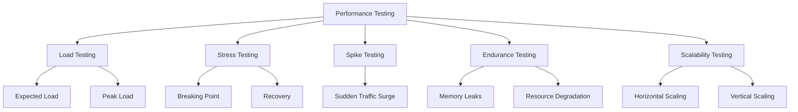
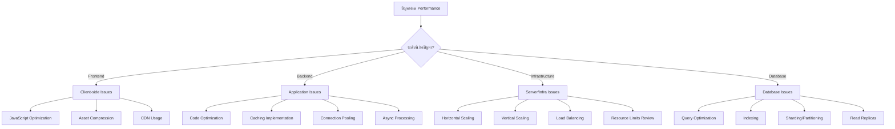
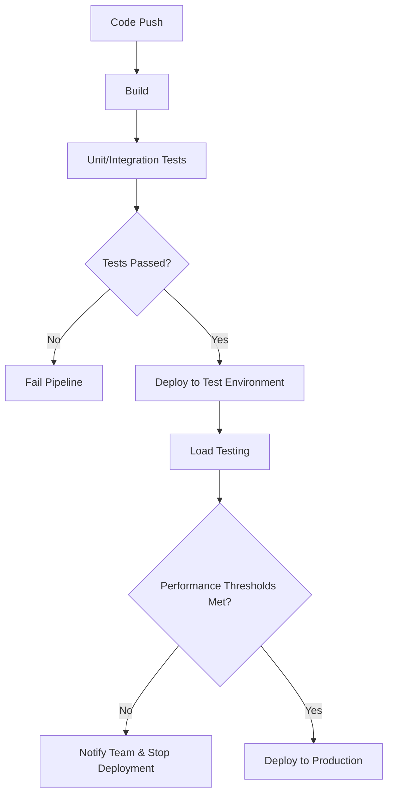

# 🔥 Load Testing เพื่อทดสอบประสิทธิภาพระบบ

## 📋 สารบัญ
- [1. บทนำสู่การทำ Load Testing](#1-บทนำสู่การทำ-load-testing)
- [2. เครื่องมือสำหรับ Load Testing](#2-เครื่องมือสำหรับ-load-testing)
- [3. การใช้งาน k6 สำหรับ Load Testing](#3-การใช้งาน-k6-สำหรับ-load-testing)
- [4. การวิเคราะห์ผลลัพธ์การทดสอบ](#4-การวิเคราะห์ผลลัพธ์การทดสอบ)
- [5. การผสมผสานกับ CI/CD Pipeline](#5-การผสมผสานกับ-cicd-pipeline)
- [6. การทำ Stress Testing และ Chaos Testing](#6-การทำ-stress-testing-และ-chaos-testing)
- [7. Best Practices และข้อควรระวัง](#7-best-practices-และข้อควรระวัง)
- [8. กรณีศึกษาและตัวอย่าง](#8-กรณีศึกษาและตัวอย่าง)
- [9. การวิเคราะห์ผลลัพธ์ Load Test เพื่อการปรับปรุงระบบ](#9-การวิเคราะห์ผลลัพธ์-load-test-เพื่อการปรับปรุงระบบ)
- [10. การเตรียมพร้อมสำหรับสถานการณ์ Traffic Surge](#10-การเตรียมพร้อมสำหรับสถานการณ์-traffic-surge)
- [11. แหล่งข้อมูลเพิ่มเติม](#11-แหล่งข้อมูลเพิ่มเติม)

## 1. บทนำสู่การทำ Load Testing

### 1.1 ความสำคัญของ Load Testing

Load Testing เป็นกระบวนการสำคัญในการพัฒนาซอฟต์แวร์ที่ช่วยให้เราเข้าใจว่าระบบจะทำงานอย่างไรภายใต้สภาวะการใช้งานจริง โดยเฉพาะเมื่อมีผู้ใช้งานจำนวนมาก Load Testing มีความสำคัญดังนี้:

- **ประเมินขีดความสามารถ**: ทดสอบว่าระบบรองรับผู้ใช้ได้มากที่สุดกี่คน
- **ระบุคอขวด (Bottlenecks)**: ค้นหาจุดที่ทำให้ระบบช้าลงหรือล่มเมื่อมีการใช้งานมาก
- **วางแผนการขยายระบบ**: ช่วยในการตัดสินใจว่าควรเพิ่มทรัพยากรอย่างไร
- **ตรวจสอบความคงทน**: ทดสอบว่าระบบทำงานได้อย่างเสถียรในระยะเวลาที่กำหนดหรือไม่
- **ปรับปรุง UX**: การตอบสนองที่รวดเร็วส่งผลต่อความพึงพอใจของผู้ใช้
- **ลดความเสี่ยง**: ป้องกันการล่มของระบบเมื่อมีการใช้งานสูง เช่น ช่วงโปรโมชัน

### 1.2 ประเภทของการทดสอบประสิทธิภาพ

การทดสอบประสิทธิภาพมีหลายรูปแบบ แต่ละแบบมีวัตถุประสงค์และวิธีการที่แตกต่างกัน:

1. **Load Testing**: ทดสอบพฤติกรรมของระบบภายใต้โหลดปกติและโหลดสูงสุดที่คาดว่าจะเกิดขึ้นในสภาพแวดล้อมจริง
2. **Stress Testing**: ทดสอบโดยเพิ่มโหลดจนเกินขีดความสามารถของระบบ เพื่อดูว่าระบบจะล้มเหลวอย่างไรและฟื้นตัวได้หรือไม่
3. **Spike Testing**: ทดสอบการเพิ่มขึ้นของโหลดอย่างฉับพลันในระยะเวลาสั้นๆ
4. **Soak/Endurance Testing**: ทดสอบระบบโดยให้โหลดต่อเนื่องเป็นเวลานาน เพื่อดูว่าจะเกิดปัญหาด้านหน่วยความจำหรือไม่
5. **Scalability Testing**: ทดสอบความสามารถในการรองรับการเพิ่มโหลดเมื่อเพิ่มทรัพยากร



### 1.3 ตัวชี้วัดสำคัญในการทำ Load Testing

เมื่อทำ Load Testing มีตัวชี้วัด (Metrics) สำคัญที่ควรติดตาม:

1. **Response Time**: ระยะเวลาที่ระบบใช้ในการตอบสนองต่อ request
   - Average: เวลาตอบสนองเฉลี่ย
   - Percentiles (p95, p99): เวลาที่ 95% หรือ 99% ของ requests เร็วกว่า
   
2. **Throughput**: จำนวน requests ที่ระบบสามารถรองรับได้ต่อหน่วยเวลา
   - Requests per second (RPS)
   - Transactions per second (TPS)

3. **Error Rate**: สัดส่วนของ requests ที่เกิด error เทียบกับจำนวน requests ทั้งหมด

4. **Concurrent Users/Connections**: จำนวนผู้ใช้หรือการเชื่อมต่อที่ใช้งานพร้อมกัน

5. **Resource Utilization**: การใช้ทรัพยากรระบบ
   - CPU usage
   - Memory usage
   - Disk I/O
   - Network I/O

6. **Saturation Point**: จุดที่ระบบเริ่มไม่สามารถรองรับโหลดที่เพิ่มขึ้นได้

## 2. เครื่องมือสำหรับ Load Testing

### 2.1 เปรียบเทียบเครื่องมือยอดนิยม

| เครื่องมือ | ข้อดี | ข้อจำกัด | เหมาะสำหรับ |
|----------|------|---------|------------|
| **k6** | - ใช้ JavaScript/TypeScript<br>- ติดตั้งง่าย<br>- CI/CD integration<br>- ขยายระบบง่าย | - เครื่องมือวิเคราะห์ UI มีจำกัด<br>- ไม่มีตัว recorder | - Developer-centric testing<br>- Microservices<br>- API testing |
| **JMeter** | - UI สำหรับสร้าง test<br>- รองรับโปรโตคอลหลากหลาย<br>- ชุมชนใหญ่<br>- Plugins จำนวนมาก | - ใช้ Java (resource-heavy)<br>- UI ค่อนข้างล้าสมัย | - โปรเจกต์ขนาดใหญ่<br>- ทีมที่คุ้นเคยกับ Java |
| **Locust** | - Python-based<br>- Distributed testing<br>- Code-based (ยืดหยุ่นสูง) | - ต้องเขียนโค้ด Python<br>- อาจซับซ้อนสำหรับผู้เริ่มต้น | - Python developers<br>- ผู้ที่ต้องการความยืดหยุ่นสูง |
| **Gatling** | - DSL ที่อ่านง่าย (Scala)<br>- Recorder<br>- รายงานละเอียด | - ต้องเรียนรู้ DSL<br>- Resource-intensive | - ทดสอบเว็บแอปที่ซับซ้อน |
| **Artillery** | - Node.js based<br>- YAML config<br>- ง่ายต่อการเริ่มต้น | - ความสามารถจำกัดเมื่อเทียบกับเครื่องมืออื่น | - ทดสอบ API อย่างรวดเร็ว |
| **Taurus** | - wrapper รวมเครื่องมืออื่นๆ<br>- YAML config<br>- Jenkins integration | - เป็นเพียง wrapper<br>- อาจมีปัญหาความเข้ากันได้ | - ทีมที่ใช้หลากหลายเครื่องมือ |

### 2.2 เหตุผลที่เลือก k6 สำหรับ Workshop

ในบทเรียนนี้ เราจะเน้นที่ k6 เนื่องจาก:

1. **ติดตั้งง่าย**: เป็น single binary หรือใช้งานผ่าน Docker ได้
2. **Developer-friendly**: ใช้ JavaScript/TypeScript ซึ่งโปรแกรมเมอร์ส่วนใหญ่คุ้นเคย
3. **เบา และ เร็ว**: ประสิทธิภาพสูงแม้จะรันบนเครื่องเดียว
4. **ขยายได้**: รองรับการกระจายโหลดไปยังหลายเครื่อง
5. **Modern features**: รองรับ HTTP/2, WebSockets และ gRPC
6. **Integration**: ทำงานร่วมกับ CI/CD และ monitoring tools ได้ดี
7. **Output formats**: ส่งออกผลลัพธ์ได้หลายรูปแบบเพื่อวิเคราะห์

## 3. การใช้งาน k6 สำหรับ Load Testing

### 3.1 การติดตั้ง k6

#### สำหรับ MacOS:

```bash
brew install k6
```

#### สำหรับ Linux (Ubuntu/Debian):

```bash
sudo apt-key adv --keyserver hkp://keyserver.ubuntu.com:80 --recv-keys C5AD17C747E3415A3642D57D77C6C491D6AC1D69
echo "deb https://dl.k6.io/deb stable main" | sudo tee /etc/apt/sources.list.d/k6.list
sudo apt-get update
sudo apt-get install k6
```

#### สำหรับ Docker:

```bash
docker pull grafana/k6
```

### 3.2 การเขียน Script ทดสอบพื้นฐาน

k6 ใช้ JavaScript สำหรับเขียน script ทดสอบ ด้านล่างเป็นตัวอย่าง script พื้นฐาน:

```javascript
import http from 'k6/http';
import { check, sleep } from 'k6';

export const options = {
  vus: 10,          // จำนวน Virtual Users (ผู้ใช้จำลอง)
  duration: '30s',  // ระยะเวลาในการทดสอบ
};

export default function () {
  // ทดสอบการเรียก API
  const res = http.get('https://test.k6.io');
  
  // ตรวจสอบผลลัพธ์
  check(res, {
    'status is 200': (r) => r.status === 200,
    'response time < 500ms': (r) => r.timings.duration < 500,
  });
  
  // หน่วงเวลาระหว่างการทดสอบ (จำลองการใช้งานจริง)
  sleep(1);
}
```

### 3.3 การกำหนดรูปแบบการทดสอบ (Test Scenarios)

k6 รองรับการกำหนด scenarios ที่หลากหลาย:

#### การทดสอบแบบค่อยๆ เพิ่มโหลด (Ramping VUs):

```javascript
export const options = {
  stages: [
    { duration: '2m', target: 100 },  // รวมเวลา 2 นาที เพิ่มจำนวนผู้ใช้เป็น 100 คน
    { duration: '5m', target: 100 },  // คงที่ที่ 100 คนเป็นเวลา 5 นาที
    { duration: '2m', target: 0 },    // ลดลงเหลือ 0 คนในเวลา 2 นาที
  ],
};
```

#### การจำลองโหลดตามช่วงเวลาที่แตกต่างกัน:

```javascript
export const options = {
  scenarios: {
    normal_hours: {
      executor: 'ramping-vus',
      startVUs: 0,
      stages: [
        { duration: '5m', target: 50 },
        { duration: '10m', target: 50 },
        { duration: '5m', target: 0 },
      ],
      startTime: '0s',
    },
    peak_hours: {
      executor: 'ramping-vus',
      startVUs: 0,
      stages: [
        { duration: '2m', target: 200 },
        { duration: '5m', target: 200 },
        { duration: '2m', target: 0 },
      ],
      startTime: '20m',
    },
  },
};
```

### 3.4 ตัวอย่าง Script ทดสอบที่ซับซ้อนขึ้น

ตัวอย่างการทดสอบแอปพลิเคชันที่มี login และการโหลดข้อมูล:

```javascript
import http from 'k6/http';
import { check, group, sleep } from 'k6';
import { Counter, Rate } from 'k6/metrics';

// กำหนด custom metrics
const errors = new Counter('errors');
const successRate = new Rate('success_rate');

export const options = {
  stages: [
    { duration: '1m', target: 50 },   // เพิ่มผู้ใช้ถึง 50 คน
    { duration: '3m', target: 50 },   // คงที่ที่ 50 คน
    { duration: '1m', target: 0 },    // ลดลงเหลือ 0
  ],
  thresholds: {
    'http_req_duration': ['p(95)<500'], // 95% ของ requests ต้องเร็วกว่า 500ms
    'http_req_failed': ['rate<0.01'],   // มี errors น้อยกว่า 1%
    'success_rate': ['rate>0.95'],      // อัตราความสำเร็จมากกว่า 95%
  },
};

export default function () {
  // สร้าง session สำหรับผู้ใช้
  const baseUrl = 'https://api.example.com';

  group('Login Flow', () => {
    // ทดสอบหน้า login
    const loginRes = http.post(`${baseUrl}/auth/login`, {
      username: 'testuser',
      password: 'testpass',
    });

    // ตรวจสอบผลลัพธ์การ login
    const checkLogin = check(loginRes, {
      'login status is 200': (r) => r.status === 200,
      'has access token': (r) => r.json('accessToken') !== '',
    });

    if (!checkLogin) {
      errors.add(1);
      successRate.add(0);
      return;
    }
    
    successRate.add(1);
    
    // ใช้ token ที่ได้รับจากการ login
    const token = loginRes.json('accessToken');
    const params = {
      headers: {
        'Authorization': `Bearer ${token}`,
      },
    };

    group('Data Fetching', () => {
      // ทดสอบการดึงข้อมูลผู้ใช้
      const userDataRes = http.get(`${baseUrl}/api/user/profile`, params);
      
      check(userDataRes, {
        'profile status is 200': (r) => r.status === 200,
        'profile contains user data': (r) => r.json('name') !== undefined,
      });

      // ทดสอบการดึง dashboard data
      const dashboardRes = http.get(`${baseUrl}/api/dashboard`, params);
      
      check(dashboardRes, {
        'dashboard status is 200': (r) => r.status === 200,
        'dashboard data loaded': (r) => r.json('items') !== undefined,
      });
    });
  });

  sleep(Math.random() * 3 + 1); // จำลองระยะเวลาที่ผู้ใช้ใช้งานระบบ (1-4 วินาที)
}
```

### 3.5 การรัน k6 และกำหนดค่าพารามิเตอร์

การรัน script พื้นฐาน:

```bash
k6 run script.js
```

การกำหนดค่าพารามิเตอร์ผ่าน command line:

```bash
k6 run --vus 100 --duration 5m script.js
```

การใช้งานผ่าน Docker:

```bash
docker run -i grafana/k6 run - <script.js
```

การส่งออกผลลัพธ์ในรูปแบบต่างๆ:

```bash
# ส่งออกเป็น JSON
k6 run --out json=results.json script.js

# ส่งออกไปยัง InfluxDB
k6 run --out influxdb=http://localhost:8086/k6 script.js

# ส่งออกไปยัง Prometheus
k6 run --out prometheus script.js
```

## 4. การวิเคราะห์ผลลัพธ์การทดสอบ

### 4.1 การอ่านและแปลผลรายงาน k6

เมื่อรัน k6 จะได้รายงานสรุปที่มีข้อมูลดังนี้:

```
     data_received..................: 1.7 MB 55 kB/s
     data_sent......................: 435 kB 14 kB/s
     http_req_blocked...............: avg=4.65ms   min=0s      med=1µs     max=345.42ms p(90)=2µs     p(95)=6µs    
     http_req_connecting............: avg=1.36ms   min=0s      med=0s      max=116.33ms p(90)=0s      p(95)=0s     
     http_req_duration..............: avg=177.65ms min=156.27ms med=172.7ms max=385.96ms p(90)=198.33ms p(95)=221.22ms
       { expected_response:true }...: avg=177.65ms min=156.27ms med=172.7ms max=385.96ms p(90)=198.33ms p(95)=221.22ms
     http_req_failed................: 0.00%  ✓ 0        ✗ 310  
     http_req_receiving.............: avg=68.17ms  min=57.48ms med=65.08ms max=249.05ms p(90)=79.36ms  p(95)=85.21ms 
     http_req_sending...............: avg=37.58µs  min=11µs    med=34µs    max=614µs    p(90)=49µs    p(95)=57µs   
     http_req_tls_handshaking.......: avg=3.02ms   min=0s      med=0s      max=229.43ms p(90)=0s      p(95)=0s     
     http_req_waiting...............: avg=109.4ms  min=96.14ms med=106.28ms max=308.32ms p(90)=118.03ms p(95)=130.1ms 
     http_reqs......................: 310    9.999801/s
     iteration_duration.............: avg=1.18s    min=1.15s   med=1.17s   max=1.55s    p(90)=1.2s     p(95)=1.22s   
     iterations.....................: 310    9.999801/s
     vus............................: 10     min=10     max=10
     vus_max........................: 10     min=10     max=10
```

การแปลผล:
- **http_req_duration**: เวลาทั้งหมดในการส่งคำขอและรับการตอบกลับ
- **p(90), p(95)**: 90% และ 95% ของ requests มีเวลาต่ำกว่าค่านี้
- **http_req_failed**: อัตราส่วนของ requests ที่ล้มเหลว
- **iterations**: จำนวนรอบการทำงานของ script ทั้งหมด
- **vus**: จำนวนผู้ใช้งานจำลองที่ใช้ในการทดสอบ

### 4.2 การใช้งาน k6 กับ Grafana สำหรับการวิเคราะห์ขั้นสูง

การใช้ k6 ร่วมกับ InfluxDB และ Grafana เพื่อสร้าง dashboard:

1. **ตั้งค่า InfluxDB และ Grafana ด้วย Docker Compose**:

```yaml
version: '3'
services:
  influxdb:
    image: influxdb:1.8
    ports:
      - "8086:8086"
    environment:
      - INFLUXDB_DB=k6
      - INFLUXDB_ADMIN_USER=admin
      - INFLUXDB_ADMIN_PASSWORD=admin
    volumes:
      - influxdb-data:/var/lib/influxdb

  grafana:
    image: grafana/grafana:latest
    ports:
      - "3000:3000"
    environment:
      - GF_AUTH_ANONYMOUS_ENABLED=true
      - GF_AUTH_ANONYMOUS_ORG_ROLE=Admin
    volumes:
      - grafana-data:/var/lib/grafana
    depends_on:
      - influxdb

volumes:
  influxdb-data:
  grafana-data:
```

2. **รัน k6 test พร้อมส่งข้อมูลไปยัง InfluxDB**:

```bash
k6 run --out influxdb=http://localhost:8086/k6 script.js
```

3. **การตั้งค่า Grafana Data Source**:
   - เปิด Grafana (http://localhost:3000)
   - เพิ่ม Data Source: InfluxDB
   - URL: http://influxdb:8086
   - Database: k6
   - User: admin
   - Password: admin
   
4. **นำเข้า k6 Dashboard**:
   - ค้นหา Grafana dashboard สำหรับ k6 (ID: 2587)
   - หรือสร้าง Panel เอง เช่น แสดงกราฟของ http_req_duration, RPS, error rate

### 4.3 การวิเคราะห์ Performance และการหาจุดคอขวด

เมื่อทำ Load Testing และพบปัญหาด้าน performance ให้ตรวจสอบตามลำดับ:

1. **เริ่มจากผู้ใช้ (Front-End)**:
   - Network latency
   - Client-side rendering performance
   - JavaScript execution time

2. **ระดับแอปพลิเคชัน**:
   - API response times
   - Database query performance
   - Memory usage
   - Connection pooling
   - Caching efficiency

3. **ระดับเซิร์ฟเวอร์และโครงสร้างพื้นฐาน**:
   - CPU utilization
   - Memory usage
   - Disk I/O
   - Network I/O
   - Connection limits

4. **Database**:
   - Slow queries
   - Index efficiency
   - Connection limits
   - Buffer pool size



## 5. การผสมผสานกับ CI/CD Pipeline

### 5.1 Load Testing ใน CI/CD Workflow

การทำ Load Testing ในกระบวนการ CI/CD ช่วยให้สามารถติดตามประสิทธิภาพของแอปพลิเคชันได้อย่างต่อเนื่อง และพบปัญหาได้ก่อนที่จะเกิดผลกระทบต่อผู้ใช้จริง

#### ขั้นตอนการทำ Load Testing ใน CI/CD:

1. **เตรียม Environment**: สร้างสภาพแวดล้อมทดสอบที่เหมือนกับ production
2. **กำหนด Test Scenarios**: ออกแบบการทดสอบให้ครอบคลุม user flows หลัก
3. **กำหนด Performance Thresholds**: กำหนดเกณฑ์ที่ยอมรับได้
4. **Automate Tests**: เขียนสคริปต์ที่รันอัตโนมัติในพื้นหลัง
5. **Analyze Results**: ตีความผลลัพธ์และเปรียบเทียบกับ baselines

### 5.2 ตัวอย่าง GitHub Actions สำหรับ k6

```yaml
name: Performance Test

on:
  push:
    branches: [ main ]
  pull_request:
    branches: [ main ]

jobs:
  k6_load_test:
    runs-on: ubuntu-latest
    
    steps:
      - name: Checkout
        uses: actions/checkout@v2
        
      - name: Run k6 load test
        uses: grafana/k6-action@v0.2.0
        with:
          filename: performance/load-test.js
          flags: --out json=results.json
          
      - name: Upload performance test results
        uses: actions/upload-artifact@v2
        with:
          name: k6-report
          path: results.json
          
      - name: Check thresholds
        run: |
          if grep -q '"thresholds":{"failed":true' results.json; then
            echo "Performance test failed"
            exit 1
          fi
```

### 5.3 ตัวอย่าง GitLab CI/CD สำหรับ k6

```yaml
stages:
  - test
  - performance

performance_test:
  stage: performance
  image: grafana/k6:latest
  script:
    - k6 run performance/load-test.js --out json=results.json
  artifacts:
    paths:
      - results.json
    expire_in: 1 week
  rules:
    - if: $CI_PIPELINE_SOURCE == "merge_request_event"
    - if: $CI_COMMIT_BRANCH == $CI_DEFAULT_BRANCH
```

### 5.4 การใช้ผลลัพธ์ Load Testing เพื่อตัดสินใจ Deployment

ในระบบ CI/CD ที่สมบูรณ์ ผลลัพธ์จากการทำ Load Testing ควรมีผลต่อการตัดสินใจว่าจะ deploy โค้ดใหม่หรือไม่:

1. **การกำหนด Threshold**:
   ```javascript
   export const options = {
     thresholds: {
       http_req_duration: ['p(95)<250'],  // 95% ของ requests ต้องเสร็จภายใน 250ms
       http_req_failed: ['rate<0.01'],    // อัตราความล้มเหลวต้องน้อยกว่า 1%
       iteration_duration: ['avg<1000'],  // เวลาเฉลี่ยต่อ iteration ต้องน้อยกว่า 1 วินาที
     },
   };
   ```

2. **การบูรณาการกับ CI/CD Pipeline**:
   - ถ้า load test ผ่าน threshold ที่กำหนด → Deploy อัตโนมัติ
   - ถ้าไม่ผ่าน → แจ้งเตือนและขอการพิจารณาจากทีม



## 6. การทำ Stress Testing และ Chaos Testing

### 6.1 Stress Testing คืออะไร

Stress Testing เป็นการทดสอบระบบโดยการเพิ่มโหลดจนเกินขีดความสามารถที่ออกแบบไว้ เพื่อดูว่าระบบจะล้มเหลวอย่างไร และสามารถฟื้นตัวได้หรือไม่ วัตถุประสงค์หลักคือ:

1. **หาจุดแตกหัก (Breaking Point)** ของระบบ
2. **ทดสอบกลไกการฟื้นตัว (Recovery Mechanisms)** 
3. **ประเมินพฤติกรรมของระบบ** ภายใต้สภาวะที่เกินกำลัง
4. **ทดสอบการ degrade gracefully** แทนที่จะล้มเหลวทันที

#### การทำ Stress Testing ด้วย k6:

```javascript
import http from 'k6/http';
import { sleep } from 'k6';

export const options = {
  // เริ่มจาก 50 users และเพิ่มเรื่อยๆ จนถึง 1000 users
  stages: [
    { duration: '5m', target: 50 },
    { duration: '10m', target: 500 },
    { duration: '5m', target: 1000 },
    { duration: '5m', target: 0 },
  ],
};

export default function () {
  http.get('https://test-api.example.com/');
  sleep(1);
}
```

### 6.2 Chaos Testing คืออะไร

Chaos Testing หรือ Chaos Engineering เป็นการทดสอบความทนทานของระบบโดยการจำลองความล้มเหลวในส่วนต่างๆ ของระบบโดยเจตนา เช่น:

1. **Network Failures**: การตัดการเชื่อมต่อเครือข่ายระหว่างส่วนประกอบ
2. **Instance/Container Failures**: การหยุดทำงานของ instances หรือ containers แบบสุ่ม
3. **Disk/CPU Pressure**: การทำให้เกิดการใช้ทรัพยากรสูงผิดปกติ
4. **Latency Injection**: การเพิ่มความล่าช้าในการสื่อสารระหว่างส่วนประกอบ

#### เครื่องมือสำหรับ Chaos Testing:

- **Chaos Monkey** (Netflix): เครื่องมือที่มีชื่อเสียงที่สุดสำหรับ Chaos Testing
- **Litmus Chaos** (CloudNative): เครื่องมือ Chaos Engineering สำหรับ Kubernetes
- **Chaos Mesh**: แพลตฟอร์ม Chaos Engineering open-source สำหรับ Kubernetes

#### ตัวอย่างการตั้งค่า Chaos Testing ด้วย Litmus Chaos:

```yaml
apiVersion: litmuschaos.io/v1alpha1
kind: ChaosEngine
metadata:
  name: nginx-chaos
  namespace: default
spec:
  appinfo:
    appns: 'default'
    applabel: 'app=nginx'
    appkind: 'deployment'
  chaosServiceAccount: litmus-admin
  monitoring: false
  jobCleanUpPolicy: 'delete'
  experiments:
    - name: pod-delete
      spec:
        components:
          env:
            # จำนวน pods ที่จะลบ
            - name: TOTAL_CHAOS_DURATION
              value: '30'
            # ระยะเวลาในการทดสอบ (วินาที)
            - name: CHAOS_INTERVAL
              value: '10'
            # เลือกแบบสุ่มหรือไม่
            - name: FORCE
              value: 'true'
```

### 6.3 ข้อควรพิจารณาในการทำ Stress Testing และ Chaos Testing

1. **มีแผนฟื้นฟู**: ต้องมีแผนในการกู้คืนระบบหลังจากการทดสอบ
2. **ทดสอบในสภาพแวดล้อมที่แยกจาก Production**: ถ้าเป็นไปได้ควรทำการทดสอบในสภาพแวดล้อมที่แยกจาก Production
3. **แจ้งให้ทุกคนทราบ**: แจ้งเตือนทีมที่เกี่ยวข้องก่อนทำการทดสอบ
4. **มีการเฝ้าระวังที่ดี**: ต้องมีการ monitoring ที่มีประสิทธิภาพเพื่อสังเกตการณ์ระบบในระหว่างการทดสอบ
5. **เรียนรู้จากความล้มเหลว**: บันทึกและวิเคราะห์ทุกความล้มเหลวที่พบเพื่อปรับปรุงระบบ

## 7. Best Practices และข้อควรระวัง

### 7.1 Best Practices ในการทำ Load Testing

1. **ทดสอบในสภาพแวดล้อมที่เหมือนกับ Production**:
   - ใช้ข้อมูลที่มีลักษณะเหมือนกับ Production
   - จำลองเครือข่ายให้เหมือน Production
   - ใช้ทรัพยากรในสัดส่วนที่เหมาะสม

2. **ทดสอบอย่างสม่ำเสมอ**:
   - ทำ Load Testing เป็นส่วนหนึ่งของ CI/CD pipeline
   - จัดตารางการทดสอบประจำ (เช่น ทุกสัปดาห์หรือทุกเดือน)
   - ทดสอบหลังจากมีการเปลี่ยนแปลงสำคัญ

3. **ทำความเข้าใจกับผลการทดสอบ**:
   - แปลผลข้อมูลอย่างถูกต้อง
   - เปรียบเทียบกับการทดสอบครั้งก่อน
   - สร้าง baseline เพื่อใช้เปรียบเทียบ

4. **ทดสอบให้ครอบคลุม**:
   - ทดสอบหลายๆ scenarios ไม่ใช่เฉพาะกรณีปกติ
   - ทดสอบทั้งระบบ ไม่ใช่แค่ส่วนประกอบย่อย
   - ทดสอบทั้งการใช้งานแบบค่อยๆ เพิ่มและการเพิ่มแบบฉับพลัน

5. **สร้าง Realistic Scenarios**:
   - จำลองพฤติกรรมผู้ใช้จริง
   - รวมทั้งการ pause และการทำงานที่สมจริง
   - คำนึงถึงความแตกต่างของอุปกรณ์และเครือข่าย

### 7.2 ข้อควรระวังในการทำ Load Testing

1. **ระวังผลกระทบต่อข้อมูล**:
   - ระวังการสร้างข้อมูลทดสอบจำนวนมากที่ต้องทำความสะอาดภายหลัง
   - ใช้ transaction rollbacks เมื่อเป็นไปได้
   - แยกฐานข้อมูลสำหรับการทดสอบ

2. **ระวังการรบกวนระบบอื่น**:
   - ระมัดระวังเมื่อทำการทดสอบในระบบที่เชื่อมต่อกับระบบอื่น
   - แจ้งเตือนทีมที่เกี่ยวข้องก่อนทำการทดสอบ
   - พิจารณาการ mock หรือ stub ระบบภายนอก

3. **คำนึงถึงข้อจำกัดของเครื่องมือ**:
   - ทรัพยากรที่ใช้ในการทดสอบอาจมีผลต่อผลลัพธ์
   - การทดสอบบนเครื่องเดียวอาจไม่เพียงพอสำหรับโหลดขนาดใหญ่
   - ใช้การทดสอบแบบกระจาย (distributed testing) เมื่อจำเป็น

4. **ระวังค่าใช้จ่าย**:
   - การทดสอบบน cloud อาจมีค่าใช้จ่ายสูง
   - ตั้งงบประมาณและขอบเขตการทดสอบให้ชัดเจน
   - ใช้ auto-scaling แบบมีขีดจำกัด

5. **ระวัง False Positives/Negatives**:
   - การทดสอบที่ไม่สมจริงอาจให้ผลที่ผิดพลาด
   - ตรวจสอบว่าระบบทดสอบไม่มีข้อจำกัดที่ไม่มีอยู่ใน production
   - พิจารณาปัจจัยภายนอกที่อาจส่งผลต่อการทดสอบ

## 8. กรณีศึกษาและตัวอย่าง

### 8.1 กรณีศึกษา: การ Load Test ระบบ E-Commerce ช่วงเทศกาล

#### สถานการณ์:
บริษัท ABC เตรียมรับมือกับแคมเปญลดราคาช่วงเทศกาล คาดว่าจะมีผู้ใช้งานเพิ่มขึ้น 5 เท่าจากปกติ

#### วิธีการทดสอบ:
1. **นำข้อมูลการใช้งานจริงมาวิเคราะห์**:
   - ศึกษาพฤติกรรมผู้ใช้จากข้อมูลในอดีต
   - วิเคราะห์เส้นทางการใช้งานที่สำคัญ (Critical paths)

2. **ออกแบบ Test Scenarios**:
   - การเรียกดูสินค้า (Browse)
   - การค้นหาสินค้า (Search)
   - การเพิ่มสินค้าลงตะกร้า (Add to cart)
   - การชำระเงิน (Checkout)

3. **สร้าง Load Test Script**:

```javascript
import http from 'k6/http';
import { sleep, check } from 'k6';
import { SharedArray } from 'k6/data';

// ข้อมูลสินค้า
const products = new SharedArray('products', function() {
  return JSON.parse(open('./products.json')).products;
});

export const options = {
  scenarios: {
    // จำลองการเข้าชมเว็บไซต์แบบปกติ
    browse: {
      executor: 'ramping-vus',
      startVUs: 0,
      stages: [
        { duration: '5m', target: 1000 },
        { duration: '30m', target: 1000 },
        { duration: '5m', target: 0 },
      ],
      exec: 'browsing',
    },
    // จำลองการทำธุรกรรม (การซื้อสินค้า)
    purchase: {
      executor: 'ramping-vus',
      startVUs: 0,
      stages: [
        { duration: '5m', target: 200 },
        { duration: '30m', target: 200 },
        { duration: '5m', target: 0 },
      ],
      exec: 'purchasing',
    },
  },
  thresholds: {
    http_req_duration: ['p(95)<2000'], // 95% ของ requests ต้องเสร็จภายใน 2 วินาที
    http_req_failed: ['rate<0.01'],    // อัตราความล้มเหลวต้องน้อยกว่า 1%
  },
};

// ฟังก์ชันจำลองการเรียกดูสินค้า
export function browsing() {
  // เรียกหน้าแรก
  let res = http.get('https://ecommerce.example.com/');
  check(res, { 'homepage status is 200': (r) => r.status === 200 });
  
  // เรียกดูหมวดหมู่สินค้า
  res = http.get('https://ecommerce.example.com/categories');
  check(res, { 'categories status is 200': (r) => r.status === 200 });
  
  // เรียกดูสินค้าแบบสุ่ม
  const productId = products[Math.floor(Math.random() * products.length)].id;
  res = http.get(`https://ecommerce.example.com/product/${productId}`);
  check(res, { 'product page status is 200': (r) => r.status === 200 });
  
  sleep(Math.random() * 5 + 3); // ผู้ใช้ใช้เวลา 3-8 วินาทีต่อหน้า
}

// ฟังก์ชันจำลองการซื้อสินค้า
export function purchasing() {
  // เลือกสินค้า login และทำการซื้อ
  
  // 1. เลือกสินค้า
  const productId = products[Math.floor(Math.random() * products.length)].id;
  let res = http.get(`https://ecommerce.example.com/product/${productId}`);
  
  // 2. เพิ่มลงตะกร้า
  res = http.post('https://ecommerce.example.com/cart/add', {
    productId: productId,
    quantity: 1,
  });
  check(res, { 'add to cart successful': (r) => r.status === 200 });
  
  // 3. ดูตะกร้าสินค้า
  res = http.get('https://ecommerce.example.com/cart');
  check(res, { 'view cart successful': (r) => r.status === 200 });
  
  // 4. ทำการ checkout
  res = http.post('https://ecommerce.example.com/checkout', {
    paymentMethod: 'credit_card',
    cardNumber: '4111111111111111',
    expiryMonth: '12',
    expiryYear: '2030',
  });
  
  check(res, { 
    'checkout successful': (r) => r.status === 200,
    'order confirmation shown': (r) => r.body.includes('order confirmed'),
  });
  
  sleep(Math.random() * 3 + 2); // เวลาระหว่างการซื้อ
}
```

4. **ผลลัพธ์และการแก้ไข**:
   - พบคอขวดที่ database connection pool
   - ปรับเพิ่ม connection pool จาก 50 เป็น 200
   - ปรับ cache policy ใน product catalog
   - เพิ่ม read replica สำหรับ database
   - ปรับกลไก auto-scaling ให้เร็วขึ้น

5. **ผลลัพธ์หลังการแก้ไข**:
   - รองรับผู้ใช้งานได้เพิ่มขึ้น 8 เท่า
   - Response time ลดลง 40%
   - อัตราความสำเร็จในการทำธุรกรรมเพิ่มขึ้นเป็น 99.8%

### 8.2 ตัวอย่าง: การทดสอบ API Gateway และ Microservices

สำหรับระบบ microservices ที่มี API Gateway เป็นจุดเข้าถึงหลัก:

```javascript
import http from 'k6/http';
import { check, group, sleep } from 'k6';

export const options = {
  stages: [
    { duration: '1m', target: 50 },  // Warm-up
    { duration: '2m', target: 100 }, // รองรับผู้ใช้ปกติ
    { duration: '5m', target: 300 }, // สถานการณ์โหลดสูง
    { duration: '2m', target: 400 }, // สถานการณ์โหลดสูงสุด
    { duration: '1m', target: 0 },   // Cool-down
  ],
  thresholds: {
    'http_req_duration{name:auth}': ['p(95)<500'],
    'http_req_duration{name:products}': ['p(95)<800'],
    'http_req_duration{name:recommendations}': ['p(95)<1200'],
    'http_req_duration{name:cart}': ['p(95)<600'],
  },
};

const BASE_URL = 'https://api-gateway.example.com';
const USER = 'test-user';
const PASSWORD = 'test-password';

export default function() {
  let authToken;
  
  group('Authentication Service', function() {
    const loginRes = http.post(`${BASE_URL}/auth/login`, {
      username: USER,
      password: PASSWORD,
    }, {
      tags: { name: 'auth' },
    });
    
    check(loginRes, {
      'login successful': (r) => r.status === 200,
      'has token': (r) => r.json('token') !== undefined,
    });
    
    authToken = loginRes.json('token');
  });
  
  const headers = {
    'Authorization': `Bearer ${authToken}`,
  };
  
  group('Product Service', function() {
    const productsRes = http.get(`${BASE_URL}/products/featured`, {
      headers: headers,
      tags: { name: 'products' },
    });
    
    check(productsRes, {
      'products status is 200': (r) => r.status === 200,
      'has products': (r) => r.json('items').length > 0,
    });
    
    // เลือกสินค้าหนึ่งรายการเพื่อดูรายละเอียด
    const productId = productsRes.json('items.0.id');
    
    const productDetailRes = http.get(`${BASE_URL}/products/${productId}`, {
      headers: headers,
      tags: { name: 'products' },
    });
    
    check(productDetailRes, {
      'product detail status is 200': (r) => r.status === 200,
    });
  });
  
  group('Recommendation Service', function() {
    const recoRes = http.get(`${BASE_URL}/recommendations/for-me`, {
      headers: headers,
      tags: { name: 'recommendations' },
    });
    
    check(recoRes, {
      'recommendations status is 200': (r) => r.status === 200,
    });
  });
  
  group('Cart Service', function() {
    // เพิ่มสินค้าในตะกร้า
    const addToCartRes = http.post(`${BASE_URL}/cart/items`, {
      productId: 'ABC123',
      quantity: 1,
    }, {
      headers: headers,
      tags: { name: 'cart' },
    });
    
    check(addToCartRes, {
      'add to cart successful': (r) => r.status === 200 || r.status === 201,
    });
    
    // ดูตะกร้า
    const viewCartRes = http.get(`${BASE_URL}/cart`, {
      headers: headers,
      tags: { name: 'cart' },
    });
    
    check(viewCartRes, {
      'view cart successful': (r) => r.status === 200,
      'cart has items': (r) => r.json('items').length > 0,
    });
  });
  
  sleep(1);
}
```

ด้วยการทดสอบนี้ เราสามารถระบุได้ว่าบริการใดที่เป็นคอขวดหรือมีประสิทธิภาพต่ำกว่าที่ควรจะเป็น เพื่อที่จะได้ปรับปรุงแต่ละส่วนของระบบได้อย่างเหมาะสม

### 8.3 การประยุกต์ใช้ Load Testing กับ Business Metrics

การวัดผล Load Testing ไม่ควรดูเพียงแค่ metrics ทางเทคนิคเท่านั้น แต่ควรเชื่อมโยงกับ metrics ทางธุรกิจด้วย:

1. **Conversion Rate**: อัตราการแปลงผู้เข้าชมเป็นลูกค้าที่ซื้อสินค้า
2. **Revenue Impact**: ผลกระทบต่อรายได้เมื่อระบบช้าหรือล่ม
3. **Customer Satisfaction**: ความพึงพอใจของลูกค้าที่ลดลงเมื่อประสบปัญหา
4. **Abandonment Rate**: อัตราการยกเลิกธุรกรรม เมื่อระบบล่าช้า

การนำข้อมูลจาก Load Testing มาวิเคราะห์ร่วมกับ business metrics:

```javascript
import http from 'k6/http';
import { check, sleep } from 'k6';
import { Rate } from 'k6/metrics';

// Custom metrics
const businessTransactionRate = new Rate('business_transaction_rate');
const cartAbandonmentRate = new Rate('cart_abandonment_rate');

export const options = {
  stages: [
    { duration: '3m', target: 200 },
    { duration: '5m', target: 200 },
    { duration: '2m', target: 0 },
  ],
  thresholds: {
    'business_transaction_rate': ['rate>0.9'], // อัตราความสำเร็จทางธุรกิจ > 90%
    'cart_abandonment_rate': ['rate<0.1'],     // อัตราการยกเลิกการซื้อ < 10%
    'http_req_duration': ['p(95)<2000'],       // 95% ของ requests ต้องเสร็จภายใน 2 วินาที
  },
};

export default function() {
  // จำลองเซสชันของผู้ใช้
  const browsing = http.get('https://ecommerce.example.com');
  
  if (browsing.timings.duration > 3000) {
    // ถ้าหน้าเว็บโหลดนานเกิน 3 วินาที ผู้ใช้อาจจะออกจากเว็บไซต์
    businessTransactionRate.add(0);
    return;
  }
  
  const addToCart = http.post('https://ecommerce.example.com/cart/add', {
    productId: 'product-123',
    quantity: 1,
  });
  
  const checkoutStart = http.get('https://ecommerce.example.com/checkout');
  
  if (checkoutStart.timings.duration > 2000) {
    // ถ้าหน้า checkout โหลดช้า ลูกค้าอาจยกเลิกการซื้อ
    cartAbandonmentRate.add(1);
    businessTransactionRate.add(0);
    return;
  } else {
    cartAbandonmentRate.add(0);
  }
  
  const orderComplete = http.post('https://ecommerce.example.com/order/complete', {
    paymentDetails: '...',
  });
  
  check(orderComplete, {
    'order successful': (r) => r.status === 200,
  });
  
  // วัดความสำเร็จของธุรกรรมทางธุรกิจ
  if (orderComplete.status === 200) {
    businessTransactionRate.add(1);
  } else {
    businessTransactionRate.add(0);
  }
  
  sleep(1);
}
```

การทดสอบนี้ไม่ใช่แค่วัดว่า API ตอบสนองเร็วแค่ไหน แต่ยังวัดผลกระทบต่อเป้าหมายทางธุรกิจด้วย เช่น อัตราการทำธุรกรรมสำเร็จ และอัตราการยกเลิกการซื้อ

การทำ Load Testing ที่มีประสิทธิภาพจะช่วยให้องค์กรเข้าใจขีดจำกัดของระบบ และสามารถปรับปรุงประสิทธิภาพก่อนที่จะมีผลกระทบต่อผู้ใช้จริงและธุรกิจ การนำเอา metrics ทางธุรกิจมาพิจารณาร่วมกับข้อมูลทางเทคนิคจะช่วยให้เห็นภาพรวมของผลกระทบทั้งหมดที่อาจเกิดขึ้น

## 9. การวิเคราะห์ผลลัพธ์ Load Test เพื่อการปรับปรุงระบบ

การที่เราทำ Load Testing แล้วได้ข้อมูลมามากมาย จะมีประโยชน์ก็ต่อเมื่อเรานำข้อมูลเหล่านั้นมาวิเคราะห์และปรับปรุงระบบ ในส่วนนี้เราจะเรียนรู้วิธีการนำผลลัพธ์จาก Load Testing ไปใช้ในการปรับปรุงระบบจริง

### 9.1 การระบุปัญหา (Problem Identification)

เมื่อเราพบว่า Load Test ให้ผลลัพธ์ที่ไม่เป็นไปตามที่คาดหวัง ขั้นตอนแรกคือการระบุว่าปัญหาเกิดที่ส่วนไหนของระบบ:

#### 9.1.1 การวิเคราะห์ด้วย Flame Graphs

Flame Graph เป็นเครื่องมือที่มีประสิทธิภาพในการวิเคราะห์ CPU profiling โดยจะแสดงให้เห็นว่าโค้ดส่วนไหนใช้เวลามากที่สุดในระหว่างการทำงาน

```bash
# การสร้าง CPU profile ด้วย Node.js
node --prof app.js

# แปลงไฟล์ log เป็น flamegraph
node --prof-process isolate-0xnnnnnnnnnnnn-v8.log | flamegraph -o flamegraph.svg
```

#### 9.1.2 การวิเคราะห์ Database Query

สำหรับระบบที่มีปัญหาด้าน database performance:

```sql
-- ค้นหา slow queries
SELECT query, calls, total_time, mean_time, max_time
FROM pg_stat_statements
ORDER BY total_time DESC
LIMIT 10;

-- ตรวจสอบการใช้ index
EXPLAIN ANALYZE SELECT * FROM users WHERE email = 'test@example.com';
```

#### 9.1.3 การวิเคราะห์ Network Bottlenecks

ใช้เครื่องมือเช่น `tcpdump` หรือ `wireshark` เพื่อดูปัญหาเครือข่าย:

```bash
# ตรวจสอบการเชื่อมต่อเครือข่าย
tcpdump -i eth0 port 80 -nn
```

### 9.2 การปรับแต่งและแก้ไขปัญหา (Optimization and Remediation)

หลังจากระบุปัญหาแล้ว ขั้นตอนต่อไปคือการปรับแต่งและแก้ไข:

#### 9.2.1 การปรับแต่ง Application Level

1. **Code Optimization**:
   - ลดการคำนวณที่ไม่จำเป็น
   - ใช้ algorithmic improvements
   - ใช้ asynchronous programming
   - ทำ code profiling และปรับแต่งส่วนที่ใช้ทรัพยากรมาก

2. **Caching Improvements**:
   - เพิ่ม in-memory caching เช่น Redis
   - ใช้ HTTP caching
   - ทำ application-level caching
   - ใช้ CDN สำหรับ static content

```javascript
// ตัวอย่างการใช้ Redis caching
const redis = require('redis');
const client = redis.createClient();

async function getProductDetail(productId) {
  // ดูข้อมูลจาก cache ก่อน
  const cachedData = await client.get(`product:${productId}`);
  
  if (cachedData) {
    return JSON.parse(cachedData);
  }
  
  // ถ้าไม่มีใน cache ค่อยไปดึงจาก database
  const product = await db.getProductById(productId);
  
  // เก็บข้อมูลลง cache
  await client.set(`product:${productId}`, JSON.stringify(product), {
    EX: 3600 // หมดอายุใน 1 ชั่วโมง
  });
  
  return product;
}
```

#### 9.2.2 การปรับแต่ง Database Level

1. **Indexing**:
   - ตรวจสอบและเพิ่ม index ที่เหมาะสม
   - ลบ index ที่ไม่จำเป็น
   - ใช้ compound indexes สำหรับ query ที่มีหลายเงื่อนไข

2. **Query Optimization**:
   - ปรับปรุง SQL queries
   - ใช้ materialized views
   - เพิ่ม database-level caching

3. **Connection Pooling**:
   - ตั้งค่า connection pool ให้เหมาะสม
   - ใช้ pgbouncer หรือ solutions อื่นๆ

```sql
-- สร้าง index
CREATE INDEX idx_users_email ON users(email);

-- สร้าง materialized view
CREATE MATERIALIZED VIEW product_summary AS
SELECT p.id, p.name, AVG(r.rating) as avg_rating, COUNT(r.id) as review_count
FROM products p
LEFT JOIN reviews r ON p.id = r.product_id
GROUP BY p.id, p.name;
```

#### 9.2.3 การปรับแต่ง Infrastructure Level

1. **Horizontal Scaling**:
   - เพิ่มจำนวน instances
   - ใช้ load balancer
   - ทำ auto-scaling

2. **Vertical Scaling**:
   - เพิ่ม RAM หรือ CPU
   - ใช้ hardware ที่มีประสิทธิภาพสูงขึ้น

3. **Distributed Systems**:
   - แบ่งระบบเป็น microservices
   - ใช้ message queues
   - ทำ event-driven architecture

```yaml
# ตัวอย่าง Kubernetes Horizontal Pod Autoscaler
apiVersion: autoscaling/v2beta2
kind: HorizontalPodAutoscaler
metadata:
  name: api-service
spec:
  scaleTargetRef:
    apiVersion: apps/v1
    kind: Deployment
    name: api-service
  minReplicas: 3
  maxReplicas: 10
  metrics:
  - type: Resource
    resource:
      name: cpu
      target:
        type: Utilization
        averageUtilization: 70
```

### 9.3 การทดสอบซ้ำและเปรียบเทียบ (Re-testing and Comparison)

หลังจากทำการปรับปรุงแล้ว ควรทำ Load Testing ซ้ำอีกครั้งเพื่อยืนยันว่าสิ่งที่แก้ไขได้ผล:

1. **ใช้ Load Test Script เดิม**:
   - รันสคริปต์เดิมเพื่อให้สามารถเปรียบเทียบได้
   - ใช้โหลดในระดับเดียวกัน

2. **เปรียบเทียบ Metrics**:
   - Response time
   - Throughput
   - Error rate
   - Resource utilization

3. **วัดความคุ้มค่าของการปรับปรุง**:
   - วิเคราะห์ cost/benefit
   - พิจารณาว่าควรปรับปรุงเพิ่มเติมหรือไม่

ตัวอย่างการเปรียบเทียบผลลัพธ์:

```javascript
import { htmlReport } from "https://raw.githubusercontent.com/benc-uk/k6-reporter/main/dist/bundle.js";

export function handleSummary(data) {
  return {
    "summary.html": htmlReport(data),
    "comparison.json": JSON.stringify(data),
  };
}
```

### 9.4 การปรับปรุงแบบต่อเนื่อง (Continuous Improvement)

การ Load Testing ควรเป็นกระบวนการต่อเนื่อง ไม่ใช่ทำเพียงครั้งเดียวแล้วจบ:

1. **ตั้ง Performance Baseline**:
   - กำหนด baseline ของ performance metrics
   - ติดตามการเปลี่ยนแปลงเมื่อเวลาผ่านไป

2. **ทำ Performance Regression Testing**:
   - ทดสอบ performance หลังจากมีการเปลี่ยนแปลงโค้ด
   - ตั้งค่า alerts เมื่อ performance แย่ลง

3. **Performance Budgeting**:
   - กำหนด "budget" สำหรับ metrics ต่างๆ
   - เช่น หน้าเว็บต้องโหลดเสร็จภายใน 2 วินาที

4. **สร้าง Performance Culture**:
   - ให้ทีมเห็นความสำคัญของ performance
   - ทำ performance เป็นส่วนหนึ่งของ definition of done

```javascript
// ตัวอย่าง performance budget ใน k6
export const options = {
  thresholds: {
    http_req_duration: ['p(95)<500'],  // 95% ของ requests ต้องเสร็จภายใน 500ms
    'http_req_duration{staticAsset:true}': ['p(95)<100'],  // static assets เร็วกว่า 100ms
    'http_req_duration{staticAsset:false}': ['p(95)<1000'],  // dynamic content เร็วกว่า 1 วินาที
    http_reqs: ['rate>100'],  // ต้องรองรับอย่างน้อย 100 req/s
  },
};
```

## 10. การเตรียมพร้อมสำหรับสถานการณ์ Traffic Surge

ในบางครั้ง ระบบของเราอาจต้องรองรับการเพิ่มขึ้นของ traffic อย่างฉับพลัน เช่น ช่วงแคมเปญส่งเสริมการขาย วันหยุดนักขัตฤกษ์ หรือเมื่อมีการกล่าวถึงบริษัทในสื่อ การเตรียมพร้อมสำหรับสถานการณ์เหล่านี้มีความสำคัญอย่างยิ่ง

### 10.1 การประเมินและวางแผนสำหรับ Traffic Surge

1. **วิเคราะห์ข้อมูลในอดีต**:
   - ดูแนวโน้มและรูปแบบของ traffic ในอดีต
   - ระบุช่วงเวลาที่มี traffic สูงสุด
   - พยากรณ์ traffic ในอนาคต

2. **กำหนด Capacity Planning**:
   - คำนวณทรัพยากรที่จำเป็น (CPU, RAM, Bandwidth)
   - วางแผน scaling strategy (horizontal vs vertical)
   - พิจารณา cloud resources vs on-premise

3. **สร้าง Spike Testing Scenarios**:
   - จำลองการเพิ่มขึ้นของ traffic อย่างรวดเร็ว
   - ทดสอบ auto-scaling mechanisms
   - ทดสอบ failover systems

```javascript
// ตัวอย่าง k6 script สำหรับ spike testing
export const options = {
  scenarios: {
    spike: {
      executor: 'ramping-arrival-rate',
      startRate: 10,
      timeUnit: '1s',
      preAllocatedVUs: 100,
      maxVUs: 1000,
      stages: [
        { duration: '1m', target: 10 },   // เริ่มด้วย 10 req/s
        { duration: '1m', target: 500 },  // spike อย่างรวดเร็วไปที่ 500 req/s
        { duration: '3m', target: 500 },  // คงที่ที่ 500 req/s
        { duration: '1m', target: 10 },   // กลับไปยัง traffic ปกติ
      ],
    },
  },
};
```

### 10.2 เทคนิคการรองรับ Traffic Surge

1. **Auto-scaling**:
   - ตั้งค่า scaling policies ที่เหมาะสม
   - ใช้ predictive scaling
   - ทดสอบการทำงานของ auto-scaling

2. **Graceful Degradation**:
   - ระบุฟีเจอร์ที่สำคัญน้อยที่สามารถปิดได้เมื่อ traffic สูง
   - ใช้ circuit breaker patterns
   - ลด non-critical features

3. **Rate Limiting และ Throttling**:
   - จำกัดจำนวน requests จาก IP เดียวกัน
   - จัดลำดับความสำคัญของ requests
   - ใช้ waiting room สำหรับ traffic สูง

```javascript
// ตัวอย่างการใช้ circuit breaker ด้วย Opossum (Node.js)
const CircuitBreaker = require('opossum');

const options = {
  timeout: 3000, // หากทำงานนานกว่า 3 วินาที ถือว่าล้มเหลว
  errorThresholdPercentage: 50, // ถ้าล้มเหลว 50% จะเปิด circuit
  resetTimeout: 30000 // circuit จะปิดอีกครั้งหลังจาก 30 วินาที
};

const breaker = new CircuitBreaker(getDatabaseData, options);

breaker.fallback(() => {
  // ส่งข้อมูลจาก cache แทนเมื่อ circuit เปิด
  return getCachedData();
});

function getDatabaseData() {
  // ดึงข้อมูลจาก database
}

function getCachedData() {
  // ดึงข้อมูลจาก cache
}
```

### 10.3 การทดสอบแบบ DDoS Protection

DDoS (Distributed Denial of Service) เป็นภัยคุกคามที่สำคัญ การทดสอบความสามารถในการป้องกัน DDoS เป็นส่วนหนึ่งของการเตรียมพร้อมสำหรับ traffic surge:

1. **การทำ Penetration Testing**:
   - ทดสอบความทนทานต่อ traffic ที่มีลักษณะเป็นการโจมตี
   - ระบุจุดอ่อนในระบบ

2. **การใช้ DDoS Protection Services**:
   - ทดสอบการทำงานร่วมกับ Cloudflare, AWS Shield, หรือ GCP Cloud Armor
   - ปรับแต่งค่าให้เหมาะสม

3. **การตั้งค่า Web Application Firewall (WAF)**:
   - กำหนด rules ที่เหมาะสมเพื่อป้องกันการโจมตี
   - ทดสอบ false positives และ false negatives

```bash
# ตัวอย่างการใช้ Slowloris สำหรับทดสอบ DDoS protection (ทำในสภาพแวดล้อมทดสอบเท่านั้น!)
perl slowloris.pl -dns example.com -port 80 -timeout 2000 -num 500
```

> **หมายเหตุ**: การทดสอบ DDoS ควรทำเฉพาะในสภาพแวดล้อมทดสอบเท่านั้น และต้องได้รับอนุญาตอย่างเป็นทางการ การทดสอบ DDoS กับระบบที่ไม่ได้รับอนุญาตอาจเป็นการกระทำที่ผิดกฎหมาย

## 11. แหล่งข้อมูลเพิ่มเติม

สำหรับผู้ที่ต้องการเรียนรู้เพิ่มเติมเกี่ยวกับ Load Testing และ Performance Testing สามารถศึกษาได้จากแหล่งข้อมูลต่อไปนี้:

### 11.1 เอกสารอ้างอิงและบทความ

1. **k6 Documentation**: [https://k6.io/docs/](https://k6.io/docs/) - เอกสารอ้างอิงอย่างเป็นทางการของ k6
2. **Web Performance in Action** โดย Jeremy Wagner - หนังสือเกี่ยวกับการปรับปรุงประสิทธิภาพเว็บ
3. **Designing Data-Intensive Applications** โดย Martin Kleppmann - หนังสือที่อธิบายหลักการออกแบบแอปพลิเคชันที่รองรับข้อมูลขนาดใหญ่
4. **Site Reliability Engineering** โดย Google - แนวทางการทำ SRE จาก Google

### 11.2 เครื่องมือที่เกี่ยวข้อง

1. **Lighthouse**: เครื่องมือจาก Google สำหรับตรวจสอบประสิทธิภาพเว็บ
2. **WebPageTest**: เครื่องมือตรวจสอบประสิทธิภาพเว็บจากหลายตำแหน่งทั่วโลก
3. **Grafana k6 Cloud**: บริการบน cloud สำหรับการทำ load testing
4. **Apache JMeter**: เครื่องมือ open source สำหรับทำ load testing

### 11.3 ชุมชนและการเรียนรู้เพิ่มเติม

1. **Stack Overflow**: แหล่งรวมคำถาม-คำตอบเกี่ยวกับ performance testing
2. **Performance Calendar**: บล็อกรวบรวมบทความเกี่ยวกับ web performance
3. **k6 Community**: ชุมชนผู้ใช้ k6 ที่แบ่งปันความรู้และประสบการณ์
4. **Web Performance Meetups**: การพบปะแลกเปลี่ยนความรู้ในกลุ่มผู้สนใจ web performance

---

Load Testing เป็นส่วนสำคัญของวงจรการพัฒนาซอฟต์แวร์ที่มุ่งเน้นคุณภาพ การเข้าใจวิธีการทดสอบ วิเคราะห์ผลลัพธ์ และปรับปรุงระบบจะช่วยให้แอปพลิเคชันของคุณมีเสถียรภาพและประสิทธิภาพสูง และสามารถตอบสนองต่อความต้องการของผู้ใช้ได้ แม้ในช่วงที่มีการใช้งานสูงสุด

