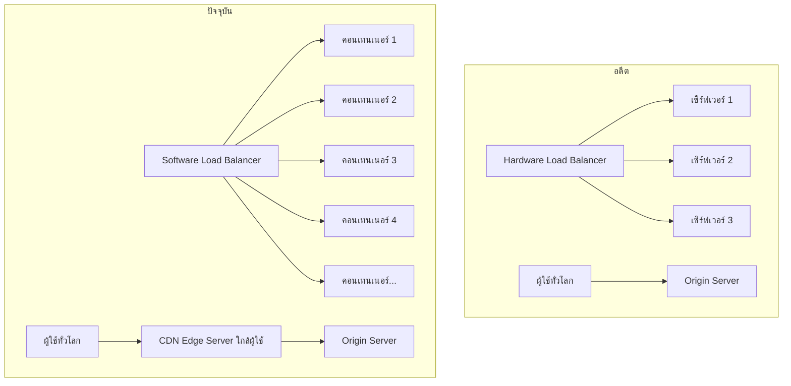
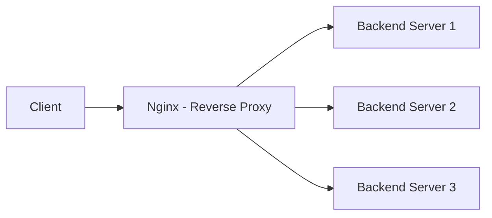
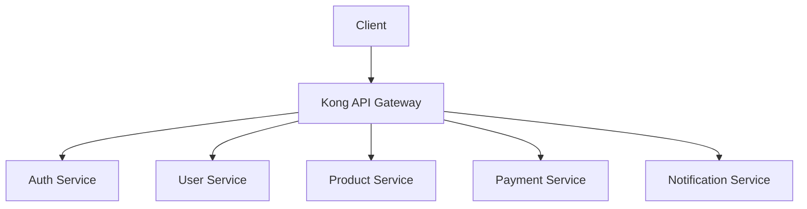
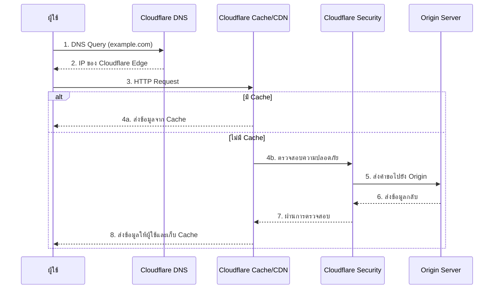
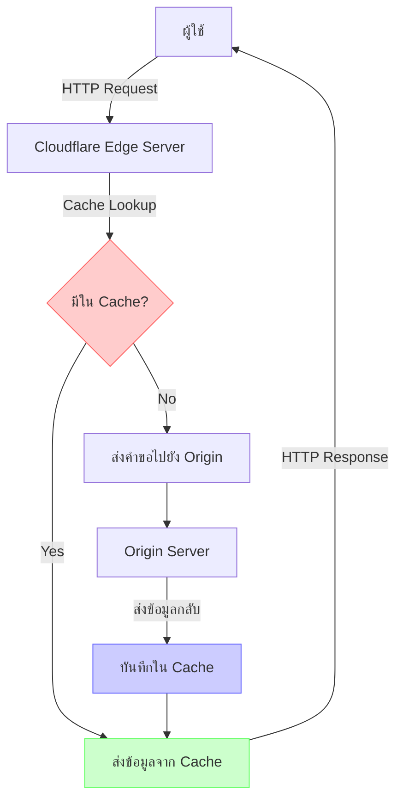
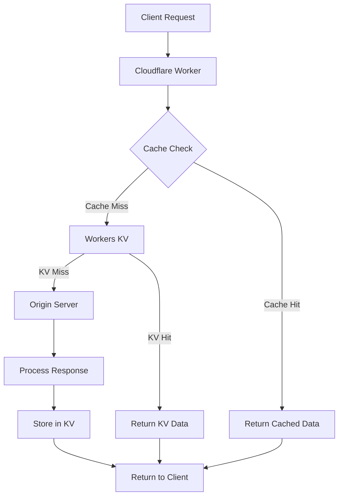
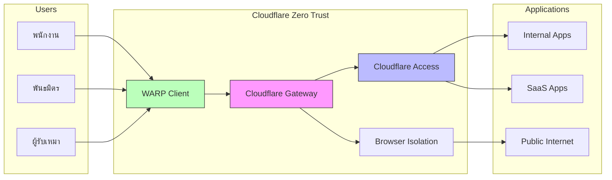
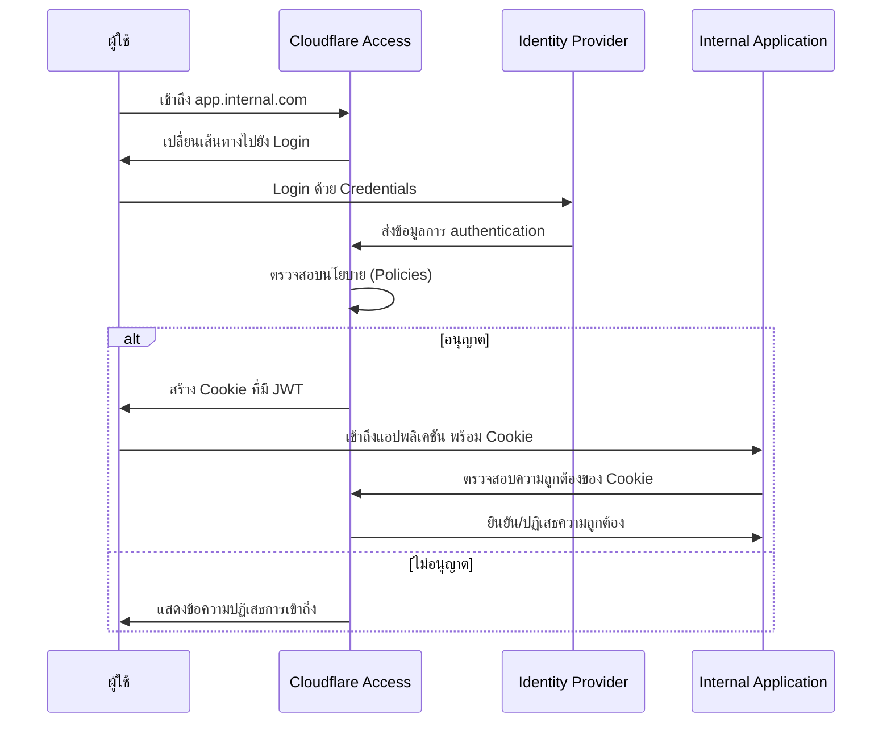
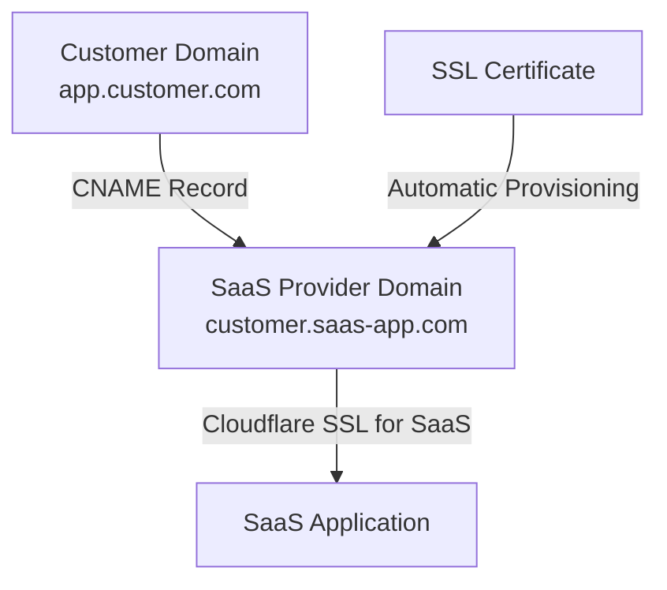

# 🌐 Load Balancing & Content Delivery Networks (CDN)

## 📋 สารบัญ
- [1. บทนำสู่ Load Balancing และ CDN](#1-บทนำสู่-load-balancing-และ-cdn)
- [2. รู้จัก Nginx](#2-รู้จัก-nginx)
- [3. Kong as Reverse Proxy](#3-kong-as-reverse-proxy)
- [4. Cloudflare as DNS Server / CDN](#4-cloudflare-as-dns-server--cdn)
- [5. การทำ Route Services สำหรับ Web Application](#5-การทำ-route-services-สำหรับ-web-application)
- [6. การทำ Multi-Routing](#6-การทำ-multi-routing)
- [7. Load Balance](#7-load-balance)
- [8. แนวทางการประยุกต์ใช้ในองค์กร](#8-แนวทางการประยุกต์ใช้ในองค์กร)

## 1. บทนำสู่ Load Balancing และ CDN

### 1.1 ความสำคัญของ Load Balancing และ CDN

ในยุคที่เทคโนโลยีดิจิทัลเติบโตอย่างรวดเร็ว การให้บริการแอปพลิเคชันออนไลน์ต้องเผชิญกับความท้าทายด้านประสิทธิภาพ ความเสถียร และความปลอดภัย โดยเฉพาะเมื่อมีผู้ใช้งานจำนวนมาก ทำให้เกิดโซลูชันสองประเภทที่สำคัญอย่างยิ่ง:

**Load Balancing:** คือกระบวนการกระจายการร้องขอ (traffic) ไปยังเซิร์ฟเวอร์หลายๆ เครื่อง เพื่อแบ่งเบาภาระการทำงาน ทำให้ระบบมีความสามารถในการรองรับผู้ใช้งานมากขึ้น และมีความเสถียรสูง

**Content Delivery Network (CDN):** คือเครือข่ายของเซิร์ฟเวอร์ที่กระจายตัวอยู่ในภูมิภาคต่างๆ ทั่วโลก เพื่อจัดเก็บ cache ของเนื้อหาเว็บไซต์เช่น รูปภาพ วิดีโอ CSS และไฟล์ JavaScript เพื่อให้ผู้ใช้งานสามารถเข้าถึงเนื้อหาได้จากเซิร์ฟเวอร์ที่อยู่ใกล้ที่สุด ลดเวลาในการโหลดหน้าเว็บ

### 1.2 พัฒนาการของ Load Balancing และ CDN

#### ในอดีต:
- **Load Balancing แบบเดิม:** ใช้อุปกรณ์ฮาร์ดแวร์เฉพาะ (Hardware Load Balancer) ที่มีราคาแพงและขาดความยืดหยุ่น
- **การ Cache แบบเดิม:** องค์กรต้องติดตั้งเซิร์ฟเวอร์ในหลายๆ ภูมิภาค และจัดการซิงค์ข้อมูลเอง ซึ่งมีต้นทุนสูงและซับซ้อน
- **ความท้าทาย:** ขาดความยืดหยุ่น ปรับขยายยาก ต้นทุนสูง และต้องใช้ทีมงานที่มีความชำนาญเฉพาะด้าน

#### ในปัจจุบัน:
- **Software-Defined Load Balancing:** ใช้ซอฟต์แวร์เช่น Nginx, HAProxy หรือ Kong ซึ่งสามารถรันบน commodity hardware ทั่วไปได้
- **Cloud-Based CDN:** บริการ CDN แบบ cloud เช่น Cloudflare, Akamai ที่ให้บริการแบบ global และมีค่าใช้จ่ายที่เหมาะสม
- **ข้อดี:** ยืดหยุ่นสูง ปรับขนาดได้ง่าย รองรับการทำงานแบบอัตโนมัติ มีฟีเจอร์ความปลอดภัยที่ทันสมัย และบูรณาการกับระบบอื่นๆ ได้ดี

### 1.3 ทำไมปัจจุบันถึงดีกว่า และจำเป็นอย่างไร

**เหตุผลที่วิธีการปัจจุบันดีกว่า:**
1. **ความยืดหยุ่นและปรับขนาดได้:** ซอฟต์แวร์ Load Balancer และ CDN แบบ cloud สามารถเพิ่มหรือลดขนาดตามความต้องการได้อย่างรวดเร็ว
2. **ต้นทุนที่ลดลง:** ไม่จำเป็นต้องซื้ออุปกรณ์ราคาแพงและลดค่าใช้จ่ายในการดูแลรักษา
3. **การบูรณาการที่ดีขึ้น:** รองรับการทำงานร่วมกับเครื่องมือและบริการอื่นๆ ผ่าน API
4. **ความสามารถด้านความปลอดภัย:** มีระบบป้องกัน DDoS, WAF และฟีเจอร์ความปลอดภัยอื่นๆ
5. **การให้บริการระดับโลก:** CDN ปัจจุบันมี edge servers หลายพันแห่งทั่วโลก

**เหตุผลที่จำเป็น:**
1. **การเติบโตของข้อมูล:** ปริมาณข้อมูลและการใช้งานเว็บไซต์เพิ่มขึ้นอย่างมหาศาล
2. **ความคาดหวังของผู้ใช้:** ผู้ใช้คาดหวังประสบการณ์ที่รวดเร็ว เสถียร ไม่ว่าจะอยู่ที่ไหนในโลก
3. **ความท้าทายด้านความปลอดภัย:** ภัยคุกคามไซเบอร์มีความซับซ้อนมากขึ้น
4. **โครงสร้างที่กระจายตัว:** แอปพลิเคชันปัจจุบันมักใช้สถาปัตยกรรมแบบไมโครเซอร์วิส ต้องการการจัดเส้นทาง (routing) ที่ชาญฉลาด
5. **การแข่งขันทางธุรกิจ:** องค์กรต้องการมอบประสบการณ์ที่ดีที่สุดให้ผู้ใช้เพื่อรักษาความได้เปรียบทางการแข่งขัน



## 2. รู้จัก Nginx

### 2.1 Nginx คืออะไร

Nginx (อ่านว่า "เอ็นจินเอ็กซ์") เป็น web server, reverse proxy, และ load balancer ที่มีประสิทธิภาพสูง สร้างขึ้นเพื่อแก้ปัญหา C10k (ความท้าทายในการรองรับการเชื่อมต่อพร้อมกัน 10,000 connections) โดยใช้สถาปัตยกรรมแบบ event-driven และ asynchronous ทำให้สามารถจัดการกับ traffic จำนวนมากได้ด้วยทรัพยากรที่จำกัด

### 2.2 ทำไม Nginx ถึงได้รับความนิยม

- **ประสิทธิภาพสูง:** สามารถจัดการ concurrent connections จำนวนมากด้วยการใช้หน่วยความจำน้อย
- **ความเสถียร:** เป็นที่รู้จักในด้านความเสถียรและความน่าเชื่อถือ
- **ความยืดหยุ่น:** สามารถทำได้หลายบทบาท เช่น web server, reverse proxy, load balancer, API gateway
- **การปรับแต่ง:** มี configuration ที่ยืดหยุ่นและ module system ที่ขยายความสามารถได้
- **ชุมชนขนาดใหญ่:** มีการสนับสนุนจากชุมชนและมี documentation ที่ดี
- **Open Source:** มีทั้งเวอร์ชัน open-source และ commercial (Nginx Plus)

### 2.3 การเปรียบเทียบกับ Web Server อื่นๆ

| คุณสมบัติ | Nginx | Apache HTTP Server | IIS |
|----------|-------|-------------------|-----|
| Architecture | Event-driven, asynchronous | Process/thread-based | Asynchronous (recent versions) |
| Performance under high load | ดีเยี่ยม | ปานกลาง | ดี |
| Memory usage | ต่ำ | สูงกว่า | ปานกลางถึงสูง |
| OS support | Cross-platform (Linux, Unix, Windows) | Cross-platform | Windows only |
| Config syntax | Centralized, มีการใช้ blocks | Directory-based (.htaccess) | GUI และ XML |
| Market share (2023) | ~33% | ~31% | ~15% |

### 2.4 การติดตั้ง Nginx

#### บน Ubuntu/Debian:
```bash
sudo apt update
sudo apt install nginx
sudo systemctl start nginx
sudo systemctl enable nginx
```

#### บน CentOS/RHEL:
```bash
sudo yum install epel-release
sudo yum install nginx
sudo systemctl start nginx
sudo systemctl enable nginx
```

### 2.5 การตั้งค่า Nginx พื้นฐาน

#### โครงสร้างไฟล์ Configuration (Ubuntu/Debian):
- **ไฟล์หลัก:** /etc/nginx/nginx.conf
- **Sites available:** /etc/nginx/sites-available/
- **Sites enabled:** /etc/nginx/sites-enabled/
- **Log files:** /var/log/nginx/

#### ตัวอย่าง Basic Server Block:
```nginx
server {
    listen 80;
    server_name example.com www.example.com;
    
    location / {
        root /var/www/html;
        index index.html index.htm;
        try_files $uri $uri/ =404;
    }
    
    access_log /var/log/nginx/example.access.log;
    error_log /var/log/nginx/example.error.log;
}
```

### 2.6 Nginx ในฐานะ Reverse Proxy

Reverse proxy เป็นเซิร์ฟเวอร์ที่อยู่หน้าเว็บเซิร์ฟเวอร์อื่นๆ และส่งต่อคำขอจากไคลเอ็นต์ไปยังเซิร์ฟเวอร์เหล่านั้น



#### ตัวอย่าง Reverse Proxy Configuration:
```nginx
server {
    listen 80;
    server_name myapp.example.com;
    
    location / {
        proxy_pass http://backend_server;
        proxy_set_header Host $host;
        proxy_set_header X-Real-IP $remote_addr;
        proxy_set_header X-Forwarded-For $proxy_add_x_forwarded_for;
        proxy_set_header X-Forwarded-Proto $scheme;
    }
}
```

### 2.7 Nginx ในฐานะ Load Balancer

```nginx
upstream backend {
    least_conn;  # ใช้อัลกอริทึม least connections
    server backend1.example.com;
    server backend2.example.com;
    server backend3.example.com;
}

server {
    listen 80;
    server_name myapp.example.com;
    
    location / {
        proxy_pass http://backend;
        proxy_set_header Host $host;
        proxy_set_header X-Real-IP $remote_addr;
    }
}
```

### 2.8 Nginx กับ HTTPS

การตั้งค่า HTTPS ด้วย SSL/TLS:

```nginx
server {
    listen 443 ssl;
    server_name example.com;
    
    ssl_certificate /etc/nginx/ssl/example.com.crt;
    ssl_certificate_key /etc/nginx/ssl/example.com.key;
    
    ssl_protocols TLSv1.2 TLSv1.3;
    ssl_prefer_server_ciphers on;
    ssl_ciphers 'ECDHE-ECDSA-AES256-GCM-SHA384:ECDHE-RSA-AES256-GCM-SHA384';
    
    # ส่วนที่เหลือของการกำหนดค่า
    # ...
}
```

## 3. Kong as Reverse Proxy

### 3.1 Kong คืออะไร

Kong เป็น API Gateway และ Reverse Proxy ที่สร้างบนพื้นฐานของ Nginx และ LuaJIT ออกแบบมาเพื่อจัดการกับ API ที่มีปริมาณมาก มีความยืดหยุ่นสูง และมี plugin ecosystem ที่กว้างขวาง Kong ทำหน้าที่เป็นชั้นกลางระหว่างไคลเอ็นต์และบริการต่างๆ โดยรองรับทั้งแบบ self-hosted และ cloud-managed service

### 3.2 เปรียบเทียบ Kong กับ Nginx ธรรมดา

| คุณสมบัติ | Kong | Nginx ธรรมดา |
|----------|------|--------------|
| API Management | มีระบบจัดการ API แบบครบวงจร | ต้องกำหนดค่าเพิ่มเติมเอง |
| พื้นฐาน | สร้างบน Nginx + LuaJIT | NGINX เอง |
| การขยายความสามารถ | Plugin system แบบรวดเร็ว | ต้องเขียน Module ในภาษา C |
| การจัดการ | Admin API, GUI (Kong Manager) | ไฟล์ config เท่านั้น |
| Authentication | มี plugins หลายแบบ | ต้องกำหนดเอง |
| Rate Limiting | มีในตัว | ต้องกำหนดเอง |
| Analytics | มีในตัว | ต้องใช้โซลูชันภายนอก |
| Microservices | ออกแบบมาเพื่อ microservices | ต้องกำหนดค่าเพิ่มเติม |

### 3.3 การติดตั้ง Kong

#### ติดตั้งด้วย Docker:
```bash
# สร้าง network
docker network create kong-net

# ติดตั้ง database
docker run -d --name kong-database \
  --network=kong-net \
  -p 5432:5432 \
  -e "POSTGRES_USER=kong" \
  -e "POSTGRES_DB=kong" \
  -e "POSTGRES_PASSWORD=kongpass" \
  postgres:13

# เตรียม database migrations
docker run --rm \
  --network=kong-net \
  -e "KONG_DATABASE=postgres" \
  -e "KONG_PG_HOST=kong-database" \
  -e "KONG_PG_USER=kong" \
  -e "KONG_PG_PASSWORD=kongpass" \
  kong:latest kong migrations bootstrap

# เริ่ม Kong
docker run -d --name kong \
  --network=kong-net \
  -e "KONG_DATABASE=postgres" \
  -e "KONG_PG_HOST=kong-database" \
  -e "KONG_PG_USER=kong" \
  -e "KONG_PG_PASSWORD=kongpass" \
  -e "KONG_PROXY_ACCESS_LOG=/dev/stdout" \
  -e "KONG_ADMIN_ACCESS_LOG=/dev/stdout" \
  -e "KONG_PROXY_ERROR_LOG=/dev/stderr" \
  -e "KONG_ADMIN_ERROR_LOG=/dev/stderr" \
  -e "KONG_ADMIN_LISTEN=0.0.0.0:8001, 0.0.0.0:8444 ssl" \
  -p 8000:8000 \
  -p 8443:8443 \
  -p 8001:8001 \
  -p 8444:8444 \
  kong:latest
```

### 3.4 การสร้าง Service และ Route ใน Kong

Kong มีแนวคิดสำคัญ 2 อย่าง:
- **Services:** แทนปลายทางของ API หรือไมโครเซอร์วิส
- **Routes:** กำหนดว่าคำขอใดควรไปที่ service ไหน

#### ตัวอย่างการสร้าง Service และ Route ด้วย Admin API:

```bash
# สร้าง Service
curl -i -X POST \
  --url http://localhost:8001/services/ \
  --data 'name=example-service' \
  --data 'url=http://mockbin.org'

# สร้าง Route
curl -i -X POST \
  --url http://localhost:8001/services/example-service/routes \
  --data 'protocols[]=http' \
  --data 'hosts[]=example.com' \
  --data 'paths[]=/api'
```

### 3.5 การใช้ Kong Plugin

Kong มี plugins มากมายที่ช่วยเพิ่มความสามารถให้กับ API Gateway:

#### ตัวอย่างการเปิด Rate Limiting Plugin:

```bash
curl -i -X POST \
  --url http://localhost:8001/services/example-service/plugins/ \
  --data 'name=rate-limiting' \
  --data 'config.minute=5' \
  --data 'config.hour=100'
```

#### Plugins ยอดนิยมของ Kong:
- **Authentication:** JWT, Key Authentication, OAuth2, LDAP
- **Security:** CORS, IP Restriction, Bot Detection
- **Traffic Control:** Rate Limiting, Request Size Limiting
- **Analytics & Monitoring:** Prometheus, Datadog, Zipkin
- **Transformation:** Request Transformer, Response Transformer
- **Logging:** HTTP Log, TCP Log, Syslog

### 3.6 Kong ในฐานะ API Gateway สำหรับ Microservices



#### ตัวอย่างการตั้งค่า Microservices Architecture:

```bash
# สร้าง Services สำหรับแต่ละ Microservice
curl -i -X POST --url http://localhost:8001/services/ --data 'name=auth-service' --data 'url=http://auth-service:3000'
curl -i -X POST --url http://localhost:8001/services/ --data 'name=user-service' --data 'url=http://user-service:3001'
curl -i -X POST --url http://localhost:8001/services/ --data 'name=product-service' --data 'url=http://product-service:3002'

# สร้าง Routes
curl -i -X POST --url http://localhost:8001/services/auth-service/routes --data 'paths[]=/auth'
curl -i -X POST --url http://localhost:8001/services/user-service/routes --data 'paths[]=/users'
curl -i -X POST --url http://localhost:8001/services/product-service/routes --data 'paths[]=/products'
```

## 4. Cloudflare as DNS Server / CDN

### 4.1 Cloudflare คืออะไร

Cloudflare เป็นบริษัทที่ให้บริการด้านความปลอดภัยและประสิทธิภาพของเว็บไซต์ โดยมีบริการหลักๆ ได้แก่ CDN, DNS, DDoS Protection, WAF (Web Application Firewall) และอื่นๆ อีกมากมาย Cloudflare มีเครือข่าย edge locations กว่า 275+ เมืองทั่วโลก ทำให้สามารถส่งมอบเนื้อหาได้อย่างรวดเร็วและปกป้องเว็บไซต์จากภัยคุกคามต่างๆ

### 4.2 พัฒนาการของ CDN

#### ในอดีต:
- **ต้นทุนสูง:** CDN เป็นบริการที่มีค่าใช้จ่ายสูง เหมาะสำหรับบริษัทใหญ่เท่านั้น
- **การตั้งค่ายาก:** ต้องใช้ผู้เชี่ยวชาญในการตั้งค่า
- **การทำงานแยกส่วน:** บริการ CDN, DNS, และความปลอดภัยมักแยกจากกัน
- **ขาดความยืดหยุ่น:** การปรับเปลี่ยนการตั้งค่าทำได้ช้าและยาก

#### ในปัจจุบัน (Cloudflare):
- **เข้าถึงง่าย:** มีแผนฟรี และราคาที่เหมาะสมสำหรับธุรกิจทุกขนาด
- **ตั้งค่าง่าย:** UI ที่ใช้งานง่าย และมี dashboard ที่เข้าใจได้ง่าย
- **บูรณาการ:** รวม CDN, DNS, WAF, DDoS protection และบริการอื่นๆ ไว้ในแพลตฟอร์มเดียว
- **ยืดหยุ่น:** สามารถปรับเปลี่ยนการตั้งค่าได้ทันทีผ่าน dashboard หรือ API
- **ขนาดใหญ่:** มีเครือข่ายที่ใหญ่ที่สุดแห่งหนึ่งของโลก

### 4.3 บริการหลักของ Cloudflare

#### 4.3.1 Cloudflare DNS
Cloudflare DNS เป็นบริการ DNS ที่รวดเร็วและน่าเชื่อถือ มีคุณสมบัติที่โดดเด่นคือ:
- **ความเร็ว:** เป็นหนึ่งในบริการ DNS ที่เร็วที่สุดในโลก
- **ความปลอดภัย:** มีการป้องกัน DNS poisoning และ DDoS attacks
- **Anycast Network:** ใช้เทคโนโลยี Anycast ทำให้คำขอ DNS ไปยัง server ที่ใกล้ที่สุด
- **DNSSEC:** รองรับการเข้ารหัส DNS เพื่อความปลอดภัยเพิ่มเติม

#### 4.3.2 Cloudflare CDN
Cloudflare CDN ช่วยให้เว็บไซต์ทำงานได้เร็วขึ้นด้วยการ cache เนื้อหาสถิตและส่งมอบจาก edge server ที่ใกล้ผู้ใช้มากที่สุด:
- **Auto Minify:** ลดขนาดไฟล์ HTML, CSS และ JavaScript โดยอัตโนมัติ
- **Brotli Compression:** การบีบอัดด้วย algorithm ที่มีประสิทธิภาพสูง
- **Argo Smart Routing:** เลือกเส้นทางเครือข่ายที่เร็วที่สุดจาก edge ไปยัง origin
- **Cache Rules:** สามารถกำหนดกฎการ cache ได้อย่างละเอียด
- **Cache Analytics:** วิเคราะห์ประสิทธิภาพการ cache ได้

### 4.4 การตั้งค่า Cloudflare สำหรับเว็บไซต์

#### ขั้นตอนการเริ่มใช้งาน Cloudflare:
1. **สมัครบัญชี:** สมัครบัญชีบนเว็บไซต์ Cloudflare
2. **เพิ่มเว็บไซต์:** เพิ่ม domain ของคุณเข้าสู่ระบบ Cloudflare
3. **ตรวจสอบ DNS Records:** Cloudflare จะดึง DNS records ที่มีอยู่ ให้คุณตรวจสอบ
4. **เปลี่ยน Nameservers:** เปลี่ยน nameservers ของ domain ให้ชี้ไปที่ nameservers ของ Cloudflare
5. **รอการ Propagation:** รอให้การเปลี่ยนแปลง nameservers มีผล (อาจใช้เวลา 24-48 ชั่วโมง)
6. **ตรวจสอบสถานะ:** ตรวจสอบว่า domain อยู่ในสถานะ "Active" บน dashboard ของ Cloudflare

#### การตั้งค่า SSL/TLS:
Cloudflare มีตัวเลือก SSL/TLS หลายแบบ:
- **Off:** ไม่ใช้ SSL
- **Flexible:** เข้ารหัสระหว่างผู้ใช้กับ Cloudflare แต่ไม่เข้ารหัสระหว่าง Cloudflare กับ origin server
- **Full:** เข้ารหัสตลอดเส้นทาง แต่ไม่ตรวจสอบความถูกต้องของใบรับรองที่ origin server
- **Full (Strict):** เข้ารหัสตลอดเส้นทางและตรวจสอบความถูกต้องของใบรับรองที่ origin server

### 4.5 การทำงานของ Cloudflare DNS, CDN และ Proxy

Cloudflare รวมบริการ DNS, CDN และ Proxy เข้าด้วยกันในแพลตฟอร์มเดียว ทำให้การทำงานมีประสิทธิภาพและความปลอดภัยสูง



#### 4.5.1 กระบวนการทำงานของ DNS บน Cloudflare

1. **DNS Query:** ผู้ใช้พิมพ์ URL ในเบราว์เซอร์ เช่น example.com
2. **Recursive DNS Resolution:** DNS resolver ของผู้ใช้ค้นหาข้อมูลจาก DNS server ต่างๆ จนกว่าจะถึง nameserver ของ Cloudflare
3. **Anycast Routing:** คำขอ DNS จะถูกส่งไปยัง Cloudflare DNS server ที่ใกล้ที่สุดด้วยเทคโนโลยี Anycast
4. **DNS Response:** Cloudflare DNS ตอบกลับด้วย IP address ของ Cloudflare edge server (ไม่ใช่ origin server)
5. **TTL Management:** Cloudflare จัดการ Time-To-Live (TTL) เพื่อควบคุมระยะเวลาการ cache DNS records

```mermaid
graph TD
    A[ผู้ใช้] -->|1. ค้นหา example.com| B[Local DNS Resolver]
    B -->|2. ถาม Root DNS| C[Root DNS Servers]
    C -->|3. ตอบข้อมูล TLD Servers| B
    B -->|4. ถาม .com TLD| D[.com TLD Servers]
    D -->|5. ตอบข้อมูล Cloudflare Nameservers| B
    B -->|6. ถาม example.com| E[Cloudflare DNS]
    E -->|7. ตอบ IP Cloudflare Edge| B
    B -->|8. IP Address| A
    A -->|9. HTTP Request| F[Cloudflare Edge]
    F -->|10. HTTP Request (ถ้าจำเป็น)| G[Origin Server]
```

#### 4.5.2 กระบวนการทำงานของ CDN บน Cloudflare

1. **Edge Server Selection:** เมื่อผู้ใช้เชื่อมต่อมาที่ IP address ของ Cloudflare จะถูกนำไปยัง edge server ที่ใกล้ที่สุด
2. **Cache Lookup:** Cloudflare ตรวจสอบว่ามีข้อมูลที่ร้องขอใน cache หรือไม่
3. **Cache Hit:** ถ้ามีข้อมูลใน cache Cloudflare จะส่งข้อมูลนั้นกลับไปยังผู้ใช้ทันที (ไม่ต้องไปถึง origin)
4. **Cache Miss:** ถ้าไม่มีข้อมูลใน cache Cloudflare จะส่งคำขอไปยัง origin server และเก็บผลลัพธ์ไว้ใน cache
5. **Cache Rules:** Cloudflare ใช้กฎต่างๆ ในการกำหนดว่าควรเก็บ cache อะไร นานแค่ไหน



### 4.6 Cloudflare Workers และการประยุกต์ใช้งาน

Cloudflare Workers เป็นบริการ serverless computing ที่ช่วยให้นักพัฒนาสามารถรันโค้ด JavaScript และ WebAssembly ที่ edge network ของ Cloudflare ใกล้กับผู้ใช้มากที่สุด 

#### 4.6.1 ความสามารถของ Cloudflare Workers

- **Edge Computing:** รันโค้ดที่ edge servers ใกล้ผู้ใช้
- **Serverless:** ไม่ต้องจัดการ infrastructure
- **Low Latency:** เวลาตอบสนองต่ำกว่า cloud functions ทั่วไป
- **Global Deployment:** deploy ไปยัง edge locations ทั่วโลกในทันที
- **KV Storage:** เก็บข้อมูลแบบ key-value ใน Workers KV
- **Durable Objects:** สร้าง stateful applications บน edge
- **Cron Triggers:** จัดตาราง worker ให้ทำงานตามเวลาที่กำหนด

#### 4.6.2 ตัวอย่างการใช้ Cloudflare Workers

**1. A/B Testing บน Edge**

```javascript
addEventListener('fetch', event => {
  event.respondWith(handleRequest(event.request))
})

async function handleRequest(request) {
  // สุ่มตัวเลข 0 หรือ 1
  const VARIANT = Math.random() < 0.5 ? 'A' : 'B'
  
  // ดึงเนื้อหาตาม variant
  const response = await fetch(`https://example.com/${VARIANT}.html`)
  
  // เพิ่ม header เพื่อติดตามผล
  const newResponse = new Response(response.body, response)
  newResponse.headers.append('X-Variant', VARIANT)
  
  return newResponse
}
```

**2. API Authentication**

```javascript
addEventListener('fetch', event => {
  event.respondWith(handleRequest(event.request))
})

async function handleRequest(request) {
  // ตรวจสอบ API key จาก headers
  const apiKey = request.headers.get('X-API-Key')
  
  if (!apiKey || !isValidApiKey(apiKey)) {
    return new Response('Unauthorized', { status: 401 })
  }
  
  // ส่งคำขอต่อไปยัง origin
  return fetch(request)
}

function isValidApiKey(key) {
  // Logic ตรวจสอบ key กับ database หรือ KV store
  const validKeys = ['key1', 'key2', 'key3']
  return validKeys.includes(key)
}
```

#### 4.6.3 Workers KV (Key-Value Storage)

Workers KV เป็นระบบจัดเก็บข้อมูลแบบ key-value ที่มีการกระจายตัวทั่วโลก เหมาะสำหรับข้อมูลที่อ่านบ่อยแต่เขียนไม่บ่อย:

```javascript
addEventListener('fetch', event => {
  event.respondWith(handleRequest(event.request))
})

async function handleRequest(request) {
  const url = new URL(request.url)
  const userId = url.pathname.split('/')[2]
  
  if (!userId) {
    return new Response('User ID required', { status: 400 })
  }
  
  // อ่านข้อมูลจาก KV store
  const userData = await USER_DATA.get(userId, 'json')
  
  if (!userData) {
    return new Response('User not found', { status: 404 })
  }
  
  return new Response(JSON.stringify(userData), {
    headers: { 'Content-Type': 'application/json' }
  })
}
```



### 4.7 Cloudflare Pages - JAMstack Hosting

Cloudflare Pages เป็นบริการ hosting สำหรับ static sites และ JAMstack applications ที่มีการทำงานร่วมกับ GitHub และ GitLab เพื่อ automate deployment

#### 4.7.1 ความสามารถของ Cloudflare Pages

- **Continuous Deployment:** เชื่อมต่อกับ GitHub/GitLab เพื่อ auto-deploy เมื่อมีการ push
- **Preview Deployments:** สร้าง preview URL สำหรับแต่ละ branch
- **Custom Domains:** ใช้ custom domain กับ SSL แบบอัตโนมัติ
- **Integrated Functions:** ใช้ Cloudflare Workers ร่วมกับ Pages ได้อย่างไร้รอยต่อ
- **Analytics:** ติดตามการใช้งานและประสิทธิภาพ
- **Large Site Support:** รองรับเว็บไซต์ขนาดใหญ่ที่มีไฟล์จำนวนมาก

#### 4.7.2 การใช้ Cloudflare Pages กับ Frontend Frameworks

Cloudflare Pages รองรับ frameworks ยอดนิยมเกือบทั้งหมด:

| Framework | Build Command | Build Output Directory |
|-----------|---------------|------------------------|
| React (Create React App) | `npm run build` | `build` |
| Next.js | `npm run build` | `.next` or `out` |
| Vue.js | `npm run build` | `dist` |
| Svelte | `npm run build` | `build` or `public` |
| Angular | `npm run build` | `dist/project-name` |
| Astro | `npm run build` | `dist` |

### 4.8 Cloudflare Zero Trust และการรักษาความปลอดภัยเครือข่าย

Cloudflare Zero Trust (เดิมชื่อ Cloudflare Access และ Cloudflare Gateway) เป็นชุดเครื่องมือสำหรับการรักษาความปลอดภัยเครือข่ายแบบ Zero Trust:

#### 4.8.1 องค์ประกอบหลักของ Cloudflare Zero Trust

- **Access:** ควบคุมการเข้าถึงแอปพลิเคชันภายในองค์กร (internal applications)
- **Gateway:** กรองและติดตาม traffic ของอุปกรณ์
- **WARP Client:** VPN client สำหรับเชื่อมต่ออุปกรณ์กับ Cloudflare network
- **Browser Isolation:** เรียกใช้เว็บในสภาพแวดล้อมแยกส่วน (isolated environment)



#### 4.8.2 การทำงานของ Cloudflare Access

1. **User Authentication:** ผู้ใช้ authenticate ผ่าน identity provider (เช่น Google, Okta, Azure AD)
2. **Policy Evaluation:** Cloudflare ตรวจสอบสิทธิ์ตามนโยบายที่กำหนด
3. **JWT Tokens:** สร้าง JSON Web Token (JWT) เพื่อการ authorization
4. **Continuous Verification:** ตรวจสอบสิทธิ์อย่างต่อเนื่องแทนที่จะเป็นครั้งเดียว



### 4.9 Cloudflare for SaaS และ Multi-Tenant Applications

Cloudflare มีโซลูชันเฉพาะสำหรับบริษัทที่ให้บริการ SaaS โดยเฉพาะที่มีการใช้งานแบบ multi-tenant

#### 4.9.1 SSL for SaaS

SSL for SaaS ช่วยให้ผู้ให้บริการ SaaS สามารถให้ลูกค้าใช้ custom domains ของตัวเองกับบริการได้โดยอัตโนมัติ:

1. **Custom Domains:** ลูกค้าสามารถใช้ domain ของตัวเอง (เช่น dashboard.customer.com)
2. **Automatic SSL:** Cloudflare จัดการ SSL certificates โดยอัตโนมัติ
3. **CNAME Setup:** ใช้ CNAME records เพื่อชี้มายัง SaaS platform



#### 4.9.2 Workers for Multi-Tenant Routing

ใช้ Cloudflare Workers เพื่อจัดการ routing ในแอปพลิเคชัน multi-tenant:

```javascript
addEventListener('fetch', event => {
  event.respondWith(handleRequest(event.request))
})

async function handleRequest(request) {
  // ดึง hostname จาก request (เช่น tenant1.saas-app.com)
  const url = new URL(request.url)
  const hostname = url.hostname
  
  // แยก tenant ID จาก hostname
  const tenantId = hostname.split('.')[0]
  
  if (!tenantId || tenantId === 'www') {
    // เป็นหน้าหลักของ SaaS
    return fetch(`https://main-app.saas-app.com${url.pathname}${url.search}`)
  }
  
  // ค้นหาข้อมูล tenant จาก KV store
  const tenantData = await TENANTS.get(tenantId, 'json')
  
  if (!tenantData) {
    return new Response('Tenant not found', { status: 404 })
  }
  
  // ส่งคำขอไปยัง backend ที่เหมาะสม พร้อมกับข้อมูล tenant
  const modifiedRequest = new Request(request)
  modifiedRequest.headers.set('X-Tenant-ID', tenantId)
  modifiedRequest.headers.set('X-Tenant-Plan', tenantData.plan)
  
  return fetch(`https://backend.saas-app.com${url.pathname}${url.search}`, modifiedRequest)
}
```

### 4.10 กรณีศึกษา: การใช้งาน Cloudflare ในองค์กรจริง

#### 4.10.1 กรณีศึกษา: E-commerce ขนาดใหญ่

**ความท้าทาย:**
- รับมือกับ traffic สูงในช่วงเทศกาล
- ป้องกัน DDoS attacks และ bot traffic
- ปรับปรุงความเร็วของเว็บไซต์ทั่วโลก

**โซลูชัน Cloudflare:**
- CDN สำหรับ static assets (รูปภาพ, CSS, JS)
- Rate limiting สำหรับ API endpoints
- Bot Management เพื่อป้องกัน scalping bots
- Page Rules เพื่อปรับแต่ง cache behavior
- Image Optimization เพื่อลดขนาดรูปภาพสินค้า

**ผลลัพธ์:**
- ลด page load time ลง 60%
- ลด bandwidth costs ลง 70%
- เพิ่มอัตราการ conversion 15%
- ป้องกัน DDoS attacks ได้มากกว่า 20 ครั้งต่อเดือน

#### 4.10.2 กรณีศึกษา: FinTech Startup

**ความท้าทาย:**
- ต้องการความปลอดภัยสูงสุดสำหรับข้อมูลการเงิน
- รองรับการขยายตัวอย่างรวดเร็ว
- ปฏิบัติตามกฎระเบียบด้านความปลอดภัย (PCI DSS, GDPR)

**โซลูชัน Cloudflare:**
- Cloudflare Access สำหรับการเข้าถึงระบบภายใน
- WAF (Web Application Firewall) เพื่อป้องกัน SQL injection และ XSS
- Argo Smart Routing เพื่อปรับปรุงความเร็วของ API
- Zero Trust security model
- Cloudflare Workers ส