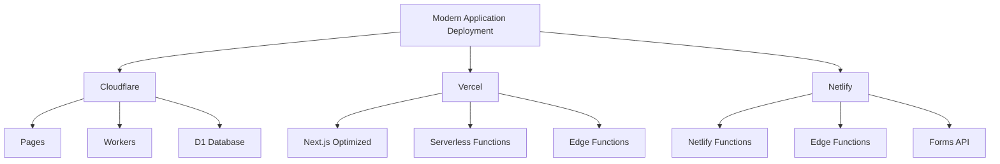
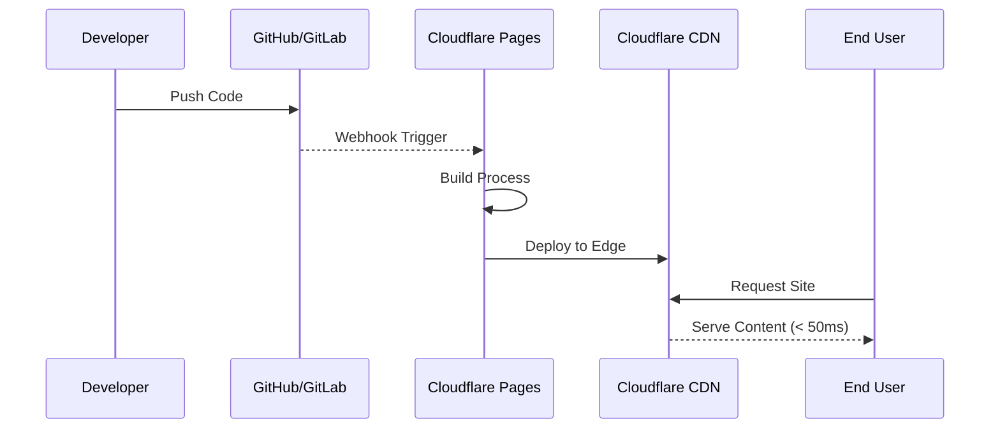
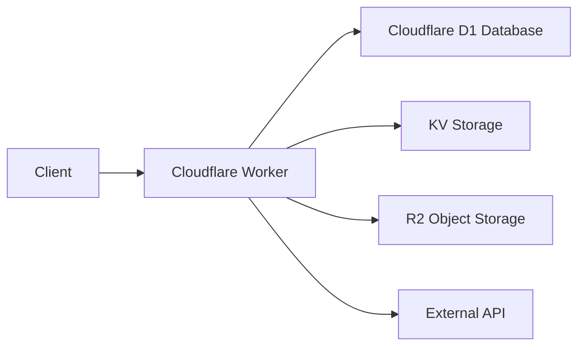
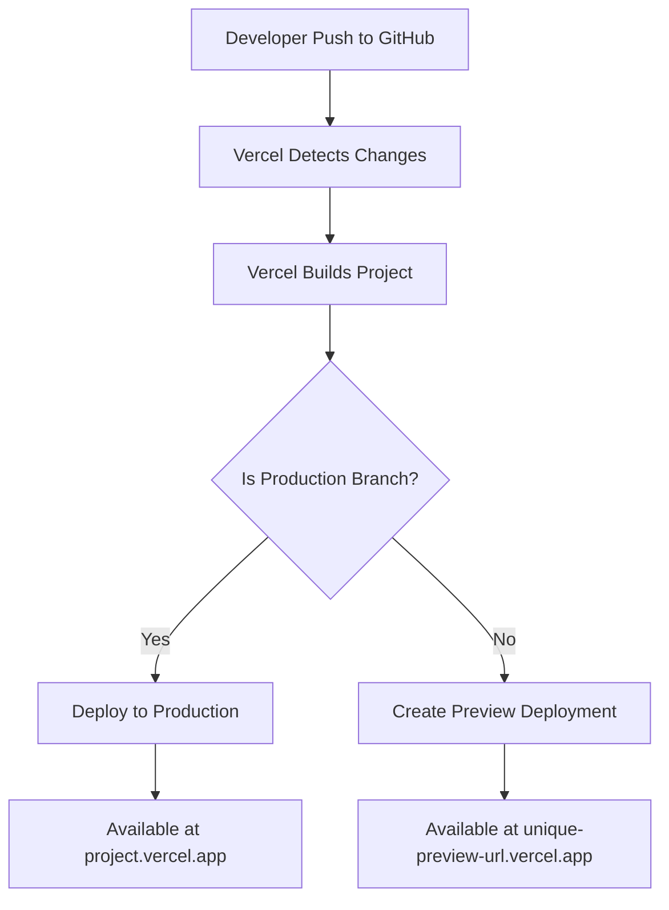
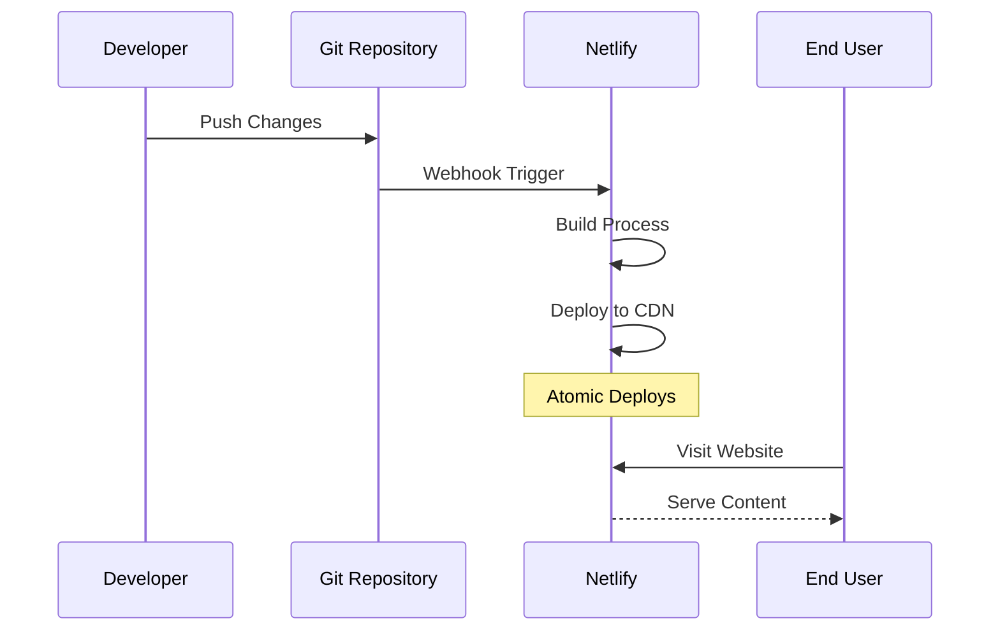

# 🚀 การ Deploy แอปพลิเคชันบน Cloud Platforms

## 📋 สารบัญ

- [1. บทนำ](#1-บทนำ)
- [2. การเปรียบเทียบ Platforms สำหรับการ Deploy](#2-การเปรียบเทียบ-platforms-สำหรับการ-deploy)
- [3. Deploy บน Cloudflare](#3-deploy-บน-cloudflare)
- [4. Deploy บน Vercel](#4-deploy-บน-vercel)
- [5. Deploy บน Netlify](#5-deploy-บน-netlify)
- [6. Best Practices สำหรับแต่ละ Platform](#6-best-practices-สำหรับแต่ละ-platform)
- [7. แหล่งข้อมูลเพิ่มเติม](#7-แหล่งข้อมูลเพิ่มเติม)

## 1. บทนำ

การ deploy แอปพลิเคชันในยุคปัจจุบันมีทางเลือกมากมายที่ช่วยให้นักพัฒนาสามารถนำแอปพลิเคชัน web, mobile หรือ API ขึ้นสู่ production ได้อย่างรวดเร็วและมีประสิทธิภาพ โดยไม่ต้องกังวลเรื่องการจัดการ infrastructure แบบดั้งเดิม

ในบทเรียนนี้ เราจะเจาะลึกถึงวิธีการ deploy แอปพลิเคชันบนแพลตฟอร์มยอดนิยม 3 แพลตฟอร์ม ได้แก่ Cloudflare, Vercel และ Netlify ซึ่งแต่ละแพลตฟอร์มมีจุดแข็งและคุณสมบัติเฉพาะตัวที่แตกต่างกันไป

### การพัฒนาของแพลตฟอร์ม Deploy

ก่อนที่จะมีแพลตฟอร์มอย่าง Cloudflare Pages, Vercel หรือ Netlify การ deploy แอปพลิเคชันมักต้องพึ่งพา:

- **การเช่า server แบบดั้งเดิม** - ต้องจัดการ infrastructure, scaling และความปลอดภัยเอง
- **บริการเว็บโฮสติ้งทั่วไป** - มีข้อจำกัดในการปรับแต่งและขยายขนาด
- **IaaS (Infrastructure as a Service)** - เช่น AWS EC2, DigitalOcean ที่ยังต้องจัดการ server เอง
- **PaaS (Platform as a Service)** - เช่น Heroku ที่มีค่าใช้จ่ายสูงเมื่อต้องขยายขนาด

ปัจจุบัน แพลตฟอร์มสมัยใหม่นำเสนอแนวคิด **Jamstack** (JavaScript, APIs, Markup) และ **Serverless** ที่ช่วยให้การ deploy เป็นเรื่องง่าย รวดเร็ว และมีค่าใช้จ่ายที่คุ้มค่ากว่า

## 2. การเปรียบเทียบ Platforms สำหรับการ Deploy

เปรียบเทียบคุณสมบัติหลักของแต่ละแพลตฟอร์ม:

| คุณสมบัติ | Cloudflare Pages/Workers | Vercel | Netlify |
|----------|--------------------------|--------|---------|
| **ฟรีเทียร์** | การ build ไม่จำกัด, 500 deploy/เดือน | 100GB Bandwidth/เดือน, Build ไม่จำกัด | 300 นาที build/เดือน, 100GB bandwidth |
| **CDN** | Cloudflare CDN (150+ locations) | Edge Network (70+ locations) | Netlify CDN (6+ locations) |
| **Serverless Functions** | Workers และ Workers KV | Serverless Functions และ Edge Functions | Netlify Functions (AWS Lambda) |
| **Full-stack Framework** | โฟกัสที่ Workers + Pages | Next.js, Nuxt, SvelteKit | Netlify Connect, Netlify Graph |
| **Preview Deployments** | มี (แต่ละ branch) | มี (แต่ละ commit) | มี (แต่ละ pull request) |
| **Database** | Cloudflare D1 (SQLite) | Vercel Postgres, KV, Blob | - |
| **Analytics** | มี | มี | มี |
| **จุดเด่น** | ความเร็ว CDN ทั่วโลก, ป้องกัน DDoS | Optimized สำหรับ Next.js, UX ดี | Developer Experience ดีเยี่ยม, Forms API |
| **ข้อจำกัด** | Workers มีข้อจำกัดด้านขนาด (1MB) | ผูกติดกับ Next.js มาก | Functions execution time จำกัด |



## 3. Deploy บน Cloudflare

Cloudflare เป็นแพลตฟอร์มที่มีจุดเด่นด้านความเร็วและความปลอดภัย ด้วยเครือข่าย CDN ที่ใหญ่ที่สุดในโลกกว่า 275 locations

### 3.1 Cloudflare Pages

Cloudflare Pages เป็นบริการสำหรับ deploy static sites และ JAMstack applications ที่รวมกับ CI/CD pipeline และ global CDN ของ Cloudflare

#### ขั้นตอนการ Deploy

1. **สร้างบัญชี Cloudflare** และเข้าสู่ dashboard
2. **ไปที่ "Pages"** และคลิก "Create a Project"
3. **เชื่อมต่อกับ Git provider** (GitHub, GitLab)
4. **เลือก repository** ที่ต้องการ deploy
5. **กำหนดค่า build settings:**
   - Build command (เช่น `npm run build` หรือ `hugo`)
   - Build output directory (เช่น `dist`, `public`, `build`)
6. **คลิก "Save and Deploy"**



#### ตัวอย่างการปรับแต่ง build สำหรับ framework ยอดนิยม

| Framework | Build Command | Build Output Directory |
|-----------|--------------|------------------------|
| React (Create React App) | `npm run build` | `build` |
| Vue.js | `npm run build` | `dist` |
| Next.js | `npm run build` | `.next` (ต้องใช้ _redirects หรือ adapter) |
| Nuxt.js | `npm run generate` | `dist` |
| Angular | `ng build --prod` | `dist/{project-name}` |
| Svelte/SvelteKit | `npm run build` | `build` |
| Astro | `npm run build` | `dist` |

### 3.2 Cloudflare Workers

Cloudflare Workers เป็นบริการ serverless ที่รันโค้ด JavaScript/WebAssembly ที่ edge locations ของ Cloudflare ทั่วโลก เหมาะสำหรับการสร้าง API, ทำ server-side rendering หรือสร้างแอปพลิเคชันแบบเต็มรูปแบบ

#### ตัวอย่าง Worker Script

```javascript
// ตัวอย่าง API Worker อย่างง่าย
addEventListener('fetch', event => {
  event.respondWith(handleRequest(event.request))
})

async function handleRequest(request) {
  const url = new URL(request.url)
  
  if (url.pathname === '/api/user') {
    return new Response(JSON.stringify({
      name: 'John Doe',
      role: 'Developer'
    }), {
      headers: {
        'Content-Type': 'application/json',
        'Access-Control-Allow-Origin': '*'
      }
    })
  }
  
  return new Response('Not Found', { status: 404 })
}
```

#### การ Deploy Cloudflare Worker

1. **ติดตั้ง Wrangler CLI**:
   ```bash
   npm install -g wrangler
   ```

2. **สร้างโปรเจค Worker**:
   ```bash
   wrangler init my-worker
   cd my-worker
   ```

3. **แก้ไขไฟล์ `src/index.js` ตามต้องการ**

4. **Deploy**:
   ```bash
   wrangler publish
   ```

### 3.3 Cloudflare D1 Database

Cloudflare D1 เป็น SQL database ที่รันบน edge network ของ Cloudflare ที่สร้างบนฐานของ SQLite และสามารถใช้งานร่วมกับ Workers ได้อย่างไร้รอยต่อ



#### ตัวอย่างการใช้ D1 กับ Worker

```javascript
// wrangler.toml
// [[ d1_databases ]]
// binding = "DB"
// database_name = "my-database"
// database_id = "xxxx"

export default {
  async fetch(request, env) {
    // ดึงข้อมูลจาก D1 database
    const stmt = env.DB.prepare(
      'SELECT * FROM users WHERE id = ?'
    ).bind(1);
    
    const result = await stmt.all();
    
    return Response.json(result.results);
  }
};
```

### 3.4 ข้อดีของ Cloudflare

- **Global Distribution**: การเข้าถึงทั่วโลกด้วย edge network 275+ locations
- **DDoS Protection**: การป้องกัน DDoS ในตัว
- **Developer Experience**: การ deploy เป็นเรื่องง่าย
- **ราคา**: ฟรีเทียร์ที่ใช้งานได้จริงและเหมาะสำหรับโปรเจคขนาดเล็กถึงกลาง
- **ความเร็ว**: การตอบสนองเร็วที่สุดเมื่อเทียบกับคู่แข่ง
- **Workers**: รองรับการสร้างแอปพลิเคชันแบบเต็มรูปแบบที่ edge

## 4. Deploy บน Vercel

Vercel เป็นแพลตฟอร์มที่เหมาะสำหรับ frontend frameworks โดยเฉพาะ Next.js (เนื่องจากเป็นบริษัทเดียวกัน) และมีประสบการณ์ผู้ใช้งานที่ดีเยี่ยม

### 4.1 ขั้นตอนการ Deploy บน Vercel

1. **สร้างบัญชี Vercel** (สามารถใช้บัญชี GitHub, GitLab หรือ Bitbucket)
2. **Import repository** จาก Git provider
3. **กำหนดค่า project settings** (ส่วนใหญ่ Vercel จะตรวจจับ framework และกำหนดค่าให้อัตโนมัติ)
4. **คลิก "Deploy"**



### 4.2 การใช้งาน Serverless Functions ใน Vercel

Vercel รองรับ Serverless Functions ที่เขียนได้หลายภาษา:

- **Node.js**
- **Python**
- **Ruby**
- **Go**

#### ตัวอย่าง API Route ใน Next.js (ทำงานเป็น Serverless Function บน Vercel)

```javascript
// pages/api/hello.js
export default function handler(req, res) {
  res.status(200).json({ name: 'John Doe' })
}
```

### 4.3 Vercel Edge Functions

Edge Functions เป็นฟีเจอร์ที่อนุญาตให้รันโค้ดที่ Edge Network ของ Vercel ใกล้กับผู้ใช้มากที่สุด (คล้ายกับ Cloudflare Workers)

```javascript
// pages/api/edge-function.js
export default function handler(req, res) {
  res.status(200).json({ 
    message: 'This is running at the edge!',
    region: process.env.VERCEL_REGION 
  });
}

export const config = {
  runtime: 'edge',
};
```

### 4.4 ข้อดีของ Vercel

- **Developer Experience**: UI ที่ใช้งานง่าย และการ setup อัตโนมัติสำหรับ frameworks ยอดนิยม
- **Next.js Integration**: รองรับฟีเจอร์ขั้นสูงของ Next.js ทั้งหมด (ISR, SSG, SSR)
- **Preview Deployments**: สร้าง preview URL สำหรับแต่ละ commit หรือ branch
- **Analytics และ Monitoring**: มีเครื่องมือติดตามประสิทธิภาพในตัว
- **Speed Insights**: วัดและติดตาม Core Web Vitals

## 5. Deploy บน Netlify

Netlify เป็นแพลตฟอร์มที่เป็นที่นิยมสำหรับการ deploy JAMstack websites และมี developer experience ที่ดีเยี่ยม

### 5.1 ขั้นตอนการ Deploy บน Netlify

1. **สร้างบัญชี Netlify**
2. **คลิก "New site from Git"**
3. **เลือก Git provider** (GitHub, GitLab, Bitbucket)
4. **เลือก repository**
5. **กำหนดค่า build settings**:
   - Build command
   - Publish directory
6. **คลิก "Deploy site"**



### 5.2 Netlify Functions

Netlify Functions ช่วยให้คุณสามารถเขียน serverless functions เพื่อดำเนินการแบบ server-side โดยไม่ต้องจัดการ server เอง

#### ตัวอย่าง Netlify Function

```javascript
// functions/hello-world.js
exports.handler = async function(event, context) {
  return {
    statusCode: 200,
    body: JSON.stringify({
      message: "Hello World",
      timestamp: new Date().toISOString()
    })
  };
}
```

### 5.3 Netlify Forms

หนึ่งในฟีเจอร์ที่โดดเด่นของ Netlify คือ Netlify Forms ที่ช่วยให้คุณสามารถจัดการกับการส่งฟอร์มโดยไม่ต้องมี backend server

#### ตัวอย่าง Netlify Form

```html
<!-- ฟอร์มที่จะถูกจัดการโดย Netlify -->
<form name="contact" method="POST" data-netlify="true">
  <p>
    <label>ชื่อของคุณ: <input type="text" name="name" /></label>
  </p>
  <p>
    <label>อีเมล: <input type="email" name="email" /></label>
  </p>
  <p>
    <label>ข้อความ: <textarea name="message"></textarea></label>
  </p>
  <p>
    <button type="submit">ส่ง</button>
  </p>
</form>
```

### 5.4 Netlify Edge Functions

Netlify Edge Functions เป็นบริการที่อนุญาตให้รันโค้ดที่ใกล้กับผู้ใช้มากที่สุด โดยใช้ Deno runtime

```javascript
// netlify/edge-functions/hello.js
export default async (request, context) => {
  return new Response(`Hello from ${context.geo.country}!`, {
    headers: { 'content-type': 'text/html' },
  });
};

export const config = {
  path: '/edge-hello',
};
```

### 5.5 ข้อดีของ Netlify

- **Netlify Forms**: การจัดการฟอร์มแบบ serverless
- **Split Testing**: A/B testing สำหรับเว็บไซต์สถิต
- **Deploy Previews**: สร้าง preview สำหรับทุก pull request
- **Easy Rollbacks**: ย้อนกลับไปยังเวอร์ชันก่อนหน้าได้ง่าย
- **Deploy Contexts**: กำหนดค่าการ build ที่แตกต่างกันสำหรับแต่ละ environment
- **Build Plugins**: ระบบปลั๊กอินที่ขยายความสามารถของ build process

## 6. Best Practices สำหรับแต่ละ Platform

### 6.1 Cloudflare Best Practices

- **ใช้ Cloudflare Workers KV** สำหรับการจัดเก็บข้อมูลที่เข้าถึงบ่อย
- **Optimize รูปภาพด้วย Cloudflare Images** เพื่อปรับขนาดและปรับแต่งรูปภาพที่ edge
- **ระวัง Worker Size Limits**: Workers มีขนาดจำกัด 1MB ต่อ worker
- **ใช้ Cloudflare Pages Functions** สำหรับ API routes ใน static sites
- **ใช้ Cloudflare R2** แทน S3 เพื่อลดค่าใช้จ่าย egress bandwidth

### 6.2 Vercel Best Practices

- **เลือกใช้ ISR (Incremental Static Regeneration)** ในแอป Next.js เพื่อความเร็วและความสด
- **กำหนด Memory Limits** สำหรับ Serverless Functions ให้เหมาะสม
- **ใช้ Edge Middleware** สำหรับการเช็คสิทธิ์, redirects, rewriting
- **ใช้ Environment Variables** แยกตาม environment
- **เปิดใช้งาน Prerendering** เพื่อเพิ่มความเร็วของเพจ

### 6.3 Netlify Best Practices

- **กำหนดค่า Redirect และ Rewrites** ใน `_redirects` หรือ `netlify.toml`
- **ใช้ Netlify Large Media** สำหรับไฟล์ขนาดใหญ่
- **ใช้ Build Plugins** เพื่อขยายความสามารถของกระบวนการ build
- **กำหนด Cache Headers** ให้เหมาะสม
- **ใช้ Deploy Contexts** เพื่อกำหนดค่าแตกต่างกันระหว่าง production และ development

## 7. แหล่งข้อมูลเพิ่มเติม

### 7.1 Cloudflare

- [Cloudflare Pages Documentation](https://developers.cloudflare.com/pages/)
- [Cloudflare Workers Documentation](https://developers.cloudflare.com/workers/)
- [Cloudflare D1 Documentation](https://developers.cloudflare.com/d1/)
- [Cloudflare Workers Examples](https://github.com/cloudflare/workers-sdk/tree/main/templates)
- [Cloudflare Developer Week Videos](https://www.youtube.com/playlist?list=PLyXdLzzW3hG2onV9uP4bRDpNn7xTTXoll)

### 7.2 Vercel

- [Vercel Documentation](https://vercel.com/docs)
- [Next.js Documentation](https://nextjs.org/docs)
- [Vercel CLI Reference](https://vercel.com/docs/cli)
- [Vercel Edge Functions](https://vercel.com/features/edge-functions)
- [Deploying Frameworks to Vercel](https://vercel.com/docs/frameworks)

### 7.3 Netlify

- [Netlify Documentation](https://docs.netlify.com/)
- [Netlify Functions](https://docs.netlify.com/functions/overview/)
- [Netlify Edge Functions](https://docs.netlify.com/edge-functions/overview/)
- [Netlify Build Plugins](https://docs.netlify.com/configure-builds/build-plugins/)
- [Netlify Community](https://community.netlify.com/)

### 7.4 ทั่วไป

- [JAMstack.org](https://jamstack.org/)
- [The State of JavaScript](https://stateofjs.com/)
- [Serverless Handbook](https://serverlesshandbook.dev/)
- [CSS-Tricks: Serverless](https://css-tricks.com/tag/serverless/)
- [Smashing Magazine: JAMstack](https://www.smashingmagazine.com/tag/jamstack/)
