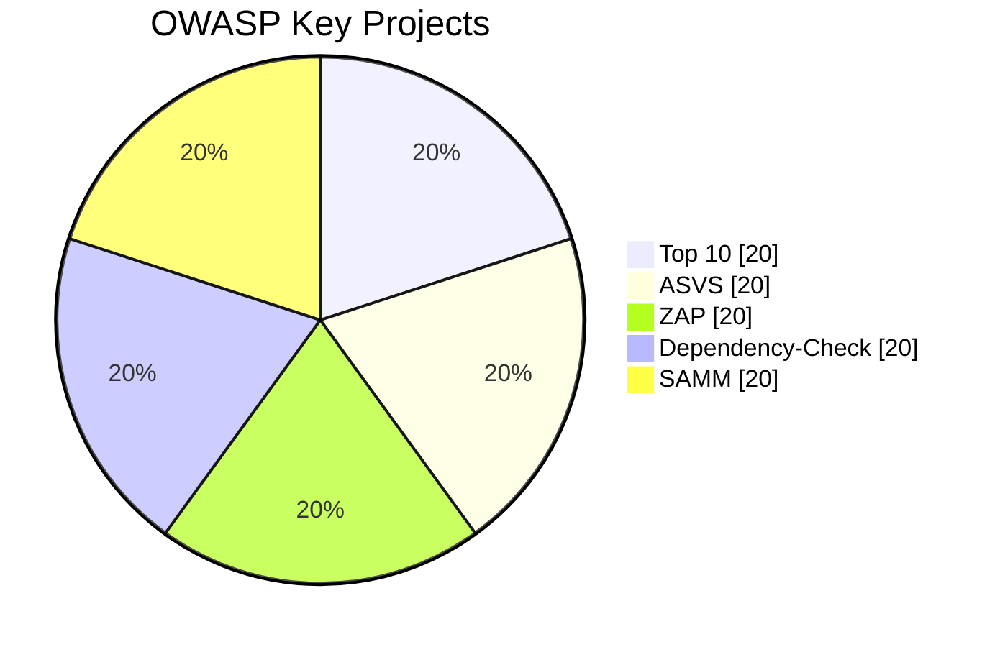

# OWASP Security Practices in DevOps


## 1. OWASP คืออะไร?

OWASP (Open Web Application Security Project) เป็นองค์กรไม่แสวงหาผลกำไรที่มุ่งเน้นการเพิ่มความปลอดภัยของซอฟต์แวร์ ก่อตั้งเมื่อปี 2001 เพื่อเผยแพร่แนวทางป้องกันช่องโหว่ต่าง ๆ ที่เกิดขึ้นในเว็บแอปพลิเคชัน โดยให้ความสำคัญกับการทำงานร่วมกับชุมชนและผู้เชี่ยวชาญทั่วโลก

### หลักการสำคัญของ OWASP
- **Open & Transparent**: ข้อมูลและเครื่องมือเผยแพร่ฟรี
- **Community-Driven**: พัฒนาโดยอาสาสมัครจากทั่วโลก
- **Vendor Neutral**: ไม่สนับสนุนผลิตภัณฑ์ทางการค้าใดเป็นพิเศษ
- **Goal-Oriented**: มุ่งแก้ปัญหาด้านความปลอดภัยของแอปพลิเคชัน

## 2. ความสำคัญของ OWASP ใน DevOps

- **Continuous Security**: การผสานแนวคิด Security เข้าไปในทุกขั้นตอนของ DevOps (DevSecOps)
- **Quick Feedback Loop**: ตรวจสอบช่องโหว่อย่างต่อเนื่องด้วยเครื่องมืออัตโนมัติ
- **Early Issue Detection**: แก้ไขปัญหาความปลอดภัยก่อนขึ้น Production

### การผสานแนวคิด DevSecOps อย่างมีประสิทธิภาพ
- **Threat Modeling**: พิจารณารูปแบบการโจมตีและความเสี่ยงตั้งแต่การออกแบบระบบ
- **Secure SDLC**: ฝึกฝนทีมพัฒนาให้คำนึงถึงความปลอดภัยตลอดวงจรการพัฒนา
- **Security Automation**: นำเครื่องมือ Automated Scanning เข้ามาเป็นส่วนหนึ่งของ CI/CD เพื่อลดภาระการตรวจสอบด้วยมนุษย์
- **Continuous Monitoring**: ติดตามสถานะความปลอดภัยระบบอยู่เสมอ เช่น การตั้งค่า SIEM (Security Information & Event Management)

## 3. ภาพรวมโครงการสำคัญของ OWASP



1. **OWASP Top 10** 
   - เน้นทำความเข้าใจ Unvalidated Input, Injection, และ Access Control
   - ผสานการ Scan อัตโนมัติบ่อยครั้งเพื่อจับ Error และ Risk เหล่านี้ได้ทัน
2. **ASVS (Application Security Verification Standard)** 
   - มั่นใจว่าแอปพลิเคชันผ่านการตรวจสอบความปลอดภัยตามระดับต่างๆ (1, 2, 3)
   - เหมาะกับการประยุกต์ใช้ในขั้น CI/CD
3. **Zed Attack Proxy (ZAP)** 
   - ใช้ทดสอบการโจมตีเชิงรุก (Active Scanning)
   - แทรกรายการทดสอบทั้ง Manual และ Automatic เพื่อให้ได้ผลลัพธ์รวม
4. **Dependency-Check** 
   - ระบุไลบรารีที่มีช่องโหว่ในระบบ
   - แนะนำให้รันทุกครั้งก่อน Deploy เพื่อลดความเสี่ยง
5. **SAMM (Software Assurance Maturity Model)** 
   - ให้เฟรมเวิร์คประเมินระดับความปลอดภัยขององค์กร
   - ส่งเสริมการปรับปรุงกระบวนการอย่างต่อเนื่อง

## 4. แนวทางการป้องกันใน DevOps

- **Shift Left**: ผสานการทดสอบความปลอดภัยตั้งแต่ขั้นตอนการพัฒนา
- **Automation**: ใช้เครื่องมืออัตโนมัติ เช่น OWASP Dependency-Check เพื่อหาช่องโหว่
- **Code Review & Static Analysis**: ควบคุมคุณภาพโค้ดและลดความเสี่ยง
- **Protected Secrets**: จัดการข้อมูลลับ (API Keys, Credentials) อย่างปลอดภัย
- **Container Security**: สแกนและอัปเดต Images อย่างสม่ำเสมอ
- **Threat Modeling Workshop**: จัดฝึกอบรมหรือ Workshop เพื่อระบุจุดเสี่ยง
- **Infrastructure as Code (IaC) Security**: สแกนไฟล์ Terraform หรือ Ansible สำหรับ Misconfiguration
- **Runtime Security**: ใช้ Container หรือ Pod Security Policy จัดการความปลอดภัยหลังการ Deploy
- **Zero Trust**: ลดขอบเขตสิทธิให้เหตุการณ์ผิดปกติสร้างความเสียหายน้อยที่สุด

### ตัวอย่าง Use Case

ในกรณีนี้ เราอาจกำหนดขั้นตอนในไฟล์ CI เช่น GitLab CI หรือ GitHub Actions ให้รัน ZAP หลังจาก Build เสร็จ
หากตรวจพบช่องโหว่ที่มีความรุนแรงในระดับเกินกำหนด Pipeline จะหยุดการ Deploy โดยอัตโนมัติ

```yaml
# Example GitLab CI configuration for OWASP ZAP
stages:
  - build
  - test
  - deploy

build:
  stage: build
  script:
    - echo "Building the application..."
    - # Add your build commands here

zap_scan:
  stage: test
  image: owasp/zap2docker-stable
  script:
    - echo "Running OWASP ZAP scan..."
    - zap-baseline.py -t http://your-application-url -r zap_report.html
  artifacts:
    paths:
      - zap_report.html
  allow_failure: true

deploy:
  stage: deploy
  script:
    - echo "Deploying the application..."
    - # Add your deploy commands here
  only:
    - master
```

## 5. แหล่งข้อมูลศึกษาเพิ่มเติม

- [OWASP Official](https://owasp.org/)
- [OWASP Top 10](https://owasp.org/www-project-top-ten/)
- [OWASP ZAP](https://owasp.org/www-project-zap/)
- [Container Security](https://owasp.org/www-project-container-security/)
- [DevSecOps Guideline](https://owasp.org/www-project-devsecops-guideline/)
