# GitOps Workshop

## 📑 สารบัญ

- [1. Overview of GitOps](#-1-overview-of-gitops)
- [2. Core Principles of GitOps](#-2-core-principles-of-gitops)
- [3. History and Evolution of GitOps](#-3-history-and-evolution-of-gitops)
- [4. Benefits of GitOps](#-4-benefits-of-gitops)
- [5. GitOps Tools and Platforms](#-5-gitops-tools-and-platforms)
- [6. Implementing GitOps Workflows](#-6-implementing-gitops-workflows)
- [7. GitOps Best Practices](#-7-gitops-best-practices)
- [8. GitOps vs. Traditional Deployment Methods](#-8-gitops-vs-traditional-deployment-methods)
- [9. Real-world GitOps Examples](#-9-real-world-gitops-examples)
- [10. Getting Started with GitOps](#-10-getting-started-with-gitops)

## 🔹 1. Overview of GitOps

GitOps คือแนวทางดำเนินงานด้าน DevOps ที่ใช้ Git เป็นแหล่งข้อมูลที่เชื่อถือได้เพียงแหล่งเดียว (single source of truth) สำหรับโครงสร้างพื้นฐานและแอปพลิเคชัน ในแบบจำลองนี้ทุกการเปลี่ยนแปลงที่ต้องการในระบบ (infrastructure, configuration, application) จะถูกประกาศไว้ใน Git repository และระบบอัตโนมัติจะนำการเปลี่ยนแปลงเหล่านี้ไปใช้กับสภาพแวดล้อมเป้าหมาย

### GitOps Workflow พื้นฐาน

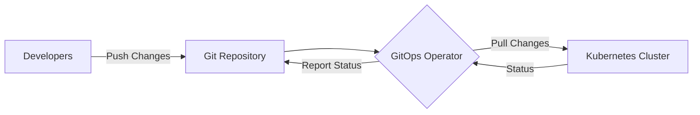

### องค์ประกอบหลักของ GitOps

1. **Declarative Configuration**: ระบบทั้งหมดถูกประกาศในรูปแบบที่อ่านได้จาก Configuration files
2. **Version Controlled**: ทุกการเปลี่ยนแปลงถูกเก็บไว้ใน Git repository
3. **Automated Delivery**: การเปลี่ยนแปลงได้รับการตรวจจับและปรับใช้โดยอัตโนมัติ
4. **Software Agents**: เครื่องมืออัตโนมัติคอยตรวจสอบและปรับสถานะจริงให้ตรงกับสถานะที่ต้องการ

## 🔹 2. Core Principles of GitOps

GitOps มีหลักการสำคัญ 4 ประการที่ถูกนิยามโดย WeaveWorks (ผู้บุกเบิกแนวคิด GitOps):

### 1. การประกาศระบบ (Declarative)

ระบบทั้งหมดต้องประกาศไว้ในรูปแบบที่อ่านได้จาก configuration files:
- ไม่ใช้ imperative scripts ที่บอกว่า "ทำอย่างไร"
- ใช้ declarative configurations ที่บอกว่า "ต้องการอะไร"
- รองรับการสร้างระบบใหม่จากเริ่มต้นใหม่หากเกิดความเสียหาย

```yaml
# ตัวอย่าง Kubernetes Manifest (Declarative)
apiVersion: apps/v1
kind: Deployment
metadata:
  name: my-app
spec:
  replicas: 3
  selector:
    matchLabels:
      app: my-app
  template:
    metadata:
      labels:
        app: my-app
    spec:
      containers:
      - name: my-app
        image: myapp:1.0.0
        ports:
        - containerPort: 8080
```

### 2. การเวอร์ชันและระบบคงสถานะ (Versioned and Immutable)

- ทุกการเปลี่ยนแปลงในสภาพแวดล้อมถูกเวอร์ชันใน Git
- สถานะของระบบถูกเก็บไว้ในลักษณะ immutable (ไม่เปลี่ยนแปลง)
- สามารถ rollback ไปยังเวอร์ชันก่อนหน้าได้อย่างสมบูรณ์
- ประวัติการเปลี่ยนแปลงทั้งหมดถูกบันทึกและตรวจสอบได้

### 3. การดึงโดยอัตโนมัติ (Automatically Pulled)

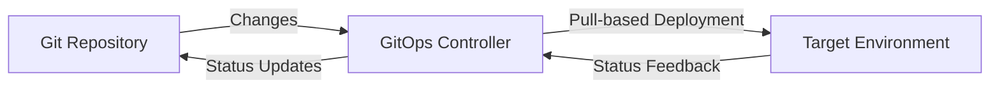

- ใช้ Pull-based model แทน Push-based
- ตัวควบคุม GitOps ทำงานภายในคลัสเตอร์เพื่อดึงการเปลี่ยนแปลงจาก Git
- ไม่ต้องเปิด inbound connections ไปยังคลัสเตอร์
- เพิ่มความปลอดภัยโดยไม่ต้องเปิดเผย credentials ภายนอกคลัสเตอร์

### 4. การปรับสมดุลต่อเนื่อง (Continuous Reconciliation)

- ตัวควบคุม GitOps ตรวจสอบความแตกต่างระหว่างสถานะที่ประกาศไว้กับสถานะจริง
- ทำการปรับสมดุลโดยอัตโนมัติเมื่อตรวจพบความแตกต่าง
- แจ้งเตือนเมื่อการปรับสมดุลล้มเหลว
- สร้าง self-healing infrastructure

## 🔹 3. History and Evolution of GitOps

### ความเป็นมาของ GitOps

GitOps ถูกนำเสนอครั้งแรกในปี 2017 โดย Alexis Richardson จาก Weaveworks บนพื้นฐานของหลักการต่างๆ ที่มีอยู่แล้วในวงการ DevOps แต่รวมเข้าด้วยกันและปรับให้เหมาะกับยุค Cloud Native:

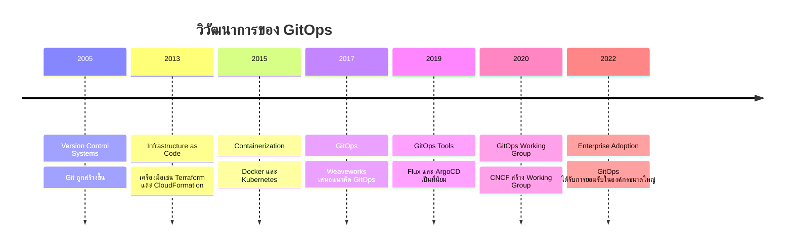

### อิทธิพลหลักที่ส่งผลต่อการพัฒนา GitOps

1. **DevOps Movement**: การรวมกันของทีม Development และ Operations
2. **Infrastructure as Code (IaC)**: การจัดการโครงสร้างพื้นฐานด้วยโค้ด
3. **Immutable Infrastructure**: การสร้างโครงสร้างพื้นฐานใหม่แทนการปรับปรุงของเดิม
4. **Kubernetes**: แพลตฟอร์มที่เน้นการประกาศ configuration
5. **Continuous Delivery**: การส่งมอบซอฟต์แวร์อย่างต่อเนื่อง

### การเติบโตของ GitOps Ecosystem

- 2018: Weaveworks เปิดตัว Flux CD เป็นเครื่องมือ GitOps สำหรับ Kubernetes
- 2019: Intuit เปิดตัว ArgoCD เป็นอีกทางเลือกสำหรับการทำ GitOps
- 2020: Cloud Native Computing Foundation (CNCF) จัดตั้ง GitOps Working Group
- 2021: Flux เข้าสู่ CNCF Incubator Project
- 2022: Emergence of GitOps platforms ที่รวมหลายเครื่องมือเข้าด้วยกัน

## 🔹 4. Benefits of GitOps

### ประโยชน์สำคัญของการนำ GitOps มาใช้

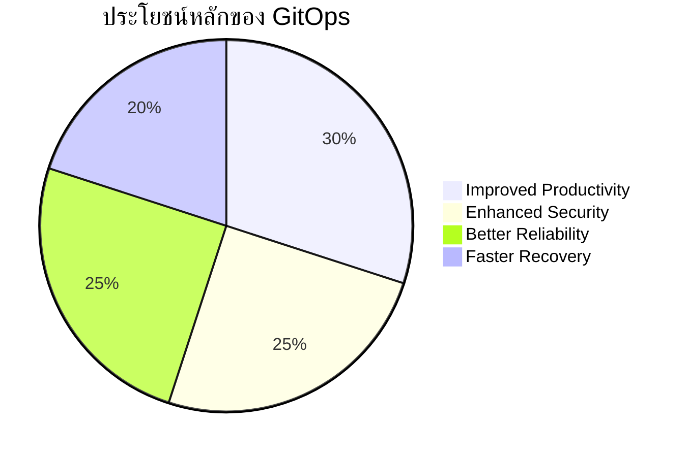

#### 1. การเพิ่มประสิทธิภาพในการทำงาน (Improved Productivity)

- **Standardized Workflows**: กระบวนการทำงานเป็นมาตรฐานสำหรับทั้งทีม Dev และ Ops
- **Self-service Platforms**: ทีมพัฒนาสามารถ deploy ได้โดยไม่ต้องพึ่ง Ops
- **Reduced Context Switching**: ทำงานผ่าน Git ซึ่งเป็นเครื่องมือที่นักพัฒนาคุ้นเคย
- **Faster Feedback Loops**: ทราบผลการ deploy ได้เร็วขึ้น

#### 2. การปรับปรุงความปลอดภัย (Enhanced Security)

- **Reduced Attack Surface**: ไม่มี CI/CD tools ที่มีสิทธิ์เขียนโดยตรงในคลัสเตอร์
- **Auditability**: ทุกการเปลี่ยนแปลงถูกบันทึกใน Git
- **Role-based Control**: ใช้ระบบอนุญาตของ Git ในการควบคุมการเปลี่ยนแปลง
- **No Credential Sharing**: ไม่จำเป็นต้องแชร์ credentials ไปยังระบบภายนอก

#### 3. ความน่าเชื่อถือที่เพิ่มขึ้น (Better Reliability)

- **Drift Detection**: ตรวจจับและแก้ไขความแตกต่างระหว่างสิ่งที่ต้องการและสถานะจริง
- **Reproducible States**: สามารถสร้างสภาพแวดล้อมซ้ำได้อย่างแม่นยำ
- **Self-healing Systems**: คลัสเตอร์สามารถซ่อมแซมตัวเองให้ตรงตามสถานะที่ต้องการ
- **Consistent Environments**: สภาพแวดล้อมการพัฒนาและการผลิตเหมือนกัน

#### 4. การกู้คืนระบบที่รวดเร็วขึ้น (Faster Recovery)

- **MTTR Reduction**: ลดเวลาเฉลี่ยในการกู้คืนระบบ
- **Easy Rollbacks**: ย้อนกลับไปยังสถานะที่เสถียรก่อนหน้าได้อย่างง่ายดาย
- **Disaster Recovery**: สร้างสภาพแวดล้อมใหม่จากศูนย์ด้วย Git repository
- **Complete Change History**: ประวัติการเปลี่ยนแปลงแบบ complete ช่วยในการแก้ปัญหา

### ตัวอย่างการลดเวลาการทำงาน

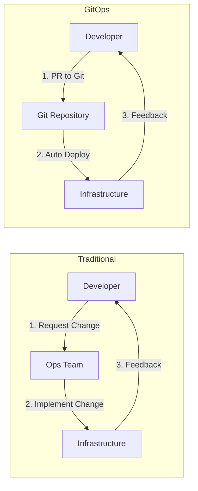

จากการศึกษาพบว่าทีมที่ใช้ GitOps สามารถลดเวลาในการ deploy รวมถึงการแก้ไขปัญหาลงได้มากกว่า 80% เมื่อเทียบกับวิธีการแบบดั้งเดิม

## 🔹 5. GitOps Tools and Platforms

การนำ GitOps มาใช้ต้องอาศัยเครื่องมือเฉพาะสำหรับการติดตามการเปลี่ยนแปลงและการปรับสมดุล สภาพแวดล้อม เครื่องมือยอดนิยมมีดังนี้:

### Flux CD

Flux เป็น tool ตัวแรกที่ถูกสร้างขึ้นเฉพาะสำหรับ GitOps โดย Weaveworks

```yaml
# ตัวอย่าง Flux configuration
apiVersion: source.toolkit.fluxcd.io/v1beta1
kind: GitRepository
metadata:
  name: podinfo
  namespace: default
spec:
  interval: 1m
  url: https://github.com/stefanprodan/podinfo
  ref:
    branch: master
---
apiVersion: kustomize.toolkit.fluxcd.io/v1beta1
kind: Kustomization
metadata:
  name: podinfo
  namespace: default
spec:
  interval: 10m
  path: "./kustomize"
  sourceRef:
    kind: GitRepository
    name: podinfo
  prune: true
```

**คุณสมบัติเด่น**:
- Open source และเป็นส่วนหนึ่งของ CNCF
- Multi-tenancy support
- ทำงานเป็น Kubernetes operator
- รองรับ Helm, Kustomize และ plain manifests
- Progressive delivery ด้วย Flagger

### ArgoCD

ArgoCD เป็นเครื่องมือ GitOps ที่ได้รับความนิยมอย่างมาก โดยเฉพาะจากความสามารถในการ visualization

```yaml
# ตัวอย่าง ArgoCD Application
apiVersion: argoproj.io/v1alpha1
kind: Application
metadata:
  name: guestbook
  namespace: argocd
spec:
  project: default
  source:
    repoURL: https://github.com/argoproj/argocd-example-apps.git
    targetRevision: HEAD
    path: guestbook
  destination:
    server: https://kubernetes.default.svc
    namespace: guestbook
  syncPolicy:
    automated:
      prune: true
      selfHeal: true
```

**คุณสมบัติเด่น**:
- UI ที่ใช้งานง่ายและแสดงผลดี
- RBAC สำหรับการจัดการสิทธิ์การเข้าถึง
- SSO Integration
- Application Health assessment
- รองรับ Multi-cluster deployments
- Webhook integration

### เครื่องมือ GitOps อื่นๆ

1. **Jenkins X**: Platform CI/CD บน Kubernetes ที่เน้น GitOps
2. **Rancher Fleet**: เครื่องมือจัดการ Kubernetes clusters รองรับ GitOps
3. **Weave GitOps**: ชุดเครื่องมือจาก Weaveworks รองรับ enterprise features
4. **Terraform Cloud**: แม้จะไม่ใช่เครื่องมือ GitOps โดยตรง แต่สามารถใช้ในลักษณะ GitOps ได้
5. **OpenShift GitOps**: GitOps เวอร์ชันของ Red Hat บน OpenShift

### การเปรียบเทียบเครื่องมือ GitOps ยอดนิยม

| เครื่องมือ | UI Dashboard | Helm Support | Multi-cluster | RBAC | SSO | Auto-sync |
|-----------|:-----------:|:------------:|:-------------:|:----:|:---:|:---------:|
| Flux v2   |   ✅ (Add-on) |      ✅      |      ✅       |  ✅  |  ✅  |    ✅     |
| ArgoCD    |      ✅      |      ✅      |      ✅       |  ✅  |  ✅  |    ✅     |
| Jenkins X |      ✅      |      ✅      |      ⚠️       |  ✅  |  ✅  |    ✅     |
| Fleet     |      ✅      |      ✅      |      ✅       |  ✅  |  ✅  |    ✅     |

## 🔹 6. Implementing GitOps Workflows

การนำ GitOps มาใช้งานจริงมีหลายรูปแบบขึ้นอยู่กับความต้องการและขนาดองค์กร ต่อไปนี้คือ workflow ที่ใช้งานได้จริง:

### แบบพื้นฐาน: Single Environment Workflow

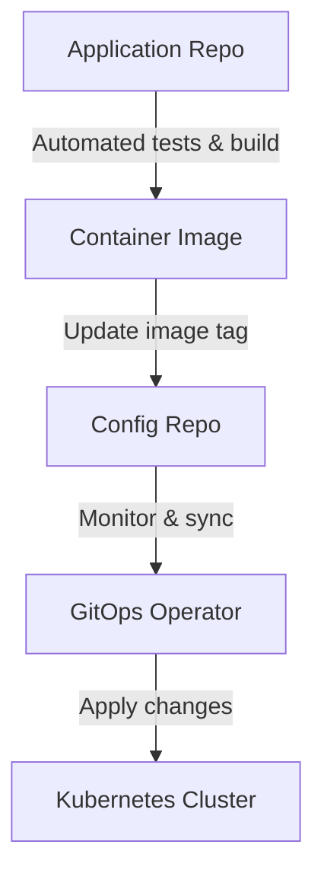

1. **นักพัฒนาสร้างการเปลี่ยนแปลง**:
   - Push โค้ดการพัฒนาไปยัง Application Repository
   - CI pipeline ทดสอบและสร้าง container image

2. **อัปเดต Configuration Repository**:
   - CI pipeline อัปเดต image tag ใน Configuration Repository
   - PR ถูกสร้างและรีวิวโดยอัตโนมัติ

3. **GitOps Operator ทำงาน**:
   - ตรวจพบการเปลี่ยนแปลงใน Configuration Repository
   - ปรับสถานะในคลัสเตอร์ให้ตรงกับ configuration

### แบบซับซ้อน: Multi-Environment Workflow

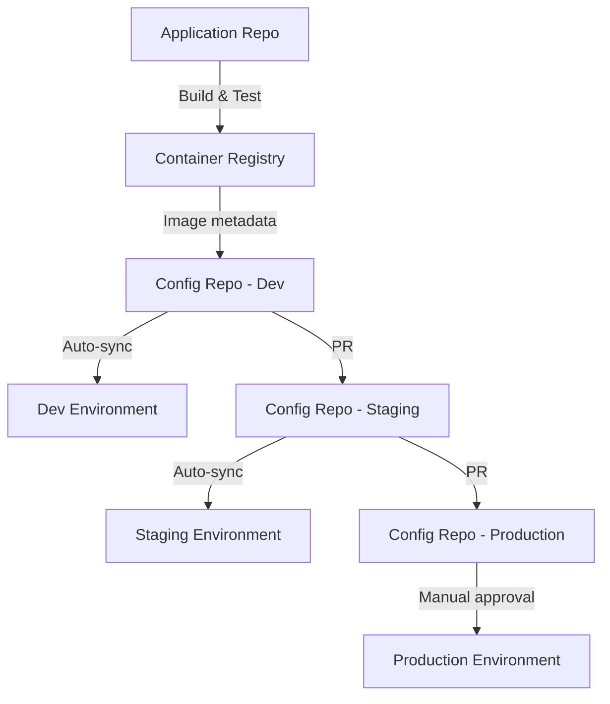

1. **นักพัฒนาแก้ไขโค้ด**:
   - Push โค้ดไปยัง application repository
   - CI สร้าง container image และอัปโหลดไปยัง registry

2. **Promotion อัตโนมัติไปยังสภาพแวดล้อม Dev**:
   - CI อัปเดต image tag ใน Configuration Repository สำหรับ Dev
   - GitOps operator sync การเปลี่ยนแปลงไปยัง Dev environment

3. **Promotion ไปยังสภาพแวดล้อม Staging**:
   - หลังจากทดสอบผ่านใน Dev, PR ถูกสร้างเพื่อปรับปรุง Staging configuration
   - เมื่อ PR ได้รับการอนุมัติ, GitOps operator ปรับปรุง Staging environment

4. **Promotion ไปยังสภาพแวดล้อม Production**:
   - หลังจากทดสอบผ่านใน Staging, PR ถูกสร้างเพื่อปรับปรุง Production configuration
   - ต้องมีการอนุมัติโดย Production team ก่อนการ merge
   - GitOps operator ปรับปรุง Production environment

### การเริ่มต้นใช้งาน ArgoCD

ขั้นตอนพื้นฐานในการติดตั้ง ArgoCD:

1. **ติดตั้ง ArgoCD ในคลัสเตอร์**:
   ```bash
   kubectl create namespace argocd
   kubectl apply -n argocd -f https://raw.githubusercontent.com/argoproj/argo-cd/stable/manifests/install.yaml
   ```

2. **เข้าถึง ArgoCD UI**:
   ```bash
   # Port forwarding
   kubectl port-forward svc/argocd-server -n argocd 8080:443
   ```

3. **รับ admin password**:
   ```bash
   kubectl -n argocd get secret argocd-initial-admin-secret -o jsonpath="{.data.password}" | base64 -d
   ```

4. **สร้าง Application**:
   ```yaml
   apiVersion: argoproj.io/v1alpha1
   kind: Application
   metadata:
     name: my-app
     namespace: argocd
   spec:
     project: default
     source:
       repoURL: https://github.com/my-org/my-config-repo.git
       targetRevision: HEAD
       path: apps/my-app
     destination:
       server: https://kubernetes.default.svc
       namespace: my-app
     syncPolicy:
       automated:
         prune: true
         selfHeal: true
```

### การเริ่มต้นใช้งาน Flux

ขั้นตอนพื้นฐานในการติดตั้ง Flux v2:

1. **ติดตั้ง Flux CLI**:
   ```bash
   curl -s https://fluxcd.io/install.sh | sudo bash
   ```

2. **ตรวจสอบสภาพแวดล้อม**:
   ```bash
   flux check --pre
   ```

3. **ติดตั้ง Flux controllers**:
   ```bash
   flux bootstrap github \
     --owner=my-github-username \
     --repository=my-fleet-infra \
     --path=clusters/my-cluster \
     --personal
   ```

4. **เพิ่ม Application**:
   ```bash
   flux create source git my-app \
     --url=https://github.com/my-org/my-app \
     --branch=main

   flux create kustomization my-app \
     --source=my-app \
     --path="./kustomize" \
     --prune=true \
     --interval=5m
   ```

## 🔹 7. GitOps Best Practices

การทำ GitOps ให้มีประสิทธิภาพสูงสุดควรปฏิบัติตามแนวทางเหล่านี้:

### โครงสร้าง Repository ที่เหมาะสม

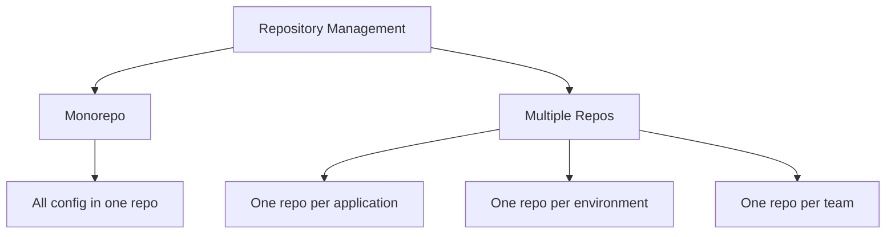

**Monorepo Approach**:
- เหมาะสำหรับทีมขนาดเล็กถึงกลาง
- มี visibility ทั้งหมดในที่เดียว
- การเปลี่ยนแปลงที่ส่งผลกระทบหลายส่วนทำได้ในคอมมิตเดียว

**Multi-repo Approach**:
- เหมาะสำหรับองค์กรขนาดใหญ่
- แบ่งตามหน้าที่, ทีม หรือแอปพลิเคชัน
- การควบคุมการเข้าถึงทำได้ละเอียดมากขึ้น

### การจัดการ Configuration

1. **แยก Application Code และ Configuration**:
   - Application Code: ลอจิกของแอปพลิเคชัน
   - Configuration: สถานะที่ต้องการของ infrastructure

2. **ใช้เครื่องมือตามความเหมาะสม**:
   - Helm: สำหรับแพ็คเกจที่ซับซ้อน
   - Kustomize: สำหรับ configuration overlays
   - Jsonnet/CUE: สำหรับ configuration ที่มีลอจิก

3. **Environment Overlays**:
   - Base configuration สำหรับทุกสภาพแวดล้อม
   - Overlay สำหรับแต่ละ environment (dev, staging, production)

### การจัดการ Secrets

1. **ไม่เก็บ Secrets ใน Git โดยตรงไม่ว่าในกรณีใดๆ**
2. **ใช้เครื่องมือเฉพาะสำหรับ secrets management**:
   - Sealed Secrets
   - HashiCorp Vault
   - AWS/GCP/Azure Key Management
   - SOPS (Secret OPerationS)
   - Bitnami Sealed Secrets

**ตัวอย่าง Sealed Secrets**:
```bash
# Encrypt a secret
kubectl create secret generic db-creds \
  --from-literal=user=admin \
  --from-literal=password=t0p-Secret \
  --dry-run=client -o yaml | \
kubeseal --format yaml > sealed-db-creds.yaml

# Apply the sealed secret
kubectl apply -f sealed-db-creds.yaml
```

### การปฏิบัติที่ดีในการใช้ GitOps

1. **ใช้ Automated Testing**:
   - ตรวจสอบ YAML syntax
   - Validate against schemas
   - Policy compliance (OPA, Kyverno)
   - Preview changes with dry-runs

2. **Implement Progressive Delivery**:
   - Canary deployments
   - Blue/Green deployments
   - A/B testing

3. **การตรวจสอบและ Monitoring**:
   - ติดตามการทำงานของ GitOps controllers
   - ติดตั้งระบบแจ้งเตือนเมื่อ sync ล้มเหลว
   - เก็บ audit logs สำหรับการเปลี่ยนแปลงทั้งหมด

4. **Backup และ Disaster Recovery**:
   - สำรองข้อมูล Git repositories
   - สำรอง cluster-state หรืออย่างน้อย state ที่ไม่ได้เก็บใน Git
   - ทดสอบกระบวนการกู้คืนอย่างสม่ำเสมอ

## 🔹 9. Real-world GitOps Examples

### Use Case: Microservices Deployment

บริษัทพัฒนาซอฟต์แวร์แห่งหนึ่งมีแอปพลิเคชันที่ประกอบด้วย microservices มากกว่า 50 ตัว และมีทีมต่างกันดูแลแต่ละส่วน การใช้ GitOps ช่วยให้:

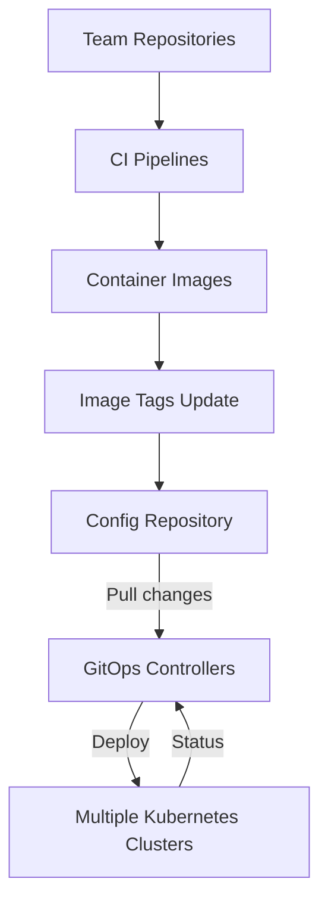

**ประโยชน์**:
- ทีมสามารถ deploy ไปยัง dev environment ด้วย PR
- ทีม platform วางกฎเกณฑ์เฉพาะใน config repository
- สามารถรันงานทั้งหมดบน Kubernetes clusters หลายตัว
- การ rollback ทำได้ง่ายด้วยการ revert commit
- เห็นสถานะของระบบปัจจุบันใน Git

### Use Case: Global Retail Company Continuous Deployment

บริษัทค้าปลีกระดับโลกรายหนึ่งที่มีร้านค้าออนไลน์และกายภาพมากกว่า 5,000 แห่งทั่วโลกได้นำ GitOps มาใช้:

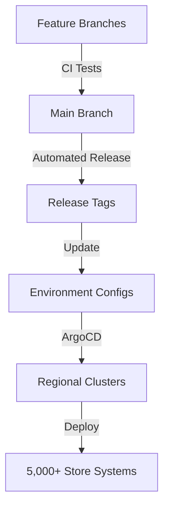

**ผลลัพธ์**:
- ลดเวลา deployment จาก 45 นาทีเหลือ 3 นาทีต่อร้าน
- ลดความเสี่ยงจากการ deploy ด้วยความสามารถในการ rollback อัตโนมัติ
- มองเห็นสถานะการ deploy ทั่วโลกแบบเรียลไทม์
- สามารถ deploy แอปพลิเคชันใหม่ไปยังร้านค้าทั่วโลกได้ภายใน 1 ชั่วโมง
- เพิ่มความเร็วในการนำ features ใหม่สู่ตลาดได้ 400%

### Use Case: Financial Services Compliance

สถาบันการเงินขนาดใหญ่ใช้ GitOps เพื่อจัดการความสอดคล้องกับข้อกำหนดด้านกฎระเบียบ:

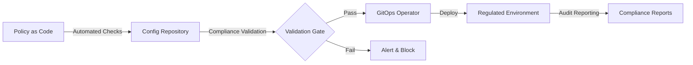

**ประโยชน์**:
- การรักษาความปลอดภัยและการตรวจสอบอัตโนมัติตามกฎระเบียบ
- สร้างรายงานการตรวจสอบอัตโนมัติเพื่อแสดงความสอดคล้องกับข้อกำหนด
- ตรวจจับและแก้ไข configuration drift ที่อาจละเมิดนโยบายความปลอดภัย
- ลดเวลาในการตรวจสอบความสอดคล้องลง 90%
- ลด human error ในกระบวนการกำกับดูแลการปฏิบัติตามกฎระเบียบ

## 🔹 10. Getting Started with GitOps

### 1. ประเมินความพร้อมและเลือกเครื่องมือ

ทำการประเมินองค์กรก่อนเริ่มต้น:

- **สภาพแวดล้อมปัจจุบัน**:
  - ใช้ Kubernetes หรือไม่?
  - มี CI/CD pipeline หรือไม่?
  - มีการใช้ IaC แล้วหรือไม่?

- **เลือกเครื่องมือที่เหมาะสม**:
  - Flux: เหมาะสำหรับทีมที่ต้องการเครื่องมือที่มี features ครบถ้วนและเป็น CNCF project
  - ArgoCD: เหมาะสำหรับทีมที่ต้องการ UI ที่ดีและความสามารถในการแสดงผล
  - Jenkins X: เหมาะสำหรับทีมที่มี Jenkins knowledge อยู่แล้ว

### 2. พัฒนา GitOps Roadmap

การเปลี่ยนไปใช้ GitOps ควรทำตาม roadmap ที่ชัดเจน:

1. **Phase 1: Discovery & Learning (1-2 เดือน)**
   - ศึกษาเครื่องมือ GitOps อย่างละเอียด
   - จัด workshops และฝึกอบรมทีม
   - สร้างโครงสร้างทีมและกำหนดบทบาทความรับผิดชอบ

2. **Phase 2: Pilot Projects (2-3 เดือน)**
   - เลือกโปรเจค non-critical สำหรับทดลอง
   - เริ่มใช้ GitOps ในสภาพแวดล้อม development
   - รวบรวมข้อเสนอแนะและปรับปรุงกระบวนการ

3. **Phase 3: Standardization & Expansion (3-6 เดือน)**
   - สร้างมาตรฐานและแนวทางปฏิบัติ
   - ขยายการใช้ GitOps ไปยังโปรเจคอื่นๆ
   - สร้าง self-service platform สำหรับทีมพัฒนา

4. **Phase 4: Enterprise Adoption (6+ เดือน)**
   - ผสานรวมกับระบบนิเวศขององค์กร
   - ปรับปรุงประสิทธิภาพและความปลอดภัย
   - วัดผลและปรับปรุงอย่างต่อเนื่อง

### 3. แนวทางการปรับใช้ในองค์กรขนาดต่างๆ

**สำหรับ Startups และทีมขนาดเล็ก**:
- เริ่มต้นด้วย ArgoCD หรือ Flux เพราะใช้งานง่าย
- ใช้ Monorepo approach สำหรับจัดการ configuration
- เน้นการทำ automation มากที่สุดเพื่อประหยัดเวลา

**สำหรับองค์กรขนาดกลาง**:
- พิจารณาทั้ง modular repositories และ monorepo ตามความเหมาะสม
- ลงทุนกับการสร้าง custom tooling เพื่อปรับให้เข้ากับ workflow
- เน้นการสร้าง self-service platform

**สำหรับองค์กรขนาดใหญ่**:
- ใช้ multi-repo approach และจัดโครงสร้างตามทีมหรือโดเมน
- พัฒนา internal platform teams สำหรับจัดการ GitOps infrastructure
- สร้าง standardized templates และ golden paths
- ลงทุนกับการฝึกอบรมและการสร้าง communities of practice

### 4. การวัดความสำเร็จของการนำ GitOps มาใช้

**Metrics ที่ควรติดตาม**:

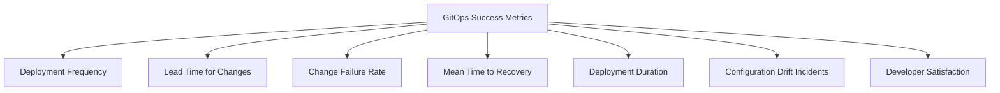

1. **Deployment Frequency**: ความถี่ในการ deploy ที่เพิ่มขึ้นแสดงถึงความคล่องตัว
2. **Lead Time for Changes**: เวลาตั้งแต่ commit จนถึง production deployment
3. **Change Failure Rate**: สัดส่วนการ deploy ที่ล้มเหลวต่อการ deploy ทั้งหมด
4. **Mean Time to Recovery**: เวลาเฉลี่ยในการแก้ไขปัญหาหลังจากเกิดความล้มเหลว
5. **Configuration Drift Incidents**: จำนวนครั้งที่ระบบออกนอกสถานะที่ต้องการ
6. **Developer Satisfaction**: ความพึงพอใจของนักพัฒนาต่อกระบวนการ deploy

### 5. แหล่งเรียนรู้เพิ่มเติมเกี่ยวกับ GitOps

- **Official Documentation**:
  - [Flux Documentation](https://fluxcd.io/docs/)
  - [ArgoCD Documentation](https://argo-cd.readthedocs.io/)
  - [CNCF GitOps Working Group](https://github.com/gitops-working-group/gitops-working-group)

- **Books**:
  - "GitOps and Kubernetes" โดย Billy Yuen, Alexander Matyushentsev, และ Todd Ekenstam
  - "Kubernetes Operators" โดย Jason Dobies และ Joshua Wood

- **Online Courses**:
  - Weaveworks GitOps Certification Program
  - CNCF GitOps Fundamentals course
  - KodeKloud GitOps with ArgoCD

- **Community Events**:
  - GitOpsCon (part of KubeCon)
  - GitOps Days
  - Local Kubernetes และ Cloud Native meetups

### สรุป

GitOps เป็นแนวทางที่มีประสิทธิภาพในการจัดการโครงสร้างพื้นฐานและแอปพลิเคชันโดยใช้ Git เป็นศูนย์กลาง การนำ GitOps มาใช้อาจต้องใช้เวลาและความพยายาม แต่ผลตอบแทนในด้านความเร็ว ความน่าเชื่อถือ และความปลอดภัยมีค่าคุ้มกับการลงทุน องค์กรที่ประสบความสำเร็จในการนำ GitOps มาใช้ไม่เพียงแต่ลงทุนในเทคโนโลยีเท่านั้น แต่ยังเน้นที่การปรับเปลี่ยนวัฒนธรรม การพัฒนาทักษะของทีม และการสร้างกระบวนการทำงานที่มีประสิทธิภาพและยั่งยืน
