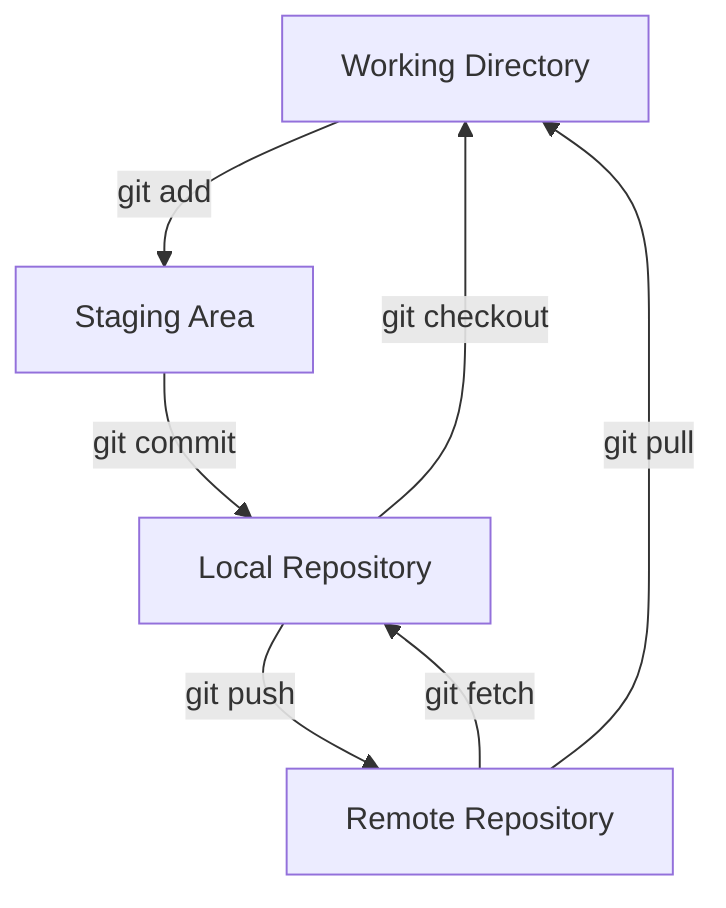
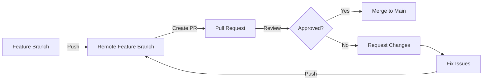
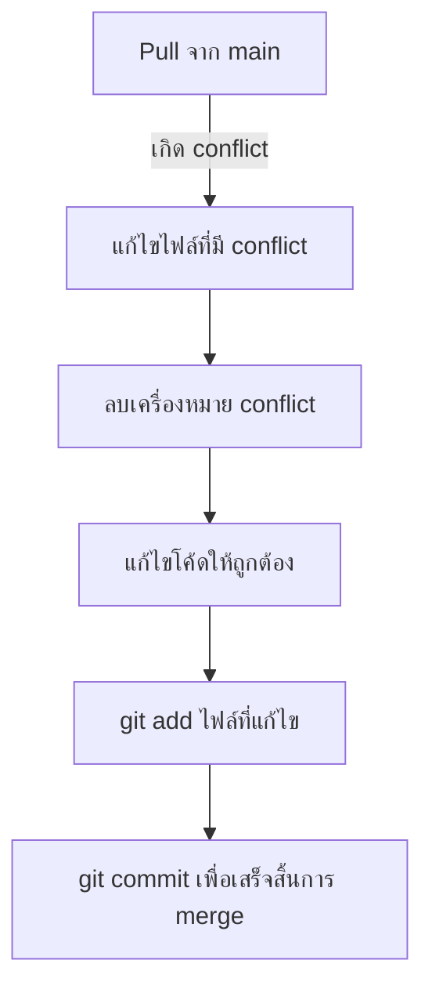

# Git Tutorial: จาก Local Environment สู่การ Push โค้ด 🚀

## 📑 สารบัญ
[Git คืออะไร?](#1-git-คืออะไร) \
[การติดตั้ง](#2-การติดตั้ง) \
[การตั้งค่าพื้นฐาน](#3-การตั้งค่าพื้นฐาน) \
[การสร้าง Repository](#4-การสร้าง-repository) \
[การ Staging และ Commit](#5-การ-staging-และ-commit) \
[การเชื่อมต่อกับ Remote Repository (GitHub)](#6-การเชื่อมต่อกับ-remote-repository-github) \
[การ Push โค้ดของคุณ](#7-การ-push-โค้ดของคุณ) \
[การ Branching ขั้นพื้นฐาน](#8-การ-branching-ขั้นพื้นฐาน) \
[การ Pull และ Merge](#9-การ-pull-และ-merge) \
[การแก้ไขข้อผิดพลาด](#10-การแก้ไขข้อผิดพลาด) \
[การทำ Pull Request](#11-การทำ-pull-request) \
[การแก้ไข Conflict](#12-การแก้ไข-conflict)

---

## 1. Git คืออะไร?
Git คือระบบควบคุมเวอร์ชันแบบกระจาย (Distributed Version Control System) ที่ช่วยให้คุณติดตามการเปลี่ยนแปลงของไฟล์, ย้อนกลับไปยังเวอร์ชันที่ต้องการ, เปรียบเทียบการเปลี่ยนแปลงในช่วงเวลาต่างๆ, และทำงานร่วมกับผู้อื่นได้อย่างมีประสิทธิภาพ

### โครงสร้างการทำงานของ Git



**ทำไมต้องใช้ Git?**
*   **ติดตามการเปลี่ยนแปลง:** Git ช่วยให้คุณเห็นว่าไฟล์ไหนมีการเปลี่ยนแปลง, ใครเป็นคนเปลี่ยน, และเมื่อไหร่ ทำให้ง่ายต่อการตรวจสอบและแก้ไขข้อผิดพลาด
*   **ทำงานร่วมกัน:** หลายคนสามารถทำงานบนโปรเจคเดียวกันได้โดยไม่ทับซ้อนกัน Git ช่วยจัดการการรวมโค้ดจากหลายคนได้อย่างราบรื่น
*   **ย้อนกลับได้:** หากเกิดข้อผิดพลาด, คุณสามารถย้อนกลับไปยังเวอร์ชันก่อนหน้าได้ง่าย ทำให้คุณไม่ต้องกังวลกับการทดลองหรือแก้ไขโค้ด
*   **สำรองข้อมูล:** โค้ดของคุณจะถูกสำรองไว้ในหลายที่, ไม่ใช่เพียงแค่ในเครื่องของคุณ ทำให้มั่นใจได้ว่าข้อมูลของคุณจะไม่สูญหาย

## 2. การติดตั้ง
*   **Windows:** ดาวน์โหลดและติดตั้งจาก [git-scm.com](https://git-scm.com).  ทำตามขั้นตอนการติดตั้งที่แนะนำ โดยทั่วไป, คุณสามารถใช้ค่าเริ่มต้นได้
*   **macOS:**
    *   ใช้ Homebrew: `brew install git` (หากยังไม่มี Homebrew, ติดตั้งจาก [brew.sh](https://brew.sh/)). Homebrew เป็น package manager ที่ช่วยให้การติดตั้งซอฟต์แวร์บน macOS ง่ายขึ้น.
    *   ดาวน์โหลดและติดตั้งจาก [git-scm.com](https://git-scm.com/download/mac).  ทำตามขั้นตอนการติดตั้งที่แนะนำ
*   **Linux (Debian/Ubuntu):** `sudo apt update && sudo apt install git`.  คำสั่งนี้จะอัปเดต package list และติดตั้ง Git.

หลังจากติดตั้งเสร็จ, ลองตรวจสอบเวอร์ชันของ Git ใน terminal เพื่อให้แน่ใจว่าการติดตั้งสำเร็จ:

```bash
git --version
```

## 3. การตั้งค่าพื้นฐาน
เปิด terminal และตั้งค่าข้อมูลส่วนตัวของคุณ เพื่อให้ Git รู้ว่าใครเป็นคน commit โค้ด:

```bash
git config --global user.name "ชื่อของคุณ"
git config --global user.email "อีเมลของคุณ@example.com"
```

*   `--global` หมายถึงการตั้งค่านี้จะมีผลกับทุก repository ในเครื่องของคุณ

คุณยังสามารถตั้งค่า text editor ที่คุณต้องการใช้สำหรับแก้ไข commit message หรือแก้ไข conflict:

```bash
git config --global core.editor "nano"  # หรือ "vim", "code", ฯลฯ
```

*   `nano` เป็น text editor ที่ใช้งานง่ายสำหรับผู้เริ่มต้น คุณสามารถใช้ `vim` หรือ `code` (Visual Studio Code) หากคุณคุ้นเคย

## 4. การสร้าง Repository

### a. Local Repository
ไปที่ directory โปรเจคของคุณใน terminal และสร้าง Git repository ใหม่:

```bash
cd /path/to/your/project
git init
```

*   `cd` คือคำสั่งเปลี่ยน directory
*   `/path/to/your/project` คือ path ไปยัง directory โปรเจคของคุณ
*   `git init` คือคำสั่งสร้าง Git repository ใหม่

คำสั่งนี้จะสร้าง directory `.git` ที่ซ่อนอยู่, ซึ่งเป็นที่เก็บข้อมูลทั้งหมดของ Git คุณไม่ควรแก้ไขไฟล์ใน directory นี้โดยตรง

### b. Cloning a Remote Repository
หากต้องการคัดลอก repository ที่มีอยู่จาก remote source (เช่น GitHub):

```bash
git clone <repository_url>
```

*   `git clone` คือคำสั่งคัดลอก repository
*   `<repository_url>` คือ URL ของ repository ที่คุณต้องการคัดลอก

ตัวอย่าง:

```bash
git clone https://github.com/your_username/your_repository.git
```

คำสั่งนี้จะสร้าง directory ใหม่ที่มีชื่อเดียวกับ repository และดาวน์โหลดไฟล์ทั้งหมด

## 5. การ Staging และ Commit

### a. Staging Changes
เพิ่มไฟล์ไปยัง staging area โดยใช้:

```bash
git add <file1> <file2> ...
```

*   `git add` คือคำสั่งเพิ่มไฟล์ไปยัง staging area
*   `<file1> <file2> ...` คือชื่อไฟล์ที่คุณต้องการเพิ่ม

ตัวอย่าง:

```bash
git add index.html style.css script.js
```

หากต้องการเพิ่มการเปลี่ยนแปลงทั้งหมดใน directory ปัจจุบัน:

```bash
git add .
```

*   `.` หมายถึง directory ปัจจุบัน

### b. Committing Changes
Commit การเปลี่ยนแปลงที่ staged พร้อมข้อความอธิบาย:

```bash
git commit -m "Initial commit: เพิ่มโครงสร้างโปรเจคพื้นฐาน"
```

*   `git commit` คือคำสั่ง commit การเปลี่ยนแปลง
*   `-m` คือ option ที่ใช้ระบุ commit message
*   `"Initial commit: เพิ่มโครงสร้างโปรเจคพื้นฐาน"` คือ commit message

ข้อความ commit ควรชัดเจนและสั้นกระชับ, อธิบายว่าคุณได้ทำอะไรไป ตัวอย่าง commit message ที่ดี:

*   "แก้ไข: แก้ไข bug ที่ทำให้หน้าเว็บไม่แสดงผล"
*   "เพิ่ม: เพิ่ม feature ใหม่สำหรับการ login"
*   "ปรับปรุง: ปรับปรุงประสิทธิภาพของโค้ด"

## 6. การเชื่อมต่อกับ Remote Repository (GitHub)
1.  สร้าง repository บน GitHub.
2.  คัดลอก URL ของ repository (เช่น `https://github.com/ชื่อผู้ใช้ของคุณ/ชื่อ repository ของคุณ.git`).
3.  เชื่อมต่อ local repository ของคุณกับ remote repository:

```bash
git remote add origin <repository_url>
```

*   `git remote add` คือคำสั่งเพิ่ม remote repository
*   `origin` เป็น alias สำหรับ remote repository ของคุณ คุณสามารถใช้ชื่ออื่นได้ แต่ `origin` เป็นชื่อที่นิยมใช้
*   `<repository_url>` คือ URL ของ remote repository

## 7. การ Push โค้ดของคุณ
Push local commits ของคุณไปยัง remote repository:

```bash
git push -u origin main
```

*   `git push` คือคำสั่ง push โค้ดไปยัง remote repository
*   `-u` ตั้งค่า upstream branch สำหรับการ push และ pull ในอนาคต ทำให้คุณไม่ต้องระบุ branch ทุกครั้ง
*   `origin` คือ alias สำหรับ remote repository ของคุณ
*   `main` คือ branch ที่คุณกำลัง push

หากคุณ push เป็นครั้งแรก, คุณอาจต้อง login ด้วย username และ password ของ GitHub

## 8. การ Branching ขั้นพื้นฐาน
Branching ช่วยให้คุณทำงานใน feature ใหม่หรือแก้ไข bug โดยไม่กระทบกับโค้ดหลัก

สร้าง branch ใหม่:

```bash
git branch <ชื่อ branch>
```

*   `git branch` คือคำสั่งสร้าง branch ใหม่
*   `<ชื่อ branch>` คือชื่อของ branch ที่คุณต้องการสร้าง

สลับไปยัง branch ใหม่:

```bash
git checkout <ชื่อ branch>
```

*   `git checkout` คือคำสั่งสลับไปยัง branch ที่มีอยู่

หรือสร้างและสลับไปยัง branch ใหม่ในคำสั่งเดียว:

```bash
git checkout -b <ชื่อ branch>
```

*   `git checkout -b` คือคำสั่งสร้างและสลับไปยัง branch ใหม่

ตัวอย่าง:

```bash
git checkout -b feature/add-new-feature
```

*   `feature/add-new-feature` คือชื่อ branch ใหม่

## 9. การ Pull และ Merge

### a. การ Pull
ดึงข้อมูลล่าสุดจาก remote repository:

```bash
git pull origin main
```

*   `git pull` คือคำสั่งดึงข้อมูลจาก remote repository และรวมเข้ากับ local branch
*   `origin` คือ alias สำหรับ remote repository ของคุณ
*   `main` คือ branch ที่คุณต้องการดึงข้อมูล

### b. การ Merge
รวม branch หนึ่งเข้ากับอีก branch หนึ่ง:

```bash
git checkout main
git merge <ชื่อ branch>
```

*   `git checkout main` คือคำสั่งสลับไปยัง `main` branch
*   `git merge <ชื่อ branch>` คือคำสั่งรวม branch ที่ระบุเข้ากับ `main` branch

หากมี conflict, คุณจะต้องแก้ไข conflict ด้วยตนเอง Git จะแจ้งให้คุณทราบว่ามี conflict และคุณจะต้องแก้ไขไฟล์ที่มี conflict ด้วยตนเอง หลังจากแก้ไขแล้ว, คุณจะต้อง add และ commit ไฟล์เหล่านั้น

## 10. การแก้ไขข้อผิดพลาด

### a. ยกเลิกการ Staging
หากคุณเผลอ add ไฟล์ที่ไม่ต้องการ, คุณสามารถยกเลิกการ staging ได้:

```bash
git reset HEAD <ชื่อไฟล์>
```

*   `git reset HEAD` คือคำสั่งยกเลิกการ staging
*   `<ชื่อไฟล์>` คือชื่อไฟล์ที่คุณต้องการยกเลิกการ staging

### b. แก้ไข Commit Message ล่าสุด
หากคุณต้องการแก้ไข commit message ล่าสุด:

```bash
git commit --amend -m "ข้อความใหม่"
```

*   `git commit --amend` คือคำสั่งแก้ไข commit ล่าสุด
*   `-m "ข้อความใหม่"` คือ commit message ใหม่

### c. ย้อนกลับ Commit

คำสั่งนี้จะสร้าง commit ใหม่ที่ยกเลิกการเปลี่ยนแปลงของ commit ที่ระบุ ทำให้ประวัติการ commit ไม่หายไปหากคุณต้องการย้อนกลับ commit ที่ผ่านมา:

```bash
git revert <commit hash>
```

*   `git revert` คือคำสั่งย้อนกลับ commit
*   `<commit hash>` คือ hash ของ commit ที่คุณต้องการย้อนกลับ

## 11. การทำ Pull Request

Pull Request (PR) เป็นวิธีที่ช่วยให้นักพัฒนาสามารถเสนอการเปลี่ยนแปลงที่พวกเขาทำในแบรนช์ให้กับทีมก่อนที่จะรวมเข้ากับโค้ดหลัก (เช่น แบรนช์ main) PR ช่วยให้ทีมสามารถตรวจสอบโค้ด, แสดงความคิดเห็น, และอนุมัติหรือขอการเปลี่ยนแปลงเพิ่มเติม

### การสร้าง Pull Request บน GitHub

1. **Push แบรนช์ของคุณไปยัง GitHub**:

```bash
git push origin feature/your-feature-branch
```

2. **ไปที่ GitHub Repository และสร้าง Pull Request**:
   * เข้าไปที่ repository ของคุณบน GitHub
   * คลิก "Pull Requests" บนแถบด้านบน
   * คลิกปุ่ม "New pull request" (สีเขียว)
   * เลือกแบรนช์ต้นทาง (แบรนช์ที่คุณสร้าง) และแบรนช์ปลายทาง (เช่น main)
   * คลิค "Create pull request"
   * กรอกรายละเอียดเกี่ยวกับการเปลี่ยนแปลงของคุณ (หัวเรื่องและคำอธิบาย)
   * คลิก "Create pull request" อีกครั้ง

3. **กระบวนการตรวจสอบ**:
   * ทีมจะสามารถตรวจสอบโค้ดของคุณ, แสดงความคิดเห็น, และขอให้คุณทำการเปลี่ยนแปลง
   * คุณสามารถอภิปรายการเปลี่ยนแปลงได้และตอบสนองต่อความคิดเห็นโดยการแก้ไขโค้ดเพิ่มเติมและ push ไปยังแบรนช์ของคุณ



4. **หลังจากได้รับการอนุมัติ**:
   * เมื่อ PR ได้รับการอนุมัติ, คุณหรือผู้ดูแลโครงการสามารถ merge การเปลี่ยนแปลงของคุณเข้ากับแบรนช์ปลายทาง (เช่น main)
   * GitHub มีตัวเลือกการ merge หลายรูปแบบ:
     * **Create a merge commit**: สร้าง commit การรวมรวมประวัติทั้งหมดของคุณ
     * **Squash and merge**: รวม commit ทั้งหมดของคุณเป็น commit เดียว
     * **Rebase and merge**: นำ commit ของคุณไปอยู่บนแบรนช์ปลายทาง

5. **ลบแบรนช์ Feature**:
   * หลังจาก merge เสร็จ, คุณสามารถลบแบรนช์ feature ทั้งใน local และ remote ได้

```bash
# ลบแบรนช์ใน remote repository
git push origin --delete feature/your-feature-branch

# สลับกลับไปยังแบรนช์ main
git checkout main

# ดึงข้อมูลล่าสุดหลังจาก merge
git pull

# ลบแบรนช์ใน local repository
git branch -d feature/your-feature-branch
```

## 12. การแก้ไข Conflict

Conflict เกิดขึ้นเมื่อมีการเปลี่ยนแปลงเดียวกันในไฟล์เดียวกันในคนละแบรนช์ Git ไม่สามารถตัดสินใจได้ว่าควรใช้การเปลี่ยนแปลงใด จึงขอให้คุณแก้ไข conflict ด้วยตนเอง

### วิธีแก้ไข Conflict

1. **ทำให้แบรนช์ปัจจุบันอัปเดตกับ main**:

```bash
git checkout feature/your-branch
git pull origin main
```

2. **หากพบ conflict, Git จะแจ้งให้ทราบ**:

```
CONFLICT (content): Merge conflict in file.txt
Automatic merge failed; fix conflicts and then commit the result.
```

3. **เปิดไฟล์ที่มี conflict**:

ไฟล์จะมีเครื่องหมายพิเศษแสดง conflict:

```
<<<<<<< HEAD (ส่วนปัจจุบันของคุณ)
โค้ดในแบรนช์ปัจจุบันของคุณ
=======
โค้ดจากแบรนช์ที่กำลังจะ merge เข้ามา
>>>>>>> branch-name (ส่วนที่กำลังจะ merge เข้ามา)
```

4. **แก้ไข conflict**:
   * ลบเครื่องหมาย `<<<<<<<`, `=======`, และ `>>>>>>>` 
   * แก้ไขเนื้อหาตามที่คุณต้องการให้เป็นผลสุดท้าย
   * คุณอาจเลือกเก็บทั้งสองส่วน, เลือกแค่ส่วนใดส่วนหนึ่ง, หรือเขียนโค้ดใหม่ทั้งหมด



5. **แจ้งให้ Git ทราบว่าคุณแก้ไข conflict เสร็จแล้ว**:

```bash
git add <ชื่อไฟล์ที่แก้ไข>
git commit -m "แก้ไข conflict กับแบรนช์ main"
```

6. **ทำการ push แบรนช์ของคุณ**:

```bash
git push origin feature/your-branch
```

### คำแนะนำในการหลีกเลี่ยง Conflict

1. **Pull บ่อยๆ**: ดึงข้อมูลล่าสุดจากแบรนช์หลัก (main) เข้าสู่แบรนช์ของคุณบ่อยๆ
2. **แบ่งงานให้ชัดเจน**: พยายามทำงานในไฟล์ที่ต่างกันหรือในส่วนต่างกันของไฟล์เดียวกัน
3. **สื่อสารในทีม**: แจ้งให้เพื่อนร่วมทีมทราบว่าคุณกำลังทำงานกับไฟล์ใด
4. **Commit บ่อยๆ**: การ commit บ่อยๆ ช่วยให้การแก้ไข conflict ง่ายขึ้นเพราะการเปลี่ยนแปลงจะมีขนาดเล็ก