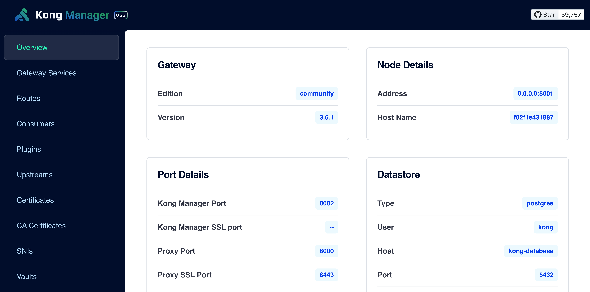

# 🐳 Kong Docker deployment
---

Kong API Gateway deployment with docker and docker-compose - The most popular open-source API Gateway built for multi-cloud and hybrid architectures.

## Overview

Kong serves as a scalable, open-source API Gateway that sits in front of your services. It offers powerful features including:

- Authentication
- Rate Limiting
- Traffic Control
- Analytics
- Plugin Extensibility
- Load Balancing
- Health Checks
- API Transformations


*Kong Docker deployment architecture overview*

## Status

This deployment is production ready.

## Change default value

Copy `default.env` to `.env`

```
cp default.env .env
```

then edit the `.env` file to change default values.

| Variable name | Default value |
|---------------|---------------|
| `POSTGRES_VERSION`    | 14-alpine |
| `POSTGRES_USER`       | kong |
| `POSTGRES_PASSWORD`   | kong |
| `POSTGRES_DB`         | kong |
| `KONG_ADMIN_LISTEN`   | 0.0.0.0:8001 |
| `KONG_PROXY_LISTEN`   | 0.0.0.0:8000, 0.0.0.0:8443 ssl http2 |
| `KONG_PG_HOST`        | kong-database |
| `KONG_PG_PASSWORD`    | kong == `env POSTGRES_PASSWORD` |
| `COMPOSE_PROJECT_NAME`| kong |
| `KONG_DATABASE`       | postgres |
| `KONG_CASSANDRA_CONTACT_POINTS` | kong-database |
| `KONG_ADMIN_GUI_LISTEN` | 0.0.0.0:8002 |
| `KONG_ADMIN_GUI_URL` | http://localhost:8002 |

## Deploy Kong

### Quick Setup

```bash
./setup.sh
```

This will execute all the necessary steps (database setup, migrations, and Kong startup) automatically.

### Manual Deployment Steps

If you prefer to run each step manually:

### Deploy kong-database

```
docker-compose up -d kong-database
```

### Run kong-database migrations

```
docker-compose run --rm kong-migrations
```

### Start Kong

```
docker-compose up -d kong
```

**Now Kong is running**

- Kong Admin API http://127.0.0.1:8001
- Kong Manager http://127.0.0.1:8002
- Kong Proxy http://127.0.0.1:8000

### Explanation of Dependency Flow
- `kong-database` is foundational because both `kong-migrations` and `kong` rely on the database to function.
- `kong-migrations` ensures the database is initialized and ready for use by Kong.
- `kong` is the last to start, as it requires the database and migrations to be fully prepared.

By setting `depends_on`, Docker Compose handles these dependencies automatically, starting the containers in the correct order as long as all services are defined in the same file and executed using `docker-compose up`. However, note that `depends_on` only checks if a container starts, not if it is fully ready, so the health checks ensure readiness.

## Architecture Overview

Kong Gateway consists of several key components:

1. **Kong Gateway**: The core proxy server that handles API requests
2. **PostgreSQL Database**: Stores Kong's configuration data
3. **Kong Manager**: Web GUI for administrative tasks
4. **Kong Admin API**: RESTful interface for configuration

## Security Considerations

- Change default passwords in production
- Use SSL/TLS for all external connections
- Implement proper network segmentation
- Regular security updates and patches
- Access control for Kong Manager and Admin API

### Upgrading Kong version

> **WARNING** : This may take some downtime to start a new Kong version.

1. Change `KONG_VERSION` in `.env` file to a newer version.

	> If running kong version 2.2 change to 2.3 (or 2.3.0). [Suggested upgrade path](https://github.com/Kong/kong/blob/master/UPGRADE.md)

2. Run migrations upgrade

	```
	docker-compose run --rm kong kong migrations up --vv
	```

3. Confirm finish migrations upgrade

	```
	docker-compose run --rm kong kong migrations finish --vv
	```
	
4. Start new Kong version

	```
	docker-compose up -d kong
	```

## Monitoring & Maintenance

### Health Checks

Monitor Kong's health using the health endpoint:
```bash
curl http://localhost:8001/status
```

### Backup & Recovery

Regular database backups are recommended:
```bash
docker exec kong-database pg_dump -U kong kong > kong_backup.sql
```

### 📚 Automation Training

- [สินค้าและบริการ](http://racksync.com)
- [เทรนนิ่งคอร์ส](https://facebook.com/racksync)

### 👥 Community

- [Home Automation Thailand](https://www.facebook.com/groups/hathailand)
- [Home Automation Marketplace](https://www.facebook.com/groups/hatmarketplace)
- [Home Automation Thailand Discord](https://discord.gg/Wc5CwnWkp4)

## 🏢 [RACKSYNC CO., LTD.](https://racksync.com)

RACKSYNC Co., Ltd. specializes in automation and smart solutions of all scales. We are experts in designing, implementing, and monitoring sophisticated automation systems. Our team of specialists provides comprehensive consulting services and technical implementation for both residential and commercial projects. Beyond automation, we offer full-cycle Software as a Service (SaaS) development, helping businesses transform their operations through custom digital solutions. With our deep expertise in IoT, home automation, and enterprise systems, we deliver reliable and innovative solutions tailored to each client's unique requirements.

📍 RACKSYNC COMPANY LIMITED    
🌏 Suratthani, Thailand 84000   
📧 Email : devops@racksync.com   
📞 Tel : +66 85 880 8885   

[](https://discord.gg/Wc5CwnWkp4) [](https://github.com/racksync) 
[](https://racksync.com)


