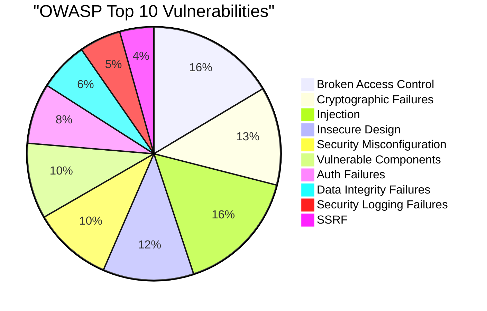

# 🛡️ การตรวจสอบความปลอดภัยด้วย SonarQube และ OWASP

| รายละเอียด | คำอธิบาย |
|----------|---------|
| **ชื่อเนื้อหา** | การตรวจสอบความปลอดภัยด้วย SonarQube และ OWASP |
| **วัตถุประสงค์** | เรียนรู้การใช้งาน SonarQube ในการตรวจสอบคุณภาพโค้ดและความปลอดภัยตามมาตรฐาน OWASP |
| **ระดับความยาก** | ปานกลาง |


## 📝 บทนำ

SonarQube เป็นเครื่องมือที่ใช้ในการวิเคราะห์คุณภาพโค้ดแบบอัตโนมัติ (Static Code Analysis) ที่ช่วยในการตรวจจับปัญหาด้านความปลอดภัย คุณภาพโค้ด และช่องโหว่ต่างๆ ในการพัฒนาซอฟต์แวร์

### สถิติช่องโหว่ OWASP Top 10 ที่พบบ่อย



### ที่มาและความสำคัญ
การพัฒนาซอฟต์แวร์ในปัจจุบันเผชิญกับความท้าทายด้านความปลอดภัยที่เพิ่มขึ้นอย่างต่อเนื่อง:
- 🔍 พบช่องโหว่ด้านความปลอดภัยเฉลี่ย 3-5 จุดต่อ 1,000 บรรทัดโค้ด
- 💰 ค่าใช้จ่ายในการแก้ไขปัญหาหลังจากระบบ Production สูงกว่าช่วงพัฒนาถึง 30 เท่า
- ⏰ การตรวจพบปัญหาเร็วในช่วงพัฒนาช่วยลดความเสี่ยงและต้นทุนได้อย่างมาก

### ทำไมต้องเลือก SonarQube?
1. **การวิเคราะห์แบบครอบคลุม**
   - ตรวจสอบได้หลายภาษาโปรแกรมมิ่ง
   - วิเคราะห์ทั้ง Security, Quality, Maintainability
   - รองรับการทำงานร่วมกับ CI/CD pipeline

2. **มาตรฐานและการรายงาน**
   - สอดคล้องกับมาตรฐาน OWASP Top 10
   - รายงานผลแบบ Real-time
   - แสดงแนวทางการแก้ไขที่ชัดเจน

3. **การใช้งานและการบำรุงรักษา**
   - ติดตั้งและใช้งานง่าย
   - มี Community Edition ที่ใช้งานฟรี
   - อัปเดตกฎความปลอดภัยสม่ำเสมอ

### ทำไมต้องใช้ SonarQube?
- ตรวจจับปัญหาความปลอดภัยตั้งแต่ขั้นตอนการพัฒนา
- ลดค่าใช้จ่ายในการแก้ไขปัญหาในภายหลัง
- สร้างมาตรฐานการเขียนโค้ดในทีม
- ติดตามคุณภาพโค้ดได้อย่างต่อเนื่อง

## 📋 กรณีศึกษา

1. [**การตรวจสอบพื้นฐาน**](./basic-scan/README.md)
   - การตั้งค่าโปรเจค
   - การตรวจสอบ Code Smells
   - การวิเคราะห์ Technical Debt

2. [**การวิเคราะห์ตาม OWASP Top 10**](./owasp-scan/README.md)
   - การตรวจสอบช่องโหว่ตาม OWASP
   - การจัดการ Security Hotspots
   - แนวทางการแก้ไขปัญหา

## 🛠️ การเตรียมความพร้อม

### ความต้องการของระบบ
- Docker และ Docker Compose
- SonarQube Community Edition หรือสูงกว่า
- Java 11 ขึ้นไป
- หน่วยความจำอย่างน้อย 4GB
- พื้นที่ว่างอย่างน้อย 5GB

### การติดตั้ง SonarQube

1. เริ่มต้น SonarQube server:
```bash
docker-compose up -d sonarqube
```

2. เข้าถึง SonarQube:
   - URL: http://localhost:9000
   - รหัสเริ่มต้น: admin/admin
   - ควรเปลี่ยนรหัสผ่านทันทีหลังเข้าใช้งานครั้งแรก

3. ติดตั้ง OWASP Plugin:
   - ไปที่ Administration > Marketplace
   - ค้นหาและติดตั้ง "OWASP Security Rules"
   - รีสตาร์ท SonarQube

## 🔍 การใช้งาน

### การสร้าง Token
1. เข้าสู่ระบบ SonarQube ด้วยบัญชี admin
2. ไปที่ User > My Account > Security
3. กรอกชื่อ token ที่ต้องการ (เช่น "project-scanner")
4. คลิก Generate และบันทึก token ไว้ (token จะแสดงเพียงครั้งเดียวเท่านั้น)

### การเตรียม Project
1. สร้าง Project ใน SonarQube:
   - ไปที่ Projects > Create Project
   - ตั้งชื่อ Project Key และ Display Name
   - เลือก "Locally" สำหรับการสแกนในเครื่อง

2. สร้างไฟล์ `sonar-project.properties` ในโปรเจค:
```properties
sonar.projectKey=my-project
sonar.projectName=My Project
sonar.sources=src
sonar.sourceEncoding=UTF-8
sonar.host.url=http://localhost:9000
sonar.login=your-token-here
# Optional configurations
sonar.tests=tests
sonar.javascript.lcov.reportPaths=coverage/lcov.info
sonar.coverage.exclusions=**/*.test.js,**/*.spec.js
```

### วิธีการสแกน

#### 1. การสแกนด้วย Docker (แนะนำ):
```bash
# สแกนโปรเจคทั้งหมด
docker run \
    --network=host \
    -v "$(pwd):/usr/src" \
    sonarsource/sonar-scanner-cli \
    -Dsonar.projectKey=my-project \
    -Dsonar.sources=. \
    -Dsonar.host.url=http://localhost:9000 \
    -Dsonar.login=your-token

# สแกนเฉพาะโฟลเดอร์
docker run \
    --network=host \
    -v "$(pwd)/src:/usr/src" \
    sonarsource/sonar-scanner-cli \
    -Dsonar.projectKey=my-project \
    -Dsonar.sources=. \
    -Dsonar.host.url=http://localhost:9000 \
    -Dsonar.login=your-token
```

#### 2. การสแกนด้วย SonarScanner CLI:
```bash
# ติดตั้ง sonar-scanner
npm install -g sonar-scanner

# รันการสแกน
sonar-scanner \
  -Dsonar.projectKey=my-project \
  -Dsonar.sources=. \
  -Dsonar.host.url=http://localhost:9000 \
  -Dsonar.login=your-token
```

### การใช้งานผ่าน VSCode Extensions

#### SonarLint Extension
1. **การติดตั้ง**
   - เปิด VSCode Extensions (Ctrl+Shift+X)
   - ค้นหา "SonarLint"
   - ติดตั้ง Extension จาก SonarSource

2. **การตั้งค่าเบื้องต้น**
   - เชื่อมต่อกับ SonarQube Server:
     - กด Ctrl+Shift+P
     - พิมพ์ "SonarLint: Connect to SonarQube"
     - ใส่ URL Server และ Token

3. **คุณสมบัติหลัก**
   - ตรวจจับปัญหาแบบ Real-time ขณะเขียนโค้ด
   - แสดง Quick Fixes สำหรับปัญหาที่พบ
   - Highlight จุดที่มีปัญหาในโค้ด
   - แสดงรายละเอียดของ Security Hotspots

4. **คำสั่งที่ใช้บ่อย**
   - `Ctrl+Shift+P` > "SonarLint: Show All Issues"
   - `Ctrl+Shift+P` > "SonarLint: Update All Bindings"
   - คลิกขวาที่ไฟล์ > "Analyze with SonarLint"

5. **การตั้งค่าเพิ่มเติม**
```json
{
    "sonarlint.connectedMode.project": {
        "projectKey": "my-project"
    },
    "sonarlint.rules": {
        "javascript:S1441": {
            "level": "off"
        }
    }
}
```

#### แนวทางการใช้งานที่แนะนำ
- ใช้ร่วมกับ Git extension เพื่อตรวจสอบโค้ดก่อน commit
- เปิดใช้งาน Auto-fix เมื่อบันทึกไฟล์
- ตั้งค่า rules ให้สอดคล้องกับ Quality Gate ของทีม
- ใช้ Workspace Trust เพื่อความปลอดภัย

### การตั้งค่าพิเศษ
```bash
# การกำหนดภาษา
-Dsonar.language=javascript

# การกำหนด test coverage
-Dsonar.javascript.lcov.reportPaths=coverage/lcov.info

# การกำหนดไฟล์ที่ต้องการข้าม
-Dsonar.exclusions=node_modules/**/*,**/*.spec.ts

# การกำหนด branch
-Dsonar.branch.name=feature/new-scan
```

### ข้อควรระวัง
- เก็บ token ไว้ในที่ปลอดภัย ไม่ควรเผยแพร่สู่สาธารณะ
- ตรวจสอบสิทธิ์การเข้าถึงของ token
- ควรใช้ Environment Variables สำหรับ token ใน CI/CD
- สำรองข้อมูลก่อนรันการสแกนครั้งแรก

## 📊 การวิเคราะห์ผล

### ตัวชี้วัดด้านความปลอดภัย
1. **Vulnerabilities (ช่องโหว่)**
   - Critical: ต้องแก้ไขทันที
   - High: ควรแก้ไขโดยเร็ว
   - Medium: ควรวางแผนแก้ไข
   - Low: พิจารณาตามความเหมาะสม

2. **Security Hotspots**
   - จุดที่ต้องตรวจสอบเพิ่มเติม
   - แนวทางการแก้ไขที่แนะนำ
   - ตัวอย่างการแก้ไขที่ถูกต้อง

3. **Security Review Rating**
   - A: ไม่พบปัญหาสำคัญ
   - B: พบปัญหาเล็กน้อย
   - C: พบปัญหาที่ควรแก้ไข
   - D: พบปัญหาสำคัญ
   - E: พบปัญหาวิกฤติ

## 🎯 เกณฑ์คุณภาพ (Quality Gates)

### เกณฑ์มาตรฐาน
- ไม่มีช่องโหว่ระดับวิกฤติ
- ช่องโหว่ระดับสูงน้อยกว่า 3 รายการ
- Security Review Rating ต้องได้เกรด B ขึ้นไป
- Code Coverage มากกว่า 80%

## 📚 แหล่งอ้างอิงเพิ่มเติม

- [SonarQube Documentation](https://docs.sonarqube.org/)
- [OWASP Top 10](https://owasp.org/www-project-top-ten/)
- [SonarQube Security Rules](https://rules.sonarsource.com/java/type/Security/)
- [Security Hardening Guide](https://docs.sonarqube.org/latest/instance-administration/security/)

## 🤝 การสนับสนุน

หากพบปัญหาหรือต้องการความช่วยเหลือ:
- เปิด Issue ใน GitHub Repository
- ติดต่อทีม DevOps
- ดู Documentation เพิ่มเติม

## 📝 หมายเหตุ

การตั้งค่าและคำแนะนำในเอกสารนี้เป็นเพียงแนวทางพื้นฐาน ควรปรับแต่งตามความต้องการและบริบทของโปรเจคของคุณ

ขอให้โค้ดปลอดภัย! 🚀
