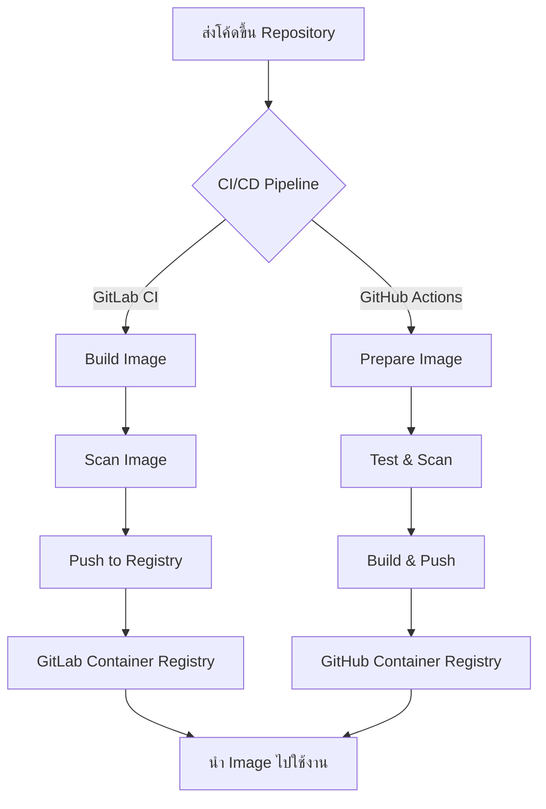
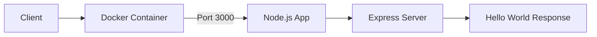

# Docker Registry Workshop Demo

## 📝 ภาพรวมโปรเจกต์

โปรเจกต์นี้เป็นตัวอย่างการใช้งาน Docker Registry สำหรับเวิร์คช็อป DevOps ซึ่งประกอบด้วยแอปพลิเคชัน Node.js อย่างง่าย พร้อมกับการตั้งค่า CI/CD pipeline สำหรับการ build, test, scan และ push image ไปยัง container registry ต่างๆ ทั้ง GitLab Container Registry และ GitHub Container Registry

## 🏗️ โครงสร้างโปรเจกต์

```
docker-registry/
├── .github/workflows/  # GitHub Actions workflows
│   └── docker.yml      # Workflow สำหรับ build และ push ไปยัง GitHub Container Registry
├── app/                # โค้ดของแอปพลิเคชัน
│   ├── index.js        # เริ่มต้นการทำงานของแอป
│   └── package.json    # การตั้งค่าและ dependencies
├── .gitlab-ci.yml      # GitLab CI/CD pipeline
├── .gitignore          # ไฟล์ที่ไม่ต้องการให้ track ใน Git
├── Dockerfile          # คำสั่งสำหรับสร้าง Docker image
└── README.md           # เอกสารโปรเจกต์ (ไฟล์นี้)
```

## 🚀 การติดตั้งและใช้งาน

### การติดตั้งในสภาพแวดล้อมการพัฒนา

1. **Clone โปรเจกต์**
   ```
   git clone <URL-ของ-repository>
   cd docker-registry
   ```

2. **ติดตั้ง dependencies**
   ```
   cd app
   npm install
   ```

3. **รันแอปพลิเคชันในเครื่องท้องถิ่น**
   ```
   npm start
   ```
   แอปพลิเคชันจะทำงานที่ http://localhost:3000

### การใช้งานกับ Docker

1. **สร้าง Docker image**
   ```
   docker build -t docker-registry-demo:local .
   ```

2. **รัน Docker container**
   ```
   docker run -p 3000:3000 docker-registry-demo:local
   ```
   แอปพลิเคชันจะทำงานที่ http://localhost:3000

## 🔄 CI/CD Pipeline

โปรเจกต์นี้มีการตั้งค่า CI/CD pipeline ไว้ทั้งบน GitLab CI/CD และ GitHub Actions

### GitLab CI/CD (.gitlab-ci.yml)

Pipeline ประกอบด้วย 3 stages:
1. **Build**: สร้าง Docker image
2. **Scan**: ตรวจสอบช่องโหว่ของ Docker image ด้วย Trivy
3. **Push**: นำ Docker image ขึ้น GitLab Container Registry

### GitHub Actions (.github/workflows/docker.yml)

Workflow ประกอบด้วย 3 jobs:
1. **prepare-image**: สร้าง Docker image สำหรับการทดสอบ
2. **test-and-scan**: ทดสอบและตรวจสอบช่องโหว่ด้วย Trivy
3. **build-and-push**: สร้างและนำ Docker image ขึ้น GitHub Container Registry

## 📊 แผนภาพการทำงาน

### แผนภาพ CI/CD Pipeline



### แผนภาพสถาปัตยกรรมของแอปพลิเคชัน



## 🔍 การสแกนช่องโหว่

โปรเจกต์นี้ใช้ Trivy เพื่อตรวจสอบช่องโหว่ในทั้งรหัสต้นฉบับและ Docker image โดยมีการตั้งค่าให้สแกนช่องโหว่ที่มีความรุนแรงระดับ HIGH และ CRITICAL ตาม best practices ด้าน security

## 📝 หมายเหตุ

โปรเจกต์นี้เป็นเพียงตัวอย่างสำหรับเวิร์คช็อป ในสภาพแวดล้อมการผลิตจริงอาจต้องมีการปรับแต่งค่าต่างๆ เพิ่มเติม เช่น การตั้งค่าความปลอดภัย การจัดการ secrets และการทำ monitoring
```

## 🛠️ เทคโนโลยีที่ใช้

- Node.js & Express.js
- Docker
- GitLab CI/CD
- GitHub Actions
- Trivy (สำหรับตรวจสอบช่องโหว่)
