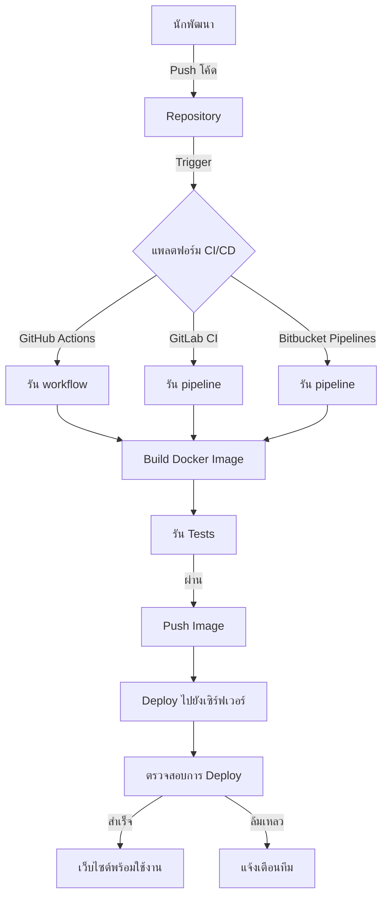

# การสาธิต HTML DevOps Workshop

โปรเจคนี้แสดงหลักการของ DevOps โดยใช้เว็บไซต์ HTML อย่างง่ายเป็นกรณีทดสอบ ถูกสร้างขึ้นโดยบริษัท RACKSYNC จำกัด เพื่อวัตถุประสงค์ทางการศึกษา

## ภาพรวม

นี่เป็นเว็บไซต์ HTML อย่างง่ายที่แสดงหลักการของ DevOps รวมถึง:
- การบูรณาการและการส่งมอบอย่างต่อเนื่อง (CI/CD)
- การทำ Containerization ด้วย Docker
- การทำ Pipeline automation กับหลายแพลตฟอร์ม CI
- แนวปฏิบัติที่ดีในการพัฒนาเว็บ

## โครงสร้างโปรเจค

```
html/
├── index.html           # หน้าแรก
├── devops.html          # หน้าแนวคิด DevOps
├── racksync.html        # หน้าข้อมูลบริษัท
├── Dockerfile           # การตั้งค่า Docker
├── .github/workflows/   # Workflows ของ GitHub Actions
├── .gitlab-ci.yml       # การตั้งค่า GitLab CI
├── bitbucket-pipelines.yml # การตั้งค่า Bitbucket Pipelines
└── README.md            # เอกสารประกอบโปรเจค
```

## การพัฒนาในเครื่อง Local

### สิ่งที่ต้องมีก่อน

- เว็บเบราว์เซอร์
- โปรแกรมแก้ไขข้อความ
- Docker (ทางเลือก)

### การรันในเครื่อง Local

เพียงแค่เปิดไฟล์ HTML ใดๆ ในเว็บเบราว์เซอร์ของคุณ:

```bash
# ใช้เบราว์เซอร์โดยตรง
open index.html

# หรือใช้เซิร์ฟเวอร์ในเครื่อง
npx serve .
```

### การใช้ Docker

```bash
# สร้าง Docker image
docker build -t html-demo .

# รันคอนเทนเนอร์
docker run -p 8080:80 --name html-demo html-demo
```

เปิดเบราว์เซอร์แล้วเข้าชมที่ `http://localhost:8080` เพื่อดูเว็บไซต์

## ขั้นตอนการ Deploy อย่างละเอียด

### 1. การเตรียมการก่อน Deploy

1. ตรวจสอบให้แน่ใจว่าไฟล์ HTML ของคุณถูกต้องและทำงานได้ดีในเครื่อง local:
   ```bash
   # ทดสอบโดยรันเซิร์ฟเวอร์ในเครื่อง
   npx serve .
   ```

2. ตรวจสอบความถูกต้องของ HTML ด้วยเครื่องมือ validator:
   ```bash
   # โดยใช้ npm package html-validator (ต้องติดตั้งก่อน)
   npx html-validator --file=index.html
   ```

### 2. การ Deploy ด้วย Docker

1. สร้าง Docker image:
   ```bash
   docker build -t html-demo:latest .
   ```

2. ทดสอบ image บนเครื่อง local:
   ```bash
   docker run -d -p 8080:80 --name html-demo-test html-demo:latest
   ```

3. เปิดเบราว์เซอร์ที่ http://localhost:8080 และตรวจสอบว่าทุกอย่างทำงานได้ถูกต้อง

4. หยุดและลบคอนเทนเนอร์ทดสอบ:
   ```bash
   docker stop html-demo-test
   docker rm html-demo-test
   ```

5. ติดแท็กและส่ง image ไปยัง registry:
   ```bash
   docker tag html-demo:latest your-registry.com/username/html-demo:latest
   docker push your-registry.com/username/html-demo:latest
   ```

### 3. การ Deploy บน Web Server

#### การใช้ Apache หรือ NGINX

1. เชื่อมต่อกับเซิร์ฟเวอร์ของคุณ:
   ```bash
   ssh username@your-server-ip
   ```

2. ติดตั้ง web server หากยังไม่ได้ติดตั้ง:
   ```bash
   # สำหรับ Apache
   sudo apt-get update
   sudo apt-get install apache2

   # หรือสำหรับ NGINX
   sudo apt-get update
   sudo apt-get install nginx
   ```

3. คัดลอกไฟล์โปรเจคไปยัง web server directory:
   ```bash
   # สำหรับ Apache
   sudo cp -r /path/to/local/html/* /var/www/html/

   # หรือสำหรับ NGINX
   sudo cp -r /path/to/local/html/* /usr/share/nginx/html/
   ```

4. ตั้งค่าสิทธิ์ที่ถูกต้อง:
   ```bash
   sudo chown -R www-data:www-data /var/www/html/
   # หรือ
   sudo chown -R nginx:nginx /usr/share/nginx/html/
   ```

#### การใช้ Docker บน Server

1. เชื่อมต่อกับเซิร์ฟเวอร์:
   ```bash
   ssh username@your-server-ip
   ```

2. ดึง Docker image (ถ้าคุณใช้ registry):
   ```bash
   docker pull your-registry.com/username/html-demo:latest
   ```

3. รันคอนเทนเนอร์:
   ```bash
   docker run -d -p 80:80 --restart always --name html-demo your-registry.com/username/html-demo:latest
   ```

4. ตั้งค่า HTTPS โดยใช้ reverse proxy หรือ Certbot (Let's Encrypt)

### 4. การตั้งค่า CI/CD Pipeline

โปรเจคนี้มีการตั้งค่า pipeline บนหลายแพลตฟอร์ม เลือกแพลตฟอร์มที่คุณต้องการใช้:

#### GitHub Actions

1. แก้ไขไฟล์ `.github/workflows/racksync-ci.yml` ให้เหมาะกับการตั้งค่าของคุณ
2. เพิ่ม secrets ที่จำเป็นในการตั้งค่า GitHub repository:
   - `SSH_PRIVATE_KEY`: คีย์ SSH สำหรับเชื่อมต่อกับเซิร์ฟเวอร์
   - `SERVER_IP`: IP address ของเซิร์ฟเวอร์
   - `SERVER_USER`: ชื่อผู้ใช้สำหรับ SSH
3. Push โค้ดไปยัง GitHub และ CI/CD pipeline จะทำงานโดยอัตโนมัติ

#### GitLab CI

1. แก้ไขไฟล์ `.gitlab-ci.yml` ให้เหมาะกับการตั้งค่าของคุณ
2. เพิ่ม variables ที่จำเป็นในการตั้งค่า GitLab CI/CD:
   - `SSH_PRIVATE_KEY`: คีย์ SSH สำหรับเชื่อมต่อกับเซิร์ฟเวอร์
   - `SERVER_IP`: IP address ของเซิร์ฟเวอร์
   - `SERVER_USER`: ชื่อผู้ใช้สำหรับ SSH
3. Push โค้ดไปยัง GitLab และ CI/CD pipeline จะทำงานโดยอัตโนมัติ

#### Bitbucket Pipelines

1. แก้ไขไฟล์ `bitbucket-pipelines.yml` ให้เหมาะกับการตั้งค่าของคุณ
2. เพิ่ม variables ใน Bitbucket repository settings:
   - `SSH_PRIVATE_KEY`: คีย์ SSH สำหรับเชื่อมต่อกับเซิร์ฟเวอร์
   - `SERVER_IP`: IP address ของเซิร์ฟเวอร์
   - `SERVER_USER`: ชื่อผู้ใช้สำหรับ SSH
3. Push โค้ดไปยัง Bitbucket และ pipeline จะทำงานโดยอัตโนมัติ

## CI/CD Pipeline Diagram



## การปรับแต่งเว็บไซต์

วิธีการแก้ไขเว็บไซต์:

1. แก้ไขไฟล์ HTML โดยใช้โปรแกรมแก้ไขข้อความใดๆ
2. ทดสอบการเปลี่ยนแปลงในเครื่อง local
3. Commit และ push เพื่อเริ่ม CI/CD pipeline:
   ```bash
   git add .
   git commit -m "อัปเดตเนื้อหาเว็บไซต์"
   git push
   ```

## วัตถุประสงค์การเรียนรู้

ผ่านโปรเจคนี้ คุณจะได้เรียนรู้:
- วิธีการทำ containerize เว็บไซต์แบบ static
- วิธีการตั้งค่า CI/CD pipelines บนแพลตฟอร์มต่างๆ
- แนวปฏิบัติที่ดีสำหรับ DevOps workflows
- การ deploy เว็บแอปพลิเคชันโดยใช้ Docker

## แหล่งข้อมูล

- [เอกสาร Docker](https://docs.docker.com/)
- [เอกสาร GitHub Actions](https://docs.github.com/en/actions)
- [เอกสาร GitLab CI](https://docs.gitlab.com/ee/ci/)
- [เอกสาร Bitbucket Pipelines](https://support.atlassian.com/bitbucket-cloud/docs/bitbucket-pipelines-configuration-reference/)

## ลิขสิทธิ์

© บริษัท RACKSYNC จำกัด สงวนลิขสิทธิ์ทั้งหมด
