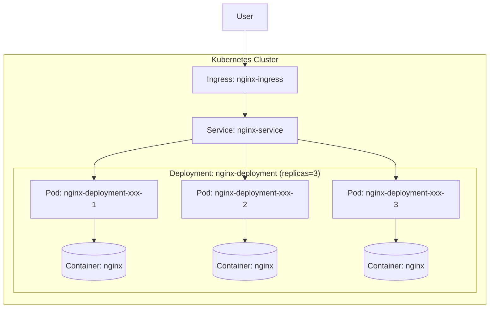

# Kubernetes Replicas Workshop

ในเวิร์คช็อปนี้ เราจะเรียนรู้เกี่ยวกับการทำ replicas ใน Kubernetes โดยใช้ nginx เป็นตัวอย่าง

## สิ่งที่จะได้เรียนรู้

- การสร้าง namespace สำหรับการทดลอง
- การสร้าง deployment ที่มีหลาย replicas
- การสร้าง service เพื่อเชื่อมต่อกับ pods
- การสร้าง ingress เพื่อเข้าถึงแอปพลิเคชันจากภายนอก
- การทดสอบ replicas และ auto-healing

## ขั้นตอนการทำงาน

### 1. สร้าง Namespace

Namespace ใช้สำหรับแยกทรัพยากรต่างๆ ใน Kubernetes

```bash
kubectl create namespace replica-demo
kubectl config set-context --current --namespace=replica-demo
```

### 2. สร้าง Deployment

Deployment จะจัดการ Pod replicas ให้เราอัตโนมัติ

```bash
kubectl apply -f nginx-deployment.yaml
```

**nginx-deployment.yaml**:
```yaml
apiVersion: apps/v1
kind: Deployment
metadata:
  name: nginx-deployment
spec:
  replicas: 3  # เราต้องการ 3 replicas
  selector:
    matchLabels:
      app: nginx
  template:
    metadata:
      labels:
        app: nginx
    spec:
      containers:
      - name: nginx
        image: nginx:latest
        ports:
        - containerPort: 80
        resources:
          limits:
            cpu: "0.5"
            memory: "256Mi"
          requests:
            cpu: "0.2"
            memory: "128Mi"
```

### 3. สร้าง Service

Service จะทำหน้าที่เป็นตัวกลางในการเชื่อมต่อกับ Pod

```bash
kubectl apply -f nginx-service.yaml
```

**nginx-service.yaml**:
```yaml
apiVersion: v1
kind: Service
metadata:
  name: nginx-service
spec:
  selector:
    app: nginx
  ports:
  - port: 80
    targetPort: 80
  type: ClusterIP
```

### 4. สร้าง Ingress

Ingress จะช่วยให้เราเข้าถึงแอปพลิเคชันจากภายนอก cluster

```bash
kubectl apply -f nginx-ingress.yaml
```

**nginx-ingress.yaml**:
```yaml
apiVersion: networking.k8s.io/v1
kind: Ingress
metadata:
  name: nginx-ingress
  annotations:
    nginx.ingress.kubernetes.io/rewrite-target: /
spec:
  rules:
  - host: nginx-demo.local
    http:
      paths:
      - path: /
        pathType: Prefix
        backend:
          service:
            name: nginx-service
            port:
              number: 80
```

หมายเหตุ: คุณอาจต้องเพิ่ม `nginx-demo.local` ไปยังไฟล์ `/etc/hosts` ของคุณ

### 5. ตรวจสอบการทำงานของ Replicas

ตรวจสอบว่า Pod ทำงานปกติ:
```bash
kubectl get pods -o wide
```

ดูรายละเอียดของ Deployment:
```bash
kubectl describe deployment nginx-deployment
```

### 6. ทดสอบ Auto-healing

ลบ Pod หนึ่งตัวเพื่อดูว่า Kubernetes จะสร้าง Pod ใหม่มาทดแทนหรือไม่:
```bash
# ลบ pod หนึ่งตัว
kubectl delete pod <pod-name>

# ตรวจสอบการทำงานอีกครั้ง
kubectl get pods
```

### 7. ปรับจำนวน Replicas

เพิ่มจำนวน replicas เป็น 5 ตัว:
```bash
kubectl scale deployment nginx-deployment --replicas=5
```

ลดจำนวน replicas เป็น 2 ตัว:
```bash
kubectl scale deployment nginx-deployment --replicas=2
```

## แผนภาพสถาปัตยกรรม



## สรุป

ในเวิร์คช็อปนี้ เราได้เรียนรู้:

1. การสร้าง Deployment ที่มี replicas หลายตัว
2. วิธีการที่ Service เชื่อมต่อกับ Pod แต่ละตัว
3. การเข้าถึง Pod ผ่าน Ingress
4. กลไก auto-healing ของ Kubernetes
5. การปรับจำนวน replicas แบบ manual scale

หากมี Pod ล้ม Kubernetes จะสร้าง Pod ใหม่ขึ้นมาทดแทนโดยอัตโนมัติ และ Service จะปรับเปลี่ยน endpoints ให้ชี้ไปยัง Pod ที่ทำงานอยู่ ทำให้แอปพลิเคชันของเรายังคงให้บริการได้อย่างต่อเนื่อง
```

