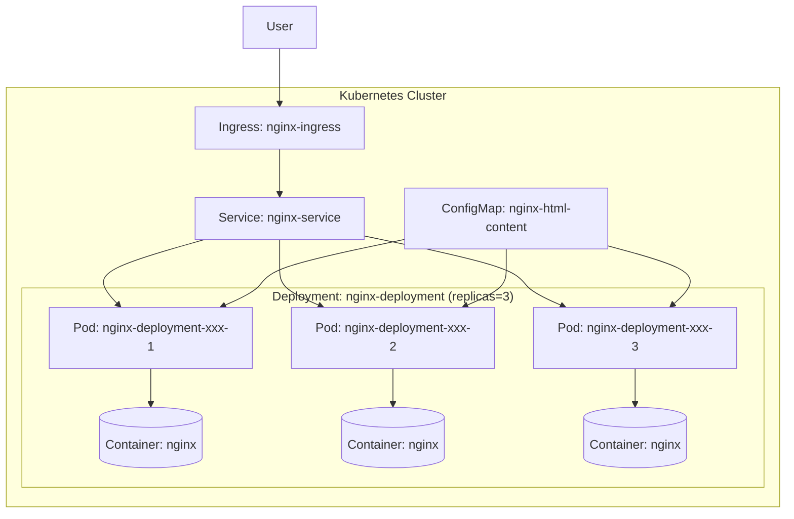

# Kubernetes Replicas Workshop

| รายละเอียด | คำอธิบาย |
|----------|---------|
| **ชื่อเนื้อหา** | การทำ Replicas ใน Kubernetes ด้วย Deployment |
| **วัตถุประสงค์** | เรียนรู้การสร้าง replicas ของ Pod เพื่อความพร้อมใช้งานสูงและการ scale |
| **ระดับความยาก** | ปานกลาง |


ในเวิร์คช็อปนี้ เราจะเรียนรู้เกี่ยวกับการทำ replicas ใน Kubernetes โดยใช้ nginx เป็นตัวอย่าง

## สิ่งที่จะได้เรียนรู้

- การสร้าง namespace สำหรับการทดลอง
- การสร้าง deployment ที่มีหลาย replicas
- การสร้าง service เพื่อเชื่อมต่อกับ pods
- การสร้าง ingress เพื่อเข้าถึงแอปพลิเคชันจากภายนอก
- การทดสอบ replicas และ auto-healing
- การใช้ ConfigMap เพื่อกำหนด custom HTML content

## ข้อกำหนดเบื้องต้น

ก่อนเริ่มเวิร์คช็อปนี้ ตรวจสอบให้แน่ใจว่าคุณมีสิ่งต่อไปนี้:

1. Kubernetes cluster ที่ทำงานอยู่ (เช่น Minikube, K3s, Docker Desktop Kubernetes)
2. kubectl ที่ตั้งค่าเพื่อเชื่อมต่อกับคลัสเตอร์ของคุณ
3. **Ingress Controller ที่ติดตั้งในคลัสเตอร์** - สำคัญมากสำหรับการใช้งาน Ingress!
   - สำหรับ Minikube: `minikube addons enable ingress`
   - สำหรับคลัสเตอร์อื่นๆ: ติดตั้ง NGINX Ingress Controller ตามคำแนะนำทางการ

## การแก้ไขปัญหา 404 Not Found เมื่อเข้าถึงผ่าน Ingress

หากคุณพบกับปัญหา 404 Not Found เมื่อพยายามเข้าถึง `nginx.k8s.local` ให้ตรวจสอบสิ่งต่อไปนี้:

1. **ตรวจสอบว่าได้ติดตั้ง Ingress Controller แล้ว**:
   ```bash
   kubectl get pods -n ingress-nginx
   # หรือตรวจสอบในเนมสเปซที่คุณติดตั้ง Ingress Controller
   ```

2. **เพิ่ม DNS resolution**:
   ```bash
   # เพิ่มบรรทัดนี้ใน /etc/hosts
   127.0.0.1 nginx.k8s.local
   ```

3. **ตรวจสอบสถานะของ Ingress**:
   ```bash
   kubectl describe ingress nginx-ingress -n replica-demo
   ```

4. **ตรวจสอบ log ของ Ingress Controller**:
   ```bash
   kubectl logs -n ingress-nginx -l app.kubernetes.io/name=ingress-nginx
   ```

5. **ทดสอบการเข้าถึงโดยตรงผ่าน port-forward**:
   ```bash
   kubectl port-forward service/nginx-service 8080:80 -n replica-demo
   # จากนั้นเปิดเบราว์เซอร์ไปที่ http://localhost:8080
   ```

## ขั้นตอนการทำงาน

### 1. สร้าง Namespace

Namespace ใช้สำหรับแยกทรัพยากรต่างๆ ใน Kubernetes

```bash
kubectl create namespace replica-demo
kubectl config set-context --current --namespace=replica-demo
```

### 2. สร้าง Deployment

Deployment จะจัดการ Pod replicas ให้เราอัตโนมัติ

```bash
kubectl apply -f nginx-deployment.yaml
```

**nginx-deployment.yaml**:
```yaml
apiVersion: apps/v1
kind: Deployment
metadata:
  name: nginx-deployment
spec:
  replicas: 3  # เราต้องการ 3 replicas
  selector:
    matchLabels:
      app: nginx
  template:
    metadata:
      labels:
        app: nginx
    spec:
      containers:
      - name: nginx
        image: nginx:latest
        ports:
        - containerPort: 80
        resources:
          limits:
            cpu: "0.5"
            memory: "256Mi"
          requests:
            cpu: "0.2"
            memory: "128Mi"
        volumeMounts:
        - name: nginx-html
          mountPath: /usr/share/nginx/html
      volumes:
      - name: nginx-html
        configMap:
          name: nginx-html-content
```

### 3. สร้าง ConfigMap

ConfigMap จะเก็บไฟล์ custom HTML ที่จะแสดงใน NGINX:

```bash
kubectl apply -f nginx-configmap.yaml
```

**nginx-configmap.yaml**:
```yaml
apiVersion: v1
kind: ConfigMap
metadata:
  name: nginx-html-content
data:
  index.html: |
    <!DOCTYPE html>
    <html>
    <head>
      <title>Welcome to NGINX on Kubernetes</title>
      <style>
        body {
          width: 35em;
          margin: 0 auto;
          font-family: Tahoma, Verdana, Arial, sans-serif;
        }
      </style>
    </head>
    <body>
      <h1>Welcome to NGINX on Kubernetes!</h1>
      <p>If you see this page, your Kubernetes NGINX deployment with Ingress is working correctly.</p>
      
      <h2>Environment Information:</h2>
      <ul>
        <li>Pod Name: NGINX Demo Pod</li>
        <li>Namespace: replica-demo</li>
        <li>Accessed via Ingress: nginx.k8s.local</li>
      </ul>
      
      <p><em>Thank you for using the DevOps Workshop tutorial.</em></p>
    </body>
    </html>
```

### 4. สร้าง Service

Service จะทำหน้าที่เป็นตัวกลางในการเชื่อมต่อกับ Pod

```bash
kubectl apply -f nginx-service.yaml
```

**nginx-service.yaml**:
```yaml
apiVersion: v1
kind: Service
metadata:
  name: nginx-service
spec:
  selector:
    app: nginx
  ports:
  - port: 80
    targetPort: 80
  type: ClusterIP
```

### 5. สร้าง Ingress

Ingress จะช่วยให้เราเข้าถึงแอปพลิเคชันจากภายนอก cluster

```bash
kubectl apply -f nginx-ingress.yaml
```

**nginx-ingress.yaml**:
```yaml
apiVersion: networking.k8s.io/v1
kind: Ingress
metadata:
  name: nginx-ingress
  annotations:
    nginx.ingress.kubernetes.io/rewrite-target: /
spec:
  rules:
  - host: nginx.k8s.local
    http:
      paths:
      - path: /
        pathType: Prefix
        backend:
          service:
            name: nginx-service
            port:
              number: 80
```

หมายเหตุ: คุณอาจต้องเพิ่ม `nginx.k8s.local` ไปยังไฟล์ `/etc/hosts` ของคุณ

### 6. ตรวจสอบการทำงานของ Replicas

ตรวจสอบว่า Pod ทำงานปกติ:
```bash
kubectl get pods -o wide
```

ดูรายละเอียดของ Deployment:
```bash
kubectl describe deployment nginx-deployment
```

### 7. ทดสอบ Auto-healing

ลบ Pod หนึ่งตัวเพื่อดูว่า Kubernetes จะสร้าง Pod ใหม่มาทดแทนหรือไม่:
```bash
# ลบ pod หนึ่งตัว
kubectl delete pod <pod-name>

# ตรวจสอบการทำงานอีกครั้ง
kubectl get pods
```

### 8. ปรับจำนวน Replicas

เพิ่มจำนวน replicas เป็น 5 ตัว:
```bash
kubectl scale deployment nginx-deployment --replicas=5
```

ลดจำนวน replicas เป็น 2 ตัว:
```bash
kubectl scale deployment nginx-deployment --replicas=2
```

## การใช้ Shell Script สำหรับการจัดการทรัพยากร

เพื่อความสะดวกในการติดตั้งและทดสอบ workshop นี้ เราได้เตรียม shell script สำหรับการจัดการทรัพยากรทั้งหมด:

### 1. การติดตั้งทรัพยากรทั้งหมด (deploy.sh)

Script นี้จะสร้าง namespace และทรัพยากรทั้งหมดที่จำเป็นสำหรับ workshop นี้:

```bash
chmod +x deploy.sh  # ให้สิทธิ์การเรียกใช้งาน script (ครั้งแรกเท่านั้น)
./deploy.sh
```

เมื่อรัน script นี้แล้ว จะมีการดำเนินการดังนี้:
- สร้าง namespace `replica-demo`
- ตั้งค่า context ให้ใช้งาน namespace `replica-demo`
- สร้าง ReplicaSet ตามที่กำหนดใน replicaset.yaml
- สร้าง Deployment ตามที่กำหนดใน deployment.yaml
- สร้าง Service สำหรับเข้าถึง Pod ใน Deployment
- สร้าง ConfigMap สำหรับตั้งค่า environments ต่างๆ

### 2. การทดสอบทรัพยากร (test.sh)

Script นี้จะทดสอบการทำงานของทรัพยากรต่างๆ ที่สร้างขึ้น:

```bash
chmod +x test.sh  # ให้สิทธิ์การเรียกใช้งาน script (ครั้งแรกเท่านั้น)
./test.sh
```

การทดสอบประกอบด้วย:
- ตรวจสอบว่า ReplicaSet สร้าง Pod ตามจำนวนที่กำหนด
- ตรวจสอบว่า Deployment สร้าง ReplicaSet และ Pod ถูกต้อง
- ทดสอบการ Scale Deployment แบบ manual
- ทดสอบการ Update Deployment และดูการทำ rolling update
- ตรวจสอบการเข้าถึง Pod ผ่าน Service
- ทดสอบความทนทานโดยการลบ Pod และดูว่ามีการสร้างใหม่ทดแทน

### 3. การลบทรัพยากรทั้งหมด (cleanup.sh)

เมื่อต้องการลบทรัพยากรทั้งหมดที่สร้างขึ้นในบทเรียนนี้:

```bash
chmod +x cleanup.sh  # ให้สิทธิ์การเรียกใช้งาน script (ครั้งแรกเท่านั้น)
./cleanup.sh
```

Script นี้จะดำเนินการ:
- ลบ Deployment ทั้งหมด
- ลบ ReplicaSet ทั้งหมด (ที่ไม่ได้ถูกสร้างโดย Deployment)
- ลบ Service ทั้งหมด
- ลบ ConfigMap ทั้งหมด
- ลบ namespace `replica-demo`
- ตั้งค่า context กลับไปที่ namespace `default`

## แผนภาพสถาปัตยกรรม



## สรุป

ในเวิร์คช็อปนี้ เราได้เรียนรู้:

1. การสร้าง Deployment ที่มี replicas หลายตัว
2. วิธีการที่ Service เชื่อมต่อกับ Pod แต่ละตัว
3. การเข้าถึง Pod ผ่าน Ingress
4. กลไก auto-healing ของ Kubernetes
5. การปรับจำนวน replicas แบบ manual scale

หากมี Pod ล้ม Kubernetes จะสร้าง Pod ใหม่ขึ้นมาทดแทนโดยอัตโนมัติ และ Service จะปรับเปลี่ยน endpoints ให้ชี้ไปยัง Pod ที่ทำงานอยู่ ทำให้แอปพลิเคชันของเรายังคงให้บริการได้อย่างต่อเนื่อง

