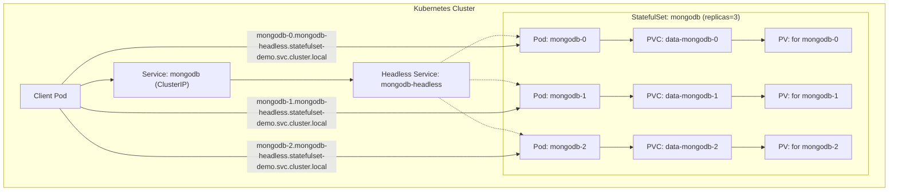
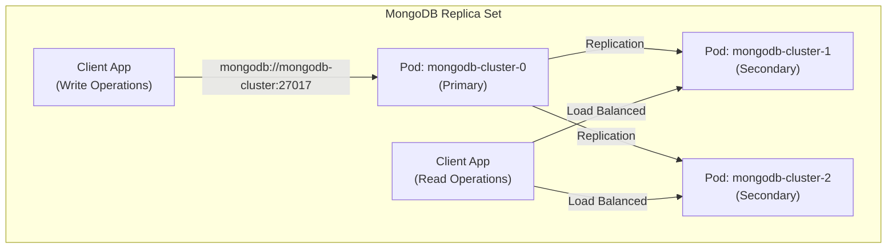

# Kubernetes StatefulSet Workshop

| รายละเอียด | คำอธิบาย |
|----------|---------|
| **ชื่อเนื้อหา** | การใช้งาน StatefulSet สำหรับแอปพลิเคชันที่มีสถานะ |
| **วัตถุประสงค์** | เรียนรู้การสร้างและจัดการแอปพลิเคชันที่ต้องการความต่อเนื่องของข้อมูลและตำแหน่งเครือข่ายที่แน่นอน |
| **ระดับความยาก** | ยาก |

ใน workshop นี้ เราจะเรียนรู้เกี่ยวกับ StatefulSet ใน Kubernetes ซึ่งเป็นรูปแบบ controller สำหรับการจัดการแอปพลิเคชันที่มีสถานะ (Stateful Applications) โดยจะใช้ MongoDB เป็นตัวอย่าง

## สารบัญ

- [Kubernetes StatefulSet Workshop](#kubernetes-statefulset-workshop)
  - [สารบัญ](#สารบัญ)
  - [สิ่งที่จะได้เรียนรู้](#สิ่งที่จะได้เรียนรู้)
  - [StatefulSet คืออะไร?](#statefulset-คืออะไร)
  - [รายละเอียดไฟล์ที่เกี่ยวข้อง](#รายละเอียดไฟล์ที่เกี่ยวข้อง)
  - [ขั้นตอนการทำงาน](#ขั้นตอนการทำงาน)
    - [1. สร้าง Namespace](#1-สร้าง-namespace)
    - [2. สร้าง Headless Service](#2-สร้าง-headless-service)
    - [3. สร้าง StatefulSet พร้อม PVC Template](#3-สร้าง-statefulset-พร้อม-pvc-template)
    - [4. สร้าง Service สำหรับการเข้าถึง](#4-สร้าง-service-สำหรับการเข้าถึง)
    - [5. สร้าง Web UI สำหรับการจัดการ MongoDB](#5-สร้าง-web-ui-สำหรับการจัดการ-mongodb)
    - [6. สร้าง Ingress เพื่อเข้าถึง Web UI](#6-สร้าง-ingress-เพื่อเข้าถึง-web-ui)
    - [7. ตรวจสอบการทำงาน](#7-ตรวจสอบการทำงาน)
    - [8. ทดสอบความคงทนของข้อมูล](#8-ทดสอบความคงทนของข้อมูล)
    - [9. ทดสอบการเข้าถึง Pod เฉพาะ](#9-ทดสอบการเข้าถึง-pod-เฉพาะ)
    - [10. สร้างและทดสอบ MongoDB Replica Set](#10-สร้างและทดสอบ-mongodb-replica-set)
  - [ความแตกต่างระหว่าง StatefulSet และ Deployment](#ความแตกต่างระหว่าง-statefulset-และ-deployment)
  - [ประยุกต์ใช้งานจริง](#ประยุกต์ใช้งานจริง)
  - [ปัญหาที่อาจพบและวิธีแก้ไข](#ปัญหาที่อาจพบและวิธีแก้ไข)
  - [แผนภาพสถาปัตยกรรม](#แผนภาพสถาปัตยกรรม)
  - [แผนภาพ MongoDB Replica Set](#แผนภาพ-mongodb-replica-set)
  - [การใช้ Shell Script สำหรับการจัดการทรัพยากร](#การใช้-shell-script-สำหรับการจัดการทรัพยากร)
    - [1. การติดตั้งทรัพยากรทั้งหมด (deploy.sh)](#1-การติดตั้งทรัพยากรทั้งหมด-deploysh)
    - [2. การทดสอบทรัพยากร (test.sh)](#2-การทดสอบทรัพยากร-testsh)
    - [3. การลบทรัพยากรทั้งหมด (cleanup.sh)](#3-การลบทรัพยากรทั้งหมด-cleanupsh)
  - [สรุป](#สรุป)

## สิ่งที่จะได้เรียนรู้

- การสร้าง namespace สำหรับการทดลอง
- การสร้าง StatefulSet สำหรับการจัดการแอปพลิเคชันที่มีสถานะ
- การสร้าง Headless Service สำหรับ StatefulSet
- การสร้าง PersistentVolumeClaim สำหรับเก็บข้อมูล
- การทดสอบความคงทนของข้อมูลเมื่อ Pod ถูกรีสตาร์ท
- การเข้าถึง Pod แต่ละตัวด้วยชื่อที่คงที่
- การสร้าง MongoDB Replica Set ด้วย StatefulSet
- การสร้าง Web UI สำหรับการจัดการ MongoDB

## StatefulSet คืออะไร?

StatefulSet เป็น Kubernetes Controller ที่จัดการการ deployment และการขยายขนาดของกลุ่ม Pod ที่มีสถานะ โดยมีคุณสมบัติที่แตกต่างจาก Deployment ดังนี้:

1. **ชื่อ Pod ที่คงที่และคาดเดาได้** - เช่น mongodb-0, mongodb-1, mongodb-2 แทนที่จะเป็นชื่อสุ่ม
2. **ลำดับการสร้างและลบที่แน่นอน** - สร้างตามลำดับจาก 0 และลบย้อนกลับจากสูงสุด
3. **Persistent Storage ที่เชื่อมโยงกับ Pod** - แม้ Pod จะถูกรีสตาร์ท ข้อมูลยังคงอยู่
4. **DNS ที่คงที่สำหรับแต่ละ Pod** - ทำให้สามารถเข้าถึง Pod เฉพาะตัวได้แม้ IP จะเปลี่ยน

## รายละเอียดไฟล์ที่เกี่ยวข้อง

| ไฟล์ | ประเภท | คำอธิบาย |
|------|--------|----------|
| namespace.yaml | Namespace | สร้างพื้นที่แยกสำหรับการทดลอง StatefulSet โดยเฉพาะ |
| headless-service.yaml | Service (Headless) | Service พิเศษที่ไม่มี ClusterIP เพื่อให้เข้าถึงแต่ละ Pod ได้โดยตรงผ่าน DNS |
| service.yaml | Service (ClusterIP) | Service ปกติสำหรับการเข้าถึง MongoDB แบบ load balancing |
| statefulset.yaml | StatefulSet | กำหนดค่า StatefulSet พื้นฐานสำหรับ MongoDB ที่มี 3 replicas |
| mongodb-admin-service.yaml | Deployment, Service | สร้าง Web UI (Mongo-Express) สำหรับการจัดการ MongoDB |
| ingress.yaml | Ingress | กำหนดการเข้าถึง MongoDB Admin UI จากภายนอก cluster |
| mongodb-cluster-headless-service.yaml | Service (Headless) | Headless Service สำหรับ MongoDB Replica Set |
| statefulset-mongodb-cluster.yaml | StatefulSet | กำหนดค่า StatefulSet สำหรับการสร้าง MongoDB Replica Set |

## ขั้นตอนการทำงาน

### 1. สร้าง Namespace

Namespace ใช้สำหรับแยกทรัพยากรต่างๆ ใน Kubernetes

```bash
kubectl apply -f namespace.yaml
kubectl config set-context --current --namespace=statefulset-demo
```

**namespace.yaml**:
```yaml
apiVersion: v1
kind: Namespace
metadata:
  name: statefulset-demo
  labels:
    purpose: workshop
    topic: statefulset
  annotations:
    description: "Namespace สำหรับการทดลอง Kubernetes StatefulSet"
    created-by: "DevOps Workshop"
```

### 2. สร้าง Headless Service

StatefulSet ต้องการ Headless Service เพื่อควบคุมโดเมนเน็ตเวิร์ค จุดประสงค์หลักคือเพื่อสร้าง DNS entries สำหรับแต่ละ Pod ในรูปแบบ:
`<pod-name>.<service-name>.<namespace>.svc.cluster.local`

```bash
kubectl apply -f headless-service.yaml
```

**headless-service.yaml**:
```yaml
apiVersion: v1
kind: Service
metadata:
  name: mongodb-headless
  namespace: statefulset-demo
  labels:
    app: mongodb
    type: database
spec:
  selector:
    app: mongodb
  ports:
  - port: 27017
    targetPort: 27017
    name: mongodb
  clusterIP: None  # กำหนดให้เป็น Headless Service โดยไม่มี ClusterIP
```

### 3. สร้าง StatefulSet พร้อม PVC Template

StatefulSet จะสร้าง Pod และ PersistentVolumeClaim ตามจำนวน replicas ที่กำหนด

```bash
kubectl apply -f statefulset.yaml
```

**statefulset.yaml**:
```yaml
apiVersion: apps/v1
kind: StatefulSet
metadata:
  name: mongodb
  namespace: statefulset-demo
spec:
  serviceName: "mongodb-headless"
  replicas: 3
  selector:
    matchLabels:
      app: mongodb
  template:
    metadata:
      labels:
        app: mongodb
    spec:
      containers:
      - name: mongodb
        image: mongo:4.4
        ports:
        - containerPort: 27017
        volumeMounts:
        - name: data
          mountPath: /data/db
        env:
        - name: MONGO_INITDB_ROOT_USERNAME
          value: "admin"
        - name: MONGO_INITDB_ROOT_PASSWORD
          value: "password"
        resources:
          limits:
            cpu: "0.5"
            memory: "512Mi"
          requests:
            cpu: "0.2"
            memory: "256Mi"
        readinessProbe:
          tcpSocket:
            port: 27017
          initialDelaySeconds: 5
          periodSeconds: 10
  volumeClaimTemplates:
  - metadata:
      name: data
    spec:
      accessModes: [ "ReadWriteOnce" ]
      resources:
        requests:
          storage: 1Gi
```

### 4. สร้าง Service สำหรับการเข้าถึง

Service จะทำหน้าที่เป็นตัวกลางในการเชื่อมต่อกับ Pod

```bash
kubectl apply -f service.yaml
```

**service.yaml**:
```yaml
apiVersion: v1
kind: Service
metadata:
  name: mongodb
  namespace: statefulset-demo
spec:
  selector:
    app: mongodb
  ports:
  - port: 27017
    targetPort: 27017
    name: mongodb
  type: ClusterIP
```

### 5. สร้าง Web UI สำหรับการจัดการ MongoDB

เพื่อให้เห็นภาพง่ายขึ้น เราจะสร้าง Web UI สำหรับการจัดการ MongoDB โดยใช้ Mongo Express

```bash
kubectl apply -f mongodb-admin-service.yaml
```

**mongodb-admin-service.yaml**:
```yaml
apiVersion: apps/v1
kind: Deployment
metadata:
  name: mongodb-admin-ui
  namespace: statefulset-demo
spec:
  replicas: 1
  selector:
    matchLabels:
      app: mongodb-admin-ui
  template:
    metadata:
      labels:
        app: mongodb-admin-ui
    spec:
      containers:
      - name: mongo-express
        image: mongo-express:latest
        env:
        - name: ME_CONFIG_MONGODB_SERVER
          value: mongodb
        - name: ME_CONFIG_MONGODB_ADMINUSERNAME
          value: admin
        - name: ME_CONFIG_MONGODB_ADMINPASSWORD
          value: password
        - name: ME_CONFIG_BASICAUTH_USERNAME
          value: admin
        - name: ME_CONFIG_BASICAUTH_PASSWORD
          value: pass
        ports:
        - containerPort: 8081
        resources:
          limits:
            cpu: "0.3"
            memory: "256Mi"
          requests:
            cpu: "0.1"
            memory: "128Mi"
```

### 6. สร้าง Ingress เพื่อเข้าถึง Web UI

```bash
kubectl apply -f ingress.yaml
```

### 7. ตรวจสอบการทำงาน

ตรวจสอบว่า Pod ทำงานปกติ:
```bash
kubectl get pods -n statefulset-demo
```

ผลลัพธ์ควรจะแสดง Pod 3 ตัวที่มีชื่อแบบคาดเดาได้:
```
NAME        READY   STATUS    RESTARTS   AGE
mongodb-0   1/1     Running   0          1m
mongodb-1   1/1     Running   0          50s
mongodb-2   1/1     Running   0          40s
```

ตรวจสอบ PersistentVolumeClaim:
```bash
kubectl get pvc -n statefulset-demo
```

### 8. ทดสอบความคงทนของข้อมูล

1. เพิ่มข้อมูลในฐานข้อมูล:

```bash
# เข้าถึง Pod mongodb-0
kubectl exec -it mongodb-0 -n statefulset-demo -- mongo -u admin -p password --authenticationDatabase admin

# สร้างข้อมูลทดสอบ
> use testdb
> db.testCollection.insertOne({"name": "test", "value": "data"})
> exit
```

2. ลบ Pod เพื่อให้มีการรีสตาร์ท:

```bash
kubectl delete pod mongodb-0 -n statefulset-demo
```

3. ตรวจสอบข้อมูลหลังจาก Pod กลับมาทำงาน:

```bash
# รอให้ Pod กลับมาทำงาน
kubectl wait --for=condition=Ready pod/mongodb-0 -n statefulset-demo --timeout=60s

# เข้าถึง Pod อีกครั้ง
kubectl exec -it mongodb-0 -n statefulset-demo -- mongo -u admin -p password --authenticationDatabase admin

# ตรวจสอบข้อมูล
> use testdb
> db.testCollection.find()
> exit
```

ข้อมูลควรยังคงอยู่แม้ว่า Pod จะถูกรีสตาร์ท เนื่องจากข้อมูลถูกเก็บใน PersistentVolume

### 9. ทดสอบการเข้าถึง Pod เฉพาะ

StatefulSet สร้าง DNS entries ที่แน่นอนสำหรับแต่ละ Pod:

```bash
# สร้าง Pod ชั่วคราวเพื่อทดสอบ DNS
kubectl run -i --tty --rm debug --image=busybox -n statefulset-demo -- sh

# ทดสอบ DNS
/ # nslookup mongodb-0.mongodb-headless.statefulset-demo.svc.cluster.local
/ # nslookup mongodb-1.mongodb-headless.statefulset-demo.svc.cluster.local
/ # nslookup mongodb-2.mongodb-headless.statefulset-demo.svc.cluster.local
/ # exit
```

### 10. สร้างและทดสอบ MongoDB Replica Set

MongoDB Replica Set คือกลุ่มของ MongoDB instances ที่เก็บชุดข้อมูลเดียวกันเพื่อความพร้อมใช้งานสูงและการกู้คืนจากความล้มเหลว ด้วยการใช้ StatefulSet เราสามารถสร้าง Replica Set ได้อย่างง่ายดาย:

```bash
# สร้าง Headless Service สำหรับ MongoDB Cluster
kubectl apply -f mongodb-cluster-headless-service.yaml

# สร้าง StatefulSet สำหรับ MongoDB Cluster
kubectl apply -f statefulset-mongodb-cluster.yaml

# รอให้ Pods พร้อมใช้งาน
kubectl rollout status statefulset mongodb-cluster -n statefulset-demo
```

## ความแตกต่างระหว่าง StatefulSet และ Deployment

| คุณสมบัติ | StatefulSet | Deployment |
|----------|------------|------------|
| ชื่อ Pod | คงที่และคาดเดาได้ (app-0, app-1) | สุ่มและไม่สามารถคาดเดาได้ |
| การเก็บข้อมูล | PVC แยกสำหรับแต่ละ Pod | มักใช้ข้อมูลชั่วคราวหรือแชร์ PVC |
| ลำดับการสร้าง/ลบ | ตามลำดับแน่นอน | สร้าง/ลบ พร้อมกัน |
| Network Identity | คงที่ผ่าน Headless Service | สุ่มและเปลี่ยนแปลงได้ |
| เหมาะสำหรับ | ฐานข้อมูล, Messaging Systems, Stateful Apps | Stateless Applications |

## ประยุกต์ใช้งานจริง

StatefulSet มีประโยชน์อย่างยิ่งสำหรับแอปพลิเคชันที่ต้องการ:
1. **เก็บข้อมูลอย่างถาวร**: เช่น ฐานข้อมูล, cache, message queue
2. **มีชื่อและเครือข่ายคงที่**: เช่น ระบบ clustered หรือ distributed ที่ต้องสื่อสารกันระหว่าง node
3. **มีการเปิดใช้งานและปิดการทำงานเป็นลำดับ**: เช่น การเริ่ม master ก่อน slave

ตัวอย่างการใช้งานจริง:
- ฐานข้อมูล: MongoDB, MySQL, PostgreSQL, Cassandra
- Message Brokers: Kafka, RabbitMQ
- Key-Value Stores: Redis, Elasticsearch
- Machine Learning: TensorFlow Distributed Training

## ปัญหาที่อาจพบและวิธีแก้ไข

1. **PVC ไม่ถูกลบเมื่อลด scale**: ต้องลบด้วยตัวเองหากไม่ต้องการเก็บข้อมูล
   ```bash
   kubectl delete pvc data-mongodb-3 -n statefulset-demo
   ```

2. **Pod ติดในสถานะ Pending**: ตรวจสอบว่ามี PV เพียงพอหรือไม่
   ```bash
   kubectl describe pod mongodb-0 -n statefulset-demo
   ```

3. **Pod ไม่สามารถเริ่มต้นแบบพร้อมกัน**: StatefulSet จะสร้างและลบ Pod ตามลำดับเสมอ หากต้องการให้เริ่มพร้อมกัน ให้ใช้ Deployment แทน

## แผนภาพสถาปัตยกรรม



## แผนภาพ MongoDB Replica Set



## การใช้ Shell Script สำหรับการจัดการทรัพยากร

เพื่อความสะดวกในการติดตั้งและทดสอบ workshop นี้ เราได้เตรียม shell script สำหรับการจัดการทรัพยากรทั้งหมด:

### 1. การติดตั้งทรัพยากรทั้งหมด (deploy.sh)

Script นี้จะสร้าง namespace และทรัพยากรทั้งหมดที่จำเป็นสำหรับ workshop นี้:

```bash
chmod +x deploy.sh  # ให้สิทธิ์การเรียกใช้งาน script (ครั้งแรกเท่านั้น)
./deploy.sh
```

เมื่อรัน script นี้แล้ว จะมีการดำเนินการดังนี้:
- สร้าง namespace `statefulset-demo`
- ตั้งค่า context ให้ใช้งาน namespace `statefulset-demo`
- สร้าง Headless Service สำหรับ StatefulSet
- สร้าง StatefulSet สำหรับ MongoDB
- สร้าง Service ปกติสำหรับการเข้าถึง MongoDB
- สร้าง Web UI สำหรับจัดการ MongoDB
- สร้าง Ingress สำหรับเข้าถึง Web UI จากภายนอก

### 2. การทดสอบทรัพยากร (test.sh)

Script นี้จะทดสอบการทำงานของทรัพยากรต่างๆ ที่สร้างขึ้น:

```bash
chmod +x test.sh  # ให้สิทธิ์การเรียกใช้งาน script (ครั้งแรกเท่านั้น)
./test.sh
```

การทดสอบประกอบด้วย:
- ตรวจสอบว่า StatefulSet ถูกสร้างและ Pod ทำงานปกติ
- ตรวจสอบการเชื่อมต่อกับ MongoDB ผ่าน Headless Service
- ทดสอบความคงทนของข้อมูลโดยการเพิ่มข้อมูล ลบ Pod และตรวจสอบว่าข้อมูลยังคงอยู่
- ทดสอบการทำงานของ MongoDB Replica Set (ถ้ามี)

### 3. การลบทรัพยากรทั้งหมด (cleanup.sh)

เมื่อต้องการลบทรัพยากรทั้งหมดที่สร้างขึ้นในบทเรียนนี้:

```bash
chmod +x cleanup.sh  # ให้สิทธิ์การเรียกใช้งาน script (ครั้งแรกเท่านั้น)
./cleanup.sh
```

Script นี้จะดำเนินการ:
- ลบ StatefulSet และ รอให้ Pod ถูกลบให้เรียบร้อย
- ลบ Services ทั้งหมด (Headless Service และ ClusterIP Service)
- ลบ MongoDB Admin UI Deployment และ Ingress
- ลบ PersistentVolumeClaims (ทำให้ข้อมูลสูญหาย) - มีตัวเลือกให้เก็บ PVC ไว้ได้
- ลบ namespace `statefulset-demo`
- ตั้งค่า context กลับไปที่ namespace `default`

## สรุป

ในเวิร์คช็อปนี้ เราได้เรียนรู้:

1. การทำงานของ StatefulSet และข้อแตกต่างจาก Deployment
2. การตั้งค่า Headless Service สำหรับการเข้าถึง Pod แต่ละตัว
3. การใช้ volumeClaimTemplates เพื่อสร้าง PVC อัตโนมัติ
4. การทดสอบความคงทนของข้อมูลใน StatefulSet
5. การเข้าถึง Pod เฉพาะผ่าน DNS ที่คงที่
6. การสร้างและจัดการ MongoDB Replica Set ด้วย StatefulSet

StatefulSet เหมาะสำหรับการรัน stateful applications เช่น ฐานข้อมูล, message queues, หรือแอปพลิเคชันอื่นๆ ที่ต้องการความต่อเนื่องของข้อมูลและตำแหน่งเครือข่ายที่แน่นอน ในโครงสร้างพื้นฐานแบบสมัยใหม่ StatefulSet มีบทบาทสำคัญในการรองรับแอปพลิเคชันที่มีสถานะบน Kubernetes
