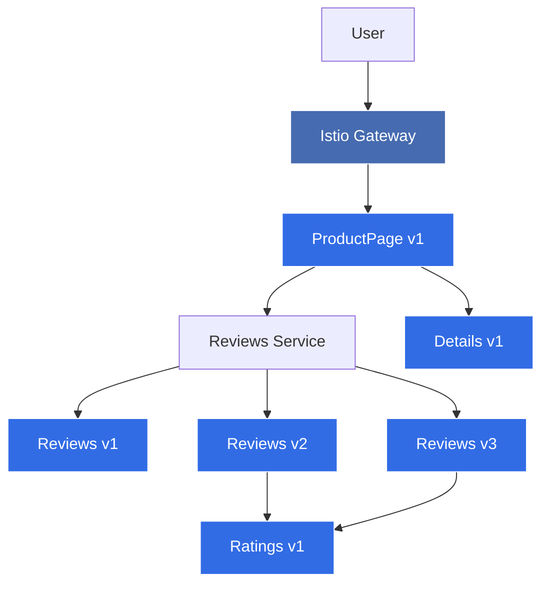

# Kubernetes Service Mesh with Istio Workshop

| รายละเอียด | คำอธิบาย |
|----------|---------|
| **ชื่อเนื้อหา** | การใช้งาน Service Mesh ด้วย Istio บน Kubernetes |
| **วัตถุประสงค์** | เรียนรู้การติดตั้งและใช้งาน Istio เพื่อสร้าง Service Mesh สำหรับการจัดการ microservices |
| **ระดับความยาก** | ยาก |

ในเวิร์คช็อปนี้ เราจะเรียนรู้เกี่ยวกับ Service Mesh และการใช้งาน Istio บน Kubernetes เพื่อจัดการ microservices แบบซับซ้อน ควบคุมการไหลของ traffic, การสังเกตการณ์ (observability), การรักษาความปลอดภัย และความยืดหยุ่นของระบบ

## สิ่งที่จะได้เรียนรู้

- ความเข้าใจพื้นฐานเกี่ยวกับ Service Mesh และ Istio
- การติดตั้งและกำหนดค่า Istio บน Kubernetes cluster
- การติดตั้ง Istio sidecar injection กับ applications
- การใช้งาน Traffic Management ด้วย Virtual Services, Destination Rules, Gateways
- การสร้าง Canary Deployments และ A/B Testing
- การทำ Observability ด้วย Prometheus, Grafana และ Jaeger
- การกำหนดค่า mTLS และนโยบายความปลอดภัย (Security Policies)
- การใช้งาน Circuit Breakers และ Fault Injection
- การสร้าง Service Mesh ที่ทนทานต่อความล้มเหลว

## ความเข้าใจเกี่ยวกับ Service Mesh และ Istio

Service Mesh เป็นชั้นโครงสร้างพื้นฐานที่ช่วยในการจัดการการสื่อสารระหว่าง services ในสถาปัตยกรรม microservices ซึ่งประกอบด้วย:

1. **Data Plane**: ประกอบด้วย proxies (เช่น Envoy) ที่ทำงานเป็น sidecar containers กับ application containers
2. **Control Plane**: ส่วนกลางที่จัดการนโยบายและการกำหนดค่า (เช่น Istiod ใน Istio)

Istio ช่วยแก้ปัญหาที่พบในระบบ microservices เช่น:
- การค้นหาบริการ (Service Discovery)
- การกระจายโหลดอัตโนมัติ (Load Balancing)
- การติดตามและตรวจสอบ (Tracing & Monitoring)
- การรักษาความปลอดภัยในการสื่อสาร (Secure Communication)
- การจัดการความล้มเหลว (Failure Management)

## ขั้นตอนการทำงาน

### 1. สร้าง Namespace และติดตั้ง Istio

สร้าง Namespace เพื่อแยกทรัพยากรที่ใช้ในบทเรียนนี้:

```bash
# สร้าง namespace สำหรับ Istio components
kubectl create namespace istio-system

# สร้าง namespace สำหรับ demo applications
kubectl create namespace istio-demo
kubectl label namespace istio-demo istio-injection=enabled
kubectl config set-context --current --namespace=istio-demo
```

ติดตั้ง Istio โดยใช้ Istioctl:

```bash
# ดาวน์โหลดและติดตั้ง Istioctl
curl -L https://istio.io/downloadIstio | sh -
cd istio-*
export PATH=$PWD/bin:$PATH

# ติดตั้ง Istio พร้อม demo profile
istioctl install --set profile=demo -y
```

### 2. ติดตั้ง Addons สำหรับการสังเกตการณ์ (Observability)

ติดตั้ง Prometheus, Grafana, Kiali และ Jaeger:

```bash
kubectl apply -f samples/addons/prometheus.yaml
kubectl apply -f samples/addons/grafana.yaml
kubectl apply -f samples/addons/kiali.yaml
kubectl apply -f samples/addons/jaeger.yaml
```

### 3. ติดตั้งแอปพลิเคชันตัวอย่าง: Bookinfo

Bookinfo เป็นตัวอย่างแอปพลิเคชัน microservices ที่ประกอบด้วย services หลายชิ้นทำงานร่วมกัน:

```bash
kubectl apply -f samples/bookinfo/platform/kube/bookinfo.yaml
```

ตรวจสอบว่าแอปพลิเคชัน Bookinfo ทำงานได้ถูกต้อง:

```bash
kubectl get services
kubectl get pods
```

### 4. กำหนดค่า Ingress Gateway

สร้าง Istio Gateway และ Virtual Service เพื่อให้สามารถเข้าถึงแอปพลิเคชันจากภายนอก:

```bash
kubectl apply -f samples/bookinfo/networking/bookinfo-gateway.yaml
```

ตรวจสอบ Gateway URL:

```bash
export INGRESS_HOST=$(kubectl -n istio-system get service istio-ingressgateway -o jsonpath='{.status.loadBalancer.ingress[0].ip}')
export INGRESS_PORT=$(kubectl -n istio-system get service istio-ingressgateway -o jsonpath='{.spec.ports[?(@.name=="http2")].port}')
export GATEWAY_URL=$INGRESS_HOST:$INGRESS_PORT
echo "http://$GATEWAY_URL/productpage"
```

### 5. การจัดการ Traffic ด้วย Virtual Services

สร้าง Destination Rules เพื่อกำหนดนโยบายในการเข้าถึง services ต่างๆ:

```bash
kubectl apply -f samples/bookinfo/networking/destination-rule-all.yaml
```

สร้าง Virtual Service เพื่อทำ traffic routing ไปยัง versions ต่างๆ:

```yaml
apiVersion: networking.istio.io/v1alpha3
kind: VirtualService
metadata:
  name: reviews
spec:
  hosts:
  - reviews
  http:
  - match:
    - headers:
        end-user:
          exact: jason
    route:
    - destination:
        host: reviews
        subset: v2
  - route:
    - destination:
        host: reviews
        subset: v1
```

บันทึกเป็นไฟล์ `virtual-service-reviews-test-v2.yaml` และใช้คำสั่ง:

```bash
kubectl apply -f virtual-service-reviews-test-v2.yaml
```

### 6. การทำ Canary Deployment

สร้าง Virtual Service เพื่อทำ weight-based routing (Canary Deployment) ระหว่าง versions ต่างๆ:

```yaml
apiVersion: networking.istio.io/v1alpha3
kind: VirtualService
metadata:
  name: reviews
spec:
  hosts:
  - reviews
  http:
  - route:
    - destination:
        host: reviews
        subset: v1
      weight: 90
    - destination:
        host: reviews
        subset: v3
      weight: 10
```

บันทึกเป็นไฟล์ `virtual-service-reviews-90-10.yaml` และใช้คำสั่ง:

```bash
kubectl apply -f virtual-service-reviews-90-10.yaml
```

### 7. การกำหนดค่า mTLS

กำหนดนโยบาย mutual TLS สำหรับทั้ง namespace:

```yaml
apiVersion: security.istio.io/v1beta1
kind: PeerAuthentication
metadata:
  name: default
  namespace: istio-demo
spec:
  mtls:
    mode: STRICT
```

บันทึกเป็นไฟล์ `peer-authentication.yaml` และใช้คำสั่ง:

```bash
kubectl apply -f peer-authentication.yaml
```

### 8. การทำ Circuit Breaking

สร้าง Destination Rule เพื่อกำหนด circuit breaking:

```yaml
apiVersion: networking.istio.io/v1alpha3
kind: DestinationRule
metadata:
  name: reviews
spec:
  host: reviews
  trafficPolicy:
    connectionPool:
      tcp:
        maxConnections: 100
      http:
        http1MaxPendingRequests: 1
        maxRequestsPerConnection: 1
    outlierDetection:
      consecutive5xxErrors: 1
      interval: 1s
      baseEjectionTime: 30s
      maxEjectionPercent: 100
  subsets:
  - name: v1
    labels:
      version: v1
  - name: v2
    labels:
      version: v2
  - name: v3
    labels:
      version: v3
```

บันทึกเป็นไฟล์ `destination-rule-circuit-breaker.yaml` และใช้คำสั่ง:

```bash
kubectl apply -f destination-rule-circuit-breaker.yaml
```

### 9. การทำ Fault Injection

สร้าง Virtual Service เพื่อจำลองความล่าช้า (Delay):

```yaml
apiVersion: networking.istio.io/v1alpha3
kind: VirtualService
metadata:
  name: ratings
spec:
  hosts:
  - ratings
  http:
  - fault:
      delay:
        percentage:
          value: 50
        fixedDelay: 5s
    route:
    - destination:
        host: ratings
        subset: v1
```

บันทึกเป็นไฟล์ `virtual-service-ratings-delay.yaml` และใช้คำสั่ง:

```bash
kubectl apply -f virtual-service-ratings-delay.yaml
```

### 10. การใช้งาน Kiali Dashboard

เปิด Kiali dashboard เพื่อดูการทำงานของ Service Mesh:

```bash
istioctl dashboard kiali
```

## การใช้ Shell Script สำหรับการจัดการทรัพยากร

เพื่อความสะดวกในการติดตั้งและทดสอบ workshop นี้ เราได้เตรียม shell script สำหรับการจัดการทรัพยากรทั้งหมด:

### 1. การติดตั้งทรัพยากรทั้งหมด (deploy.sh)

Script นี้จะสร้าง namespace และทรัพยากรทั้งหมดที่จำเป็นสำหรับ workshop นี้:

```bash
chmod +x deploy.sh  # ให้สิทธิ์การเรียกใช้งาน script (ครั้งแรกเท่านั้น)
./deploy.sh
```

เมื่อรัน script นี้แล้ว จะมีการดำเนินการดังนี้:
- ติดตั้ง Istio และ addons ที่เกี่ยวข้อง
- สร้าง namespace `istio-demo` และเปิดใช้งาน sidecar injection
- ติดตั้งแอปพลิเคชันตัวอย่าง Bookinfo
- สร้าง Gateway และ Virtual Service เพื่อเข้าถึงแอปพลิเคชัน
- สร้าง Destination Rules สำหรับ services ต่างๆ

### 2. การทดสอบทรัพยากร (test.sh)

Script นี้จะทดสอบการทำงานของ Istio และ Service Mesh:

```bash
chmod +x test.sh  # ให้สิทธิ์การเรียกใช้งาน script (ครั้งแรกเท่านั้น)
./test.sh
```

การทดสอบประกอบด้วย:
- ตรวจสอบว่า Istio ทำงานได้ปกติ
- ทดสอบการเข้าถึงแอปพลิเคชัน Bookinfo
- ทดสอบการทำ traffic routing ไปยัง version ต่างๆ
- ทดสอบ canary deployment และ weighted routing
- ทดสอบ circuit breaking และ fault injection
- แสดงข้อมูลจาก dashboards (Kiali, Grafana, Jaeger)

### 3. การลบทรัพยากรทั้งหมด (cleanup.sh)

เมื่อต้องการลบทรัพยากรทั้งหมดที่สร้างขึ้นในบทเรียนนี้:

```bash
chmod +x cleanup.sh  # ให้สิทธิ์การเรียกใช้งาน script (ครั้งแรกเท่านั้น)
./cleanup.sh
```

Script นี้จะดำเนินการ:
- ลบแอปพลิเคชัน Bookinfo
- ลบ Istio Gateway, Virtual Services และ Destination Rules
- ลบ namespace `istio-demo`
- ถอนการติดตั้ง Istio (ถ้าต้องการ)
- ตั้งค่า context กลับไปที่ namespace `default`

## สถาปัตยกรรมของแอปพลิเคชัน Bookinfo



## ข้อควรระวังในการใช้งาน Istio

1. **ทรัพยากรที่ใช้**: Istio เพิ่มการใช้ CPU, หน่วยความจำ และ latency ให้กับระบบ
2. **ความซับซ้อน**: เพิ่มความซับซ้อนในการแก้ไขปัญหาและบำรุงรักษา
3. **การตั้งค่าที่เหมาะสม**: การตั้งค่า parameters ต่างๆ ต้องเหมาะสมกับสภาพแวดล้อม
4. **การติดตามและบำรุงรักษา**: ต้องเก็บข้อมูล metrics และ logs ที่เพียงพอ
5. **ขนาดของ Cluster**: ควรมีทรัพยากรเพียงพอสำหรับ Istio components

## แนวทางปฏิบัติที่ดีในการใช้งาน Istio

1. **เริ่มจากขนาดเล็ก**: นำ Istio ไปใช้กับบางส่วนของระบบก่อน
2. **การตั้งค่า Resource Limits**: ตั้งค่า limits ที่เหมาะสมสำหรับ Istio components
3. **การเลือกใช้ Features**: ใช้เฉพาะ features ที่จำเป็น เพื่อลดความซับซ้อน
4. **การทดสอบ**: ทดสอบการทำงานของ Service Mesh อย่างรอบคอบก่อนใช้งานจริง
5. **การอัพเกรด**: วางแผนการอัพเกรด Istio อย่างรอบคอบ

## การประยุกต์ใช้ใน Production

การนำ Istio ไปใช้ใน Production มีข้อควรพิจารณาเพิ่มเติม:

1. **High Availability**: กำหนดค่าให้ Istio control plane ทำงานแบบ high availability
2. **Performance Tuning**: ปรับแต่งประสิทธิภาพของ Envoy proxies
3. **Security**: กำหนดนโยบายความปลอดภัยที่เหมาะสม
4. **Monitoring**: ตั้งค่าระบบ monitoring และ alerts
5. **Capacity Planning**: วางแผนทรัพยากรที่จำเป็นสำหรับ Istio components

## ประโยชน์ของ Service Mesh และ Istio

1. **ความปลอดภัย**: mTLS, Authorization Policies, Certificate Management
2. **การสังเกตการณ์**: Request Tracing, Metrics Collection, Visualization
3. **การควบคุม Traffic**: Intelligent Routing, Load Balancing, Circuit Breaking
4. **การจัดการ Failures**: Timeouts, Retries, Fault Injection
5. **การทำ Testing ในสภาพแวดล้อมจริง**: A/B Testing, Canary Deployments

## สรุป

ในเวิร์คช็อปนี้ เราได้เรียนรู้:

1. พื้นฐาน Service Mesh และ Istio architecture
2. การติดตั้งและกำหนดค่า Istio บน Kubernetes
3. การใช้งาน Traffic Management เช่น routing, canary deployments
4. การเพิ่มความปลอดภัยด้วย mTLS
5. การปรับปรุงความยืดหยุ่นของระบบด้วย circuit breaking และ fault handling
6. การสังเกตการณ์ระบบด้วย Kiali, Grafana และ Jaeger

Service Mesh และ Istio เป็นเครื่องมือที่มีประสิทธิภาพสำหรับการจัดการ microservices ในสภาพแวดล้อมที่ซับซ้อน ช่วยให้ทีมพัฒนาสามารถมุ่งเน้นไปที่การพัฒนาแอปพลิเคชัน โดยมี Istio จัดการเรื่องการสื่อสารระหว่าง services ความปลอดภัย และความยืดหยุ่นของระบบ
