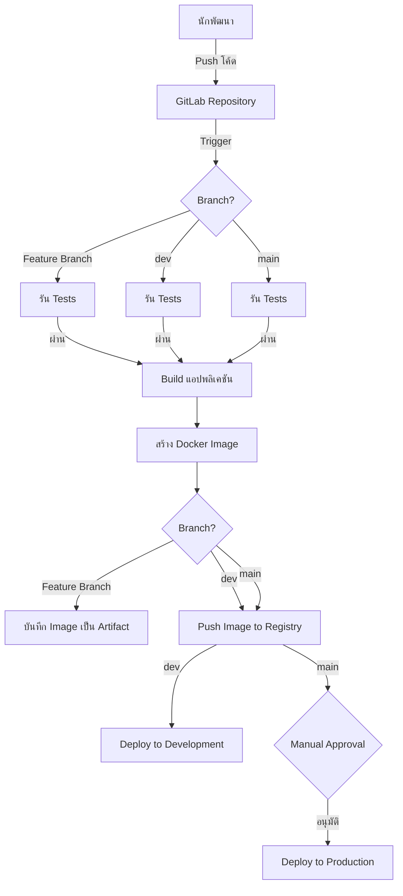

# แอปพลิเคชัน Go พร้อม CI/CD Pipelines


## ภาพรวม

เวิร์กช็อปนี้จัดทำโดย RACKSYNC CO., LTD. นำเสนอตัวอย่างการพัฒนาแอปพลิเคชันด้วยภาษา Go และการตั้งค่า CI/CD pipeline เพื่อการพัฒนาและการ deploy อย่างมีประสิทธิภาพ เหมาะสำหรับนักพัฒนาและ DevOps ที่ต้องการเรียนรู้การใช้งาน GitLab CI กับโปรเจค Go

## คุณสมบัติของแอปพลิเคชัน

- เว็บเซิร์ฟเวอร์ HTTP พื้นฐานที่สร้างด้วย Go
- การจัดการเส้นทาง (routing) ด้วย Gorilla Mux
- API endpoints สำหรับตัวอย่างการใช้งาน
- การทดสอบอัตโนมัติด้วย Go testing package
- การสร้างอิมเมจ Docker สำหรับการ deploy
- การตั้งค่า CI/CD pipeline ด้วย GitLab CI

## สิ่งที่ต้องมีก่อน

- Go 1.21 หรือสูงกว่า
- Docker
- บัญชี GitLab
- ความเข้าใจพื้นฐานเกี่ยวกับ Git และการควบคุมเวอร์ชัน
- ความเข้าใจเบื้องต้นเกี่ยวกับภาษา Go

## คู่มือเริ่มต้นอย่างรวดเร็ว

### 1. โคลนรีโพสิทอรี

```bash
git clone https://github.com/racksync/devops-workshop.git
cd devops-workshop/hands-on/pipelines/go
```

### 2. รันแอปพลิเคชันในเครื่อง Local

```bash
# สร้างและรันแอปพลิเคชัน Go โดยตรง
go build -o app
./app

# หรือใช้ Docker
docker build -t go-app:local .
docker run -p 8080:8080 --name go-local go-app:local
```

เข้าถึงแอปพลิเคชันที่ `http://localhost:8080` ในเว็บเบราว์เซอร์ของคุณ

## โครงสร้างโปรเจค

```
/pipelines/go/
├── cmd/                        # โค้ดหลักของแอปพลิเคชัน
│   └── server/                 # เซิร์ฟเวอร์หลัก
│       └── main.go             # จุดเริ่มต้นของแอปพลิเคชัน
├── pkg/                        # แพ็คเกจที่ใช้ร่วมกัน
│   ├── api/                    # โค้ด API
│   │   └── handlers.go         # ตัวจัดการ HTTP
│   ├── config/                 # การกำหนดค่า
│   │   └── config.go           # การโหลดการกำหนดค่า
│   └── models/                 # โมเดลข้อมูล
│       └── models.go           # นิยามโมเดล
├── tests/                      # การทดสอบ
│   └── api_test.go             # การทดสอบ API
├── .gitlab-ci.yml              # การกำหนดค่า GitLab CI
├── Dockerfile                  # การกำหนดค่า Docker
├── go.mod                      # การจัดการการพึ่งพา Go Modules
├── go.sum                      # การล็อกเวอร์ชันการพึ่งพา
└── README.md                   # เอกสารนี้
```

## การตั้งค่า CI/CD Pipeline

### GitLab CI Overview

Pipeline ของ GitLab CI ถูกกำหนดในไฟล์ `.gitlab-ci.yml` แบ่งออกเป็น 3 ขั้นตอนหลัก:

1. **สร้างและทดสอบ (Build & Test)**: รัน unit tests และสร้างไบนารีของแอปพลิเคชัน
2. **สร้างอิมเมจ Docker (Build Docker Image)**: สร้างและบันทึกอิมเมจ Docker
3. **Deploy**: Deploy แอปพลิเคชันไปยังสภาพแวดล้อมต่างๆ

### รายละเอียดของ Stages

#### Stage: Test

- ทดสอบโค้ดด้วย `go test`
- ตรวจสอบคุณภาพโค้ดด้วย `golangci-lint`
- สร้างรายงานความครอบคลุมของโค้ด (code coverage)

#### Stage: Build

- สร้างแอปพลิเคชันด้วย `go build`
- สร้างอิมเมจ Docker
- บันทึกอิมเมจเป็น Artifact

#### Stage: Deploy

- **Development**: Deploy อัตโนมัติไปยังสภาพแวดล้อมการพัฒนาเมื่อมีการ push ไปยัง branch `dev`
- **Staging**: Deploy อัตโนมัติไปยังสภาพแวดล้อม staging เมื่อมีการ push ไปยัง branch `staging` 
- **Production**: Deploy ด้วยตนเองไปยังสภาพแวดล้อมการผลิตเมื่อมีการ push ไปยัง branch `main` (ต้องการการอนุมัติก่อน)

### ตัวอย่าง .gitlab-ci.yml

```yaml
image: golang:1.21-alpine

stages:
  - test
  - build
  - deploy

variables:
  GO_PROJECT_DIR: $CI_PROJECT_DIR
  CGO_ENABLED: 0

before_script:
  - apk add --no-cache git
  - go mod download

test:
  stage: test
  script:
    - go test ./... -cover
    - go vet ./...

lint:
  stage: test
  image: golangci/golangci-lint:latest
  script:
    - golangci-lint run ./...

build:
  stage: build
  script:
    - go build -o go-app ./cmd/server
  artifacts:
    paths:
      - go-app
    expire_in: 1 week

docker-build:
  stage: build
  image: docker:24.0.5
  services:
    - docker:24.0.5-dind
  script:
    - docker build -t $CI_REGISTRY_IMAGE:$CI_COMMIT_SHA .
    - docker login -u $CI_REGISTRY_USER -p $CI_REGISTRY_PASSWORD $CI_REGISTRY
    - docker push $CI_REGISTRY_IMAGE:$CI_COMMIT_SHA

deploy-dev:
  stage: deploy
  image: alpine:latest
  script:
    - apk add --no-cache curl
    - curl -X POST -F token=$DEPLOY_TOKEN -F ref=main https://gitlab.example.com/api/v4/projects/$CI_PROJECT_ID/trigger/pipeline
  environment:
    name: development
    url: http://dev-server:8080
  only:
    - dev

deploy-staging:
  stage: deploy
  image: alpine:latest
  script:
    - apk add --no-cache curl
    - curl -X POST -F token=$DEPLOY_TOKEN -F ref=main https://gitlab.example.com/api/v4/projects/$CI_PROJECT_ID/trigger/pipeline
  environment:
    name: staging
    url: http://staging-server:8080
  only:
    - staging

deploy-production:
  stage: deploy
  image: alpine:latest
  script:
    - apk add --no-cache curl
    - curl -X POST -F token=$DEPLOY_TOKEN -F ref=main https://gitlab.example.com/api/v4/projects/$CI_PROJECT_ID/trigger/pipeline
  environment:
    name: production
    url: http://production-server:8080
  when: manual
  only:
    - main
```

## แบบฝึกหัดเวิร์กช็อป

### แบบฝึกหัดที่ 1: พัฒนาแอปพลิเคชัน Go ในเครื่อง Local

1. โคลนรีโพสิทอรีและเข้าไปในไดเรกทอรีโปรเจค
2. สร้างและรันแอปพลิเคชัน Go
3. เพิ่มฟีเจอร์ใหม่ในแอปพลิเคชัน (เช่น API endpoint ใหม่)
4. เขียนการทดสอบสำหรับฟีเจอร์ใหม่
5. ทดสอบการเปลี่ยนแปลงในเครื่อง Local

### แบบฝึกหัดที่ 2: ตั้งค่า GitLab CI Pipeline

1. สร้าง Fork ของโปรเจคใน GitLab
2. ตรวจสอบและปรับแต่งไฟล์ `.gitlab-ci.yml`
3. Push การเปลี่ยนแปลงไปยัง branch `dev`
4. ตรวจสอบว่า pipeline ทำงานสำเร็จหรือไม่
5. แก้ไขปัญหาใดๆ ที่เกิดขึ้นในขั้นตอน pipeline

### แบบฝึกหัดที่ 3: สร้างและ Deploy Docker Image

1. ปรับแต่ง Dockerfile ตามความต้องการ
2. สร้าง Docker image ในเครื่อง Local
3. รันและทดสอบแอปพลิเคชันจาก Docker container
4. ตั้งค่า GitLab Container Registry
5. Push และ deploy image ผ่าน GitLab CI

### แบบฝึกหัดที่ 4: ขั้นตอนการทำงานแบบ Feature Branch

1. สร้าง feature branch ใหม่จาก `dev`
   ```bash
   git checkout dev
   git pull
   git checkout -b feature/new-api-endpoint
   ```
2. พัฒนาฟีเจอร์ใหม่
3. สร้าง commit และ push ไปยัง feature branch
4. สร้าง Merge Request ไปยัง branch `dev`
5. ตรวจสอบว่า pipeline ทำงานสำเร็จในขั้นตอน CI
6. ตรวจทานโค้ดและ merge ไปยัง `dev`
7. ตรวจสอบการ deploy ไปยังสภาพแวดล้อมการพัฒนา

## แนวปฏิบัติที่ดีที่สุด

### การพัฒนา Go

- จัดระเบียบโค้ดตามแนวทางมาตรฐานของ Go
- ใช้ `go fmt` และ `go vet` เพื่อรักษารูปแบบโค้ดและตรวจสอบข้อผิดพลาดทั่วไป
- เขียนการทดสอบให้ครอบคลุมฟังก์ชันหลักทั้งหมด
- ใช้ประโยชน์จากคุณสมบัติใหม่ใน Go 1.21 เช่น built-in slices, maps และ channels functions
- หลีกเลี่ยงการพึ่งพาไลบรารีภายนอกมากเกินความจำเป็น

### Docker

- ใช้ multi-stage build เพื่อลดขนาดอิมเมจสุดท้าย
- ระบุเวอร์ชันที่แน่นอนสำหรับอิมเมจพื้นฐาน
- หลีกเลี่ยงการรันแอปพลิเคชันเป็น root ในคอนเทนเนอร์
- รวมเฉพาะไฟล์ที่จำเป็นในอิมเมจ

### CI/CD

- ตั้งค่า cache ที่เหมาะสมเพื่อเร่งความเร็วในการสร้าง
- ใช้ tags และ เวอร์ชันที่มีความหมายสำหรับอิมเมจ
- ตรวจสอบว่าการทดสอบทั้งหมดผ่านก่อนการ deploy
- ใช้สภาพแวดล้อมที่แตกต่างกันสำหรับการพัฒนาและการผลิต

## ไดอะแกรม CI/CD Pipeline



## การแก้ไขปัญหา

### ปัญหาทั่วไปและวิธีแก้ไข

#### ปัญหา: การสร้างล้มเหลวเนื่องจากข้อผิดพลาดในการคอมไพล์
```bash
# ตรวจสอบว่าใช้เวอร์ชัน Go ที่ถูกต้อง
go version

# รันการทดสอบในเครื่อง Localก่อน push
go test ./...
```

#### ปัญหา: การรัน Docker ล้มเหลว
```bash
# ตรวจสอบล็อกของคอนเทนเนอร์
docker logs <container_id>

# เข้าไปในคอนเทนเนอร์เพื่อตรวจสอบ
docker exec -it <container_id> /bin/sh
```

#### ปัญหา: GitLab CI pipeline ล้มเหลว
- ตรวจสอบตัวแปรสภาพแวดล้อมที่กำหนดใน GitLab CI/CD settings
- ตรวจสอบสิทธิ์ของ runner และการเชื่อมต่อกับ registry
- ดูที่ล็อกของ pipeline เพื่อข้อมูลข้อผิดพลาดโดยละเอียด

## แหล่งข้อมูลเพิ่มเติม

- [เอกสาร Go](https://golang.org/doc/)
- [คุณสมบัติใหม่ใน Go 1.21](https://go.dev/blog/go1.21)
- [เอกสาร GitLab CI](https://docs.gitlab.com/ee/ci/)
- [แนวทางปฏิบัติที่ดีที่สุดสำหรับ Dockerfile](https://docs.docker.com/develop/develop-images/dockerfile_best-practices/)
- [Go Modules](https://blog.golang.org/using-go-modules)
- [Go Testing แบบครบถ้วน](https://go.dev/doc/tutorial/add-a-test)

## เกี่ยวกับ RACKSYNC

RACKSYNC CO., LTD. เป็นบริษัทชั้นนำด้านโซลูชัน DevOps และการฝึกอบรมในประเทศไทย เราเชี่ยวชาญในการช่วยองค์กรปรับใช้แนวทางปฏิบัติโครงสร้างพื้นฐานสมัยใหม่เพื่อปรับปรุงขั้นตอนการพัฒนาและประสิทธิภาพการทำงาน

สำหรับข้อมูลเพิ่มเติม เยี่ยมชม [GitHub repository](https://github.com/racksync/devops-workshop) ของเราหรือติดต่อทีมของเราสำหรับการฝึกอบรมและคำปรึกษาที่ปรับแต่งตามความต้องการ

## ลิขสิทธิ์

เนื้อหาเวิร์กช็อปนี้จัดทำโดย RACKSYNC CO., LTD. และได้รับอนุญาตภายใต้สัญญาอนุญาต MIT
