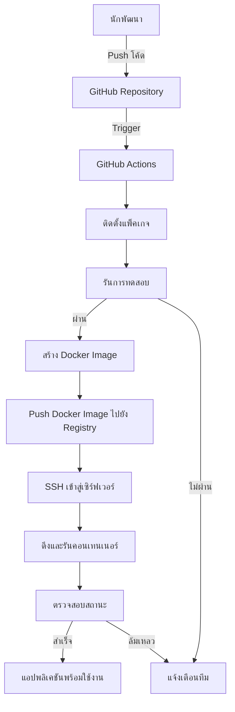

# แอปพลิเคชัน Python Flask

นี่เป็นแอปพลิเคชันเว็บ Flask ที่สร้างโดย RACKSYNC CO., LTD. สำหรับการสาธิตเวิร์กชอป DevOps แสดงให้เห็นวิธีการตั้งค่าแอปพลิเคชันเว็บ Python พร้อมการจัดการคอนเทนเนอร์และการบูรณาการ CI/CD ที่เหมาะสม

## ภาพรวม

แอปพลิเคชันนี้แสดงให้เห็นถึง:
- เฟรมเวิร์ก Flask
- การจัดการและตรวจสอบความถูกต้องของฟอร์ม
- การเรนเดอร์เทมเพลต
- การจัดการคอนเทนเนอร์ด้วย Docker
- การบูรณาการไปป์ไลน์ CI/CD

## สิ่งที่ต้องมีก่อน

- Python 3.9+
- pip
- Docker (ทางเลือก สำหรับการจัดการคอนเทนเนอร์)
- Git

## การติดตั้งสำหรับการพัฒนาแบบโลคอล

### สภาพแวดล้อมเสมือน (Virtual Environment)

1. โคลนรีโพสิทอรี:
   ```bash
   git clone https://github.com/racksync/workshop-devops.git
   cd devops-workshop/hands-on/python
   ```

2. สร้างและเปิดใช้งานสภาพแวดล้อมเสมือน:
   ```bash
   python -m venv venv
   
   # สำหรับ Linux/macOS
   source venv/bin/activate
   
   # สำหรับ Windows
   venv\Scripts\activate
   ```

3. ติดตั้งแพ็คเกจที่จำเป็น:
   ```bash
   pip install -r requirements.txt
   ```

4. รันแอปพลิเคชัน:
   ```bash
   python app.py
   ```

5. เยี่ยมชม `http://localhost:5000` ในเว็บเบราว์เซอร์ของคุณ

### การใช้ Docker

1. สร้างอิมเมจ Docker:
   ```bash
   docker build -t python-flask-app .
   ```

2. รันคอนเทนเนอร์:
   ```bash
   docker run -p 5000:5000 --name flask-app python-flask-app
   ```

3. เยี่ยมชม `http://localhost:5000` ในเว็บเบราว์เซอร์ของคุณ

## โครงสร้างโปรเจ็ค

```
python/
├── templates/          # เทมเพลต HTML
│   ├── base.html       # เทมเพลตพื้นฐานที่มีองค์ประกอบทั่วไป
│   ├── form.html       # เทมเพลตฟอร์ม
│   └── submissions.html # เทมเพลตผลลัพธ์การส่งข้อมูล
├── static/             # ไฟล์คงที่ (CSS, JS, รูปภาพ)
├── app.py              # ไฟล์แอปพลิเคชันหลัก
├── Dockerfile          # การกำหนดค่า Docker
├── requirements.txt    # แพ็คเกจที่ต้องใช้สำหรับ Python
└── README.md           # เอกสารประกอบโปรเจ็ค
```

## คุณสมบัติของแอปพลิเคชัน

- แบบฟอร์มเว็บพร้อมการตรวจสอบความถูกต้อง
- การจัดการการส่งข้อมูล
- การออกแบบที่ตอบสนองโดยใช้ CSS แบบกำหนดเอง
- ข้อความแฟลชสำหรับการแจ้งเตือนผู้ใช้

## ขั้นตอนการ Deploy อย่างละเอียด

### 1. เตรียมความพร้อมสำหรับการ Deploy

1. ตรวจสอบให้แน่ใจว่าโค้ดของคุณทำงานได้อย่างถูกต้องในสภาพแวดล้อมการพัฒนา:
   ```bash
   python app.py
   ```

2. ตรวจสอบว่าได้ทดสอบทุกฟังก์ชั่นและไม่มีปัญหาด้านความปลอดภัยหรือประสิทธิภาพ

3. เพิ่มหรือแก้ไขไฟล์การตั้งค่าสำหรับสภาพแวดล้อมการผลิต (ตัวอย่างเช่น config.py หรือ .env)

### 2. การ Deploy ด้วย Docker

#### การเตรียม Docker Image

1. ตรวจสอบและปรับแต่ง Dockerfile เพื่อให้เหมาะสมกับสภาพแวดล้อมการผลิต:
   ```bash
   # ตรวจสอบ Dockerfile
   cat Dockerfile
   ```

2. สร้าง Docker image:
   ```bash
   docker build -t python-flask-app:latest .
   ```

3. ทดสอบ image ในเครื่อง local:
   ```bash
   docker run -p 5000:5000 --name flask-app-test python-flask-app:latest
   ```

4. ทดสอบแอปพลิเคชันที่ http://localhost:5000 เพื่อตรวจสอบว่าทุกอย่างทำงานได้อย่างถูกต้อง

5. หยุดและลบคอนเทนเนอร์ทดสอบ:
   ```bash
   docker stop flask-app-test
   docker rm flask-app-test
   ```

#### การ Push Image ไปยัง Registry

1. ติดแท็ก image สำหรับการส่งไปยัง registry:
   ```bash
   docker tag python-flask-app:latest your-registry.com/username/python-flask-app:latest
   ```

2. ล็อกอินเข้า registry:
   ```bash
   docker login your-registry.com
   ```

3. ส่ง image ไปยัง registry:
   ```bash
   docker push your-registry.com/username/python-flask-app:latest
   ```

### 3. การ Deploy บนเซิร์ฟเวอร์

#### การ Deploy ด้วย Docker บนเซิร์ฟเวอร์

1. เข้าสู่ระบบในเซิร์ฟเวอร์:
   ```bash
   ssh username@your-server
   ```

2. ตรวจสอบว่า Docker ติดตั้งบนเซิร์ฟเวอร์แล้ว:
   ```bash
   docker --version
   ```

3. ดึง Docker image จาก registry:
   ```bash
   docker pull your-registry.com/username/python-flask-app:latest
   ```

4. หยุดและลบคอนเทนเนอร์เดิม (ถ้ามี):
   ```bash
   docker stop flask-app
   docker rm flask-app
   ```

5. รันคอนเทนเนอร์ใหม่:
   ```bash
   docker run -d -p 80:5000 --restart always --name flask-app your-registry.com/username/python-flask-app:latest
   ```

6. ตรวจสอบว่าคอนเทนเนอร์กำลังทำงาน:
   ```bash
   docker ps
   ```

#### การตั้งค่า Reverse Proxy (ทางเลือก)

1. ติดตั้ง Nginx:
   ```bash
   sudo apt update
   sudo apt install nginx
   ```

2. สร้างไฟล์กำหนดค่า Nginx:
   ```bash
   sudo nano /etc/nginx/sites-available/flask-app
   ```

3. เพิ่มการกำหนดค่า:
   ```
   server {
       listen 80;
       server_name yourdomain.com www.yourdomain.com;

       location / {
           proxy_pass http://localhost:5000;
           proxy_set_header Host $host;
           proxy_set_header X-Real-IP $remote_addr;
       }
   }
   ```

4. เปิดใช้งานไซต์และรีสตาร์ท Nginx:
   ```bash
   sudo ln -s /etc/nginx/sites-available/flask-app /etc/nginx/sites-enabled/
   sudo nginx -t
   sudo systemctl restart nginx
   ```

#### การตั้งค่า SSL/TLS ด้วย Certbot (ทางเลือก)

1. ติดตั้ง Certbot:
   ```bash
   sudo apt install certbot python3-certbot-nginx
   ```

2. ขอใบรับรอง SSL:
   ```bash
   sudo certbot --nginx -d yourdomain.com -d www.yourdomain.com
   ```

3. ตั้งค่าการต่ออายุอัตโนมัติ:
   ```bash
   sudo certbot renew --dry-run
   ```

### 4. การ Deploy ด้วย CI/CD Pipeline

#### การตั้งค่า GitHub Actions

1. สร้างไฟล์ `.github/workflows/deploy.yml`:
   ```yaml
   name: Deploy Flask App

   on:
     push:
       branches: [ main ]

   jobs:
     deploy:
       runs-on: ubuntu-latest
       steps:
         - uses: actions/checkout@v2
         
         - name: Set up Docker Buildx
           uses: docker/setup-buildx-action@v1
         
         - name: Login to DockerHub
           uses: docker/login-action@v1
           with:
             username: ${{ secrets.DOCKER_USERNAME }}
             password: ${{ secrets.DOCKER_PASSWORD }}
         
         - name: Build and push
           uses: docker/build-push-action@v2
           with:
             push: true
             tags: your-registry.com/username/python-flask-app:latest
         
         - name: Deploy to server
           uses: appleboy/ssh-action@master
           with:
             host: ${{ secrets.SERVER_HOST }}
             username: ${{ secrets.SERVER_USERNAME }}
             key: ${{ secrets.SSH_PRIVATE_KEY }}
             script: |
               docker pull your-registry.com/username/python-flask-app:latest
               docker stop flask-app || true
               docker rm flask-app || true
               docker run -d -p 80:5000 --restart always --name flask-app your-registry.com/username/python-flask-app:latest
   ```

2. ตั้งค่า GitHub Secrets:
   - `DOCKER_USERNAME`: ชื่อผู้ใช้ Docker Hub ของคุณ
   - `DOCKER_PASSWORD`: รหัสผ่านหรือโทเคน Docker Hub ของคุณ
   - `SERVER_HOST`: IP address หรือโดเมนของเซิร์ฟเวอร์
   - `SERVER_USERNAME`: ชื่อผู้ใช้ SSH บนเซิร์ฟเวอร์
   - `SSH_PRIVATE_KEY`: คีย์ SSH ส่วนตัวของคุณ

3. ผลักดันการเปลี่ยนแปลงไปยัง GitHub:
   ```bash
   git add .
   git commit -m "Add GitHub Actions workflow"
   git push origin main
   ```

## CI/CD Pipeline Diagram



## การกำหนดค่า Docker

Dockerfile ที่รวมอยู่:
- ใช้ Python 3.9 เป็นอิมเมจพื้นฐาน
- ตั้งค่าผู้ใช้ที่ไม่ใช่ root เพื่อความปลอดภัยที่ดีขึ้น
- ติดตั้งแพ็คเกจที่จำเป็นทั้งหมด
- เปิดพอร์ต 5000 สำหรับการเข้าถึงเว็บ
- ตั้งค่าตัวแปรสภาพแวดล้อมที่เหมาะสม

## การแก้ไขปัญหา

ปัญหาทั่วไป:

1. พอร์ตถูกใช้งานแล้ว:
   ```bash
   # ตรวจสอบว่าพอร์ต 5000 ถูกใช้งานอยู่หรือไม่
   lsof -i :5000
   
   # ใช้พอร์ตอื่น
   export FLASK_RUN_PORT=5001
   flask run
   ```

2. ปัญหาสิทธิ์ของ Docker:
   ```bash
   # เพิ่มผู้ใช้ของคุณเข้ากลุ่ม docker
   sudo usermod -aG docker $USER
   newgrp docker
   ```

3. ปัญหาการเชื่อมต่อฐานข้อมูล:
   ```bash
   # ตรวจสอบการเชื่อมต่อกับฐานข้อมูล
   python -c "from app import db; db.engine.connect()"
   ```

4. การแก้ไขปัญหาคอนเทนเนอร์ Docker:
   ```bash
   # ดูล็อกของคอนเทนเนอร์
   docker logs flask-app
   
   # เข้าไปภายในคอนเทนเนอร์เพื่อแก้ไขปัญหา
   docker exec -it flask-app bash
   ```

## การปรับปรุงประสิทธิภาพ

1. การใช้ Gunicorn เป็น WSGI server:
   ```bash
   # เพิ่ม gunicorn ในไฟล์ requirements.txt
   echo "gunicorn" >> requirements.txt
   
   # ปรับ Dockerfile เพื่อใช้ Gunicorn
   # CMD ["gunicorn", "--bind", "0.0.0.0:5000", "app:app"]
   ```

2. การใช้ Redis สำหรับการแคช:
   ```bash
   # เพิ่ม redis ในไฟล์ requirements.txt
   echo "redis" >> requirements.txt
   
   # เพิ่มการเชื่อมต่อ Redis ในแอปพลิเคชัน
   ```

## ลิขสิทธิ์

© บริษัท RACKSYNC จำกัด สงวนลิขสิทธิ์ทั้งหมด
