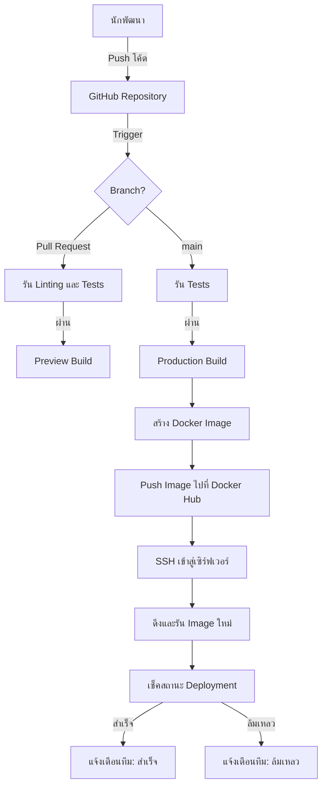

# แอปพลิเคชัน React พร้อมขั้นตอนการทำงานแบบ DevOps

โครงการนี้แสดงให้เห็นถึงแอปพลิเคชัน React พร้อมการผสมผสานกระบวนการทำงานแบบ DevOps อย่างสมบูรณ์ ซึ่งพัฒนาโดยบริษัท RACKSYNC จำกัด เพื่อวัตถุประสงค์ทางการศึกษา

## ภาพรวม

แอปพลิเคชัน React นี้แสดงให้เห็นถึง:
- การพัฒนา React สมัยใหม่ด้วย hooks
- ใช้ Vite สำหรับการพัฒนาและการสร้างที่รวดเร็ว
- แนวทางปฏิบัติ DevOps รวมถึงการทำ containerization และ CI/CD
- โครงสร้างการทดสอบ

## สิ่งที่ต้องมีก่อน

- Node.js 18.x หรือสูงกว่า
- npm หรือ yarn
- Docker (สำหรับการทำ containerization)
- Git

## เริ่มต้นใช้งาน

### การพัฒนาในเครื่องท้องถิ่น

1. โคลนที่เก็บโค้ด
   ```bash
   git clone https://github.com/racksync/workshop-devops.git
   cd devops-workshop/hands-on/react
   ```

2. ติดตั้งแพ็คเกจที่จำเป็น
   ```bash
   npm install
   # หรือด้วย yarn
   yarn
   ```

3. เริ่มเซิร์ฟเวอร์สำหรับการพัฒนา
   ```bash
   npm run dev
   # หรือด้วย yarn
   yarn dev
   ```

4. เปิดเบราว์เซอร์และเข้าชมที่ `http://localhost:5173`

### การสร้างสำหรับใช้งานจริง

```bash
npm run build
# หรือด้วย yarn
yarn build
```

ไฟล์ที่สร้างแล้วจะอยู่ในไดเร็กทอรี `dist`

### การรันการทดสอบ

```bash
npm run test
# หรือด้วย yarn
yarn test
```

## การสนับสนุน Docker

โครงการนี้รองรับ Docker สำหรับการปรับใช้งานในรูปแบบ container

### การสร้างอิมเมจ Docker

```bash
docker build -t react-app:latest .
```

### การรันคอนเทนเนอร์

```bash
docker run -p 8080:80 --name react-app react-app:latest
```

แอปพลิเคชันจะสามารถเข้าถึงได้ที่ `http://localhost:8080`

## ขั้นตอนการ Deploy อย่างละเอียด

### 1. การเตรียมความพร้อมก่อนการ Deploy

1. ตรวจสอบให้แน่ใจว่าโค้ดของคุณทำงานได้ถูกต้องในสภาพแวดล้อมการพัฒนา:
   ```bash
   npm run dev
   ```

2. รันการทดสอบทั้งหมดเพื่อยืนยันว่าทุกอย่างทำงานได้ตามที่คาดหวัง:
   ```bash
   npm test
   ```

3. สร้างเวอร์ชันพร้อมใช้งานจริงของแอปพลิเคชัน:
   ```bash
   npm run build
   ```

4. ตรวจสอบว่าแอปพลิเคชันพร้อมใช้งานจริงทำงานได้อย่างถูกต้อง:
   ```bash
   npm run preview
   ```

### 2. การ Deploy แบบ Manual ด้วย Docker

1. สร้าง Docker image สำหรับแอปพลิเคชัน:
   ```bash
   docker build -t react-app:latest .
   ```

2. ตรวจสอบ image ที่สร้าง:
   ```bash
   docker images
   ```

3. รันคอนเทนเนอร์บนเครื่องของคุณเพื่อทดสอบ:
   ```bash
   docker run -p 8080:80 --name react-app-test react-app:latest
   ```

4. ทดสอบแอปพลิเคชันที่ http://localhost:8080 เพื่อตรวจสอบว่าทุกอย่างทำงานได้อย่างถูกต้อง

5. หยุดและลบคอนเทนเนอร์ทดสอบ:
   ```bash
   docker stop react-app-test
   docker rm react-app-test
   ```

6. (ทางเลือก) ติดแท็ก image สำหรับการส่งไปยัง registry:
   ```bash
   docker tag react-app:latest your-registry.com/username/react-app:latest
   ```

7. (ทางเลือก) ส่ง image ไปยัง registry:
   ```bash
   docker push your-registry.com/username/react-app:latest
   ```

### 3. การ Deploy บน Server

1. เชื่อมต่อกับเซิร์ฟเวอร์ของคุณ:
   ```bash
   ssh user@your-server
   ```

2. ดึง Docker image (หากใช้ registry) หรือโอน image ไปยังเซิร์ฟเวอร์:
   ```bash
   docker pull your-registry.com/username/react-app:latest
   ```

3. หยุดและลบคอนเทนเนอร์เดิมที่อาจกำลังทำงานอยู่:
   ```bash
   docker stop react-app
   docker rm react-app
   ```

4. รันคอนเทนเนอร์ใหม่:
   ```bash
   docker run -d -p 80:80 --restart always --name react-app your-registry.com/username/react-app:latest
   ```

5. กำหนดค่า HTTPS โดยใช้ reverse proxy (nginx หรือ apache) หรือใช้ certbot สำหรับ Let's Encrypt (ขั้นตอนนี้แตกต่างกันไปตามการตั้งค่าเซิร์ฟเวอร์ของคุณ)

### 4. การ Deploy อัตโนมัติด้วย CI/CD Pipeline

การ Deploy อัตโนมัติโดยใช้ CI/CD pipeline ภายใน GitHub Actions:

1. แก้ไขไฟล์ `.github/workflows/deploy.yml` เพื่อตั้งค่าการ deploy อัตโนมัติ
2. เพิ่ม secrets ที่จำเป็นใน GitHub repository ของคุณ:
   - `DOCKER_USERNAME`: ชื่อผู้ใช้ Docker Hub ของคุณ
   - `DOCKER_PASSWORD`: รหัสผ่าน Docker Hub หรือ access token
   - `SSH_PRIVATE_KEY`: คีย์ SSH สำหรับการเชื่อมต่อกับเซิร์ฟเวอร์
   - `SERVER_IP`: IP หรือโฮสต์เนมของเซิร์ฟเวอร์การผลิต
   - `SERVER_USER`: ชื่อผู้ใช้สำหรับเชื่อมต่อกับเซิร์ฟเวอร์

3. Push โค้ดของคุณไปยัง GitHub และ CI/CD pipeline จะดำเนินการโดยอัตโนมัติ

## การผสานรวม CI/CD

โครงการนี้ตั้งค่าด้วย GitHub Actions สำหรับ CI/CD โดยขั้นตอนการทำงานประกอบด้วย:

- การรันการทดสอบเมื่อมีการส่ง pull request
- การสร้างและการส่ง Docker images
- การปรับใช้งานในสภาพแวดล้อมการพัฒนา/การใช้งานจริง



## โครงสร้างโครงการ

```
react/
├── public/              # ไฟล์คงที่
├── src/                 # ไฟล์ซอร์สโค้ด
│   ├── assets/          # สินทรัพย์ต่างๆ (รูปภาพ, ฯลฯ)
│   ├── components/      # คอมโพเนนท์ React
│   ├── App.jsx          # คอมโพเนนท์หลักของแอป
│   └── main.jsx         # จุดเริ่มต้นของแอปพลิเคชัน
├── .github/workflows/   # ขั้นตอนการทำงานของ GitHub Actions
├── Dockerfile           # การตั้งค่า Docker
└── README.md            # เอกสารประกอบโครงการ
```

## การมีส่วนร่วม

1. สร้างแบรนช์ใหม่จาก `main`
2. ทำการเปลี่ยนแปลงของคุณ
3. ส่ง pull request

## แหล่งข้อมูล

- [React Documentation](https://react.dev/docs/getting-started)
- [Vite Documentation](https://vitejs.dev/guide/)
- [DevOps Workshop Repository](https://github.com/racksync/workshop-devops)

## ลิขสิทธิ์

© บริษัท RACKSYNC จำกัด สงวนลิขสิทธิ์ทั้งหมด
