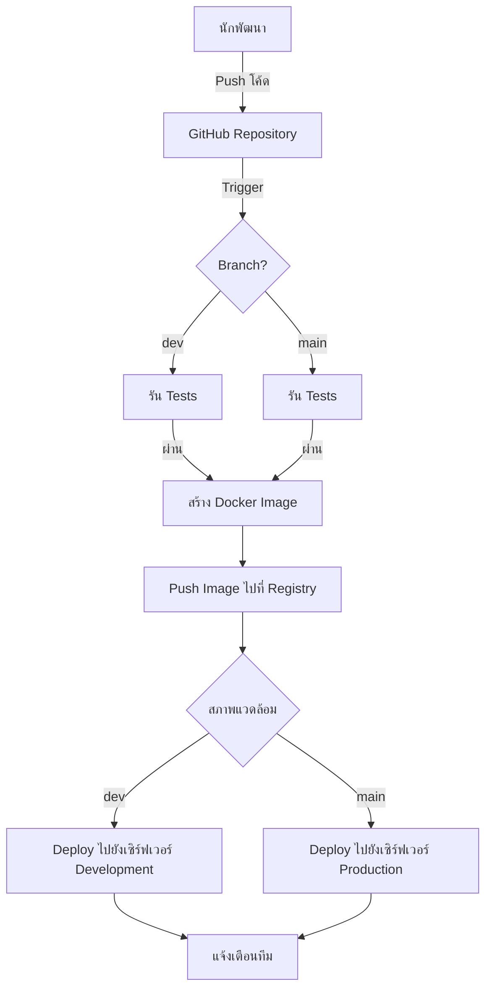

# แอปพลิเคชัน Vue.js

นี่เป็นแอปพลิเคชัน Vue.js สำหรับการสาธิต DevOps Workshop โดย บริษัท RACKSYNC จำกัด แอปพลิเคชันนี้แสดงให้เห็นถึงกระบวนการพัฒนา frontend สมัยใหม่ที่มีการบูรณาการกับ CI/CD pipelines

## ภาพรวมโปรเจค

- สร้างด้วย Vue.js และ Nuxt.js
- ใช้ Tailwind CSS สำหรับการจัดการรูปแบบ
- รวมการทดสอบแบบ unit tests ด้วย Vitest
- ตั้งค่าด้วย Docker สำหรับการ containerization
- ตั้งค่าด้วย CI/CD pipelines สำหรับการทดสอบและการ deploy อัตโนมัติ

## การติดตั้งโปรเจค
```
npm install
```

### คอมไพล์และรีโหลดอัตโนมัติสำหรับการพัฒนา
```
npm run serve
```

### คอมไพล์และลดขนาดสำหรับการใช้งานจริง
```
npm run build
```

### รันการทดสอบ
```
npm test
```

## กระบวนการพัฒนา

### การทำงานกับ branches

1. สร้างและสลับไปที่ branch dev:
```bash
git checkout -b dev
```

2. ทำการเปลี่ยนแปลงและคอมมิต:
```bash
git add .
git commit -m "ข้อความคอมมิตของคุณ"
```

3. ผลักดันการเปลี่ยนแปลงไปยัง branch dev:
```bash
git push origin dev
```

4. สร้าง pull request จาก dev ไปยัง main เมื่อพร้อม

### การทดสอบ

การทดสอบจะถูกรันอัตโนมัติใน CI pipeline สำหรับทุกการ push ไปยัง branch dev และ pull requests ไปยัง dev หรือ main

คุณยังสามารถรันการทดสอบแบบ local ได้ด้วย:
```bash
npm test
```

## การตั้งค่า Docker

แอปพลิเคชันถูกทำเป็น containerized โดยใช้ Docker:

```bash
# สร้าง Docker image
docker build -t vue-app:latest .

# รันคอนเทนเนอร์
docker run -p 8085:8080 --network backend --name vue-app -d vue-app:latest
```

## ขั้นตอนการ Deploy อย่างละเอียด

### 1. การเตรียมพร้อมสำหรับการ Deploy

1. ตรวจสอบให้แน่ใจว่าโค้ดของคุณทำงานได้อย่างถูกต้องในสภาพแวดล้อมการพัฒนา:
```bash
npm run serve
```

2. รันการทดสอบทั้งหมดเพื่อยืนยันว่าทุกอย่างทำงานได้ตามที่คาดหวัง:
```bash
npm test
```

3. สร้างเวอร์ชันที่พร้อมใช้งานจริงของแอปพลิเคชัน:
```bash
npm run build
```

### 2. การ Deploy ด้วย Docker

1. สร้าง Docker image สำหรับแอปพลิเคชันของคุณ:
```bash
docker build -t vue-app:latest .
```

2. ตรวจสอบ image ที่สร้าง:
```bash
docker images
```

3. ทดสอบ image ในเครื่อง local ก่อน deploy:
```bash
docker run -p 8085:8080 --name vue-app-test vue-app:latest
```

4. เข้าถึงแอปพลิเคชันที่ http://localhost:8085 เพื่อตรวจสอบว่าทุกอย่างทำงานอย่างถูกต้อง

5. หยุดและลบคอนเทนเนอร์ทดสอบ:
```bash
docker stop vue-app-test
docker rm vue-app-test
```

6. (ทางเลือก) ติดแท็ก image สำหรับ registry:
```bash
docker tag vue-app:latest your-registry.com/username/vue-app:latest
```

7. (ทางเลือก) ผลักดัน image ไปยัง registry:
```bash
docker push your-registry.com/username/vue-app:latest
```

8. Deploy บนเซิร์ฟเวอร์การผลิต:
```bash
# เชื่อมต่อกับเซิร์ฟเวอร์การผลิต
ssh user@production-server

# ดึง image ล่าสุด (ถ้าใช้ registry)
docker pull your-registry.com/username/vue-app:latest

# หยุดและลบคอนเทนเนอร์ที่มีอยู่ (ถ้ามี)
docker stop vue-app
docker rm vue-app

# รันคอนเทนเนอร์ใหม่
docker run -p 8085:8080 --network backend --name vue-app -d your-registry.com/username/vue-app:latest

# ตรวจสอบว่าคอนเทนเนอร์กำลังทำงาน
docker ps
```

### 3. การ Deploy อัตโนมัติด้วย CI/CD

โปรเจคนี้ใช้ GitHub Actions สำหรับการบูรณาการและการ deploy อย่างต่อเนื่อง:

1. กระบวนการถูกกระตุ้นเมื่อคุณผลักดันโค้ดไปยัง branch หลัก (main) หรือสร้าง pull request
2. Pipeline จะรัน tests และสร้าง Docker image
3. Docker image จะถูกผลักดันไปยัง registry
4. คอนเทนเนอร์ใหม่จะถูก deployed บนเซิร์ฟเวอร์การผลิต

การตั้งค่า CI/CD pipeline สามารถพบได้ใน `.github/workflows/`

## CI/CD Pipeline

โปรเจคนี้ใช้ GitHub Actions สำหรับการบูรณาการและการ deploy อย่างต่อเนื่อง:

- การทดสอบจะถูกรันอัตโนมัติเมื่อทำการ push ไปยัง branch dev
- เมื่อโค้ดถูก merge ไปยัง main จะมีการสร้างและ deploy แอปพลิเคชันโดยอัตโนมัติ



## โครงสร้างโปรเจค

```
app/
├── components/          # Vue components
├── tests/               # ไฟล์ทดสอบ
├── app.vue              # คอมโพเนนต์หลักของแอปพลิเคชัน
├── nuxt.config.ts       # การตั้งค่า Nuxt
└── README.md            # เอกสารประกอบโปรเจค
```

## การมีส่วนร่วม

1. สร้าง feature branch จาก `dev`
2. ทำการเปลี่ยนแปลงของคุณ
3. เขียนหรืออัปเดตการทดสอบตามที่จำเป็น
4. ส่ง pull request ไปยัง branch `dev`
5. หลังจากการตรวจสอบ จะถูก merge ไปยัง `main` สำหรับการ deploy

## ลิขสิทธิ์

© 2025 บริษัท RACKSYNC จำกัด สงวนลิขสิทธิ์ทั้งหมด
